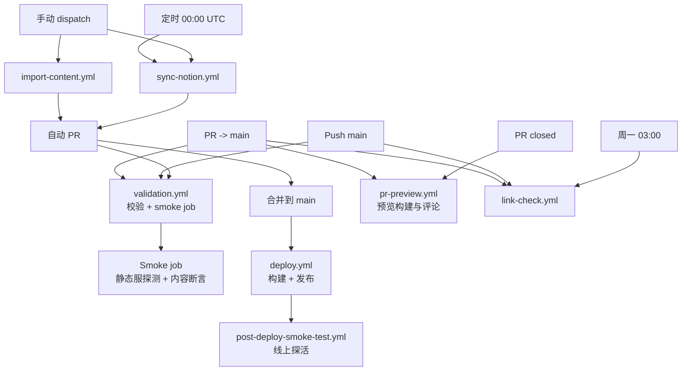

# CI / Workflow 现状说明（ci-workflow-map）

## 一、总体结构概览

- 校验层：`validation.yml` 负责类型检查、Lint、单测、构建、E2E 与独立 smoke job，保证 PR / main 的基线质量，读仓库不写入。
- 内容变更层：`import-content.yml`（手动）与 `sync-notion.yml`（定时/手动）生成内容与图片，自动创建 PR；变更集中在 `src/content/blog/` 与 `public/images/`。
- 发布与验证：`deploy.yml` 负责 GitHub Pages 构建与发布；`post-deploy-smoke-test.yml` 在成功发布后做线上探活；`pr-preview.yml` 为 PR 提供预览。
- 辅助检测：`link-check.yml` 周期与 PR/Push 链路检测仓库与外链。

## 二、Workflow 清单（现存）

| Workflow                   | 触发方式                                                  | 主要职责                                         | 是否写仓库                 |
| -------------------------- | --------------------------------------------------------- | ------------------------------------------------ | -------------------------- |
| validation.yml             | `pull_request` (main)、`push` (main)                      | check、lint、test、build、test:e2e + smoke job   | 否                         |
| import-content.yml         | `workflow_dispatch`（必填 `url`，可选覆盖/预览/封面选项） | 抓取文章、下载图片、生成 Markdown、创建 PR       | 是（内容与图片，自动 PR）  |
| sync-notion.yml            | `schedule` 每日 00:00 UTC / `workflow_dispatch`           | 同步 Notion 页面与图片，生成 Markdown，创建 PR   | 是（Notion 内容，自动 PR） |
| deploy.yml                 | `push` (main) / `workflow_dispatch`                       | 构建产物、上传 Pages artifact、发布 GitHub Pages | 否                         |
| pr-preview.yml             | `pull_request` 打开/同步/关闭                             | 构建并部署 PR 预览到外部预览仓库，关闭时清理     | 否（仅写预览仓库）         |
| post-deploy-smoke-test.yml | `workflow_run`：Deploy 成功后                             | 线上探活，验证首页/文章/RSS/Sitemap              | 否                         |
| link-check.yml             | `pull_request`、`push` (main)、`schedule` 周一 03:00 UTC  | 校验仓库与外部链接可用性                         | 否                         |

## 三、Scripts 清单（核心）

| Script                        | 用途                                         | 主要输入                                                                                                    | 主要输出                                                |
| ----------------------------- | -------------------------------------------- | ----------------------------------------------------------------------------------------------------------- | ------------------------------------------------------- |
| `scripts/notion-sync.ts`      | 拉取 Notion 页面、下载封面/图片并转 Markdown | 环境变量：`NOTION_TOKEN`、`NOTION_DATABASE_ID`                                                              | `src/content/blog/notion/`、`public/images/notion/`     |
| `scripts/content-import.ts`   | 从 URL 抓取文章并本地化资源                  | `--url`（必填）；`--allow-overwrite`、`--dry-run`、`--use-first-image-as-cover`（可选，亦支持同名环境变量） | `src/content/blog/<source>/`、`public/images/<source>/` |
| `scripts/process-md-files.ts` | 修正常见数学公式格式                         | Markdown 路径（文件或目录）                                                                                 | 原地更新的 Markdown                                     |

## 四、执行与依赖关系图

