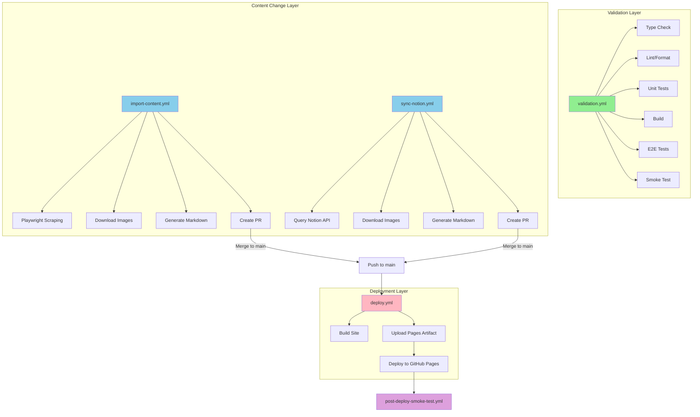
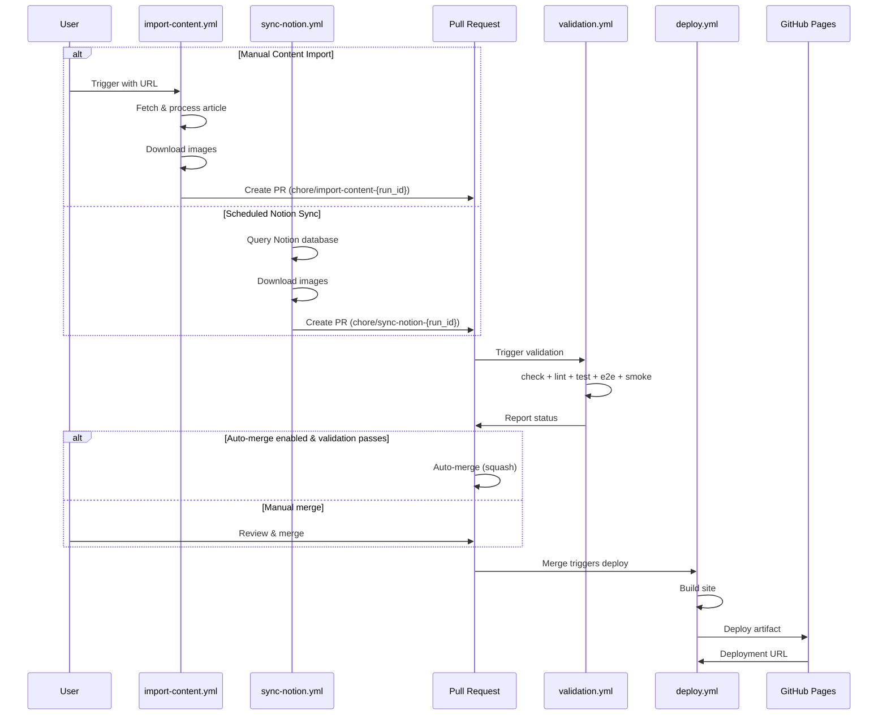

```mermaid
graph TB
    PR[Pull Request to main] --> VAL[validation.yml]
    PUSH[Push to main] --> VAL
    PUSH --> DEPLOY[deploy.yml]

    MANUAL_IMPORT[Manual: workflow_dispatch] --> IMPORT[import-content.yml]
    MANUAL_SYNC[Manual: workflow_dispatch] --> SYNC[sync-notion.yml]
    SCHEDULE[Schedule: Daily midnight] --> SYNC

    PR --> PREVIEW[pr-preview.yml]
    PR_CLOSE[PR Closed] --> PREVIEW_CLEAN[pr-preview.yml cleanup]

    DEPLOY_SUCCESS[Deploy Success] --> POST_SMOKE[post-deploy-smoke-test.yml]

    PUSH --> LINK[link-check.yml]
    PR --> LINK
    WEEKLY[Schedule: Weekly Mon 3am] --> LINK

    style VAL fill:#90EE90
    style DEPLOY fill:#FFB6C1
    style IMPORT fill:#87CEEB
    style SYNC fill:#87CEEB
    style POST_SMOKE fill:#DDA0DD
    style PREVIEW fill:#F0E68C
    style LINK fill:#F0E68C
```

# CI/CD Workflow Status & Documentation

This document describes the refactored CI/CD workflows and scripts structure for the blog repository after comprehensive refactoring to eliminate race conditions, improve maintainability, and establish clear separation of concerns.

## 📋 Current Workflows Inventory

### 1. Validation Layer (PR/Push Triggered)

#### `validation.yml` ⭐ **Primary Validation Workflow**

- **Triggers**: `pull_request` on main, `push` to main
- **Permissions**: `contents: read` (read-only)
- **Concurrency**: `validation-{workflow}-{PR number or ref}` (cancel-in-progress)
- **Node Version**: 22
- **Main Responsibilities**:
  - Type checking (`npm run check`)
  - Linting and formatting (`npm run lint`)
  - Unit tests (`npm run test`)
  - Build verification (`npm run build`)
  - E2E tests (`npm run test:e2e`)
  - Smoke tests (HTTP + content assertions)
- **Key Features**:
  - Playwright browser caching (keyed by package-lock.json)
  - npm dependency caching
  - Separate smoke test job for better failure isolation
  - No repository writes
- **Directories Read**: All source files
- **Directories Written**: None
- **Creates PR**: No
- **Deploys**: No

**Deprecated Workflows** (replaced by validation.yml):

- `ci.yml.deprecated` - Basic CI validation
- `lint-format.yml.deprecated` - Linting and formatting
- `pr-smoke-test.yml.deprecated` - Smoke testing

### 2. Content Change Layer (Dispatch/Schedule Triggered)

#### `import-content.yml` - Manual Content Import

- **Triggers**: `workflow_dispatch` (manual with parameters)
- **Permissions**: `contents: write`, `pull-requests: write`
- **Concurrency**: `import-content` (no cancellation to prevent data loss)
- **Node Version**: 22
- **Inputs**:
  - `url` (required): Article URL to import
  - `allow_overwrite` (optional, default: false): Overwrite existing files
  - `dry_run` (optional, default: false): Preview without writing
  - `use_first_image_as_cover` (optional, default: true): Use first image as cover
- **Main Responsibilities**:
  - Fetch and convert articles from various platforms (Zhihu, Medium, WeChat, etc.)
  - Download and localize images
  - Create markdown files with frontmatter
  - Generate PR with changes
- **Key Features**:
  - Unique branch naming: `chore/import-content-{run_id}`
  - Playwright browser caching
  - Auto-delete branch after merge
  - Auto-merge with squash (if enabled)
- **Directories Written**: `src/content/blog/`, `public/images/`
- **Creates PR**: Yes (when changes detected)
- **Deploys**: No

#### `sync-notion.yml` - Notion Content Synchronization

- **Triggers**: `schedule` (daily at midnight UTC), `workflow_dispatch` (manual)
- **Permissions**: `contents: write`, `pull-requests: write`
- **Concurrency**: `sync-notion` (no cancellation to prevent data loss)
- **Node Version**: 22
- **Environment Variables Required**:
  - `NOTION_TOKEN`: Notion API token
  - `NOTION_DATABASE_ID`: Notion database ID
- **Main Responsibilities**:
  - Query Notion database for published pages
  - Incremental sync (only changed pages)
  - Download images from Notion
  - Generate markdown with frontmatter
  - Create PR with changes
- **Key Features**:
  - Unique branch naming: `chore/sync-notion-{run_id}`
  - Incremental updates (checks lastEditedTime)
  - Auto-delete branch after merge
  - Auto-merge with squash (if enabled)
- **Directories Written**: `src/content/blog/notion/`, `public/images/notion/`
- **Creates PR**: Yes (when changes detected)
- **Deploys**: No

### 3. Deployment Layer (Main Branch Triggered)

#### `deploy.yml` - GitHub Pages Deployment

- **Triggers**: `push` to main, `workflow_dispatch` (manual)
- **Permissions**: `contents: read`, `pages: write`, `id-token: write`
- **Concurrency**: `pages` (no cancellation)
- **Node Version**: 22
- **Main Responsibilities**:
  - Build production site (`npm run build`)
  - Create GitHub Pages artifact
  - Deploy to GitHub Pages
- **Key Features**:
  - No content sync (relies on PRs merged to main)
  - Minimal permissions (read-only for contents)
  - Two-job structure (build + deploy)
  - Disables Jekyll (`.nojekyll` file)
- **Directories Read**: All source files
- **Directories Written**: `dist/` (build output)
- **Creates PR**: No
- **Deploys**: Yes (GitHub Pages)

### 4. Supplementary Workflows

#### `pr-preview.yml` - PR Preview Deployment

- **Triggers**: `pull_request` (opened, synchronize, reopened, closed)
- **Permissions**: `contents: read`, `pull-requests: write`
- **Node Version**: 22
- **Main Responsibilities**:
  - Build preview for PR
  - Deploy to external preview repository
  - Post preview URL as PR comment
  - Cleanup preview when PR closes
- **Key Features**:
  - Per-PR preview directory
  - External repository deployment
  - Automatic cleanup on PR close
  - Preview URL commenting
- **Environment Variables Required**:
  - `PREVIEW_REPO`: External preview repository
  - `PREVIEW_TOKEN`: GitHub PAT for preview repo
  - `PREVIEW_BASE_URL`: Base URL for previews
- **Directories Written**: External repository `previews/pr-{number}/`
- **Creates PR**: No
- **Deploys**: Yes (external preview repository)

#### `post-deploy-smoke-test.yml` - Post-Deployment Validation

- **Triggers**: `workflow_run` (after Deploy to GitHub Pages completes successfully)
- **Permissions**: `contents: read`
- **Main Responsibilities**:
  - Validate deployed site is accessible
  - Check critical pages and routes
  - Verify RSS and sitemap
- **Key Features**:
  - Runs only on successful deployments
  - Auto-detects prefix (/blog or root)
  - Graceful handling of optional pages
- **Environment Variables**:
  - `SITE_URL` (default: `https://yuanlehome.github.io/blog`)
- **Deploys**: No

#### `link-check.yml` - Dead Link Detection

- **Triggers**: `pull_request`, `push` to main, `schedule` (weekly on Monday at 3am UTC)
- **Permissions**: `contents: read`
- **Container**: `lycheeverse/lychee:0.22.0`
- **Main Responsibilities**:
  - Check for broken links in markdown files
  - Validate external URLs
- **Key Features**:
  - Uses `.lychee.toml` configuration
  - Runs in container for consistency
- **Directories Read**: `README.md`, `src/`, `public/`, `docs/`
- **Deploys**: No

## 🔄 Workflow Dependency Diagrams

### Event → Workflow Trigger Flow



### Workflow → Actions → Artifacts Flow



### Content Sync → PR → Deploy Pipeline



## 📐 Unified Execution Order & Conventions

### Content Synchronization/Import Flow

1. **Trigger** (Manual dispatch or Schedule)
   - Import: User triggers with URL and options
   - Sync: Cron job (daily midnight) or manual trigger

2. **Content Processing**
   - Fetch content from source
   - Download and localize images
   - Generate markdown with frontmatter
   - Apply formatting fixes (math, sanitization)

3. **PR Creation**
   - Check for changes (`git status --porcelain`)
   - Create PR with **unique branch name** (includes run_id)
   - Add descriptive body with metadata
   - Set auto-delete branch on merge

4. **Validation** (automatically triggered on PR)
   - validation.yml runs full test suite
   - Must pass before merge

5. **Merge to Main**
   - Auto-merge (if enabled and validation passes)
   - Or manual merge by maintainer

6. **Deployment** (automatically triggered on merge)
   - deploy.yml builds and deploys to GitHub Pages

### Validation Flow (PR or Push)

1. **Trigger** (PR or Push to main)
2. **Setup Environment**
   - Install Node.js 22
   - Restore npm cache
   - Install dependencies
   - Restore/Install Playwright browsers (with caching)
3. **Sequential Validation Steps**
   - Type check (`astro check`)
   - Lint/Format (`prettier` + `markdownlint`)
   - Unit tests (vitest)
   - Build (astro build)
   - E2E tests (playwright)
4. **Smoke Test Job** (runs after validation)
   - Start local HTTP server
   - Test critical routes
   - Validate content presence
5. **Report Status** to PR

### Deployment Flow

1. **Trigger** (Push to main or manual)
2. **Build Job**
   - Checkout code
   - Setup Node.js 22 with npm cache
   - Install dependencies
   - Build site (`npm run build`)
   - Create `.nojekyll` file
   - Upload pages artifact
3. **Deploy Job** (needs build)
   - Deploy artifact to GitHub Pages
   - Output deployment URL
4. **Post-Deploy Smoke Test** (workflow_run triggered)
   - Wait 10 seconds for DNS propagation
   - Test live site accessibility
   - Validate critical routes

## 🎯 Key Constraints & Conventions

### Branch Naming Convention

| Workflow           | Branch Pattern                  | Example                         | Delete After Merge |
| ------------------ | ------------------------------- | ------------------------------- | ------------------ |
| import-content.yml | `chore/import-content-{run_id}` | `chore/import-content-12345678` | ✅ Yes             |
| sync-notion.yml    | `chore/sync-notion-{run_id}`    | `chore/sync-notion-12345679`    | ✅ Yes             |

**Rationale**: Unique branch names prevent conflicts when multiple imports/syncs run concurrently or in quick succession.

### Concurrency Control Rules

| Workflow                   | Concurrency Key                            | Cancel In Progress               |
| -------------------------- | ------------------------------------------ | -------------------------------- |
| validation.yml             | `validation-{workflow}-{PR number or ref}` | ✅ Yes                           |
| import-content.yml         | `import-content`                           | ❌ No (prevents data loss)       |
| sync-notion.yml            | `sync-notion`                              | ❌ No (prevents data loss)       |
| deploy.yml                 | `pages`                                    | ❌ No (ensures clean deployment) |
| pr-preview.yml             | Default (per PR)                           | ℹ️ Not specified                 |
| post-deploy-smoke-test.yml | None                                       | N/A                              |
| link-check.yml             | None                                       | N/A                              |

**Rationale**:

- Validation can be cancelled when new commits push (saves CI time)
- Content operations should not be cancelled to prevent partial writes
- Deployment should complete to avoid broken state

### Cache Strategy

#### npm Dependencies

- **Cache Key**: `npm` (automatic via `actions/setup-node@v4`)
- **Path**: npm cache directory (automatic)
- **Used By**: All workflows

#### Playwright Browsers

- **Cache Key**: `playwright-{os}-{package-lock.json hash}`
- **Path**: `~/.cache/ms-playwright`
- **Used By**: validation.yml, import-content.yml
- **Fallback**: If cache miss, run `npx playwright install --with-deps chromium`
- **Optimization**: If cache hit, only run `npx playwright install-deps chromium` (faster)

#### Build Artifacts

- Not cached (built fresh each time for deployment)

### Node.js Version Standardization

**All workflows use Node.js 22** for consistency.

**Migration Note**: Previously workflows used Node.js 20. All have been updated to 22 to:

- Ensure consistent behavior across all environments
- Leverage latest Node.js LTS features
- Simplify dependency management

### Script Parameter Standards

All CLI scripts in `scripts/` directory support:

1. **Flag Format**: Both `--flag=value` and `--flag value`

   ```bash
   npm run import:content -- --url=https://example.com
   npm run import:content -- --url https://example.com
   ```

2. **Boolean Flags**: Presence indicates true

   ```bash
   npm run import:content -- --url=... --allow-overwrite
   npm run import:content -- --url=... --dry-run
   ```

3. **Environment Variable Fallback**:

   ```bash
   URL=https://example.com ALLOW_OVERWRITE=true npm run import:content
   ```

4. **No Problematic Flags**: Avoid flags that conflict with npm (e.g., `--force`)

### Permission Minimization

| Workflow                   | Permissions                                         |
| -------------------------- | --------------------------------------------------- |
| validation.yml             | `contents: read`                                    |
| import-content.yml         | `contents: write`, `pull-requests: write`           |
| sync-notion.yml            | `contents: write`, `pull-requests: write`           |
| deploy.yml                 | `contents: read`, `pages: write`, `id-token: write` |
| pr-preview.yml             | `contents: read`, `pull-requests: write`            |
| post-deploy-smoke-test.yml | `contents: read`                                    |
| link-check.yml             | `contents: read`                                    |

**Principle**: Each workflow has minimal permissions required for its function.

## 🔍 Troubleshooting Guide

### Import Content Issues

#### Issue: Import produces no changes

**Symptoms**: Workflow runs but no PR created

**Diagnosis**:

```bash
# Check if content was actually fetched
# Look for "No content changes detected" in workflow logs
```

**Common Causes**:

1. Content already exists and `allow_overwrite=false`
2. Dry run mode enabled
3. Scraping failed silently

**Solutions**:

1. Use `--allow-overwrite` flag if updating existing content
2. Disable `dry_run` input
3. Check artifacts folder for debug screenshots/HTML/logs (on scraping failure)
4. Verify URL is accessible and from supported platform

#### Issue: Images not downloading

**Symptoms**: Markdown generated but images missing

**Diagnosis**:

```bash
# Check workflow logs for "Failed to download image" warnings
```

**Common Causes**:

1. Platform anti-bot protection (especially WeChat)
2. Image URLs require special headers/referer
3. Rate limiting

**Solutions**:

1. For WeChat: Playwright fallback automatically triggered
2. Check PROVIDER_CONFIGS in content-import.ts
3. Verify image URLs are accessible

### Validation Failures

#### Issue: Lint/Format modified files

**Symptoms**: "Lint/format modified files" error

**Diagnosis**:

```bash
# Run locally
npm run lint
git diff
```

**Solutions**:

```bash
# Fix formatting issues locally
npm run lint
git add .
git commit -m "fix: format code"
git push
```

#### Issue: E2E tests fail

**Symptoms**: Playwright tests timeout or fail

**Diagnosis**:

```bash
# Run locally
npm run test:e2e

# Check if build succeeded
npm run build
ls -R dist/
```

**Common Causes**:

1. Build output structure changed
2. Content missing expected text
3. Routes changed

**Solutions**:

1. Verify build produces expected structure
2. Check test assertions match actual content
3. Update test selectors if site structure changed

### Deployment Issues

#### Issue: Deploy fails with 404

**Symptoms**: Deployment completes but site shows 404

**Diagnosis**:

- Check if `dist/.nojekyll` file exists
- Verify base path configuration in astro.config.mjs

**Solutions**:

1. Ensure deploy.yml creates `.nojekyll` file (it does)
2. Check `site` and `base` in astro.config.mjs match repository structure

#### Issue: Post-deploy smoke test fails

**Symptoms**: Site deployed but smoke test fails

**Diagnosis**:

```bash
# Check if site is accessible
curl -I https://yuanlehome.github.io/blog/

# Test specific routes
curl https://yuanlehome.github.io/blog/
```

**Common Causes**:

1. DNS propagation delay (especially first deploy)
2. Content structure changed
3. Route paths changed

**Solutions**:

1. Wait 5-10 minutes and re-run workflow
2. Update smoke test script to match new content
3. Verify routes match expected paths

### Notion Sync Issues

#### Issue: Sync not detecting changes

**Symptoms**: No PR created despite Notion updates

**Diagnosis**:

- Check `lastEditedTime` in Notion page properties
- Verify existing markdown has correct `lastEditedTime` frontmatter

**Solutions**:

1. Manually delete cached markdown to force re-sync
2. Check `NOTION_TOKEN` has read access
3. Verify page status is "Published"

#### Issue: Images not downloading from Notion

**Symptoms**: Markdown generated but images broken

**Diagnosis**:

- Check workflow logs for fetch failures
- Verify Notion image URLs are not expired

**Common Causes**:

1. Notion signed URLs expire after time
2. Network issues during download

**Solutions**:

1. Re-run sync workflow (gets fresh URLs)
2. Check `NOTION_TOKEN` permissions

## 📊 Workflow Success Metrics

### Validation Success Criteria

- ✅ Type check: 0 errors
- ✅ Lint: 0 errors (warnings acceptable)
- ✅ Unit tests: 100% pass rate
- ✅ Build: Completes successfully
- ✅ E2E tests: 100% pass rate
- ✅ Smoke test: All critical routes return 200

### Deployment Success Criteria

- ✅ Build: Generates `dist/` with all pages
- ✅ Upload: Pages artifact created
- ✅ Deploy: GitHub Pages deployment succeeds
- ✅ Post-deploy smoke test: Site accessible and content valid

### Content Sync Success Criteria

- ✅ Fetch: Content retrieved from source
- ✅ Images: All images downloaded and localized
- ✅ Markdown: Valid markdown with frontmatter generated
- ✅ PR: Created with unique branch name
- ✅ Validation: PR passes all checks

## 🔄 Workflow Execution Logs Access

To access workflow logs:

1. **Via GitHub UI**:
   - Navigate to Actions tab
   - Select workflow run
   - Click on job name
   - Expand steps to see logs

2. **Via GitHub CLI**:

   ```bash
   # List recent runs
   gh run list --workflow=validation.yml

   # View specific run
   gh run view <run-id> --log
   ```

3. **Debug Artifacts** (for import failures):
   - Check `artifacts/` directory in import-content workflow
   - Contains screenshots, HTML, and logs for failed scrapes

## 🚀 Future Improvements (Not Implemented)

Potential enhancements for consideration:

1. **Composite Actions**: Extract common setup steps (node + npm + playwright) into reusable composite action
2. **Matrix Testing**: Test across multiple Node.js versions
3. **Performance Monitoring**: Add build time tracking
4. **Notification System**: Slack/Discord notifications for deployment
5. **Preview Environment**: Dedicated staging environment
6. **Rollback Mechanism**: Automatic rollback on smoke test failure

## 📝 Maintenance Notes

### When Adding New Content Sources

1. Add provider configuration to `scripts/content-import.ts`:

   ```typescript
   const PROVIDER_CONFIGS: Record<string, ProviderConfig> = {
     newplatform: {
       headers: {
         /* ... */
       },
       defaultExt: '.jpg',
       maxRetries: 3,
     },
   };
   ```

2. Add provider definition to `providers` array

3. Test import manually:

   ```bash
   npm run import:content -- --url=https://newplatform.com/article --dry-run
   ```

4. Update this documentation with new provider

### When Modifying Workflows

1. Test locally with `act` (if possible) or in fork
2. Update this documentation to reflect changes
3. Update workflow diagrams if dependencies change
4. Notify team of breaking changes

### When Updating Dependencies

1. Update Playwright cache key in validation.yml and import-content.yml:

   ```yaml
   key: playwright-${{ runner.os }}-${{ hashFiles('package-lock.json') }}
   ```

2. Test all workflows after dependency updates

3. Update Node.js version in all workflows if upgrading

---

**Document Version**: 1.0.0  
**Last Updated**: 2025-12-28  
**Maintained By**: DevOps Team  
**Contact**: Open an issue for questions or improvements
