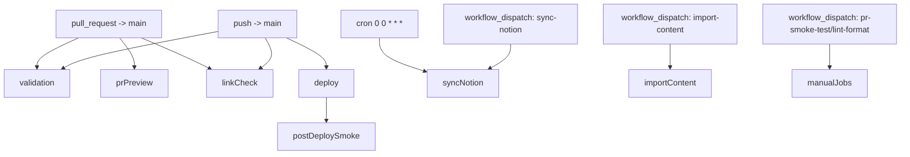
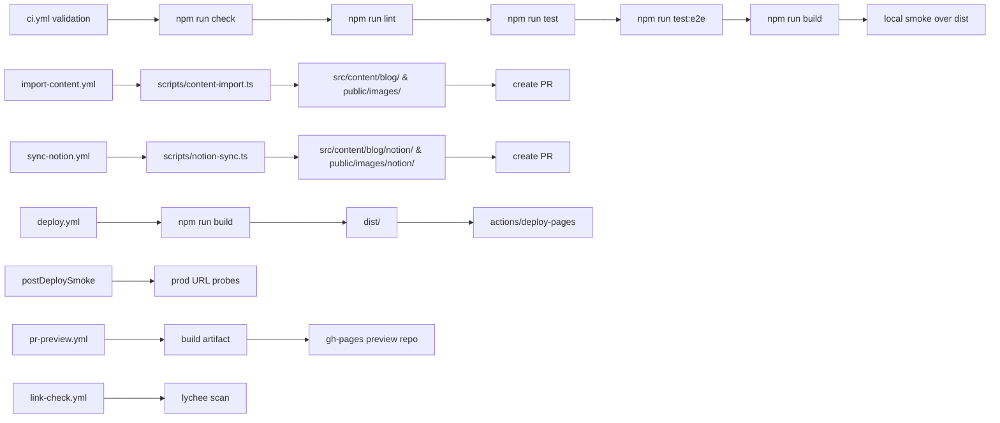

## CI/CD workflow status

### Workflow inventory

- `ci.yml` (Validation) — trigger: `pull_request`/`push` on `main`; runs `npm ci`, `npm run check`, `npm run lint`, `npm run test`, `npm run test:e2e`, `npm run build`, plus local smoke over `dist/`; reads only, no PR creation or deploy.
- `deploy.yml` (Deploy to GitHub Pages) — trigger: `push` to `main` or `workflow_dispatch`; builds `dist/` and uploads to Pages; deploys to `github-pages` environment; no repository writes.
- `import-content.yml` — trigger: `workflow_dispatch`; runs `npm ci`, `npm run import:content`; writes `src/content/blog/` and `public/images/` through an auto PR on branch `chore/import-content-${{ github.run_id }}`.
- `sync-notion.yml` — trigger: `schedule` daily at 00:00 UTC + `workflow_dispatch`; runs `npm run notion:sync`; writes `src/content/blog/notion/` and `public/images/notion/` via PR `chore/sync-notion-content-${{ github.run_id }}`.
- `pr-preview.yml` — trigger: PR open/sync/reopen/close; builds preview artifact and publishes to external preview repo; writes PR comments, no repo writes.
- `link-check.yml` — trigger: `pull_request`/`push` on `main`, weekly schedule; runs lychee against `README.md`, `src`, `public`, `docs`; read-only.
- `post-deploy-smoke-test.yml` — trigger: `workflow_run` after successful `deploy.yml`; probes live site; read-only.
- `pr-smoke-test.yml` — trigger: manual `workflow_dispatch` or `workflow_call`; runs build + smoke against local `dist/`; read-only.
- `lint-format.yml` — trigger: manual `workflow_dispatch` or `workflow_call`; runs `npm run lint`; read-only.

### Trigger DAG

### Execution DAG

### Execution order and handoffs

- **Validation chain (PR/Push):** `npm ci` → `npm run check` → `npm run lint` → `npm run test` → `npm run test:e2e` → `npm run build` → smoke test against built `dist/`. Concurrency key `validation-${{ github.event.pull_request.number || github.ref }}` ensures only one validation per ref/PR.
- **Content chain (manual/scheduled):** `import-content.yml` and `sync-notion.yml` each run on dedicated branches (`chore/import-content-${run_id}`, `chore/sync-notion-content-${run_id}`), create PRs instead of pushing to `main`, and are mutually serialized via concurrency keys `content-import-${ref}` / `content-sync-notion-${ref}`.
- **Deploy chain (main only):** `deploy.yml` builds `dist/` on `main`, uploads via `actions/deploy-pages`, guarded by concurrency `pages-${ref}`; `post-deploy-smoke-test.yml` runs only after a successful deploy workflow to verify the public site.

### Constraints and conventions

- **Branch naming:** content PRs use `chore/import-content-${run_id}` and `chore/sync-notion-content-${run_id}` to avoid collisions; preview deploys stay on `gh-pages` in the external repo.
- **Concurrency:** validation (`validation-${pr/ref}`), deploy (`pages-${ref}`), post-deploy smoke (`post-deploy-smoke-${branch}`), PR preview (`pr-preview-${pr/ref}`), and content jobs (`content-import-${ref}`, `content-sync-notion-${ref}`) prevent overlapping runs on the same ref/PR.
- **Cache strategy:** `actions/setup-node` uses npm cache; Playwright browsers cached at `~/.cache/ms-playwright` with key `playwright-${{ runner.os }}-${{ hashFiles('package-lock.json') }}` across validation and import workflows.
- **Parameter norms:** content import supports `--url`, `--allow-overwrite`, `--dry-run`, `--use-first-image-as-cover` in both `--flag value` and `--flag=value` forms; env fallbacks `URL`, `ALLOW_OVERWRITE`, `DRY_RUN`, `USE_FIRST_IMAGE_AS_COVER`; logs emit `key:value` summaries.
- **Smoke gates:** sitemap checks are warn-only by default; set `FAIL_ON_MISSING_SITEMAP=true` to require a sitemap in validation smoke.
- **Write boundaries:** only content workflows write to `src/content/**` or `public/images/**`, and always via PRs; validation/link-check/pr-preview/post-deploy are read-only; deploy only publishes `dist/` to Pages.

### Troubleshooting

- **Import produced no changes:** check workflow logs for `changed=false`; confirm `--allow-overwrite`/`--dry-run` flags and URL; rerun with `workflow_dispatch`.
- **PR validation failed:** inspect the validation job in `ci.yml`; rerun the workflow to reuse caches; ensure Playwright browsers downloaded and lint formatted files locally.
- **Deploy failed:** verify `deploy.yml` logs for build errors; ensure Pages permissions are intact; if deploy succeeded but site fails, see `post-deploy-smoke-test` output for curl failures and sitemap/RSS availability.
