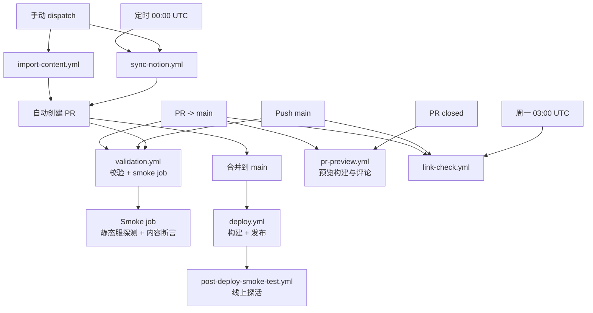

# CI / Workflow 文档

本文档专注于 **持续集成（CI）** 与 **自动化工作流（GitHub Actions）** 的说明。

> **关于 Scripts 的详细说明**：请参见 [scripts/README.md](../scripts/README.md)  
> **关于仓库架构设计**：请参见 [architecture.md](./architecture.md)

---

## 一、CI 的目标

CI 系统确保代码质量与部署流程的自动化：

1. **质量保障**：每次 PR 和 push 都经过类型检查、lint、测试、构建验证
2. **内容自动化**：定期或手动触发内容同步，自动创建 PR
3. **部署自动化**：main 分支变更自动发布到 GitHub Pages
4. **健康检测**：部署后自动探测线上服务可用性，定期检查链接有效性

---

## 二、Workflow 清单

### 2.1 校验类 Workflow

#### `validation.yml`

**职责**：质量门禁，确保代码和内容符合标准

**触发条件**：

- PR 指向 main 分支
- Push 到 main 分支

**执行的 Jobs**：

1. **validate** job：
   - 类型检查（`npm run check`）
   - Lint 与格式化（`npm run lint`）
   - 单元测试（`npm run test`）
   - 构建验证（`npm run build`）
   - E2E 测试（`npm run test:e2e`）

2. **smoke-test** job（依赖 validate 完成）：
   - 启动静态服务器
   - 访问首页、文章页
   - 验证 RSS、Sitemap
   - 断言内容正确性

**权限**：只读（`contents: read`）

**并发控制**：同一 PR/分支的多次触发会取消旧的运行

---

#### `link-check.yml`

**职责**：检查仓库内链接和外部链接的可用性

**触发条件**：

- PR 指向 main
- Push 到 main
- 定时：每周一 03:00 UTC

**权限**：只读

---

### 2.2 内容变更类 Workflow

这些 workflow 会修改仓库内容（`src/content/blog/` 和 `public/images/`），并自动创建 PR。

#### `sync-notion.yml`

**职责**：从 Notion 数据库同步已发布页面到博客

**触发条件**：

- 定时：每日 00:00 UTC
- 手动触发（`workflow_dispatch`）

**执行流程**：

1. 检出代码
2. 安装依赖和 Playwright
3. 运行 `npm run notion:sync`（调用 `scripts/notion-sync.ts`）
4. 检测是否有变更
5. 如有变更，自动创建 PR（分支名：`notion-sync/<timestamp>`）

**权限**：

- `contents: write`（创建分支、提交代码）
- `pull-requests: write`（创建 PR）

**并发控制**：不允许并发执行，新触发会等待旧任务完成

> **Scripts 参数详情**：参见 [scripts/README.md](../scripts/README.md#notion-syncts)

---

#### `import-content.yml`

**职责**：从外部 URL（微信、知乎、Medium 等）导入文章

**触发条件**：手动触发（`workflow_dispatch`）

**输入参数**：

- `url`（必填）：要导入的文章 URL
- `allow_overwrite`（可选，默认 false）：是否覆盖已存在的文章
- `dry_run`（可选，默认 false）：预览模式，不实际写入文件
- `use_first_image_as_cover`（可选，默认 true）：将正文首图作为封面

**执行流程**：

1. 检出代码
2. 安装依赖和 Playwright
3. 运行 `npm run import:content`（调用 `scripts/content-import.ts`）
4. 如有变更且非 dry-run，自动创建 PR（分支名：`import-content/<slug>-<timestamp>`）

**权限**：

- `contents: write`
- `pull-requests: write`

**并发控制**：不允许并发执行

> **Scripts 参数详情**：参见 [scripts/README.md](../scripts/README.md#content-importts)

---

#### `delete-article.yml`

**职责**：删除指定文章及其关联图片

**触发条件**：手动触发（`workflow_dispatch`）

**输入参数**：

- `target`（必填）：文章的 slug 或文件路径
- `delete_images`（可选，默认 false）：是否同时删除关联图片
- `dry_run`（可选，默认 false）：预览模式

**执行流程**：

1. 检出代码
2. 安装依赖
3. 运行 `npm run delete:article`（调用 `scripts/delete-article.ts`）
4. 如有变更且非 dry-run，自动创建 PR（分支名：`delete-article/<target>-<timestamp>`）

**权限**：

- `contents: write`
- `pull-requests: write`

> **Scripts 参数详情**：参见 [scripts/README.md](../scripts/README.md#delete-articlets)

---

### 2.3 部署与验证类 Workflow

#### `deploy.yml`

**职责**：构建静态站点并发布到 GitHub Pages

**触发条件**：

- Push 到 main 分支
- 手动触发（`workflow_dispatch`）

**执行流程**：

1. 检出代码
2. 安装依赖
3. 运行 `npm run build`
4. 上传 `dist/` 作为 Pages artifact
5. 部署到 GitHub Pages

**权限**：

- `contents: read`
- `pages: write`
- `id-token: write`

---

#### `post-deploy-smoke-test.yml`

**职责**：部署成功后验证线上服务的可用性

**触发条件**：`deploy.yml` 成功完成后（`workflow_run`）

**执行流程**：

1. 等待 GitHub Pages 部署完成（最多 5 分钟）
2. 访问首页、文章页、RSS、Sitemap
3. 验证响应状态和内容正确性

**权限**：无需特殊权限

---

#### `pr-preview.yml`

**职责**：为 PR 生成预览站点，并在 PR 中添加预览链接评论

**触发条件**：

- PR 打开或同步（新的 push）
- PR 关闭（清理预览）

**执行流程**：

- **PR 打开/同步时**：
  1. 构建站点
  2. 部署到外部预览仓库
  3. 在 PR 中评论预览链接
- **PR 关闭时**：
  1. 清理预览分支

**权限**：

- `contents: write`（写入预览仓库）
- `pull-requests: write`（添加评论）

**注意**：预览部署到独立的 preview 仓库，不影响主仓库

---

## 三、Workflow 依赖关系

---

## 四、PR 合入 main 的约束策略

### 4.1 分支保护规则

main 分支受保护，PR 必须满足以下条件才能合并：

1. **Required checks must pass**：
   - `validation.yml` 的 `validate` job 必须通过
   - `validation.yml` 的 `smoke-test` job 必须通过

2. **Merge method**：
   - 使用 **Squash merge**（将 PR 的所有 commit 合并为一个）
   - 保持 main 分支历史线性清晰

### 4.2 自动化 PR 的处理

由 `sync-notion.yml`、`import-content.yml`、`delete-article.yml` 创建的 PR 需要：

1. 经过 `validation.yml` 校验（自动触发）
2. 人工 review 确认内容正确
3. 手动合并（或配置自动合并策略）

---

## 五、Workflow 与 Scripts 的关系

**明确边界**：

- **Workflow 负责**：触发时机、环境配置、权限管理、PR 创建
- **Scripts 负责**：具体的内容获取、转换、写入逻辑

**调用关系**：

- `sync-notion.yml` → `npm run notion:sync` → `scripts/notion-sync.ts`
- `import-content.yml` → `npm run import:content` → `scripts/content-import.ts`
- `delete-article.yml` → `npm run delete:article` → `scripts/delete-article.ts`

**参数传递**：

Workflow 通过环境变量或命令行参数传递给 Scripts：

- 环境变量示例：`URL`、`ALLOW_OVERWRITE`、`DRY_RUN`
- 命令行参数示例：`--url`、`--allow-overwrite`、`--dry-run`

> **完整的 Scripts 参数说明**：请参见 [scripts/README.md](../scripts/README.md)

---

## 六、后续调整指南

### 添加新的 Workflow

1. 在 `.github/workflows/` 创建新的 `.yml` 文件
2. 定义触发条件（`on:`）
3. 设置必要的权限（`permissions:`）
4. 编写 jobs 和 steps
5. 如需调用 scripts，参考现有 workflow 的模式
6. 在本文档中补充说明

### 修改现有 Workflow

1. 确认修改是否影响 PR 合并策略
2. 测试修改是否破坏 CI 流程
3. 更新本文档中的相关说明

### 调整 Scripts

如果需要修改 scripts 的参数或行为：

1. **修改 scripts 源码**（在 `scripts/` 目录）
2. **更新 scripts/README.md**（参数说明必须与源码一致）
3. **如有必要，调整调用该 script 的 workflow**
4. 本文档通常不需要修改（除非触发条件或 job 结构变化）
