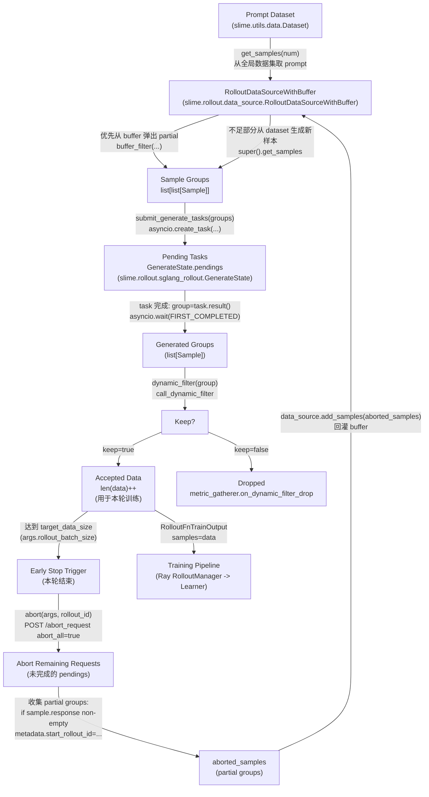
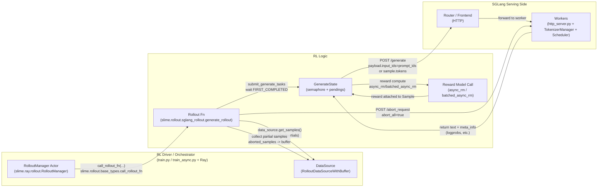
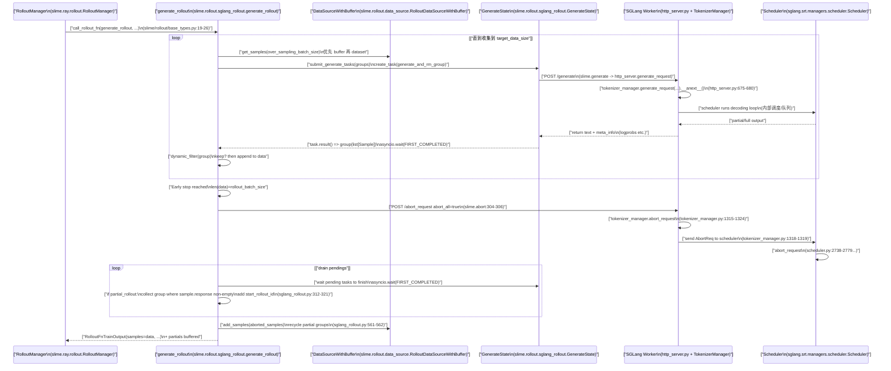

在 LLM 的 RL post-training（PPO / GRPO / DAPO / GSPO 等）里，工程团队经常会遇到一个“看起来像算法问题，实际上是系统瓶颈”的现象：**rollout 占掉 90%+ 的端到端时间**，而且**同步 rollout 的每一步会被极少数超长样本拖死**。[APRIL](https://arxiv.org/pdf/2509.18521) 和 [RollPacker](https://arxiv.org/pdf/2509.21009) 可以看作对同一类瓶颈的两条路线：前者从“请求生命周期”切入做 **Partial Rollouts**，后者从“轮次调度”切入做 **Tail Batching**。两者共同目标都是：**减少 GPU bubbles（空转）**，提高吞吐，但尽量不牺牲同步 on-policy 的训练属性与最终效果。

---

## 一、Long-tail rollouts：同步 RL 的 makespan 被尾巴决定

把一个同步 rollout step 抽象成三段：

1. Actor 用当前 policy 批量生成 responses
1. Reward / advantage 计算
1. Learner 反向更新 policy

在大型模型场景里，**第 1 段（生成）通常是最重的**，而生成长度呈长尾分布：同一个 batch 里大部分请求很快结束，但少数请求会因为“输出更长、采样更慢、遇到更复杂推理链”等原因拖很久。同步系统里，rollout step 的结束时间（makespan）由最长的那几个请求决定——这就是 bubble 的来源：多数 GPU/worker 已经无事可做，但仍被同步栅栏卡住。

> 关键点：这不是“把长样本删掉”就能解决的，因为删样本会改变训练分布；很多任务里长输出恰恰包含关键信号（推理链、代码、长格式答案等）。

---

## 二、APRIL：把“长尾时间”从每一步的尾巴摊薄到多步

APRIL（Active Partial Rollouts in Reinforcement Learning）的视角非常系统：既然长尾不可避免，那就不要让每个 step 都等到“最慢请求完全结束”。它提出三件事，组合起来就是 **Partial Rollouts**：

### 2.1 Over-provision：超额提交请求

目标需要 K 条有效样本，但每轮实际提交 **K + Δ** 条 rollout 请求。这样做的直觉是：batch 内总会有一部分请求更快完成，**更容易尽早凑齐 K 条“完成样本”**。

### 2.2 Early stop：达标就立刻结束本轮

当已经收集到 K 条完成样本（或满足过滤条件的样本）时，**立刻停止本轮 rollout step**，不再等待剩余请求自然跑完。

### 2.3 Recycle partials：被打断的请求不丢，续写回收

Early stop 会打断一些正在生成的请求。APRIL 的关键在于：**不丢这些被打断的样本**，而是把它们当前已经生成的 token 作为 partial response 存起来，下一轮继续从这些 token 位置接着生成，直到最终也以“完整样本”的形式进入训练分布。

> 这相当于把长尾的那部分计算，从“每个 step 都要等一次”变成“在后续多个 step 里分期支付”。宏观上 makespan 下降，吞吐上升，而训练分布不被粗暴篡改。APRIL 报告在多种 RL 算法上提升 rollout 吞吐（最高到 44%）并且不但不降精度，某些任务上还有更高的最终准确率。

---

## 三、slime 中的 Partial Rollouts 实现

在工程层面，APRIL 的“三板斧”真正难点不在概念，而在于**要把请求的生命周期、缓存、续写、以及训练的 on/off-policy 边界处理干净**。slime(0.2.2) 在 SGLang router/worker 的 rollout 链路上，把这套机制落到了可运行的实现里。

1. Over-provision：多取样本、多提交任务

   rollout 主循环会从 data_source 里用 `over_sampling_batch_size` 拉取样本，并把 sample groups 以 async task 形式提交到 pending 队列。

1. Early stop：凑齐 target_data_size 就 abort

   当 `len(data) == rollout_batch_size` 时，不等待所有 pending task 完成，直接触发 abort，把剩余未完成请求停掉，结束本轮 step。

1. Recycle partials：收集 abort 时已生成的部分并存入 buffer

   abort 过程中，如果开启 `partial_rollout`，会把已生成出部分 response 的样本收集起来，写入 metadata（例如 `start_rollout_id`），再存入 data_source 的 buffer。下一轮优先从 buffer 取这些 partial 样本继续生成。

1. “续写”如何实现：用已有 tokens 续写 + 可选 loss mask

   续写的工程要点通常有两个：
   - **请求侧续写**：如果 sample 已有 `response/tokens`，则下次生成时把 `input_ids` 直接设成已有 tokens，并扣减 `max_new_tokens`，避免越写越超长。
   - **训练侧边界**：partial rollout 可能引入“跨 step 的 token”，严格意义上会出现 off-policy 风险。slime 提供了 `mask_offpolicy_in_partial_rollout` ：把旧 token 的 loss 标 0，只对新续写出来的 token 计算 loss，从而把“跨 step 的历史生成部分”从梯度里剔除（是否启用取决于工程对 on-policy 严格程度的要求）。

> 直观理解：**APRIL 在系统层面把“请求完成”拆分；loss mask 在学习层面把“哪些 token 归属当前 step 的 policy”重新画边界。**

APRIL/Partial Rollouts 要成立，abort 必须是真正意义上的“停止正在跑的请求”。SGLang 提供了明确的 HTTP 链路（`/generate` + `/abort_request`），并把 abort 传递到 tokenizer manager 和调度器里进行队列清理与状态回收。工程上这非常关键：如果 abort 只是“上层不等结果”，而底层推理还在继续烧 GPU，那 bubble 依然存在，只是被隐藏了。Rollout 系统能否吃到 APRIL 的收益，很大程度取决于 serving 引擎是否具备这种“可抢占/可中止”的能力。

<u>_数据流图_</u>

<u>_架构图_</u>

<u>_时序图_</u>

---

## 四、RollPacker：不改请求生命周期，改“轮次组成”——Tail Batching

如果说 APRIL 是把长尾拆碎并跨 step 摊销，那么 RollPacker 的思路更像调度学：**长尾请求本来就会慢，那就不要让它们污染每一轮**，而是把它们集中放进少数几轮“长轮次”。这就是 Tail Batching：

- 把 prompts 按“是否可能产生长尾输出”分组
- 大多数 rollout step（short rounds）只包含短且均衡的请求
- 少数 rollout step（long rounds）集中处理长尾请求

这样做的效果是：**绝大多数 step 的 makespan 变短且稳定**，GPU bubbles 显著下降；长轮次依然慢，但它们被集中成“少数事件”，不会让每一步都被尾巴拖住。RollPacker 报告在大规模 H800 集群上带来可观的端到端训练加速。

### 4.1 Tail Batching 的隐含前提：同步边界要“抬高”

Tail batching 表面上只是“重排样本顺序”，但同步 on-policy 系统里有个硬约束：

> 如果某些 prompts 被挪到更后面的 rollout round 才生成，而中间 policy 已更新，那么这些样本将变成 off-policy。

因此，Tail Batching 在同步 RL 里要成立，通常需要把同步边界从“每轮 rollout 都更新”提升到“多个 rollout rounds 组成一个 update step”，在一个 update step 内 actor 权重冻结；等 short rounds + long rounds 都完成后再做一次更新。

RollPacker 的 short/long rounds 设计，本质上就是在这个更高层级同步边界上做调度优化，并且进一步配合 rollout / reward / training 三阶段的系统化优化（如动态资源分配、训练与 rollout 的流水重叠等）。

---

## 结语

APRIL 解决的是“同步 rollout 被最长样本拖死”这一类系统性瓶颈：通过超额提交、达标即停、partial 回收续写，把长尾从“每一步的尾巴”变成“跨多步的可摊销成本”。

RollPacker 则把问题上升到“轮次调度与同步边界”：用 tail batching 把长尾集中到少数 long rounds，让绝大多数 short rounds 快且稳，并进一步做三阶段系统级协同优化拿到端到端收益。

对于真实的 RL 工程系统，最实用的落地策略往往不是二选一，而是分层组合：**用 Tail Batching 稳住轮次结构，用 APRIL 清掉轮次内部残余尾巴**，再用指标体系把收益“可观测、可回归、可调参”。
