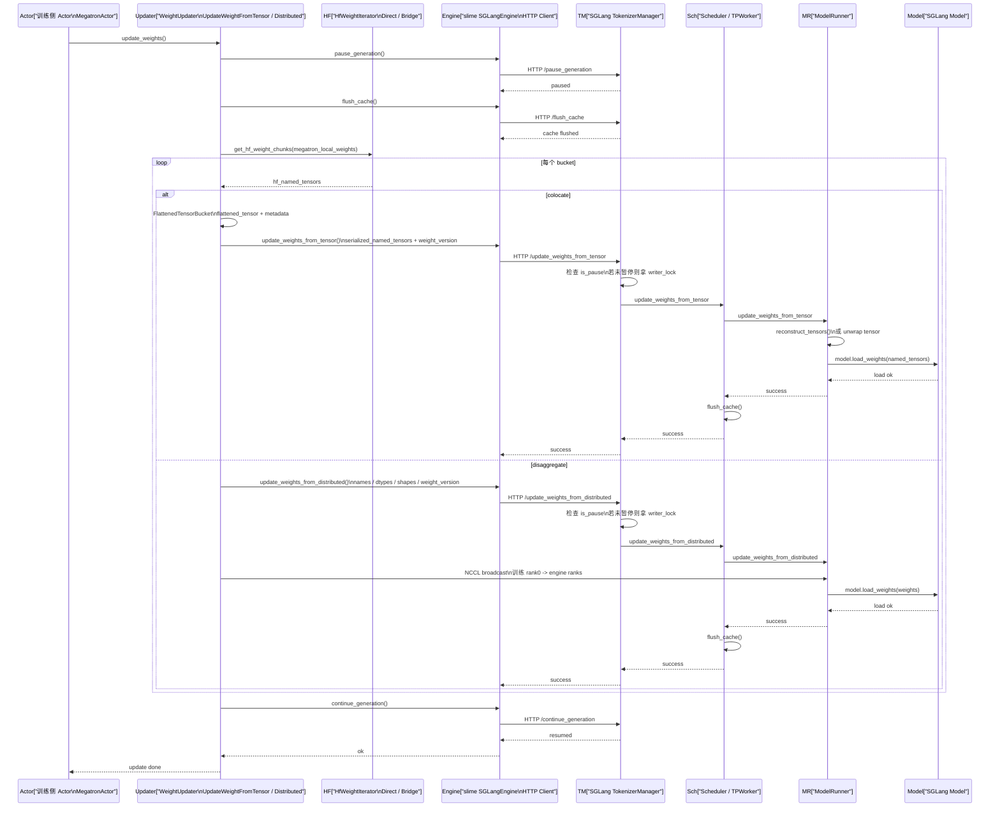
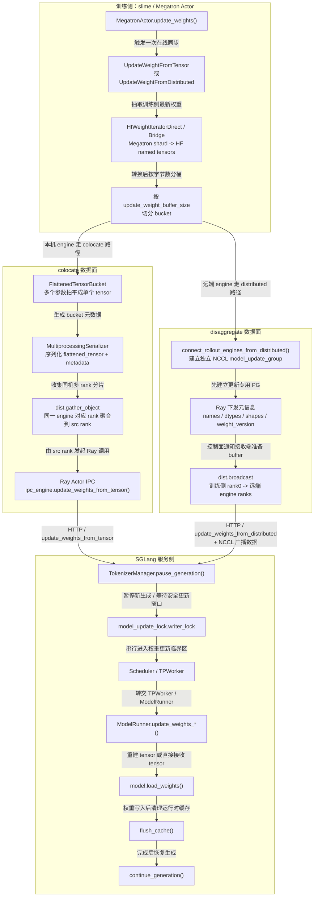
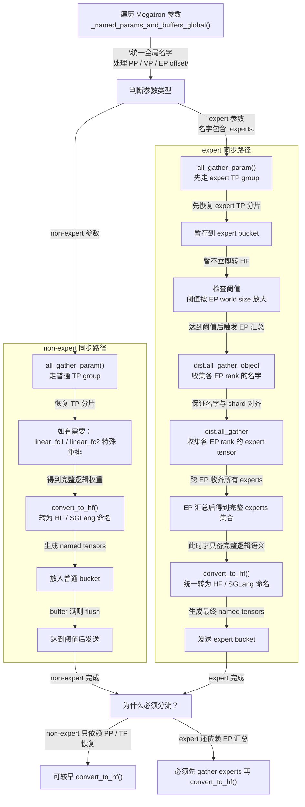

<u>_训练侧到 SGLang 侧的时序图_</u>



在 slime(0.2.2) 里，“权重同步”不是单一接口，而是一套**训练侧权重抽取→聚合→格式转换→发送**，再到 **SGLang 侧暂停生成→加锁→落盘到模型→刷新 cache →继续生成**的完整在线更新流水线。

如果把它抽象成工程概念，实际上有四层：

1. **训练侧更新入口层**
   actor 在训练后决定何时把最新权重同步到 rollout engine。
1. **训练侧权重整理层**
   把 Megatron 分布式参数恢复成可被推理侧接受的 HF/SGLang 权重名字与张量布局。
1. **传输层**
   slime 实现了两条不同数据面：
   - **colocate 路径**：同机时走 **tensor / CUDA IPC + 序列化元数据。**
   - **disaggregate 路径**：跨 engine 时走**自建 process group + NCCL broadcast。**
1. **SGLang 引擎落地层**
   TokenizerManager 负责“停流量 + 串行化更新”；Scheduler/TPWorker/ModelRunner 负责真正把 tensor 原地 load 到推理模型里。

---

## 一、总入口：slime 在哪里决定怎么同步权重

### 1.1 选择 colocate 还是 disaggregate

```python
# slime/backends/megatron_utils/actor.py
update_weight_cls = UpdateWeightFromTensor if self.args.colocate else UpdateWeightFromDistributed
self.weight_updater = update_weight_cls(
    self.args,
    self.model,
    weights_getter=lambda: self.weights_backuper.get("actor"),
    model_name=type(self.hf_config).__name__.lower() if self.args.model_name is None else self.args.model_name,
    quantization_config=getattr(self.hf_config, "quantization_config", None),
)
```

这里已经把 slime 的权重同步设计定死了：

- `args.colocate=True`：选择 `UpdateWeightFromTensor`
- `args.colocate=False`：选择 `UpdateWeightFromDistributed`

也就是说，**slime 并不是在 SGLang 侧区分 colocate / disaggregate，而是在训练侧就选定整条同步数据路径**。

### 1.2 真正触发同步的入口

```python
# slime/backends/megatron_utils/actor.py
def update_weights(self) -> None:
    if self.args.debug_train_only or self.args.debug_rollout_only:
        return

    if self.args.use_fault_tolerance:
        if dist.get_rank() == 0:
            ray.get(self.rollout_manager.recover_rollout_engines.remote())
        dist.barrier(group=get_gloo_group())

    rollout_engines, rollout_engine_lock, num_new_engines = ray.get(
        self.rollout_manager.get_rollout_engines_and_lock.remote()
    )

    if self.args.offload_train:
        reload_process_groups()

    if num_new_engines > 0:
        self.weight_updater.connect_rollout_engines(rollout_engines, rollout_engine_lock)
        dist.barrier(group=get_gloo_group())
        if dist.get_rank() == 0:
            ray.get(self.rollout_manager.clear_num_new_engines.remote())

    with torch_memory_saver.disable() if self.args.offload_train else nullcontext():
        print_memory("before update_weights")
        self.weight_updater.update_weights()
        print_memory("after update_weights")
```

这个入口很关键，说明 slime 的同步不是“直接推权重”，而是先做两件事：

- `connect_rollout_engines(...)`：建立训练侧到 rollout engines 的通信拓扑
- `self.weight_updater.update_weights()`：执行一次完整同步

所以工程上看，**权重同步分成“连接期”和“同步期”**。

---

## 二、训练侧如何把 Megatron 权重变成可同步对象

slime 的核心难点不在“发 tensor”，而在于 **Megatron 训练态参数并不是推理侧想要的最终名字和布局**。
特别是 MoE 场景下，要处理：

- PP 分段
- TP 切分
- EP 切分
- expert / non-expert 参数不同处理
- expert_bias 这种 buffer 也要纳入更新
- 某些 grouped moe / GLU 权重在 gather 时还要修正维度

### 2.1 统一枚举参数：给 PP / EP / MTP 生成全局一致名字

```python
# slime/backends/megatron_utils/update_weight/common.py
def _named_params_and_buffers_global(
    args: Namespace, model: Sequence[torch.nn.Module]
) -> Iterator[tuple[str, torch.Tensor]]:
    """
    Yield (global_name, param/buffer) with consistent names across PP/EP. Adjusts indices for
    virtual PP + EP offsets. Handles decoder.layers, mtp.layers (Multi-Token Prediction), expert_bias.
    """
    ep_size = mpu.get_expert_model_parallel_world_size()
    ep_rank = mpu.get_expert_model_parallel_rank()
    if args.num_experts:
        expert_offset = ep_rank * args.num_experts // ep_size

    sig = inspect.signature(get_transformer_layer_offset)
    need_vp_stage = "vp_stage" in sig.parameters

    for vp_stage, model_module in enumerate(model):
        if need_vp_stage:
            layer_offset = get_transformer_layer_offset(model_module.config, vp_stage)
        else:
            layer_offset = get_transformer_layer_offset(model_module.config)
        for name, param in model_module.named_parameters():
            # for model without ddp wrap
            if not name.startswith("module.module."):
                name = "module." + name

            decoder_layers_pattern = r"module\\.module\\.decoder\\.layers\\.(\\d+)\\.(.+)"
            match = re.match(decoder_layers_pattern, name)
            if not match:
                # MTP (Multi-Token Prediction) layers for speculative decoding
                mtp_layers_pattern = r"module\\.module\\.mtp\\.layers\\.(\\d+)\\.(.+)"
                match = re.match(mtp_layers_pattern, name)
                if not match:
                    yield name, param
                    continue

                # MTP layer indices start from 0
                layer_idx, rest = match.groups()
                expert_pattern = r"transformer_layer.mlp.experts\\.(.+)\\.weight(\\d+)"
                match = re.match(expert_pattern, rest)
                if not match:
                    yield name, param
                    continue

                rest, expert_idx = match.groups()
                expert_idx = int(expert_idx) + expert_offset
                yield f"module.module.mtp.layers.{layer_idx}.transformer_layer.mlp.experts.{rest}.weight{expert_idx}", param
                continue

            layer_idx, rest = match.groups()
            layer_idx = int(layer_idx) + layer_offset

            # this is hardcoded for te grouped matmul
            expert_pattern = r"mlp.experts\\.(.+)\\.weight(\\d+)"
            match = re.match(expert_pattern, rest)
            if match:
                rest, expert_idx = match.groups()
                expert_idx = int(expert_idx) + expert_offset
                yield f"module.module.decoder.layers.{layer_idx}.mlp.experts.{rest}.weight{expert_idx}", param
            else:
                yield f"module.module.decoder.layers.{layer_idx}.{rest}", param

        # treat expert bias as normal parameters
        for name, buffer in model_module.named_buffers():
            # TODO shall we handle (almost) all buffers like Megatron Bridge
            if "expert_bias" not in name:
                continue
            # for model without ddp wrap
            if not name.startswith("module.module."):
                name = "module." + name

            decoder_layers_pattern = r"module\\.module\\.decoder\\.layers\\.(\\d+)\\.(.+)"
            match = re.match(decoder_layers_pattern, name)
            if not match:
                yield name, buffer
            else:
                layer_idx, rest = match.groups()
                layer_idx = int(layer_idx) + layer_offset
                yield f"module.module.decoder.layers.{layer_idx}.{rest}", buffer
```

这一段体现了 slime 在权重同步里的第一个核心思想：

> **先把“本地 shard 名字”整理成“全局逻辑名字”，后面的 HF 转换、bucket 划分、远端 load 才能成立。**

尤其是 MoE：

- `expert_idx` 会按 `ep_rank` 加 offset
- `expert_bias` 也被当成“可同步参数”
- decoder layer index 会叠加 PP / virtual PP offset

这一步如果做错，后面 SGLang 就算收到 tensor，也会 load 到错误参数上。

### 2.2 TP 聚合：普通权重和 expert 权重走不同 TP group

文件：`slime/backends/megatron_utils/update_weight/common.py:15-48`

```python
def all_gather_param(name: str, param: torch.nn.Parameter) -> torch.Tensor:
    if "expert_bias" in name:
        return param

    if not param.tensor_model_parallel or getattr(param, "parallel_mode", None) == "duplicated":
        return param.data

    if ".experts." in name:
        tp_size = mpu.get_expert_tensor_parallel_world_size()
        tp_group = mpu.get_expert_tensor_parallel_group()
    else:
        tp_size = mpu.get_tensor_model_parallel_world_size()
        tp_group = mpu.get_tensor_model_parallel_group()

    param_partitions = [torch.empty_like(param.data) for _ in range(tp_size)]
    dist.all_gather(param_partitions, param.data, group=tp_group)

    partition_dim = param.partition_dim
    assert param.partition_stride == 1, "partition_stride != 1 is not supported"
    # TODO: here we did an extra copy during concat, maybe merge this with convert_to_hf is better?
    # TODO: check only GLU is used.
    if "linear_fc1.weight" in name:
        param_partitions = [p.chunk(2, dim=0) for p in param_partitions]
        param_partitions = [p[0] for p in param_partitions] + [p[1] for p in param_partitions]
    # this is bug in megatron's grouped moe.
    if "linear_fc2.weight" in name:
        if partition_dim == 0:
            partition_dim = 1
    param = torch.cat(param_partitions, dim=partition_dim)
    return param
```

这里能看出 MoE 权重同步的第二个核心点：

> **expert 参数不是走普通 TP group，而是走 expert TP group。**

而且 slime 在 gather 时已经内嵌了两类工程修正：

- `linear_fc1.weight`：GLU 结构需要重新 chunk / 重排
- `linear_fc2.weight`：grouped moe 的 partition_dim 有兼容修正

这意味着 slime 的同步不是“把训练张量原样发过去”，而是**在训练侧就做了和推理格式对齐的张量重组**。

### 2.3 批量异步 all-gather：减少串行通信开销

```python
# slime/backends/megatron_utils/update_weight/common.py
def all_gather_params_async(
    param_infos_and_params: list[tuple[ParamInfo, torch.Tensor]],
) -> list[torch.Tensor]:
    """
    Parallel TP all-gather for multiple params. Loop 1: for each TP param, allocate buffers +
    dist.all_gather(async_op=True) on expert-TP/regular-TP group (skip expert_bias/non-TP/duplicated).
    Loop 2: wait all NCCL handles (enables overlap). Loop 3: concat partitions + apply GLU rechunk/MoE dim fix.
    """
    # Phase 1: Start all async all_gather operations
    gather_tasks = []
    handles = []

    for info, param in param_infos_and_params:
        # Prepare async all_gather
        if "expert_bias" in info.name:
            gather_tasks.append((info, param, None, None, None))
            handles.append(None)
        elif not param.tensor_model_parallel or getattr(param, "parallel_mode", None) == "duplicated":
            gather_tasks.append((info, param.data, None, None, None))
            handles.append(None)
        else:
            # Start async all_gather
            if ".experts." in info.name:
                tp_size = mpu.get_expert_tensor_parallel_world_size()
                tp_group = mpu.get_expert_tensor_parallel_group()
            else:
                tp_size = mpu.get_tensor_model_parallel_world_size()
                tp_group = mpu.get_tensor_model_parallel_group()

            param_partitions = [torch.empty_like(param.data) for _ in range(tp_size)]
            handle = dist.all_gather(param_partitions, param.data, group=tp_group, async_op=True)
            gather_tasks.append((info, None, handle, param_partitions, param.partition_dim))
            handles.append(handle)

    # Phase 2: Wait for ALL async operations to complete at once
    # This ensures maximum parallelism by not blocking on individual operations
    for handle in handles:
        if handle is not None:
            handle.wait()

    # Phase 3: Process all results after all communications are done
    gathered_params = []
    for info, direct_param, handle, param_partitions, partition_dim in gather_tasks:
        if handle is None:
            # No all_gather needed
            param = direct_param
        else:
            # Process the gathered partitions (same logic as original all_gather_param)
            assert partition_dim is not None, "partition_stride != 1 is not supported"
            if "linear_fc1.weight" in info.name:
                param_partitions = [p.chunk(2, dim=0) for p in param_partitions]
                param_partitions = [p[0] for p in param_partitions] + [p[1] for p in param_partitions]
            if "linear_fc2.weight" in info.name:
                if partition_dim == 0:
                    partition_dim = 1
            param = torch.cat(param_partitions, dim=partition_dim)

        gathered_params.append(param)

    return gathered_params
```

这一步是更工程化的版本：把多个参数的 TP 聚合并发化，减少每个参数都单独 wait 的串行损耗。所以 slime 的优化点不仅是“功能可用”，而是**有意识地让权重同步通信批处理化**。

---

## 三、HF 权重迭代器：slime 如何把训练权重分桶并转成 SGLang/HF 名字

slime 为 Megatron → HF 权重转换抽象了一层 `HfWeightIteratorBase`。

### 3.1 抽象工厂：raw / bridge 两种转换模式

```python
# slime/backends/megatron_utils/update_weight/hf_weight_iterator_base.py
class HfWeightIteratorBase(ABC):
    @staticmethod
    def create(args, model, **kwargs):
        from .hf_weight_iterator_bridge import HfWeightIteratorBridge
        from .hf_weight_iterator_direct import HfWeightIteratorDirect

        c = {
            "raw": HfWeightIteratorDirect,
            "bridge": HfWeightIteratorBridge,
        }[args.megatron_to_hf_mode]

        return c(args, model, **kwargs)

    def __init__(self, args, model, model_name, quantization_config):
        self.args = args
        self.model = model
        self.model_name = model_name
        self.quantization_config = quantization_config

    @abstractmethod
    def get_hf_weight_chunks(self, megatron_local_weights):
```

也就是说，slime 把“如何从 Megatron 权重变成 HF 命名张量块”独立成策略：

- `raw`：自己 gather + 自己 convert
- `bridge`：借助 `megatron.bridge`

### 3.2 direct 模式：自己恢复全量参数，再转换成 HF named tensors

```python
# slime/backends/megatron_utils/update_weight/hf_weight_iterator_direct.py
class HfWeightIteratorDirect(HfWeightIteratorBase):
    def __init__(self, *args, **kwargs):
        super().__init__(*args, **kwargs)
        self.megatron_local_param_info_buckets = _get_megatron_local_param_info_buckets(self.args, self.model)

    def get_hf_weight_chunks(self, megatron_local_weights):
        rank = dist.get_rank()

        for megatron_local_param_infos in tqdm(
            self.megatron_local_param_info_buckets, disable=rank != 0, desc="Update weights"
        ):
            megatron_full_params = _get_megatron_full_params(megatron_local_param_infos, megatron_local_weights)
            hf_named_tensors = self._convert_to_hf_named_tensors(megatron_full_params, megatron_local_param_infos)
            yield hf_named_tensors
            del megatron_full_params

    def _convert_to_hf_named_tensors(self, megatron_full_params: Sequence[torch.Tensor], param_infos: list[ParamInfo]):
        hf_named_tensors = []
        for info, param in zip(param_infos, megatron_full_params, strict=False):
            hf_named_tensors.extend(
                convert_to_hf(self.args, self.model_name, info.name, param, self.quantization_config)
            )
        return hf_named_tensors
```

这个接口很重要，因为它说明 slime 的发送对象不是“Megatron 原始参数”，而是：

> **分桶后的 HF named tensors**

也就是后面传给 SGLang 的 `(name, tensor)`，已经是推理侧能够直接 `load_weights` 的命名格式。

### 3.3 direct 模式里的 PP / EP / TP 恢复顺序

```python
# slime/backends/megatron_utils/update_weight/hf_weight_iterator_direct.py
def _get_megatron_full_params(
    megatron_local_param_infos: Sequence[ParamInfo],
    megatron_local_weights,
) -> Sequence[torch.Tensor]:
    monkey_patch_torch_reductions()
    pp_size = mpu.get_pipeline_model_parallel_world_size()
    ep_size = mpu.get_expert_model_parallel_world_size()
    rank = dist.get_rank()
    # init params:
    params = []
    for info in megatron_local_param_infos:
        if dist.get_rank() == info.src_rank:
            params.append(
                torch.nn.Parameter(
                    megatron_local_weights[info.name].to(device=torch.cuda.current_device(), non_blocking=True),
                    requires_grad=False,
                )
            )
        else:
            params.append(torch.empty(info.shape, dtype=info.dtype, device=torch.cuda.current_device()))
    torch.cuda.synchronize()

    # broadcast params across pp ranks
    if pp_size > 1:
        handles = []
        for info, param in zip(megatron_local_param_infos, params, strict=False):
            if info.src_rank in dist.get_process_group_ranks(mpu.get_pipeline_model_parallel_group()):
                handles.append(
                    torch.distributed.broadcast(
                        param, src=info.src_rank, group=mpu.get_pipeline_model_parallel_group(), async_op=True
                    )
                )
        for handle in handles:
            handle.wait()

    # broadcast params across ep ranks
    if ep_size > 1:
        handles = []
        for info, param in zip(megatron_local_param_infos, params, strict=False):
            if ".experts." in info.name:
                src_rank = (
                    info.src_rank
                    if info.src_rank in dist.get_process_group_ranks(mpu.get_expert_model_parallel_group())
                    else rank
                )
                handles.append(
                    torch.distributed.broadcast(
                        param, src=src_rank, group=mpu.get_expert_model_parallel_group(), async_op=True
                    )
                )
        for handle in handles:
            handle.wait()

    # Set tp attrs for all params
    for info, param in zip(megatron_local_param_infos, params, strict=False):
        for key, value in info.attrs.items():
            setattr(param, key, value)

    # Batch async all_gather for all parameters
    gathered_params = all_gather_params_async(list(zip(megatron_local_param_infos, params, strict=False)))

    return gathered_params
```

这段代码给出了 slime 的恢复顺序：

1. 先找参数的源 rank
1. **PP 内 broadcast**
1. 对 expert 参数再做 **EP 内 broadcast**
1. 补回 TP 属性
1. 最后统一做 **TP all_gather**

所以从实现原理上讲，slime 的同步不是简单的“把 actor 模型 state_dict 发过去”，而是**先在训练侧做一次“去 shard 化恢复”**。

### 3.4 bucket 划分：以 `update_weight_buffer_size` 为界

```python
# slime/backends/megatron_utils/update_weight/hf_weight_iterator_direct.py
def _get_megatron_local_param_info_buckets(args: Namespace, model: Sequence[torch.nn.Module]) -> list[list[ParamInfo]]:
    """
    Partition params into buckets ≤ update_weight_buffer_size (with TP replication).
    """
    param_infos = _get_megatron_local_param_infos(args, model)
    param_info_buckets = [[]]  # Start with one empty bucket
    buffer_size = 0  # Track current bucket size in bytes

    for info in param_infos:
        # Expert params use expert-TP size, others use regular TP
        if ".experts." in info.name:
            tp_size = mpu.get_expert_tensor_parallel_world_size()
        else:
            tp_size = mpu.get_tensor_model_parallel_world_size()

        param_size = info.numel * info.dtype.itemsize * tp_size

        # If adding this param would exceed buffer size, start a new bucket
        if buffer_size + param_size > args.update_weight_buffer_size and len(param_info_buckets[-1]) > 0:
            param_info_buckets.append([])
            buffer_size = 0

        # Add param to current bucket and update size
        param_info_buckets[-1].append(info)
        buffer_size += param_size

    return param_info_buckets
```

这里说明 bucket 不是按参数个数分，而是按**字节数预算**分。而且 expert 参数会按 expert TP size 估算，这对 MoE 大模型很关键。

### 3.5 bridge 模式：让 megatron-bridge 帮忙导出 HF 权重

```python
# slime/backends/megatron_utils/update_weight/hf_weight_iterator_bridge.py
class HfWeightIteratorBridge(HfWeightIteratorBase):
    def __init__(self, *args, **kwargs):
        super().__init__(*args, **kwargs)

        from megatron.bridge import AutoBridge

        import slime_plugins.megatron_bridge  # noqa: F401

        self._bridge = AutoBridge.from_hf_pretrained(self.args.hf_checkpoint, trust_remote_code=True)

    def get_hf_weight_chunks(self, megatron_local_weights):
        # TODO support quantization (e.g. modify megatron-bridge to provide megatron param name)
        renamed_megatron_local_weights = {strip_param_name_prefix(k): v for k, v in megatron_local_weights.items()}
        with megatron_bridge_utils.patch_megatron_model(self.model):
            conversion_tasks = self._bridge.get_conversion_tasks(self.model)
            conversion_tasks = _process_conversion_tasks(conversion_tasks, renamed_megatron_local_weights)

            named_weights = self._bridge.export_hf_weights(self.model, cpu=False, conversion_tasks=conversion_tasks)

            named_weights = (
                (
                    hf_param_name,
                    postprocess_hf_param(
                        args=self.args,
                        megatron_param_name=megatron_param_name,
                        hf_param_name=hf_param_name,
                        param=weight,
                    ),
                )
                for hf_param_name, weight, megatron_param_name in named_weights
            )

            yield from chunk_named_params_by_size(named_weights, chunk_size=self.args.update_weight_buffer_size)
```

这一条是“桥接式导出”，核心思想和 direct 一样：最终都是**输出分桶好的 HF named tensors**。

---

## 四、colocate 路径：`UpdateWeightFromTensor`

这是 slime 在 `args.colocate=True` 时的主链路。

### 4.1 类定义：它到底在做什么

```python
# slime/backends/megatron_utils/update_weight/update_weight_from_tensor.py
class UpdateWeightFromTensor:
    """
    Update rollout engines from tensor dict:
    load(dict→GPU) → broadcast PP/EP(GPU NCCL) → gather TP(GPU NCCL) → convert HF(GPU) → send.
    Colocated: GPU→CPU serialize → gather_object(Gloo CPU, collects from rollout_num_gpus_per_engine ranks) → Ray IPC to engine.
    Distributed: GPU NCCL broadcast to remote engines.
    """
```

这段注释其实已经把架构说透了：

- **本地 colocated engine**：走 `tensor -> FlattenedBucket -> gather_object -> Ray -> HTTP -> SGLang`
- 如果还有远端 engine，则附带走 distributed broadcast

也就是说，`UpdateWeightFromTensor` 其实是\*\*“本地优先，远端补充”\*\*的混合路径，不只是单纯 colocate。

### 4.2 connect 阶段：区分本地 engine 和远端 engine

```python
# slime/backends/megatron_utils/update_weight/update_weight_from_tensor.py
def connect_rollout_engines(
    self, rollout_engines: Sequence[ActorHandle], rollout_engine_lock: ActorHandle
) -> None:
    """
    Split colocated/distributed engines. Global source rank (DP=TP=PP=0) creates NCCL
    for distributed. Map ranks to colocated IPC engines.
    """
    self.rollout_engines = rollout_engines
    colocate_engine_nums = (
        self.args.actor_num_nodes * self.args.actor_num_gpus_per_node // self.args.rollout_num_gpus_per_engine
    )
    self.use_distribute = len(rollout_engines) > colocate_engine_nums

    if self.use_distribute:
        self.rollout_engines = rollout_engines[:colocate_engine_nums]
        self.distributed_rollout_engines = rollout_engines[colocate_engine_nums:]
        self._is_distributed_src_rank = (
            mpu.get_data_parallel_rank(with_context_parallel=True) == 0
            and mpu.get_tensor_model_parallel_rank() == 0
            and mpu.get_pipeline_model_parallel_rank() == 0
        )
        self._group_name = "slime"
        if self._is_distributed_src_rank:
            if self._model_update_groups is not None:
                disconnect_rollout_engines_from_distributed(
                    self.args, self._group_name, self._model_update_groups, self.distributed_rollout_engines
                )

            self._model_update_groups = connect_rollout_engines_from_distributed(
                self.args, self._group_name, self.distributed_rollout_engines
            )

    # Here we assume the gpu id of rollout engines and train actors are the same.
    for i, engine in enumerate(self.rollout_engines):
        start_rank = i * self.args.rollout_num_gpus_per_engine
        end_rank = (i + 1) * self.args.rollout_num_gpus_per_engine
        group_ranks = list(range(start_rank, end_rank))
        if dist.get_rank() in group_ranks:
            self._ipc_engine = engine
```

这里体现出 slime 的一个很工程化的设计：

- 先算出“哪些 rollout engine 和训练 colocate”
- 剩下的才认为是 distributed rollout engines
- 只有全局源 rank（DP/TP/PP 都为 0）负责建远端 NCCL 同步组
- 每个训练 rank 还会绑定一个本地 `_ipc_engine`

也就是说同一个 `UpdateWeightFromTensor` 对象，实际上同时维护：

- 一个**本地 IPC 同步通道**
- 一个**远端 distributed 同步通道**

### 4.3 update 主流程：先停生成，再更新，再继续

文件：`slime/backends/megatron_utils/update_weight/update_weight_from_tensor.py:106-143`

```python
@torch.no_grad()
def update_weights(self) -> None:
    """
    version++, flush caches, process buckets. Progress on rank 0.
    """
    self.weight_version += 1

    rank = dist.get_rank()
    if rank == 0:
        ray.get([engine.pause_generation.remote() for engine in self.rollout_engines])
        ray.get([engine.flush_cache.remote() for engine in self.rollout_engines])
        if self.quantization_config and self.quantization_config["quant_method"] in ["compressed-tensors"]:
            post_process_weights(
                restore_weights_before_load=True,
                post_process_quantization=False,
                rollout_engines=self.rollout_engines,
            )
    dist.barrier(group=get_gloo_group())

    megatron_local_weights = self.weights_getter()

    for hf_named_tensors in self._hf_weight_iterator.get_hf_weight_chunks(megatron_local_weights):
        refs, long_lived_tensors = self._send_hf_params(hf_named_tensors)
        ray.get(refs)
        del long_lived_tensors

    dist.barrier(group=get_gloo_group())

    # int4/fp4 post_process
    if rank == 0:
        if self.quantization_config and self.quantization_config["quant_method"] in ["compressed-tensors"]:
            post_process_weights(
                restore_weights_before_load=False,
                post_process_quantization=True,
                rollout_engines=self.rollout_engines,
            )
        ray.get([engine.continue_generation.remote() for engine in self.rollout_engines])
    dist.barrier(group=get_gloo_group())
```

这段代码定义了 slime 在线同步的基本协议：

1. `weight_version += 1`
1. rank0 通知 rollout engines：
   - `pause_generation`
   - `flush_cache`
1. 逐 bucket 发送 HF named tensors
1. 如果是压缩量化权重，做前后处理
1. `continue_generation`

所以 slime 的权重同步本质上是：

> **带有流量冻结语义的在线热更新，而不是无锁背景替换。**

### 4.4 colocate 数据面：FlattenedTensorBucket + gather_object + Ray

```python
# slime/backends/megatron_utils/update_weight/update_weight_from_tensor.py
def _send_to_colocated_engine(
    hf_named_tensors: list[tuple[str, torch.Tensor]],
    *,
    ipc_engine,
    ipc_gather_src,
    ipc_gather_group,
    weight_version,
) -> tuple[list[ObjectRef], Any]:
    # TODO improve
    long_live_tensors = []

    if getattr(FlattenedTensorBucket, "supports_multi_dtypes", False):
        converted_named_tensors_by_dtypes = {"dtype": hf_named_tensors}
    else:
        converted_named_tensors_by_dtypes = {}
        for name, tensor in hf_named_tensors:
            dtype = tensor.dtype
            if dtype not in converted_named_tensors_by_dtypes:
                converted_named_tensors_by_dtypes[dtype] = []
            converted_named_tensors_by_dtypes[dtype].append((name, tensor))

    serialized_tensors = []
    for _dtype, named_tensors in converted_named_tensors_by_dtypes.items():
        flattened_tensor_bucket = FlattenedTensorBucket(named_tensors=named_tensors)
        metadata = flattened_tensor_bucket.get_metadata()
        flattened_tensor_data = {
            "flattened_tensor": flattened_tensor_bucket.get_flattened_tensor(),
            "metadata": metadata,
        }
        long_live_tensors.append(flattened_tensor_data)
        serialized_tensors.append(MultiprocessingSerializer.serialize(flattened_tensor_data, output_str=True))

    serialized_named_tensors = (
        [None] * dist.get_world_size(ipc_gather_group) if ipc_gather_src == dist.get_rank() else None
    )
    dist.gather_object(
        serialized_tensors,
        object_gather_list=serialized_named_tensors,
        dst=ipc_gather_src,
        group=ipc_gather_group,
    )

    refs = []
    if dist.get_rank() == ipc_gather_src:
        # TODO: here we assume all ranks have the same number of dtypes, not sure if that is correct.
        num_dtypes = len(serialized_named_tensors[0])
        for i in range(num_dtypes):
            kwargs = {
                "serialized_named_tensors": [tensors[i] for tensors in serialized_named_tensors],
                "load_format": "flattened_bucket",
                "weight_version": str(weight_version),
            }
            refs.append(ipc_engine.update_weights_from_tensor.remote(**kwargs))

    return refs, long_lived_tensors
```

这段是 colocate 路径最关键的实现。它做了什么：

- 把一批 `(name, tensor)` 压成一个 `FlattenedTensorBucket`
- 把 `flattened_tensor + metadata` 一起序列化
- 用 `dist.gather_object` 把同一 rollout engine 对应的多 rank 数据收集到源 rank
- 由源 rank 调用 `ipc_engine.update_weights_from_tensor.remote(...)`

这段实现体现的设计思想：

1. 数据面和控制面分离
   1. 控制面：Ray remote 调用
   1. 数据面：`MultiprocessingSerializer` + 本地共享 tensor / IPC

1. 用 bucket 降低 Python / RPC 开销

   不是每个参数发一次，而是合并成一个 bucket 再发。

1. SGLang 接收侧 load_format 明确使用 `"flattened_bucket"`

   这保证 SGLang 不需要重新理解 slime 的参数切片语义，只需要理解 bucket metadata 即可。

---

## 五、disaggregate 路径：`UpdateWeightFromDistributed`

当 `args.colocate=False`，slime 直接走 distributed 路径。

### 5.1 总体设计

```python
# slime/backends/megatron_utils/update_weight/update_weight_from_distributed.py
class UpdateWeightFromDistributed:
    """
    Training rank 0 broadcasts HF-converted tensors to rollout engines via NCCL custom process group.
    """
```

这条路径更直接：

- 训练侧 rank0 是 broadcast 源
- rollout engines 加入自建 process group
- 先发元数据，再 broadcast 真正 tensor

### 5.2 connect 阶段：建立训练侧 rank0 + 所有 rollout engine GPU 的 NCCL 组

```python
# slime/backends/megatron_utils/update_weight/update_weight_from_distributed.py
def connect_rollout_engines_from_distributed(
    args: Namespace, group_name: str, rollout_engines: Sequence[ActorHandle]
) -> dist.ProcessGroup:
    """
    Create NCCL group: training rank 0 + all engine GPUs. Blocks until joined.
    """
    master_address = ray._private.services.get_node_ip_address()
    with socket.socket() as sock:
        sock.bind(("", 0))
        master_port = sock.getsockname()[1]
    world_size = len(rollout_engines) * args.rollout_num_gpus_per_engine + 1

    refs = [
        engine.init_weights_update_group.remote(
            master_address,
            master_port,
            i * args.rollout_num_gpus_per_engine + 1,
            world_size,
            group_name,
            backend="nccl",
        )
        for i, engine in enumerate(rollout_engines)
    ]
    model_update_groups = init_process_group(
        backend="nccl",
        init_method=f"tcp://{master_address}:{master_port}",
        world_size=world_size,
        rank=0,
        group_name=group_name,
    )
    ray.get(refs)
    return model_update_groups
```

这里非常清楚：

- 训练侧自己作为 `rank=0`
- 每个 engine 按 `rank_offset` 分配自己的一组 rank
- 训练侧和 rollout 侧共同加入 `group_name`

所以 **slime 的 distributed 同步不是复用训练原有 process group，而是单独新建一条“模型更新 group”**。

### 5.3 真正发送：先 Ray 通知元信息，再 NCCL broadcast tensor

```python
# slime/backends/megatron_utils/update_weight/update_weight_from_distributed.py
def update_weights_from_distributed(
    group_name: str,
    group: dist.ProcessGroup,
    weight_version: int,
    rollout_engines: Sequence[ActorHandle],
    converted_named_tensors: Sequence[tuple[str, torch.Tensor]],
) -> list[ObjectRef]:
    """
    Send metadata (Ray), broadcast tensors (NCCL rank 0 → engines).
    """
    refs = [
        engine.update_weights_from_distributed.remote(
            names=[name for name, _ in converted_named_tensors],
            dtypes=[param.dtype for _, param in converted_named_tensors],
            shapes=[param.shape for _, param in converted_named_tensors],
            group_name=group_name,
            weight_version=str(weight_version),
        )
        for engine in rollout_engines
    ]

    handles = []
    for _, param in converted_named_tensors:
        handles.append(dist.broadcast(param.data, 0, group=group, async_op=True))
    for handle in handles:
        handle.wait()

    return refs
```

这个实现特别典型：

- **元数据**：通过 Ray 发给每个 engine
- **数据**：通过 NCCL `broadcast` 发给 process group 中所有 engine rank

因此可以把它总结为：

> **控制面走 Ray，数据面走 NCCL。**

这和 colocate 路径“控制面走 Ray，数据面走 IPC / gather_object”形成了鲜明对照。

<u>_colocate vs disaggregate 权重同步架构图_</u>



### 5.4 为什么要加 rollout_engine_lock

```python
# slime/backends/megatron_utils/update_weight/update_weight_from_distributed.py
def _update_bucket_weights_from_distributed(
    self, converted_named_tensors: list[tuple[str, torch.Tensor]], pbar: tqdm | None = None
) -> None:
    """
    Lock → broadcast → clear → unlock → pbar++. Lock prevents NCCL deadlock.
    """
    # lock the rollout engines to prevent dead lock on broadcast.
    while not ray.get(self.rollout_engine_lock.acquire.remote()):
        time.sleep(0.1)

    refs = update_weights_from_distributed(
        self._group_name,
        self._model_update_groups,
        self.weight_version,
        self.rollout_engines,
        converted_named_tensors,
    )

    ray.get(refs)
    converted_named_tensors.clear()
    ray.get(self.rollout_engine_lock.release.remote())
    pbar.update(1)
```

这是 slime 很工程的一点：

- broadcast 期间显式拿锁
- 注释直接写明：**避免 NCCL deadlock**

这意味着 rollout engines 里可能还有别的 NCCL 活动或请求路径，如果不锁住，权重同步和生成请求的 collective 顺序可能冲突。

---

## 六、MoE 场景下，expert / non-expert 权重为什么分开处理

slime 在 distributed 路径里把 expert 和 non-expert 完全拆成两套处理策略。

<u>_MoE 场景下 expert / non-expert 权重同步分流图_</u>



### 6.1 non-expert：TP gather 后立即转 HF，再按 bucket 发

```python
# slime/backends/megatron_utils/update_weight/update_weight_from_distributed.py
def _update_weight_from_distributed(
    self,
    name: str,
    param: torch.nn.Parameter,
    converted_named_tensors: list[tuple[str, torch.Tensor]],
    buffer_size: int,
    pbar: tqdm | None = None,
) -> int | None:
    """
    Non-expert: gather TP → rm pad → HF → buffer (flush if full). All gather, PP source buffers.
    Returns updated bytes on source, None on non-source.
    """
    param = all_gather_param(name, param)
    if not self._is_pp_src_rank:
        return

    param_size = param.numel() * param.element_size()
    if buffer_size + param_size > self.args.update_weight_buffer_size:
        self._update_bucket_weights_from_distributed(converted_named_tensors, pbar=pbar)
        buffer_size = 0
    converted_named_tensors += convert_to_hf(self.args, self.model_name, name, param, self.quantization_config)
    buffer_size += param_size
    return buffer_size
```

non-expert 权重的处理逻辑是：

- 先 TP gather
- 只在 PP 源 rank 上继续处理
- 立刻 `convert_to_hf`
- 放进 bucket，达到阈值就发

### 6.2 expert：先攒起来，等 EP all-gather 完再统一转 HF

```python
# slime/backends/megatron_utils/update_weight/update_weight_from_distributed.py
def _update_expert_weight_from_distributed(
    self,
    name: str,
    param: torch.nn.Parameter,
    named_tensors: list[tuple[str, torch.Tensor]],
    buffer_size: int,
    pbar: tqdm | None = None,
) -> int:
    """
    Expert: gather TP → rm pad → buffer. EP gather + HF deferred. Threshold × EP size.
    """
    param = all_gather_param(name, param)

    param_size = param.numel() * param.element_size()
    if (
        buffer_size + param_size
    ) * mpu.get_expert_model_parallel_world_size() > self.args.update_weight_buffer_size:
        self._update_expert_bucket_weights_from_distributed(named_tensors, pbar=pbar)
        buffer_size = 0

    named_tensors.append((name, param))
    buffer_size += param_size
    return buffer_size
```

```python
def _update_expert_bucket_weights_from_distributed(
    self, named_tensors: list[tuple[str, torch.Tensor]], pbar: tqdm | None = None
) -> None:
    """
    Gather EP → HF → broadcast. Clears buffer.
    """
    names = [name for name, _ in named_tensors]
    all_names = [None] * mpu.get_expert_model_parallel_world_size()
    dist.all_gather_object(all_names, names, group=mpu.get_expert_model_parallel_group())

    for names in all_names:
        assert len(named_tensors) == len(names), f"mismatch names length: {len(named_tensors)} != {len(names)}"

    all_gathered_params = [[] for _ in range(mpu.get_expert_model_parallel_world_size())]
    handles = []
    for i, (_name, param) in enumerate(named_tensors):
        params = [
            torch.empty_like(param.data, device=torch.cuda.current_device())
            for _ in range(mpu.get_expert_model_parallel_world_size())
        ]
        handle = dist.all_gather(params, param.data, group=mpu.get_expert_model_parallel_group(), async_op=True)
        handles.append(handle)
        for ep_rank, names in enumerate(all_names):
            all_gathered_params[ep_rank].append((names[i], params[ep_rank]))
    for handle in handles:
        handle.wait()

    named_tensors.clear()
    if not self._is_pp_src_rank:
        return

    all_gathered_params = sum(all_gathered_params, [])
    converted_hf_tensors = []
    for name, param in all_gathered_params:
        converted_hf_tensors += convert_to_hf(self.args, self.model_name, name, param, self.quantization_config)

    self._update_bucket_weights_from_distributed(converted_hf_tensors, pbar)
```

这里可以总结出 MoE 下最核心的同步原则：

1. non-expert 权重
   1. PP / TP 恢复后就可以转成 HF
   1. 不依赖 EP
1. expert 权重
   1. 先做 TP gather
   1. 还不能立刻转 HF
   1. 必须等 **EP 内所有 expert shard 全 gather 完**
   1. 然后才能得到完整的 expert 权重集合，再统一 `convert_to_hf`

所以 slime 明确把 expert 和 non-expert 分两条路径，是因为：

> **MoE 的 expert 参数在 EP 维度上天然是“分片语义”，只有完成 EP 汇总后才是可导出 / 可同步的逻辑权重。**

---

## 七、SGLang 侧：slime 发过来的权重是如何进入推理引擎的

现在进入 SGLang。

### 7.1 Engine：把同步接口暴露成可调用入口

```python
# python/sglang/srt/entrypoints/engine.py
def init_weights_update_group(
    self,
    master_address: str,
    master_port: int,
    rank_offset: int,
    world_size: int,
    group_name: str,
    backend: str = "nccl",
):
    """Initialize parameter update group."""
    obj = InitWeightsUpdateGroupReqInput(
        master_address=master_address,
        master_port=master_port,
        rank_offset=rank_offset,
        world_size=world_size,
        group_name=group_name,
        backend=backend,
    )
    return self.loop.run_until_complete(
        self.tokenizer_manager.init_weights_update_group(obj, None)
    )

def update_weights_from_distributed(
    self,
    names: list[str],
    dtypes: list[str],
    shapes: list[list[int]],
    group_name: str = "weight_update_group",
    flush_cache: bool = True,
    load_format: Optional[str] = None,
):
    """Update weights from distributed source."""
    obj = UpdateWeightsFromDistributedReqInput(
        names=names,
        dtypes=dtypes,
        shapes=shapes,
        group_name=group_name,
        flush_cache=flush_cache,
        load_format=load_format,
    )
    return self.loop.run_until_complete(
        self.tokenizer_manager.update_weights_from_distributed(obj, None)
    )

def update_weights_from_tensor(
    self,
    named_tensors: List[Tuple[str, torch.Tensor]],
    load_format: Optional[str] = None,
    flush_cache: bool = True,
):
    """Update weights from distributed source. If there are going to be more updates, set `flush_cache` to be false
    to avoid duplicated cache cleaning operation."""
    if load_format == "flattened_bucket":
        serialized_named_tensors = named_tensors
    else:
        serialized_named_tensors = [
            MultiprocessingSerializer.serialize(named_tensors)
            for _ in range(self.server_args.tp_size)
        ]
    obj = UpdateWeightsFromTensorReqInput(
        serialized_named_tensors=serialized_named_tensors,
        load_format=load_format,
        flush_cache=flush_cache,
    )
    return self.loop.run_until_complete(
        self.tokenizer_manager.update_weights_from_tensor(obj, None)
    )
```

Engine 层基本就是 API 适配层：

- 构造 req object
- 交给 TokenizerManager

它本身不做实际 load，但决定了 SGLang 对外支持：

- `init_weights_update_group`
- `update_weights_from_distributed`
- `update_weights_from_tensor`

### 7.2 slime 的 SGLang 封装：通过 HTTP 调这些接口

```python
# slime/backends/sglang_utils/sglang_engine.py
def update_weights_from_tensor(
    self,
    serialized_named_tensors: list[str],
    load_format: str | None = None,
    flush_cache: bool = False,
    weight_version: str | None = None,
):
    payload = {
        "serialized_named_tensors": serialized_named_tensors,
        "load_format": load_format,
        "flush_cache": flush_cache,
    }
    if weight_version is not None:
        payload["weight_version"] = weight_version
    return self._make_request(
        "update_weights_from_tensor",
        payload,
    )

def init_weights_update_group(self, master_address, master_port, rank_offset, world_size, group_name, backend):
    return self._make_request(
        "init_weights_update_group",
        {
            "master_address": master_address,
            "master_port": master_port,
            "rank_offset": rank_offset,
            "world_size": world_size,
            "group_name": group_name,
            "backend": backend,
        },
    )

def update_weights_from_distributed(
    self, names, dtypes, shapes, group_name, flush_cache=False, weight_version: str | None = None
):
    payload = {
        "names": names,
        "dtypes": [str(dtype).replace("torch.", "") for dtype in dtypes],
        "shapes": shapes,
        "group_name": group_name,
        "flush_cache": flush_cache,
    }
    if weight_version is not None:
        payload["weight_version"] = weight_version
    return self._make_request(
        "update_weights_from_distributed",
        payload,
    )

def pause_generation(self):
    response = requests.post(f"http://{self.server_host}:{self.server_port}/pause_generation", json={})
    response.raise_for_status()
    return response

def continue_generation(self):
    response = requests.post(f"http://{self.server_host}:{self.server_port}/continue_generation", json={})
    response.raise_for_status()
    return response

def post_process_weights(
    self,
    restore_weights_before_load: bool = False,
    post_process_quantization: bool = False,
):
    return self._make_request(
        "post_process_weights",
        {
            "restore_weights_before_load": restore_weights_before_load,
            "post_process_quantization": post_process_quantization,
        },
    )
```

这一层告诉我们：

> slime 侧的 `SGLangEngine` 本质是一个 **HTTP client wrapper**，把训练侧同步逻辑映射成 SGLang server 的在线热更新接口。

---

## 八、TokenizerManager：真正的“停流量 + 上写锁 + 更新版本号”

这是 SGLang 权重热更新最核心的一层。

### 8.1 pause / continue generation

```python
# python/sglang/srt/managers/tokenizer_manager.py
async def pause_generation(self, obj: PauseGenerationReqInput):
    async with self.is_pause_cond:
        self.is_pause = True
        if obj.mode != "abort":
            await self.send_to_scheduler.send_pyobj(obj)
        else:
            # we are using the model_update_lock to check if there is still on-going requests.
            while True:
                # TODO: maybe make it async instead of fire-and-forget
                self.abort_request(abort_all=True)
                is_locked = await self.model_update_lock.is_locked()
                if not is_locked:
                    break
                await asyncio.sleep(1.0)

async def continue_generation(self, obj: ContinueGenerationReqInput):
    async with self.is_pause_cond:
        self.is_pause = False
        await self.send_to_scheduler.send_pyobj(obj)
        self.is_pause_cond.notify_all()
```

这里可以看到，SGLang 的暂停不只是“拒绝新请求”，而是维护一个 `is_pause` 状态，并配合 `model_update_lock` 判断当前是否仍有请求在执行。

### 8.2 distributed / tensor 更新时都要看 paused 状态并加 writer lock

```python
# python/sglang/srt/managers/tokenizer_communicator_mixin.py
async def update_weights_from_distributed(
    self: TokenizerManager,
    obj: UpdateWeightsFromDistributedReqInput,
    request: Optional[fastapi.Request] = None,
) -> Tuple[bool, str]:
    self.auto_create_handle_loop()
    assert (
        self.server_args.dp_size == 1 or self.server_args.enable_dp_attention
    ), "dp_size must be 1 or dp attention must be enabled for update weights from distributed"

    if obj.abort_all_requests:
        self.abort_request(abort_all=True)

    # Immediately update the weights if the engine is in paused state
    async with self.is_pause_cond:
        is_paused = self.is_pause

    lock_context = (
        self.model_update_lock.writer_lock if not is_paused else nullcontext()
    )
    async with lock_context:
        results = await self.update_weights_from_distributed_communicator(obj)

    success, message = _Communicator.merge_results(results)
    if success and obj.weight_version is not None:
        self._update_weight_version_if_provided(obj.weight_version)
        message += f" Weight version updated to {obj.weight_version}."

    return success, message

async def update_weights_from_tensor(
    self: TokenizerManager,
    obj: UpdateWeightsFromTensorReqInput,
    request: Optional[fastapi.Request] = None,
) -> Tuple[bool, str]:
    self.auto_create_handle_loop()
    assert (
        self.server_args.dp_size == 1 or self.server_args.enable_dp_attention
    ), "dp_size must be 1 or dp attention must be enabled for update weights from tensor"

    if obj.abort_all_requests:
        self.abort_request(abort_all=True)

    # Immediately update the weights if the engine is in paused state
    async with self.is_pause_cond:
        is_paused = self.is_pause

    lock_context = (
        self.model_update_lock.writer_lock if not is_paused else nullcontext()
    )
    async with lock_context:
        results = await self.update_weights_from_tensor_communicator(obj)

    success, message = _Communicator.merge_results(results)
    if success and obj.weight_version is not None:
        self._update_weight_version_if_provided(obj.weight_version)
        message += f" Weight version updated to {obj.weight_version}."

    return success, message
```

这段代码给出了 SGLang 在线更新最关键的控制语义：

- 如果当前已经是 paused 状态，直接更新
- 否则，必须拿 `model_update_lock.writer_lock`

所以可以概括成：

> **SGLang 把权重更新视为一种“写操作”，与生成请求这种“读操作”互斥。**

### 8.3 weight_version 会回流到推理结果

```python
# python/sglang/srt/managers/tokenizer_manager.py
# Build meta_info and return value
meta_info = {
    "id": rid,
    "finish_reason": recv_obj.finished_reasons[i],
    "prompt_tokens": recv_obj.prompt_tokens[i],
    "weight_version": self.server_args.weight_version,
    "total_retractions": recv_obj.retraction_counts[i],
}
```

这意味着 slime/SGLang 的在线更新不仅改了模型，还显式把当前 `weight_version` 暴露到生成结果里。这是非常重要的可观测性信号，尤其适合 RL 训练里做 rollout 版本一致性检查。

---

## 九、Scheduler / TPWorker / ModelRunner：真正把 tensor load 到推理模型里

### 9.1 Scheduler：更新成功后会 flush cache

```python
# python/sglang/srt/managers/scheduler_update_weights_mixin.py
def update_weights_from_distributed(
    self,
    recv_req: UpdateWeightsFromDistributedReqInput,
) -> Tuple[bool, str]:
    """Update the online model parameter."""
    success, message = self.tp_worker.update_weights_from_distributed(recv_req)
    if success:
        if recv_req.flush_cache:
            flush_cache_success = self.flush_cache()
            assert flush_cache_success, "Cache flush failed after updating weights"
    else:
        logger.error(message)
    return UpdateWeightsFromDistributedReqOutput(success, message)

def update_weights_from_tensor(
    self: Scheduler, recv_req: UpdateWeightsFromTensorReqInput
):
    """Update the online model parameter from tensors."""
    worker = self.draft_worker or self.tp_worker
    success, message = worker.update_weights_from_tensor(recv_req)
    # TODO extract common code b/t update_weights_from_distributed and update_weights_from_tensor later
    if success:
        if recv_req.flush_cache:
            flush_cache_success = self.flush_cache()
            assert flush_cache_success, "Cache flush failed after updating weights"
    else:
        logger.error(message)
    torch.distributed.barrier(group=self.tp_cpu_group)
    return UpdateWeightsFromTensorReqOutput(success, message)
```

这里能看到两个细节：

- 更新后会 `flush_cache`
- tensor 路径完成后还会 `barrier(tp_cpu_group)`

所以权重同步在 SGLang 侧并不是“load 完就结束”，而是还要清掉运行时缓存，保证后续推理不混用旧状态。

### 9.2 TPWorker：只是把请求转给 ModelRunner

```python
# python/sglang/srt/managers/tp_worker.py
def update_weights_from_distributed(
    self, recv_req: UpdateWeightsFromDistributedReqInput
):
    success, message = self.model_runner.update_weights_from_distributed(
        recv_req.names,
        recv_req.dtypes,
        recv_req.shapes,
        recv_req.group_name,
        recv_req.load_format,
    )
    return success, message

def update_weights_from_tensor(self, recv_req: UpdateWeightsFromTensorReqInput):

    monkey_patch_torch_reductions()
    success, message = self.model_runner.update_weights_from_tensor(
        named_tensors=MultiprocessingSerializer.deserialize(
            recv_req.serialized_named_tensors[self.tp_rank]
        ),
        load_format=recv_req.load_format,
    )
    return success, message
```

说明真正落到模型里的核心逻辑都在 `ModelRunner`。

### 9.3 ModelRunner：SGLang 权重同步的最终落点

1. **distributed 路径**：先从 process group recv，再 `model.load_weights` 。

```python
# python/sglang/srt/model_executor/model_runner.py
def update_weights_from_distributed(
    self,
    names,
    dtypes,
    shapes,
    group_name,
    load_format: Optional[str] = None,
):
    assert group_name in self._model_update_group, (
        f"Group {group_name} not in {list(self._model_update_group.keys())}. "
        "Please call `init_weights_update_group` first."
    )

    if load_format == "flattened_bucket":
        return self._update_bucketed_weights_from_distributed(
            names, dtypes, shapes, group_name
        )
    try:
        weights = []
        handles = []
        for name, dtype, shape in zip(names, dtypes, shapes):
            target_dtype = (
                dtype if isinstance(dtype, torch.dtype) else getattr(torch, dtype)
            )
            weight = torch.empty(shape, dtype=target_dtype, device=self.device)
            handles.append(
                torch.distributed.broadcast(
                    weight,
                    src=0,
                    group=self._model_update_group[group_name],
                    async_op=True,
                )
            )
            weights.append((name, weight))
        for handle in handles:
            handle.wait()

        self.model.load_weights(weights)
        return True, "Succeeded to update parameter online."
```

这个实现很直白：

- 为每个待更新参数分配空 tensor
- 从 group `src=0` broadcast 接收
- 收齐后 `self.model.load_weights(weights)`

也就是说，在 distributed 路径里，**SGLang engine 本身不参与任何 Megatron→HF 转换**；它只负责接收已经整理好的 HF 权重。

1. **flattened bucket 路径**：先 reconstruct，再 load。

```python
# python/sglang/srt/model_executor/model_runner.py
def _update_bucketed_weights_from_distributed(
    self, names, dtypes, shapes, group_name
):
    try:
        named_tensors = []
        for name, dtype, shape in zip(names, dtypes, shapes):
            target_dtype = (
                dtype if isinstance(dtype, torch.dtype) else getattr(torch, dtype)
            )
            named_tensors.append(
                (name, torch.empty(shape, dtype=target_dtype, device=self.device))
            )
        bucket = FlattenedTensorBucket(named_tensors=named_tensors)
        flattened_tensor = bucket.get_flattened_tensor()
        torch.distributed.broadcast(
            flattened_tensor,
            src=0,
            group=self._model_update_group[group_name],
        )
        reconstructed_tensors = bucket.reconstruct_tensors()
        self.model.load_weights(reconstructed_tensors)
        return True, f"Succeeded to update parameter online."

def update_weights_from_tensor(
    self,
    named_tensors: List[Tuple[str, Union[torch.Tensor, "LocalSerializedTensor"]]],
    load_format: Optional[str] = None,
):
    monkey_patch_torch_reductions()
    if load_format == "flattened_bucket":
        # Handle flattened bucket format
        return self._update_weights_from_flattened_bucket(
            flattened_tensor_bucket_dict=named_tensors
        )

def _update_weights_from_flattened_bucket(
    self,
    flattened_tensor_bucket_dict,
):
    """Handle flattened bucket format for weight updates"""
    flattened_tensor = flattened_tensor_bucket_dict["flattened_tensor"]
    metadata = flattened_tensor_bucket_dict["metadata"]

    # Convert metadata dict to our format
    converted_metadata = []
    for meta in metadata:
        converted_meta = FlattenedTensorMetadata(
            name=meta.name,
            shape=meta.shape,
            dtype=meta.dtype,
            start_idx=meta.start_idx,
            end_idx=meta.end_idx,
            numel=meta.numel,
        )
        converted_metadata.append(converted_meta)

    # Create bucket and reconstruct tensors
    bucket = FlattenedTensorBucket(
        flattened_tensor=flattened_tensor, metadata=converted_metadata
    )
    reconstructed_tensors = bucket.reconstruct_tensors()

    # Load the reconstructed tensors using the standard method
    self.model.load_weights(reconstructed_tensors)

    return True, "Success"
```

这条路径和 slime 的 colocate bucket 完整对上了：

- slime 发 `flattened_tensor + metadata`
- SGLang 用 `FlattenedTensorBucket.reconstruct_tensors()`
- 最终还是 `model.load_weights(...)`

所以可以把 bucket 机制理解成：

> **一种减少 RPC / 序列化开销的“参数打包协议”，并没有改变最终 load_weights 的语义。**

3. **direct tensor 路径**：也支持不走 bucket，直接按名字 load

```python
# python/sglang/srt/model_executor/model_runner.py
named_tensors = [
    (name, _unwrap_tensor(tensor, tp_rank=self.tp_rank, device=infered_device))
    for name, tensor in named_tensors
]
if load_format == "direct":
    _model_load_weights_direct(self.model, named_tensors)
elif load_format in self.server_args.custom_weight_loader:
    custom_loader = dynamic_import(load_format)
    custom_loader(self.model, named_tensors)
elif load_format is None:
    self.model.load_weights(named_tensors)
else:
    raise NotImplementedError(f"Unknown load_format={load_format}")
return True, "Success"
```

```python
def _model_load_weights_direct(model, named_tensors: List[Tuple[str, torch.Tensor]]):
    params_dict = dict(model.named_parameters())
    for name, tensor in named_tensors:
        default_weight_loader(params_dict[name], tensor)
```

说明 SGLang 侧支持三种 load 语义：

- `flattened_bucket`
- `direct`
- 默认 `model.load_weights`

而 slime 当前主路径更偏向 `flattened_bucket` / 默认 load。

---

## 十、FlattenedTensorBucket：为什么它是这套同步设计里的关键基础件

```python
# python/sglang/srt/weight_sync/tensor_bucket.py
@dataclass
class FlattenedTensorMetadata:
"""Metadata for a tensor in a flattened bucket"""

name: str
shape: torch.Size
dtype: torch.dtype
start_idx: int
end_idx: int
numel: int

class FlattenedTensorBucket:
"""
A bucket that flattens multiple tensors into a single tensor for efficient processing
while preserving all metadata needed for reconstruction.
"""

def __init__(
    self,
    named_tensors: List[Tuple[str, torch.Tensor]] = None,
    flattened_tensor: torch.Tensor = None,
    metadata: List[FlattenedTensorMetadata] = None,
):
    # Implementation details...
    if named_tensors is not None:
        # Create bucket from named tensors
        flattened_tensors = []
        metadata_list = []
        current_idx = 0

        for i, (name, tensor) in enumerate(named_tensors):
            flattened = tensor.flatten().view(torch.uint8)
            flattened_tensors.append(flattened)

            numel = flattened.numel()
            metadata_obj = FlattenedTensorMetadata(
                name=name,
                shape=tensor.shape,
                dtype=tensor.dtype,
                start_idx=current_idx,
                end_idx=current_idx + numel,
                numel=numel,
            )
            metadata_list.append(metadata_obj)
            current_idx += numel

        self.flattened_tensor = torch.cat(flattened_tensors, dim=0)
        self.metadata = metadata_list
    else:
        # Initialize from existing flattened tensor and metadata
        self.flattened_tensor = flattened_tensor
        self.metadata = metadata

def reconstruct_tensors(self) -> List[Tuple[str, torch.Tensor]]:
    """
    Reconstruct original tensors from flattened tensor with optimized performance.
    Uses memory-efficient operations to minimize allocations and copies.
    """
    # preallocate the result list
    reconstructed = [None] * len(self.metadata)

    for i, meta in enumerate(self.metadata):
        tensor = (
            self.flattened_tensor[meta.start_idx : meta.end_idx]
            .view(meta.dtype)
            .reshape(meta.shape)
        )

        reconstructed[i] = (meta.name, tensor)

    return reconstructed
```

它的价值有三个：

1. 把多参数合成单个连续字节流

   减少 Python list / 多次 RPC / 多次序列化开销。

1. 保留 name / shape / dtype / slice offset 元数据

   使接收端无需知道源端分桶逻辑。

1. 天然适配多 dtype

   `supports_multi_dtypes = True`，slime 因此可以直接把混合 dtype 张量一起放进一个 bucket。
