vLLM 最近在主线里引入了 EPD（Disaggregated Encoder / Encoder-Prefill/Decode Disaggregation）相关能力。很多人第一次看到这个名字时，会把它理解成“又一种把推理流程切开的分布式 pipeline”。但如果顺着源码一路往下读，会发现它真正拆出来的，并不是整条推理链，而是多模态请求中的 `encoder outputs`。

这篇文章想回答三个问题：vLLM 当前主线里的 EPD 到底已经实现了什么，它和常见的 P/D 分离有什么不同，以及这套设计距离“一键可生产化”的完整形态还有哪些工程缺口。

如果只先记一条结论，那么就是：**当前主线的 EPD 更像“内核已经具备 encoder 输出解耦与远端注入能力，但完整线上拓扑仍依赖外部 proxy 编排”。**

> 说明：本文基于 vLLM `main` 分支的 commit `4eefbf9609e5ddb996e3ac37e192e92466ec35cc`（commit 时间：`2026-04-02 11:52:18 +0000`）进行分析，目标仓库为 <https://github.com/vllm-project/vllm>。

---

## 1. 执行摘要

### 当前实现

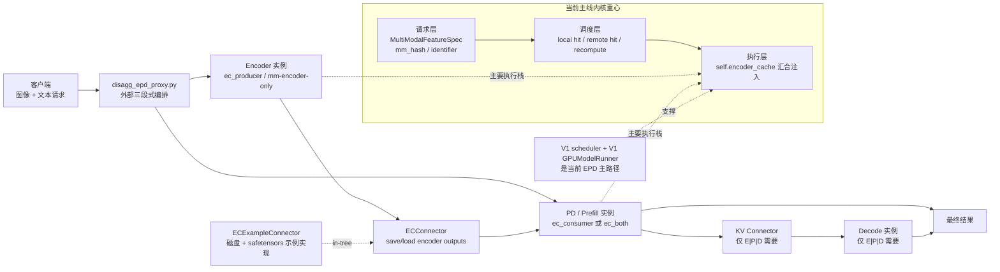

要点说明：

1. 当前主线的 EPD，本质上是“把多模态 encoder 从 prefill/decode 所在实例中拆出去”，并通过 `ECConnector` 在进程间传递 encoder outputs，而不是把整个推理流程自动做成一个内建分布式 pipeline。
2. 在线 E|PD / E|P|D 示例并不只靠引擎内部完成 orchestration，而是依赖外部代理 `examples/online_serving/disaggregated_encoder/disagg_epd_proxy.py` 做“三段式编排”。
3. 当前主线源码里 EC 相关 mixin 与完整执行链仍集中在 V1 路径；in-tree connector 只有 `ECExampleConnector`，定位是示例实现。

### 架构分析

1. 当前 vLLM 的 EPD 更像“内核已经具备 encoder 输出解耦与远端注入能力，但完整线上拓扑仍靠代理拼装”。这决定了它已经能解释设计思想，但距离“单开关生产化 EPD”还有工程空隙。
2. EPD 真正解决的是“多模态 encoder 计算与文本 prefill/decode 的耦合”，而不是所有分布式 serving 问题。它和 disaggregated prefill 是两个正交维度：前者转移的是 encoder outputs，后者转移的是 KV cache。
3. 这套设计的价值中心不是“把 encoder 拆出去”这件事本身，而是“把 encoder outputs 变成一个可缓存、可传输、可注入的中间表示”。

---

## 2. 背景与动机

### 当前实现

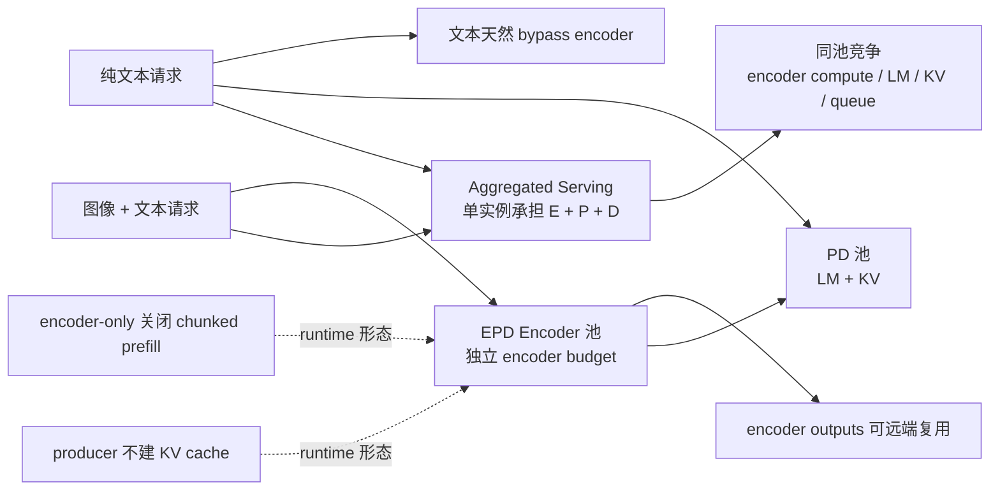

要点说明：

1. 从当前代码结构可以直接看出，encoder、prefill、decode 被视为资源画像不同的阶段，三者长期共置会带来互相干扰与扩容耦合。
2. 这种差异已经进入 runtime：scheduler 有独立的 `encoder_compute_budget` 与 `encoder_cache_manager`，纯 producer 不分配 KV cache，encoder-only 关闭 chunked prefill。
3. 文本请求在代理层和引擎层都天然可以 bypass encoder。

### 架构分析

1. vLLM 做 EPD 的根因，不是“把 pipeline 切得更细一定更快”，而是“多模态请求把一个短时、重计算、强波动的 encoder 阶段硬塞进了文本 generation 实例”，导致文本请求也被视觉工作拖累。
2. 纯 PD 分离主要是为了解耦 TTFT 与 ITL；EPD 更强调去掉“视觉 encoder 对文本生成的干扰”。两者关注的瓶颈不同，所以收益形态也不同。

---

## 3. 官方定义与能力边界

### 3.1 概念地图

| 概念                  | 当前仓库中的含义                                                                                    | 传递对象                     | 典型拓扑                  | 关键模块                                  |
| --------------------- | --------------------------------------------------------------------------------------------------- | ---------------------------- | ------------------------- | ----------------------------------------- |
| aggregated serving    | 单个 vLLM 实例同时承担该请求需要的全部阶段；对多模态请求来说通常是 E+P+D 共置，对纯文本请求则没有 E | 无跨进程中间态               | `1 x vLLM`                | 常规 scheduler / worker                   |
| disaggregated encoder | 把多模态 encoder 从 PD 实例拆出，PD 侧加载远端 encoder outputs                                      | encoder outputs / embeddings | `E + PD`                  | `vllm/distributed/ec_transfer`            |
| disaggregated prefill | 把 prefill 与 decode 拆开，decode 侧加载远端 KV                                                     | KV cache + 传输参数          | `P + D`                   | `vllm/distributed/kv_transfer`            |
| E\|PD                 | EPD 的最小在线形态；E 单独实例，PD 为 combined 实例                                                 | 仅 EC                        | `1E + 1PD` 或扩展到多实例 | `disagg_epd_proxy.py` + EC connector      |
| E\|P\|D               | 在 EPD 上再叠加 PD 分离                                                                             | 先 EC，后 KV                 | `1E + 1P + 1D`            | `disagg_epd_proxy.py` + EC + KV connector |
| ec_both               | 单实例既是 EC producer 又是 EC consumer；仍可生成 token，不等于单独的 encoder-only 实例             | EC                           | 聚合节点上的混合角色      | `ec_role="ec_both"`                       |

### 3.2 解决什么问题，不解决什么问题

#### 当前实现

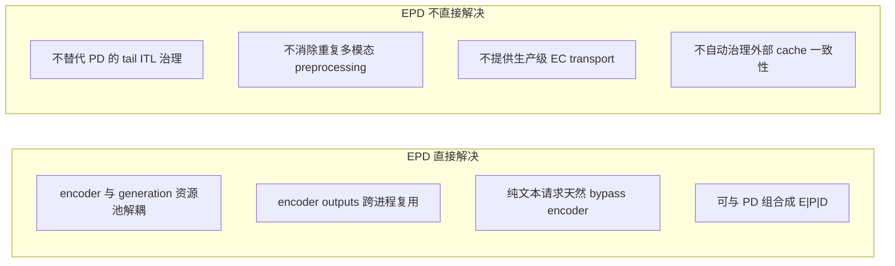

要点说明：

1. EPD 解决的是“多模态 encoder 结果如何拆出、复用、注回 generation 流水线”。
2. EPD 不会自动把整条多模态请求链都变成可复用中间态，也不会自动补齐 transport 和 cache governance。

#### 架构分析

1. EPD 的“边界”非常清楚：它把“视觉 encoder 结果”外提成可复用中间态，但没有把“整个多模态请求处理”都提成可复用中间态。当前 proxy 仍会让 E、P、D 三端分别解析和预处理原始多模态输入。
2. 对自研框架来说，不能把 EPD 误读为“只要把 vision tower 拆到另一台机器就行”。如果没有 hash、metadata、cache lifecycle、失败回退，这个设计会很快失效。

### 3.3 `ec_role` 与运行时行为矩阵

| `ec_role`     | scheduler 侧行为                                                                             | worker 侧行为                                     | 是否走 encoder-only 快路径                                                          | KV / sampler 形态                                                         | 典型部署                 |
| ------------- | -------------------------------------------------------------------------------------------- | ------------------------------------------------- | ----------------------------------------------------------------------------------- | ------------------------------------------------------------------------- | ------------------------ |
| `ec_producer` | 不参与远端 EC 载入决策；scheduler 侧基本没有 consumer 式命中/加载语义                        | 只 `save_caches()`，不 `start_load_caches()`      | 是。`execute_model()` 在 `has_ec_transfer() and not is_consumer` 时会提前返回空输出 | `get_kv_cache_spec()` 直接返回空；Ray executor 也不会把它当成正常采样实例 | 纯 encoder 节点          |
| `ec_consumer` | 参与 `has_cache_item()` / `build_connector_meta()`，把“远端载入还是本地重算”前移到 scheduler | 先 `start_load_caches()`，再走正常 prefill/decode | 否                                                                                  | 正常持有 KV cache，可与 KV connector 组合成 P/D 分离                      | PD 或 P 节点             |
| `ec_both`     | 具备与 consumer 相同的远端命中/metadata 构建语义                                             | 同时具备 load 与 save 能力                        | 否。因为 `ec_both` 也是 consumer，不满足 `not is_consumer`                          | 仍是正常生成实例                                                          | 聚合节点或单实例复用场景 |

要点说明：

1. `ec_both` 是一个很容易被误读的角色。它不是“带一点 producer 能力的 encoder-only”，而是“仍然按正常生成实例运行，但同时能读写 EC”。
2. 这也解释了为什么 `ec_both` 可以用于单实例基准或重复图像命中测试，但它并不等价于真正的 E-only 节点。

---

## 4. 仓库与代码入口总览

### 4.1 文档 / 示例 / 测试入口

1. 官方功能文档：
   - `docs/features/disagg_encoder.md`
   - `docs/features/disagg_prefill.md`
2. 在线示例：
   - `examples/online_serving/disaggregated_encoder/README.md`
   - `examples/online_serving/disaggregated_encoder/disagg_epd_proxy.py`
   - `examples/online_serving/disaggregated_encoder/disagg_1e1pd_example.sh`
   - `examples/online_serving/disaggregated_encoder/disagg_1e1p1d_example.sh`
   - `examples/online_serving/disaggregated_serving/README.md`
   - `examples/online_serving/ec_both_encoder/ec_both_encoder.sh`
3. EPD 直接相关测试：
   - `tests/v1/ec_connector/unit/test_ec_example_connector.py`
   - `tests/v1/ec_connector/integration/test_epd_correctness.py`
   - `tests/v1/ec_connector/integration/run_epd_correctness_test.sh`
   - `tests/v1/core/test_scheduler.py`
   - `tests/v1/engine/test_engine_core.py`

### 4.2 核心代码地图

1. 配置与初始化：
   - `vllm/engine/arg_utils.py`: 暴露 `--ec-transfer-config`、`--mm-encoder-only`
   - `vllm/config/ec_transfer.py`: `ECTransferConfig`
   - `vllm/distributed/ec_transfer/ec_transfer_state.py`: worker 侧全局 EC connector 初始化
   - `vllm/v1/worker/gpu_worker.py`: 创建 model runner 前调用 `ensure_ec_transfer_initialized()`
2. 请求解析与多模态输入建模：
   - `vllm/entrypoints/openai/chat_completion/serving.py`
   - `vllm/entrypoints/serve/render/serving.py`
   - `vllm/entrypoints/chat_utils.py`
   - `vllm/inputs/preprocess.py`
   - `vllm/v1/engine/input_processor.py`
   - `vllm/multimodal/inputs.py`
   - `vllm/v1/request.py`
3. 调度与缓存：
   - `vllm/v1/core/encoder_cache_manager.py`
   - `vllm/v1/core/sched/scheduler.py`
   - `vllm/v1/core/sched/output.py`
4. 执行与注入：
   - `vllm/v1/worker/ec_connector_model_runner_mixin.py`
   - `vllm/v1/worker/gpu_model_runner.py`
5. Connector 抽象与实现：
   - `vllm/distributed/ec_transfer/ec_connector/base.py`
   - `vllm/distributed/ec_transfer/ec_connector/factory.py`
   - `vllm/distributed/ec_transfer/ec_connector/example_connector.py`
6. 与 PD 组合时的 KV 参数传递：
   - `vllm/entrypoints/openai/chat_completion/protocol.py`
   - `vllm/v1/request.py`
   - `vllm/v1/core/sched/scheduler.py`
   - `vllm/v1/engine/output_processor.py`

### 4.3 初始化路径、请求路径、传输路径、失败路径

```mermaid
flowchart TB
  subgraph Init["初始化路径"]
    I1["CLI / ENV<br/>--ec-transfer-config<br/>--mm-encoder-only"]
    I2["ECTransferConfig"]
    I3["GPUWorker.ensure_ec_transfer_initialized()"]
    I4["ECConnectorFactory.create_connector()"]
    I1 --> I2 --> I3 --> I4
  end

  subgraph Req["请求路径"]
    R1["OpenAI Chat Request"]
    R2["renderer / parser / multimodal preprocess"]
    R3["InputProcessor.process_inputs()"]
    R4["Request"]
    R5["Scheduler.schedule()"]
    R6["GPUModelRunner.execute_model()"]
    R1 --> R2 --> R3 --> R4 --> R5 --> R6
  end

  subgraph Transfer["传输路径"]
    T1["_execute_mm_encoder()"]
    T2["self.encoder_cache"]
    T3["save_caches()"]
    T4["共享介质 / 远端存储"]
    T5["start_load_caches()"]
    T6["_gather_mm_embeddings()"]
    T1 --> T2 --> T3 --> T4 --> T5 --> T2 --> T6
  end

  subgraph Fail["失败路径"]
    F1["远端 EC 不存在"]
    F2["scheduler 回退到本地 encode"]
    F3["调度后远端文件消失"]
    F4["start_load_caches() 抛 FileNotFoundError"]
    F5["载入后仍缺项"]
    F6["_gather_mm_embeddings() 报 Encoder cache miss"]
    F1 --> F2
    F3 --> F4 --> F5 --> F6
  end
```

1. 初始化路径：
   - CLI `--ec-transfer-config` / `--mm-encoder-only`
   - `ECTransferConfig`
   - `GPUWorker` 调 `ensure_ec_transfer_initialized()`
   - `ECConnectorFactory.create_connector()`
2. 请求路径：
   - OpenAI Chat 请求
   - renderer / parser / multimodal preprocess
   - `InputProcessor.process_inputs()`
   - `Request`
   - `Scheduler.schedule()`
   - `GPUModelRunner.execute_model()`
3. 传输路径：
   - EC: `_execute_mm_encoder()` -> `self.encoder_cache` -> `save_caches()` -> 远端/共享介质 -> `start_load_caches()` -> `self.encoder_cache` -> `_gather_mm_embeddings()`
   - KV: prefill 响应把 `kv_transfer_params` 带回上层，再由 decode 请求继续使用
4. 失败路径：
   - 远端 EC 不存在: scheduler 直接回退到本地 encode
   - 远端 EC 在调度后消失: `start_load_caches()` 抛 `FileNotFoundError`
   - 载入后仍缺项: `_gather_mm_embeddings()` 断言 `Encoder cache miss`
   - 有 `kv_transfer_params` 但没有 KV connector: engine warning 后禁用

---

## 5. EPD 端到端请求生命周期

以下以“图像 + 文本”的在线 E|P|D 请求为例说明。E|PD 只是把其中的 prefill 与 decode 合并为一个 PD 实例。

### 全链路 Mermaid 时序图

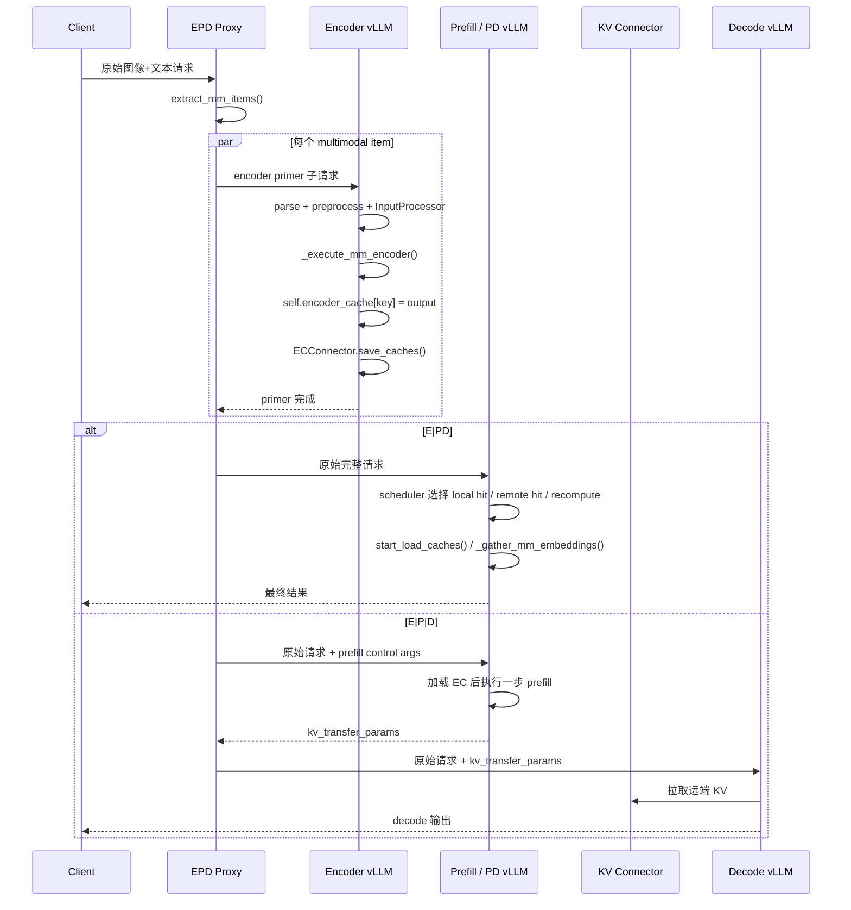

### 5.1 请求进入系统

1. 客户端向 `disagg_epd_proxy.py` 发送 OpenAI chat completion 请求。
2. 代理的 `extract_mm_items()` 只从 `messages[*].content` 的 list 形态里提取 `image_url` / `audio_url` / `input_audio` 三类 item，而不是泛化地抓取一切非文本内容。这意味着当前 demo proxy 的模态覆盖范围，其实比引擎内部的多模态抽象更窄。
3. `fanout_encoder_primer()` 会为每个 multimodal item 构造一个“只保留该 item、完全删除文本”的子请求，并把 `max_tokens` 固定为 `1`，以确保服务端真正走到 encoder 执行路径。所有 primer 子请求必须全部成功，后续 P/PD/D 阶段才会继续。

### 5.2 多模态输入解析

1. 每个 encoder primer 子请求与原始请求，在各自 vLLM 实例里都会走同一条标准入口：
   - `OpenAIServingChat.create_chat_completion()`
   - `OpenAIServingRender.render_chat()`
   - `parse_chat_messages()`
   - `InputPreprocessor._process_multimodal()`
   - `InputProcessor.process_inputs()`
2. `InputProcessor` 把多模态 item 统一折叠成 `MultiModalFeatureSpec`，其中最关键的字段有：
   - `data`: 真正给 vision tower 的输入
   - `identifier`: 用于 cache / connector 命中的 key；LoRA 场景下可变成 `lora_name:mm_hash`
   - `mm_position`: 该多模态 item 在 decoder 输入序列里的 placeholder 位置
   - `mm_hash`: 原始多模态 processor 产出的基础 hash
3. `InputProcessor` 会先按 `mm_position` 对多模态项排序，再生成 `mm_features`。因此后续 scheduler / worker 实际看到的顺序，是“在 decoder 序列中的占位顺序”，不一定等同于原始 `messages` 遍历顺序。
4. `MultiModalFeatureSpec.data` 允许为 `None`。源码注释写得很明确：这是为了在 API server 与 engine core 之间跳过不必要的 IPC。所以 EPD 的调度与命中语义，真正依赖的是 `identifier` / `mm_position` / `mm_hash`，而不是始终依赖原始多模态 payload 常驻内存。
5. `PlaceholderRange` 还支持 `is_embed` mask，这意味着“placeholder token 数”和“当前 step 真正需要切出的 encoder embedding 数”并不总是一一对应；后续 `_gather_mm_embeddings()` 会根据这个 mask 做稀疏切片。

### 5.3 encoder 如何被触发 / 分流

1. 代理层不是把“原始完整请求”直接发给 encoder；而是 `fanout_encoder_primer()` 为每个多模态 item 构造一个只包含该 item、没有文本内容的子请求，并发打到 encoder 集群。
2. 在 encoder 实例内，`GPUModelRunner.execute_model()` 会检测到“当前有 EC transfer，且本实例不是 consumer”，于是走 encoder-only 分支：
   - 进入 EC connector 生命周期上下文
   - 执行 `_execute_mm_encoder()`
   - 立即返回 `make_empty_encoder_model_runner_output()`
3. 这个分支不会继续走 LM prefill/decode，因此 encoder-only 实例不需要 KV cache。

### 5.4 encoder outputs 如何生成

1. `_execute_mm_encoder()` 根据 `scheduler_output.scheduled_encoder_inputs` 把需要编码的多模态 item 批量收集出来。
2. 然后调用模型的 `embed_multimodal(**mm_kwargs_batch)` 真正运行 vision encoder。
3. 每个 item 的输出以 `self.encoder_cache[key] = output` 形式落到 worker 本地 `encoder_cache`；这里的 `key` 实际沿用 `MultiModalFeatureSpec.identifier`，无 LoRA 时通常等于基础 `mm_hash`。
4. 实际 batching 比报告开头看起来更精细：runner 会先按 modality 分组批处理；如果一个 batch 中 modality 混杂，或者为了保持 item 顺序必须拆分，就会变成多个 micro-batch。
5. 某些视频 / EVS / dynamic-resolution video 场景下，源码会主动退化成“逐视频顺序编码”，以降低峰值显存，而不是强行把视频样本堆到同一个 encoder batch 里。
6. LoRA 场景下，EPD 不只是把 `identifier` 改成 `lora_name:mm_hash`。如果 tower connector LoRA 打开，runner 还会额外构造 TOWER / CONNECTOR 两套 LoRA mapping，再执行 `embed_multimodal()`。也就是说，LoRA 既影响 cache key，也影响 encoder 执行上下文。

### 5.5 metadata 如何组织

1. scheduler 不直接把 tensor 发给 worker；它只在 `SchedulerOutput.ec_connector_metadata` 里携带一个“这一轮需要从外部加载哪些 mm item”的 opaque metadata。
2. 对 `ECExampleConnector` 而言，这个 metadata 是 `ECExampleConnectorMetadata`，里面只是一组 `MMMeta(mm_hash, num_token)`；字段名虽然叫 `mm_hash`，但实际承载的是用于载入的字符串 key，无 LoRA 时通常等于基础 `mm_hash`。
3. 这说明当前元数据设计是极简的：worker 知道“要加载哪些 hash”，至于 tensor 的 schema / 版本 / dtype / 设备兼容性，不在 connector metadata 里显式表达。

### 5.6 outputs 如何缓存 / 传输

1. encoder 侧本地缓存：
   - `self.encoder_cache` 是 worker 内的物理缓存。
   - `EncoderCacheManager` 是 scheduler 内的逻辑缓存。
2. 远端传输：
   - `maybe_save_ec_to_connector()` 调 `ECConnector.save_caches()`
   - `ECExampleConnector.save_caches()` 把 tensor 转 CPU 后写入 `<shared_storage_path>/<key>/encoder_cache.safetensors`
3. 这个设计里，“外部 EC”与“本地 `encoder_cache`”是两套缓存层次，不是同一份对象。
4. ExampleConnector 的 save/load 路径是一条非常明确的“GPU -> CPU -> safetensors 文件 -> 目标设备”链路：`save_caches()` 会对张量做 `detach().cpu()`，`start_load_caches()` 再用 `safetensors.torch.load_file(..., device=current_platform.device_type)` 直接读回目标设备。
5. `ECExampleConnector._generate_filename_debug()` 在读写两侧都会自动创建 `<shared_storage_path>/<key>/` 目录，因此“目录存在”不等价于“缓存文件已经有效写完”；真正命中依赖的还是 `encoder_cache.safetensors` 是否存在、是否可读。

### 5.7 PD 侧如何加载 / 注入

1. Prefill 或 PD 实例收到原始完整请求后，会再次独立解析出同样的 `mm_hash` / `identifier` / `mm_position`。
2. scheduler 的 `_try_schedule_encoder_inputs()` 对每个多模态 item 做三选一：
   - 本地 encoder cache 命中: `EncoderCacheManager.check_and_update_cache()`
   - 远端 EC 命中: `ec_connector.has_cache_item(identifier)`，随后放进 `external_load_encoder_input`
   - 否则本地算 encoder，放进 `scheduled_encoder_inputs`
3. 进入 worker 后：
   - `ECConnectorModelRunnerMixin` 先 `bind_connector_metadata()`
   - consumer 角色执行 `start_load_caches()`
   - `ECExampleConnector.start_load_caches()` 从共享目录把 safetensors 读回 `self.encoder_cache`
   - `_gather_mm_embeddings()` 从 `self.encoder_cache[key]` 切出当前 step 所需区间
   - `_preprocess()` 把这些 `mm_embeds` 注入 `model.embed_input_ids(...)`
4. 当前 EC load 是 step 内同步完成的，并没有像 KV transfer 那样把请求推进到某个 `WAITING_FOR_REMOTE_*` 状态；这也是为什么现有 ExampleConnector 更像“同步 cache load”，而不是完整的异步远端传输 pipeline。
5. `_gather_mm_embeddings()` 不只是简单切张量。它既支持 `PlaceholderRange.is_embed` 的稀疏切片，也支持多个 multimodal feature 在同一段 prompt 上重叠时通过 OR mask 合并 `is_mm_embed`，例如 `use_audio_in_video` 这类复合输入场景。

### 5.8 prefill / decode 如何继续执行

1. 如果代理配置了独立 prefill 实例，`process_prefill_stage()` 会给请求塞入：
   - `kv_transfer_params = {"do_remote_decode": true, "do_remote_prefill": false, ...}`
   - `max_tokens = 1`
   - `stream = false`
2. OpenAI 协议层 `ChatCompletionRequest` 会把 `kv_transfer_params` 塞进 `SamplingParams.extra_args`。
3. `Request` 初始化时会从 `sampling_params.extra_args` 里抽出 `kv_transfer_params`。
4. prefill 结束时，scheduler 把 `kv_transfer_params` 放进 `EngineCoreOutput`，`OutputProcessor` 再把它带到上层响应。
5. 代理把返回的 `kv_transfer_params` 注回原始请求，然后转发给 decode 实例。
6. decode 实例此时不关心 EC；它主要消费的是 KV connector 路径。

### 5.9 最终如何返回结果

1. E|PD:
   - 代理先完成 encoder primer
   - 然后把原始请求直接发给 PD 实例
   - PD 完成 prefill + decode 并把结果返回给客户端
2. E|P|D:
   - 代理先完成 encoder primer
   - 再调用 prefill 实例拿 `kv_transfer_params`
   - 最后把原始请求 + `kv_transfer_params` 发给 decode 实例，decode 负责最终流式/非流式输出

### 5.10 失败路径与 fallback

1. 远端 EC 根本不存在时，fallback 发生在 scheduler 阶段：`has_cache_item()` 返回 `False`，该 item 会回到“本地计算 encoder”分支。
2. 远端 EC 在 scheduler 认为“存在”之后被删除时，当前 ExampleConnector 不做恢复，它会在 `start_load_caches()` 中直接触发 `FileNotFoundError`。
3. 如果某个 item 理应已经装入 `self.encoder_cache`，但到 `_gather_mm_embeddings()` 时仍未拿到，会触发 `assert encoder_output is not None`。
4. 文本请求不会走上述路径：没有 `mm_features`，也没有 encoder primer 子请求。

---

## 6. 核心工程实现拆解

### 6.0 总体架构图

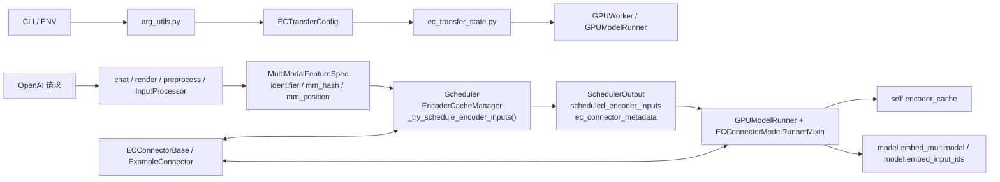

#### 调度与缓存图

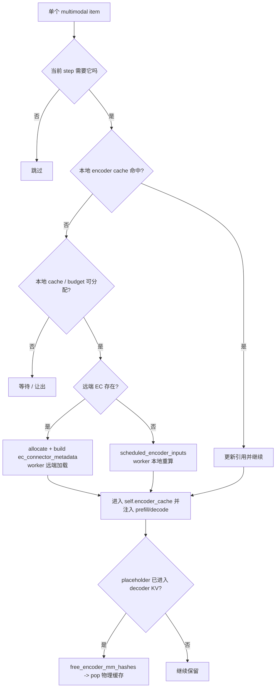

### 6.1 模式开关与配置入口

#### 当前实现

1. CLI 参数入口在 `vllm/engine/arg_utils.py`：
   - `--mm-encoder-only`
   - `--ec-transfer-config`
2. `ECTransferConfig` 的核心字段在 `vllm/config/ec_transfer.py`：
   - `ec_connector`
   - `ec_role`，支持 `ec_producer` / `ec_consumer` / `ec_both`
   - `engine_id`
   - `ec_connector_extra_config`
   - `ec_connector_module_path`
3. `compute_hash()` 当前没有纳入任何 factor，返回的是空 factors 的 hash。这意味着 EC transfer 配置本身并不参与计算图哈希。
4. 官方示例 README 指明 encoder 实例推荐组合：
   - `--enforce-eager`
   - `--no-enable-prefix-caching`
   - 很大的 `--max-num-batched-tokens`
   - 可选 `--mm-encoder-only`
5. `engine_id` 在未显式传入时会自动生成 UUID，但当前并不参与 cache key 或 `compute_hash()`；它更像 connector 实例身份而不是一致性边界。
6. `ec_connector_module_path` 的动态加载能力，源码注释明确写的是 “Only supported in V1”，这进一步说明当前 EPD 扩展点仍主要依附在 V1 runner / connector 栈上。

#### 架构分析

1. 从配置设计看，vLLM 把 EPD 视为“额外的 transport / scheduling capability”，而不是一种全新 engine type。
2. `compute_hash()` 目前忽略 ECTransferConfig，说明当前实现默认认为“EC transfer 不改变模型计算图”，但这也意味着 connector 层并不会帮助你做任何模型版本隔离。

### 6.2 encoder-only / PD 实例初始化差异

#### 当前实现

1. `GPUWorker` 在分布式环境初始化后调用 `ensure_ec_transfer_initialized()`，由此在 worker 进程内创建全局 EC connector。
2. `GPUModelRunner.execute_model()` 对 “`has_ec_transfer()` 且 `not get_ec_transfer().is_consumer`” 有专门分支：这就是 encoder-only 实例的主执行路径。
3. `GPUModelRunner.get_kv_cache_spec()` 在纯 producer 路径上直接返回空字典，因此不会创建真正的 KV cache。
4. `tests/v1/engine/test_engine_core.py` 明确验证了：
   - `ec_producer` 只有一个 null KV block
   - 没有 `kv_cache_groups`
   - 没有 `kv_cache_tensors`
   - chunked prefill 被禁用
5. `model_executor/models/interfaces.py` 用 `StageMissingLayer("language_model", mod)` 支持 `--mm-encoder-only`，让 encoder-only 实例跳过语言模型组件初始化。
6. `vllm/v1/executor/ray_executor.py` 还根据 `is_ec_consumer` 来决定是否启用 sampler，这意味着纯 producer 实例不会走正常生成采样语义。
7. 一个很关键但不那么显眼的细节是：`ec_both` 不会走第 2 条里的“encoder-only 提前返回”分支，因为它同时也是 consumer。也就是说，`ec_both` 本质上仍是正常生成实例，只是额外具备读写 EC 的能力。

#### 架构分析

1. 当前的 encoder-only 实例不是“裁掉一部分算子后仍能正常生成”的普通 vLLM；它更接近一个只保留 vision tower 与必要调度骨架的专门化执行体。
2. `ec_both` 的引入说明 vLLM 已经开始支持“聚合节点也参与 EC 读写”的混合部署，但这不改变 EPD 主设计仍以“encoder-only producer + consumer PD/P”组合为主。

### 6.3 connector 抽象：接口、职责、扩展点、调用链

#### 当前实现

1. `ECConnectorBase` 把接口严格分成两类：
   - scheduler 侧: `has_cache_item()`、`update_state_after_alloc()`、`build_connector_meta()`
   - worker 侧: `bind_connector_metadata()`、`clear_connector_metadata()`、`start_load_caches()`、`save_caches()`、`get_finished()`
2. `ECConnectorFactory` 当前 registry 里内建的只有 `ECExampleConnector`；如果要扩展，只能走 `ec_connector_module_path` 动态加载。
3. `ECExampleConnector` 的行为非常朴素：
   - `has_cache_item()` 只检查文件是否存在
   - `save_caches()` 直接把张量存到磁盘
   - `start_load_caches()` 直接从磁盘读回 GPU 设备
   - `build_connector_meta()` 只打包一组 `key + num_token`（数据结构字段名仍叫 `mm_hash`）
4. connector 在 scheduler 侧和 worker 侧不是同一个对象：scheduler 会自己创建一个 `role=SCHEDULER` 的 connector，而 worker 侧则通过 `ec_transfer_state.py` 把 connector 放进进程全局单例 `_EC_CONNECTOR_AGENT`。这意味着二者共享的是协议与配置，不共享内存状态。
5. `ECConnectorFactory` 用的是 lazy registry：只有真正命中某个 connector 名称时，才会 import 对应模块。这让 EPD 扩展点保持轻量，但也意味着 connector 的初始化副作用和错误要等到 runtime 才暴露。

#### 架构分析

1. 这套抽象刻意把 connector 变成“调度器能问 cache 是否存在、worker 能把 tensor 拉进/写出 local `encoder_cache`”的最小接口，避免把 transport 细节写死在 scheduler/worker 里。
2. 但当前抽象仍偏早期：
   - scheduler 侧没有显式的 async 状态机
   - worker 侧没有强制性的 save completion / retry / rollback 约束
   - metadata 太薄，难以支撑复杂的高性能 transport

### 6.4 metadata 设计：跨阶段传递了什么，为什么这样设计

#### 当前实现

1. `MultiModalFeatureSpec` 是跨阶段的核心实体，字段含义分别是：
   - `identifier`: cache / connector 命中 key
   - `mm_hash`: 基础 hash
   - `mm_position`: placeholder 范围
   - `data`: 真正的多模态输入
2. `SchedulerOutput` 里有三类和 EPD 强相关的字段：
   - `scheduled_encoder_inputs`
   - `free_encoder_mm_hashes`
   - `ec_connector_metadata`
3. `ECExampleConnectorMetadata` 只包含 `MMMeta(mm_hash, num_token)`；其中字段名 `mm_hash` 实际承载的是 load 所需的字符串 key。
4. 当前 ExampleConnector 在 worker load 路径里实际上只消费这个 key；`num_token` 没有参与真正的 IO / shape 校验。
5. `data=None` 本身就是正式支持的状态，而不是异常值。它的意义是“这个 multimodal item 的大 payload 可以不在 API server 和 engine core 之间重复搬运”，但其定位、命中与注入语义仍然可通过 `identifier` / `mm_position` 保持完整。
6. `PlaceholderRange` 里的 `is_embed` 使得同一个 placeholder 区间内部可以只有部分 token 需要被 encoder embedding 覆盖；因此 `num_token`、`get_num_embeds()`、实际切片范围是三个不能简单混为一谈的量。

#### 架构分析

1. vLLM 的 metadata 设计倾向于“最小必要信息”：
   - placeholder 位置仍由请求状态决定
   - connector metadata 只回答“这一轮要加载哪些 EC”
2. 这种设计的优点是 connector 与模型实现解耦；缺点是当前 metadata 不足以承担版本校验、shape 校验、跨硬件协商等职责。

### 6.5 encoder outputs 的保存、加载、注入路径

#### 当前实现

1. 保存路径：
   - `GPUModelRunner._execute_mm_encoder()`
   - `self.encoder_cache[key] = output`
   - `maybe_save_ec_to_connector()`
   - `ECExampleConnector.save_caches()`
2. 加载路径：
   - scheduler 构造 `ec_connector_metadata`
   - `ECConnectorModelRunnerMixin._get_ec_connector_output()`
   - `start_load_caches()`
   - `ECExampleConnector.start_load_caches()`
   - `self.encoder_cache[key] = ec_cache`
3. 注入路径：
   - `_gather_mm_embeddings()` 从 `self.encoder_cache` 按 placeholder 区间切片
   - `_preprocess()` 把 `mm_embeds` 与 `is_mm_embed` 交给 `model.embed_input_ids(...)`

#### 架构分析

1. `self.encoder_cache` 是整个 EPD runtime 的“合流点”。只要某个张量最终进入这个 dict，后续 prefill/decode 就不在乎它是本地算出来的还是远端载入的。
2. 这比在模型内部硬编码“远端 embedding 输入”要干净，因为它把远端传输问题隔离在 worker 外围。

### 6.6 scheduler / orchestration 如何推进状态

#### 当前实现

1. `_try_schedule_encoder_inputs()` 是 EPD 的关键调度点。对每个 multimodal item，它依次检查：
   - 当前 step 是否需要该 item
   - 是否已在 decoder KV 中消费完成
   - 本地 encoder cache 是否命中
   - cache / budget 是否允许分配
   - 远端 EC 是否存在
   - 最终决定本地算还是远端载入
2. `schedule()` 会对需要的 item 先做逻辑 `allocate()`，再调用 `ec_connector.update_state_after_alloc()`。
3. `build_connector_meta()` 在 `SchedulerOutput` 组装阶段执行。
4. `_update_after_schedule()` 会推进 `num_computed_tokens`，随后调用 `_free_encoder_inputs()`。
5. `_free_encoder_inputs()` 的释放条件是“该 item 对应的 placeholder 已经被消费进入 decoder KV”；这意味着物理释放不是立刻发生。
6. scheduler 虽然按 request 调度，但在 `_try_schedule_encoder_inputs()` 内部会额外维护 `mm_hashes_to_schedule` 与 `num_embeds_to_schedule` 这两个“按 item 粒度”的临时状态，用来避免同一步里对同一个 `identifier` 重复调度、也避免容量计算失真。
7. 当 `disable_chunked_mm_input=True` 且当前 token window 只覆盖到某个 multimodal item 的一部分时，scheduler 会把 `num_new_tokens` 回滚到该 item 开始之前，而不是让一个 MM item 被截断地进入当前 step。
8. 当 `can_allocate()` 失败时，如果 `num_computed_tokens` 已经因为 prefix caching 等原因越过了该 item 的 `start_pos`，scheduler 会把本轮 `num_new_tokens` 直接置成 `0`，而不是勉强调度一部分。这是一个很强的正确性优先决策。
9. “远端命中”在 `_try_schedule_encoder_inputs()` 里会被放进 `external_load_encoder_input`，并同样累加到 `num_embeds_to_schedule`。也就是说，它虽然不扣 encoder compute budget，但会占 encoder cache 的本地落点预算。

#### 架构分析

1. scheduler 里的 EPD 逻辑本质上是一个三路选择器：
   - reuse local
   - load remote
   - recompute local
2. 这也是为什么 EPD 真正依赖 scheduler，而不是只靠 worker：你必须在 token budget、encoder budget、cache capacity、placeholder overlap 这几个约束下做选择。

### 6.7 cache 机制：命中判断、key、生命周期、一致性

#### 当前实现

1. 逻辑 cache manager 是 `EncoderCacheManager`：
   - key 是 `request.mm_features[input_id].identifier`
   - 粒度是“单个 multimodal item”
   - 容量按 encoder embeddings 数量而不是字节计
2. `check_and_update_cache()` 负责命中与引用计数更新。
3. `can_allocate()` 负责容量判断，并可能触发逻辑层 eviction；被逐出的 `mm_hash` 会放到 `freed`，稍后通过 `SchedulerOutput.free_encoder_mm_hashes` 通知 worker。
4. worker 物理释放发生在 `GPUModelRunner` 处理 `scheduler_output.free_encoder_mm_hashes` 时，从 `self.encoder_cache` 中 `pop` 掉对应 key。
5. `reset_encoder_cache()` 只清本地逻辑/物理缓存；engine 注释明确说它主要用于调试，且“不尝试 re-sync internal caches”。
6. `ECExampleConnector` 的外部 key 最终落到单个字符串路径上：无 LoRA 时通常是基础 `mm_hash`，有 LoRA 时可能带 `lora_name:` 前缀；无论哪种情况都不带模型版本。
7. 除了 EPD 的 encoder cache 外，vLLM 还存在独立的 multimodal processor cache：`MultiModalConfig.mm_processor_cache_gb` / `mm_processor_cache_type` 控制的是“预处理与 processor 输出缓存”，而且它会在每个 API 进程和 engine core 进程各自复制一份，总内存开销近似为 `mm_processor_cache_gb * (api_server_count + data_parallel_size)`，并不是 EPD 的跨进程共享缓存。

#### 架构分析

1. 当前 EPD 实际上有三层 cache：
   - scheduler 逻辑引用与容量管理
   - worker 本地张量缓存
   - connector 外部持久化 / 传输层
2. 一致性是当前实现最脆弱的部分：
   - 外部 ExampleConnector 没有模型版本 key
   - 没有外部缓存删除 API
   - `reset_encoder_cache()` 不会清外部磁盘文件
3. 因而当前实现更像“operator 需要自己管理 EC 目录生命周期”，而不是“框架自动保证跨实例一致性”。
4. 这也解释了为什么“重复 preprocessing”至今还是问题。即使开启了 mm processor cache，它也主要是进程内 / 本地复用，并没有自动变成 E|P|D 三段共享的规范化中间态。

### 6.8 与 disaggregated prefill 的关系和组合方式

#### 当前实现

1. EPD 与 PD 分离用的是两套独立系统：
   - EPD: `vllm/distributed/ec_transfer`
   - PD: `vllm/distributed/kv_transfer`
2. 官方文档明确把 E|P|D 描述为：Prefill 先按 EPD 的方式拿到 encoder outputs，然后只执行一步 prefill，再把 KV 交给 decode。
3. `disagg_epd_proxy.py` 里这两个阶段在编排上是串行的：
   - 先 encoder primer
   - 再可选 prefill
   - 最后 decode
4. `kv_transfer_params` 通过 OpenAI 协议对象进入 `SamplingParams.extra_args`，再由 `Request` 和 scheduler / output processor 传下去与传回来。

#### 架构分析

1. EPD 与 PD 分离的本质差异是“中间态不同”：
   - EPD 传的是模态 encoder outputs
   - PD 传的是自回归 attention 的 KV states
2. E|P|D 不是一个全新特性，而是“两条中间态通道首尾串接”的组合模式。

### 6.8.1 示例 proxy 的真实编排语义

#### 当前实现

1. `disagg_epd_proxy.py` 对 encode 集群和 decode / prefill 集群的负载均衡策略并不相同：
   - encoder primer 对同一个请求内的 multimodal items 做 round-robin
   - prefill / decode 则是对实例列表做 `random.choice()`
2. proxy 在控制面上是“全 barrier”语义：
   - 所有 primer 子请求都成功，后续阶段才继续
   - 任何一个 primer 异常或非 200，整个原始请求直接失败
3. prefill 阶段会强制覆盖若干请求参数：
   - 注入 `kv_transfer_params`
   - 设 `stream=false`
   - 设 `max_tokens=1`
   - 删除 `stream_options`
4. 这套示例编排没有任何“sticky session”或“跨阶段亲和性”概念。encode 子请求打到哪台 E、后续原始请求打到哪台 P/PD/D，都是独立决定的。

#### 架构分析

1. 这意味着示例 EPD 正确性真正依赖的不是“同一个请求一直路由到同一台机器”，而是：
   - 多端能算出稳定一致的 `identifier`
   - 共享 EC / KV 存储可被不同实例无状态消费
2. 这种设计很适合先验证数据面抽象是否成立，但它也暴露出当前 control plane 仍偏 demo：
   - 没有跨阶段亲和路由
   - 没有 primer 与后续阶段的流水线重叠
   - 没有更细粒度的失败补偿与重试

### 6.9 异常 / 边界情况

#### 当前实现

1. cache miss：
   - 正常 miss 在 scheduler 阶段回退到本地计算
   - 非正常 miss 在 worker 阶段可能报 `FileNotFoundError` 或 `Encoder cache miss`
2. 形状不符 / 版本不符：
   - `ECExampleConnector` 不携带 tensor schema 或模型版本元数据
   - `start_load_caches()` 直接 `load_file(...)[\"ec_cache\"]`
   - `_gather_mm_embeddings()` 只断言“取得到条目”
3. oversize 输入：
   - `InputProcessor._validate_model_input()` 会在单个多模态 item 超过预分配 encoder cache 大小时抛错
4. chunking 边界：
   - `compute_mm_encoder_budget()` 与 `_try_schedule_encoder_inputs()` 都有针对 chunked mm input 的边界处理
5. encoder-decoder 模型：
   - 当前有 `EncoderDecoderCacheManager`
   - 但其注释直接说明 encoder-decoder 还没有真正复用 encoder cache，只是在调度层做兼容

#### 架构分析

1. 当前代码对“找不到 cache”处理得比“cache 找到了但内容不兼容”更充分。
2. 如果要把 EPD 做到生产可用，versioning、schema 校验、跨实例失效广播、外部 cache deallocation 会比“再写一个更快的 transport”更先变成刚需。

### 6.10 测试覆盖了什么，没覆盖什么

#### 当前实现

1. `tests/v1/ec_connector/unit/test_ec_example_connector.py` 已覆盖：
   - 初始化
   - `has_cache_item()`
   - `update_state_after_alloc()`
   - metadata 构建
   - save / load
   - 已存在缓存时跳过 load
   - 空 metadata
   - 不存在文件时抛 `FileNotFoundError`
2. `tests/v1/core/test_scheduler.py` 已覆盖：
   - preemption/resumption 下，本地命中 / 远端命中 / 无命中 三种优先级
   - “远端载入也占用 encoder cache 容量，但不消耗 encoder compute budget”
3. `tests/v1/engine/test_engine_core.py` 已覆盖：
   - producer 与 consumer 初始化差异
4. `tests/v1/ec_connector/integration/test_epd_correctness.py` 与 `run_epd_correctness_test.sh` 已覆盖：
   - baseline vs 1E+1PD
   - baseline(1P+1D) vs 1E+1P+1D
   - multimodal prompts 与 text-only prompts

#### 架构分析

1. 当前测试足以证明“主路径正确性”和“部分 fallback 行为”，但还不够证明“生产稳定性”。
2. 还明显缺少：
   - shape / dtype / model-version mismatch 测试
   - connector 并发写读竞争测试
   - EC 外部缓存失效 / deallocation 测试
   - Model Runner V2 (MRv2) 路径覆盖
   - 大规模 E|P|D 组合压测

### 6.11 源码里的隐含不变量

#### 当前实现

1. 只要启用了 EC connector，scheduler 每一步都会构造 `ec_connector_metadata` 对象，哪怕里面是空的。原因很直接：worker 侧 mixin 在进入 connector 生命周期时会 `assert scheduler_output.ec_connector_metadata is not None`。
2. 当前实现没有 `WAITING_FOR_REMOTE_EC` 之类的请求状态；与 KV transfer 不同，EC load 在 ExampleConnector 里是同步、step 内完成的。
3. 尽管源码里的局部变量名经常写作 `mm_hash`，worker 侧 `self.encoder_cache` 实际沿用的是 `identifier` 这一逻辑 key；因此 LoRA-aware tower connector cache 在逻辑上天然与 base tower cache 隔离。
4. `update_state_after_alloc()` 会在“本地重算”和“远端载入”两条路径上都被调用；只是 ExampleConnector 内部会再次检查 `is_consumer` 与 `has_cache_item()`，因此 miss 场景下最终是 no-op。

#### 架构分析

1. 这些不变量说明，当前 EPD 的设计重心是“把远端载入统一收束到一次 step 内的同步生命周期”，而不是像 KV transfer 那样显式建一套异步状态机。
2. 这也是为什么现在的 connector metadata 可以做得很薄。一旦未来要支持真正异步 EC transfer，这些不变量大概率都要被打破，metadata、状态流转和失败回退协议都会明显变厚。

---

## 7. 关键调用链与 Mermaid 时序图

### 7.1 关键调用链

#### 请求解析链

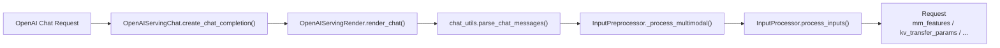

#### EPD 调度链

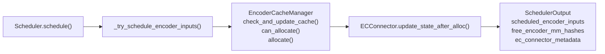

#### encoder producer 执行链

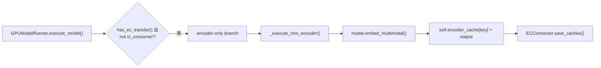

#### consumer 注入链

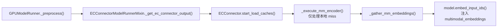

#### E|P|D 组合链

### 7.2 全链路时序图

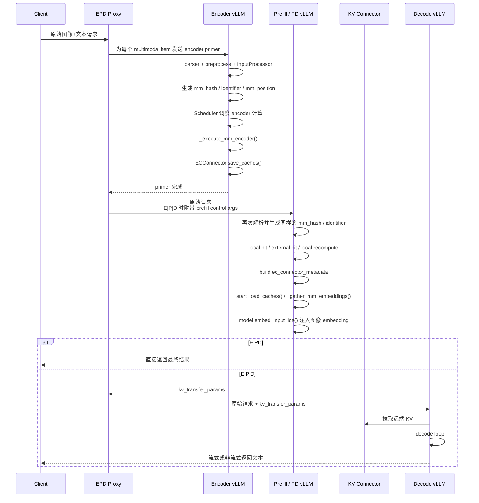

### 7.3 失败路径时序图

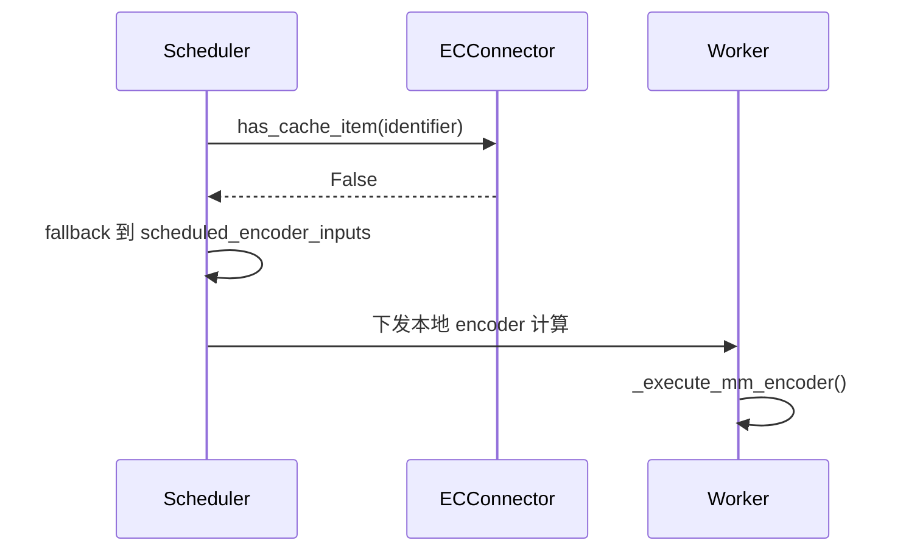

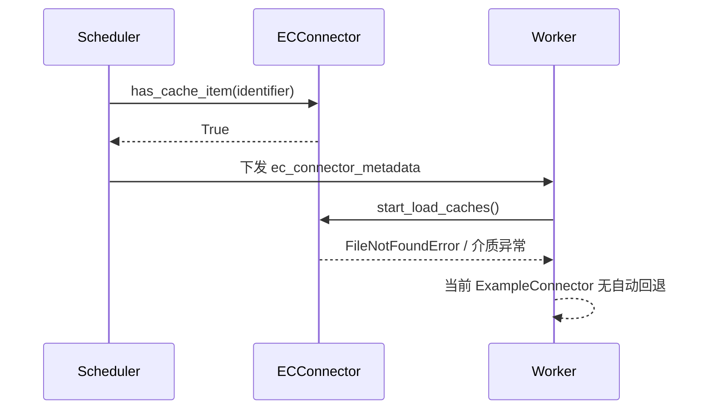

---

## 8. 设计思想与工程取舍

### 当前实现

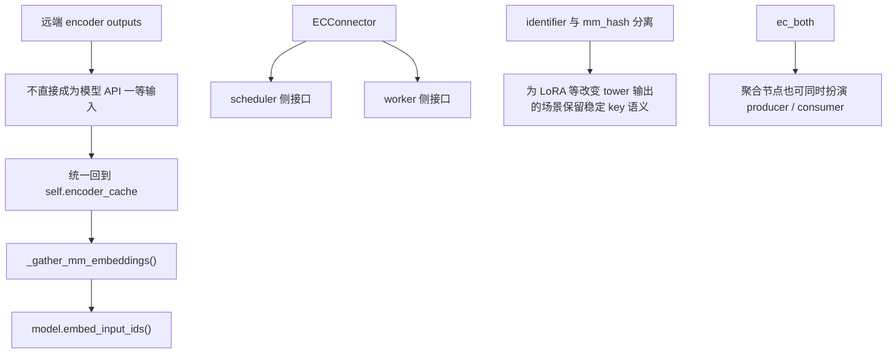

要点说明：

1. vLLM 没有把“远端 encoder outputs”直接暴露成模型 API，而是统一回收到 `self.encoder_cache` 后再注入模型。
2. connector 被设计成 scheduler / worker 双角色对象，而不是单侧 transport 适配层。
3. `identifier` / `mm_hash` 分离，以及 `ec_both` 的存在，都说明它在为更复杂的部署组合预留空间。

### 架构分析

1. 为什么 encoder 要和 PD 分离：
   - encoder 是阶段性、短时、重计算的工作
   - PD 特别是 decode 是长尾、显存/KV 主导的工作
   - 两者共置会在 queueing、资源配比、扩缩容上互相伤害
2. 为什么需要 connector：
   - 如果没有 connector，跨实例就无法形成统一的“远端命中语义”
   - scheduler 也就无法在“复用远端输出”和“本地重算”之间做选择
3. 为什么 metadata / cache / transfer 是核心：
   - EPD 的本质不是“网络转 tensor”，而是“让跨阶段共享的中间表示具备可定位、可复用、可失效的生命周期”
4. 对 TTFT、吞吐、资源异构、扩缩容、文本 bypass 意味着什么：
   - TTFT: 多模态请求的 encoder 可以和别的请求 generation pipeline 并行
   - 吞吐 / goodput: 主要受益于移除 encoder 对 decode 的干扰，而不是 PD 文档里那种单纯 P/D 拆分
   - 资源异构: encoder 池与 PD 池可以独立选型
   - 文本 bypass: 纯文本请求在代理与 scheduler 两层都天然绕过 encoder
5. 与纯 PD 分离的本质差异：
   - PD 分离解决的是“KV 在 prefill 与 decode 之间怎么搬”
   - EPD 解决的是“多模态 encoder 输出是否提前分流、可否复用、如何注回文本流水线”

### 更深一层的架构思考

1. 我认为 vLLM 现在选的分离边界是合理的。它没有把边界放在“原始图像输入”之前，也没有放在“prefill 之后的内部 hidden states”上，而是放在了“多模态 encoder outputs”这一层。这个边界的价值在于：
   - 语义已经足够稳定，后续语言模型只需要把它当作 embedding 使用。
   - 模型侵入性较低，不需要改写大部分 LM 主干接口。
   - 复用价值高，因为真实系统里重复出现的往往是图像本身，而不是整个图文请求。
2. 这个边界也暴露出当前实现最关键的遗留问题：虽然 encoder 计算被拆出来了，但“生成这些 outputs 之前的 preprocessing”仍然没有被真正共享。于是系统做到了“算子层解耦”，还没有完全做到“请求语义层解耦”。
3. 从架构抽象看，EPD 不应被理解成“一个网络传 tensor 的技巧”，而应理解成“把原本私有的中间态物化成一个可调度对象”：
   - 先有稳定标识
   - 再有命中/回收语义
   - 最后才是传输
4. vLLM 当前最值得肯定的一点，是它没有把这三件事揉在一起：
   - `MultiModalFeatureSpec` 负责表示
   - `Scheduler` 和 `EncoderCacheManager` 负责决策
   - `ECConnector` 和 `GPUModelRunner` 负责搬运与注入
5. 这类拆法的长期收益很大，因为 transport、cache policy、orchestration 都可以沿着各自方向演进，而不必把模型执行内核反复改坏。

### 典型实现难点与对应解法

1. 难点一：跨实例如何稳定地认定“这是同一个 multimodal item”。
   - 这是 EPD 能否成立的第一前提。E 端产出的 encoder outputs，只有在 P/PD/D 端算出完全相同的定位 key 时，才可能被远端命中；否则系统表面上“支持 EPD”，实际每次都会退回本地重算。
   - vLLM 当前的解法很朴素，但非常稳：让 encoder 侧和 consumer 侧都重复走同一条解析链，直到 `InputProcessor.process_inputs()` 产出 `MultiModalFeatureSpec`，再用 `_get_mm_identifier()` 生成 `identifier`。后续无论是 `EncoderCacheManager.check_and_update_cache()`，还是 `ECConnector.has_cache_item()`，都基于这同一套 key 语义工作。
   - 这套做法可信的地方，在于它没有引入“代理层先算一份 key、引擎层再猜一份 key”的双重真相；代价也很明确，就是 E、P、D 三端仍会重复做 parser / preprocess / hash。

2. 难点二：远端命中不等于“免费”，调度器必须把它算进本地容量。
   - 一个很容易写错的实现是：既然远端已有 encoder outputs，那 consumer 侧就把它当成零成本命中。这样会导致调度器高估可承载请求数，因为张量最终还是要落到本地 `self.encoder_cache`，显存并不会因为“来自远端”而凭空免费。
   - vLLM 在 `_try_schedule_encoder_inputs()` 里把这件事拆得很清楚：先检查本地命中，再用 `can_allocate()` 判断本地 encoder cache 是否装得下，然后才看 `ec_connector.has_cache_item(identifier)` 决定把 item 放进 `external_load_encoder_input` 还是 `scheduled_encoder_inputs`。
   - 真正关键的细节在后面：无论是“本地重算”还是“远端载入”，scheduler 都会对对应 item 调 `EncoderCacheManager.allocate()`；区别只在于远端载入不扣 `encoder_compute_budget`。这使“命中了远端”与“本地有地方接住这份结果”两个条件在实现上被严格分开了。

3. 难点三：encoder outputs 的生命周期必须跟 decoder 消费进度对齐，而不是跟 encoder 完成时刻对齐。
   - encoder 一旦跑完，直觉上很容易立刻释放中间结果；但对多模态模型来说，真正决定“还能不能删”的不是 encoder 是否结束，而是这些 embeddings 是否已经被当前请求对应的 placeholder 消费进 decoder KV。
   - vLLM 当前的做法分成两层。第一层是 scheduler 的 `_free_encoder_inputs()`：只有当 `start_pos + num_tokens <= request.num_computed_tokens` 时，才会调用 `EncoderCacheManager.free_encoder_input()` 释放该请求对这份结果的引用。第二层是 cache manager 的延迟回收：`free_encoder_input()` 只是把 entry 变成 freeable，不会立刻删物理缓存；真正 eviction 发生在后续 `can_allocate()` 发现容量紧张时，随后再通过 `free_encoder_mm_hashes` 通知 worker `pop` 掉本地张量。
   - 这套两阶段释放的好处是正确性更稳：不会因为“某个请求刚算完 encoder”就过早删缓存；同时也不会把“引用释放”和“物理回收”硬绑在同一个时间点上。

4. 难点四：connector 不能只是一个搬运 tensor 的库，它必须同时服务 scheduler 决策和 worker 执行。
   - 如果 connector 只暴露 worker 侧 `load/save` 接口，scheduler 根本无法在本地复用、远端载入、本地重算三者之间做前置选择；但如果 connector 只服务 scheduler，worker 又不得不把具体 IO、设备放置、载入生命周期写回执行主链。
   - vLLM 现在的抽象是明确的双侧分工：scheduler 侧关心 `has_cache_item()`、`update_state_after_alloc()`、`build_connector_meta()`；worker 侧关心 `bind_connector_metadata()`、`start_load_caches()`、`save_caches()`、`clear_connector_metadata()`。`ECExampleConnector` 里还能直接看到这一点：scheduler 先把要载入的 item 收进 `_mm_datas_need_loads`，再由 `build_connector_meta()` 生成 step 级 metadata。
   - 这套设计的可信之处，在于它把“决策”和“搬运”分到了不同接口层；但它也暴露了当前实现的边界：metadata 仍然很薄，只够表达“这一轮加载哪些 key”，还不足以承担版本、shape、dtype、部分写入等更重的生产语义。

5. 难点五：远端加载失败该怎么回退，决定了你要不要引入异步状态机。
   - 正常 cache miss 并不难处理，scheduler 阶段 `has_cache_item()` 返回 `False`，直接回到本地重算即可。真正棘手的是“调度时看见命中，执行时文件没了 / 介质异常 / 内容无效”这类调度后失败。
   - vLLM 当前选择的是先把复杂度压低：EC load 不像 KV transfer 那样引入 `WAITING_FOR_REMOTE_*` 状态，源码里也没有 `WAITING_FOR_REMOTE_EC`。ExampleConnector 的 `start_load_caches()` 是 step 内同步载入，成功就把结果放进本地 `encoder_cache`，失败就直接抛错；这也是为什么它更像“同步 cache load”，而不是完整的异步传输状态机。
   - 这种做法的优点是执行链很短，容易把主路径先跑通；代价是异常恢复能力弱。也就是说，当前实现已经很好地解决了“正常 miss 如何 fallback”，但还没有彻底解决“调度后远端对象失效如何优雅降级”。

6. 难点六：在线编排到底放在引擎里还是放在代理里，本质上是在决定控制面边界。
   - EPD 不只是 worker 内多一个 `load/save` 调用，它还涉及“什么时候先打 encoder primer、什么时候再发原始请求、E|PD 和 E|P|D 怎么串起来”。这些逻辑如果一开始就全塞回引擎，主线复杂度会迅速上升。
   - vLLM 当前采取的是代理先行：`disagg_epd_proxy.py` 负责 `fanout_encoder_primer()`、`maybe_prefill()`、`process_prefill_stage()` 等编排动作，而且是明显的 barrier 语义，即所有 primer 成功后才继续后续阶段。
   - 这个解法很现实，也很符合工程节奏：先证明 data plane 抽象成立，再考虑 control plane 内聚。它的边界同样很清楚，当前收益主要来自“功能先跑通、主引擎少侵入”，代价则是编排逻辑分散在引擎外、跨阶段 overlap 和更细粒度补偿机制都还没有进入主线。

---

## 9. 性能与收益分析

### 当前实现

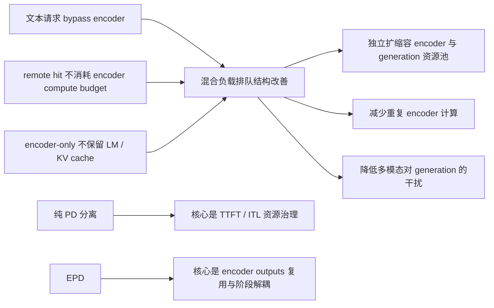

要点说明：

1. 从当前实现可以直接推出，EPD 主要面向三类收益：资源池解耦、混合负载排队改善、重复 encoder 计算消除。
2. 纯 PD 分离和 EPD 都在“拆阶段”，但收益来源不同：前者偏 TTFT / ITL 治理，后者偏 encoder 干扰消除与远端复用。

### 架构分析

1. EPD 的性能收益高度 workload-dependent：
   - 图像多、encoder 占比高、混合文本请求多时，更容易体现收益
   - 超长 decode 主导场景下，EPD 价值更偏“去干扰”和“资源池解耦”，而不是绝对吞吐倍增
2. 纯 PD 与 EPD 看起来都在“拆阶段”，但优化对象不同：
   - 纯 PD 不减少总计算，只改变阶段位置
   - EPD 能让 encoder 与 generation 解耦、让文本请求 bypass、让 encoder outputs 复用
3. 当前代码仍存在重复多模态预处理，因此真实系统里的端到端 TTFT 提升会被 preprocessing 开销吃掉一部分。

### 我对收益上限的判断

1. EPD 更像“系统级收益优化”，而不是单请求微优化。
   - 它的最大价值往往不是把某个多模态请求从 1000ms 降到 700ms，而是让混合负载下的排队结构发生变化。
   - 文本请求不再被视觉 encoder 拖住，这种收益在整池 goodput 和尾延迟上通常比单请求平均值更明显。
2. 当请求里图像很多、encoder 占比高、并且文本请求和多模态请求混跑时，EPD 往往最容易发挥作用。
3. 当 workload 已经被超长 decode 主导时，EPD 的收益会从“明显提速”转向“更稳、更好扩容、更少互扰”。这时它的收益更像平台治理收益，而不是纯算力收益。
4. 当前实现里的一个现实瓶颈是：它把 encoder 计算拆开了，但还没有把 preprocessing 一并拆干净。所以今天看到的性能上限，还不是“完全体 EPD”的上限。
5. 从工程经验看，EPD 的收益通常分三层出现：
   - 第一层是文本 bypass 带来的拥塞缓解
   - 第二层是 encoder outputs 复用带来的重复计算消除
   - 第三层才是更强 transport、异构部署和精细资源池带来的进一步增益

### 从源码能直接看见的性能地板与天花板

#### 当前实现

1. 当前 in-tree `ECExampleConnector` 的数据路径是：
   - producer 侧 `detach().cpu()` 后写 safetensors 文件
   - consumer 侧再从文件读回目标设备
   - 因而它天然包含 CPU round-trip 与文件系统开销
2. 示例 proxy 的控制面是 barrier 式的：
   - 先 fanout 完所有 primer
   - 等所有 primer 成功
   - 再进入 P/PD/D
   - 没有跨阶段 overlap
3. `_execute_mm_encoder()` 虽然会按 modality 做 batching，但混合 modality 会被拆 batch，某些视频场景甚至会主动退化成顺序编码。
4. 远端 EC 命中不会消耗 encoder compute budget，但仍要占 consumer 侧 encoder cache 容量。
5. 纯 producer 实例在源码里是真正“去掉 LM 与 KV 初始化”的，不只是逻辑上少跑几步；因此它带来的显存节省是实打实的。

#### 架构分析

1. 这说明当前主线实现的性能上限，受三个层面的约束：
   - transport 太朴素
   - control plane 还没做流水化
   - mixed-modality batching 仍有保守拆分
2. 同时它的性能下限也比想象中更有保障：
   - producer 真正不建 KV cache
   - text-only 请求天然 bypass encoder
   - remote hit 至少能稳定省掉 encoder compute budget
3. 如果未来换成更强的 connector 与更正式的 control plane，性能改进的第一来源未必是“单次张量搬运更快”，而更可能是“去掉 barrier、减少重复 preprocessing、减少 CPU round-trip”。

---

## 10. 限制、未完成点与演进方向

### 当前实现

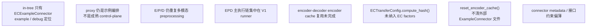

要点说明：

1. 当前实现最明显的不足，不是功能不存在，而是生产级闭环还没有补齐。
2. 缺口主要集中在 connector、control-plane、重复 preprocessing、外部 cache 生命周期以及 runner 收敛。

### 架构分析

1. 当前实现最明显的边界，不是“功能不能跑”，而是“生产级闭环还没补齐”：
   - 外部缓存生命周期
   - 版本 / schema 校验
   - 高性能 EC transport
   - 代理层冗余预处理
   - Model Runner V2 (MRv2) 对齐
2. `ECExampleConnector` 最终只依赖单个字符串 key 作为文件路径（无 LoRA 时通常等于基础 `mm_hash`），这意味着如果模型权重变了而共享目录没清，理论上存在陈旧 EC 被误命中的风险；现有代码没有 connector 级别的版本化防护。
3. 从当前源码的空缺与接口形态看，后续演进方向大概率会集中在三条线：
   - 更强的 connector
   - 更轻的请求表示与 preprocessing 复用
   - 与 Model Runner V2 (MRv2) / 更统一调度栈的整合

### 我认为最难补齐的几个点

1. 最难补的不是“再写一个更快的 connector”，而是“外部 cache 一致性”。
   - 只要 EC 可以跨实例复用，它就迟早会遇到模型升级、部分写入、脏数据、重复写入、过期回收、跨节点清理这些问题。
   - 这类问题一旦处理不好，线上表现通常不是性能差一点，而是正确性和稳定性一起出问题。
2. 第二难的是失败回退。
   - scheduler 看到命中，不代表 worker 真的能成功载入。
   - proxy 看到 encoder primer 成功，也不代表后续阶段能消费同一份 metadata。
   - 这要求系统具备端到端的降级协议，而不是单点 try/except。
3. 第三难的是重复 preprocessing 的消除。
   - 这一步如果做不好，EPD 会永远停留在“算子解耦”，而到不了“请求级解耦”。
   - 但它又会改动请求协议、缓存 key 和多模态处理器，因此属于收益大、改动也大的升级点。
4. 第四难的是新旧 runner 的收敛。
   - 只要 EPD 长期只在 V1 路径成熟，后续 connector、测试和控制逻辑就会越来越依赖旧路径，拖慢平台演进。

### 更现实的演进路线

1. 第一阶段应优先把 connector 做强。
   - 包括版本戳、shape 校验、写完成标记、失败回退、批量回收和监控。
2. 第二阶段把“规范化后的多模态 metadata”变成正式中间产物。
   - 让 P/D 侧少做甚至不再做重复 preprocessing。
3. 第三阶段再考虑把外部代理中的关键编排逻辑内聚回正式 control plane。
   - 这样 E|P|D 的组合才能从 demo 变成平台能力。
4. 第四阶段完成 MRv2 收敛，让 EPD 进入统一 runner 时代。
   - 这一步做完后，EPD 才会真正从“特性”升级为“基础设施”。

---

## 11. 对自研推理框架的借鉴建议

### 当前实现

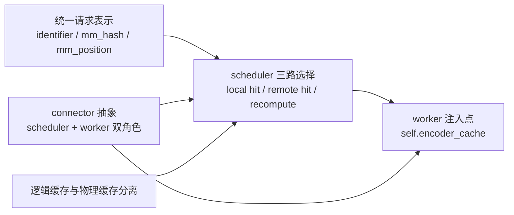

要点说明：

1. vLLM 把 EPD 做成了“统一请求表示 + scheduler 三路选择 + worker 注入点 + connector 抽象”的组合，而不是只在 proxy 层做编排。
2. 逻辑缓存与物理缓存分离，给了 scheduler 足够的空间去做预算和回收。
3. `identifier` / `mm_hash` / `mm_position` 三件套是跨阶段贯穿的最小语义。

### 架构分析

1. 自研框架应优先复用 vLLM 这几个抽象，而不是先写 transport：
   - 把多模态 item 变成稳定 key
   - 把“本地命中 / 远端命中 / 本地重算”前移到 scheduler
   - 把远端输出统一注入到本地 encoder cache 或等价抽象
2. 必须额外补的能力：
   - 外部 cache key 带模型版本 / tower revision / dtype / shape 摘要
   - cache deallocation 与 invalidation
   - preprocessing 结果复用，最好让 E 阶段把“后续阶段不必重复解析的 metadata”一并返回
   - connector 层的错误恢复与降级策略
3. 如果框架准备长期演进，建议尽早统一：
   - V1/V2 runner 的 connector 接口
   - metrics / tracing / debug API
   - proxy 与 engine 的边界，减少例子代码与核心路径两套真相并存

### 如果是我来设计一版更偏生产的 EPD

1. 我会先只把 `E|PD` 打磨扎实，而不是一开始就追求 `E|P|D`。
   - 因为只拆 encoder 就已经能验证最核心的架构假设：视觉 encoder 与文本 generation 的资源解耦到底值不值得。
   - 这时系统里只有一种远端中间态，复杂度明显更可控。
2. 我会把“encoder outputs locator + 规范化后的模态 metadata”一起定义成正式协议。
   - 后续阶段不应再从原始请求里重复推导关键中间信息。
3. 我会把外部 cache 当作产品级子系统来做，而不是调试附属物。
   - 要有分区、TTL、回收、版本、写完成语义和可观测性。
4. 我会把 control-plane 与 data-plane 明确分离。
   - control-plane 负责命中决策、拓扑路由、失败回退
   - data-plane 负责搬运 EC / KV
5. 如果资源有限，我宁可先牺牲一点极限性能，也会先把“失败后可退回本地重算”做牢。因为对线上系统来说，稳定可退化通常比理想情况下更快更重要。

---

## 12. 附录

### 12.1 关键文件 / 类 / 函数索引

| 类别          | 文件                                                                | 关键类 / 函数                                                                                                                                                       | 作用                                                            |
| ------------- | ------------------------------------------------------------------- | ------------------------------------------------------------------------------------------------------------------------------------------------------------------- | --------------------------------------------------------------- |
| 文档          | `docs/features/disagg_encoder.md`                                   | 全文                                                                                                                                                                | 官方 EPD 定义、动机、开发说明                                   |
| 文档          | `docs/features/disagg_prefill.md`                                   | 全文                                                                                                                                                                | 官方 PD 分离定义与能力边界                                      |
| 示例          | `examples/online_serving/disaggregated_encoder/disagg_epd_proxy.py` | `extract_mm_items` / `fanout_encoder_primer` / `maybe_prefill` / `process_prefill_stage` / `forward_non_stream` / `forward_stream`                                  | 在线 <code>E&#124;PD</code> / <code>E&#124;P&#124;D</code> 编排 |
| 示例          | `examples/online_serving/ec_both_encoder/ec_both_encoder.sh`        | 全文                                                                                                                                                                | `ec_both` 单实例基准与重复图像命中示例                          |
| 配置          | `vllm/config/ec_transfer.py`                                        | `ECTransferConfig`                                                                                                                                                  | EC transfer 配置与角色定义                                      |
| 配置          | `vllm/config/multimodal.py`                                         | `MultiModalConfig`                                                                                                                                                  | `mm_encoder_only`、processor cache、MM IPC 等多模态运行时开关   |
| 抽象          | `vllm/distributed/ec_transfer/ec_connector/base.py`                 | `ECConnectorBase` / `ECConnectorRole` / `ECConnectorMetadata`                                                                                                       | EC connector 最小抽象                                           |
| 工厂          | `vllm/distributed/ec_transfer/ec_connector/factory.py`              | `ECConnectorFactory.create_connector`                                                                                                                               | connector 创建与动态加载                                        |
| 示例实现      | `vllm/distributed/ec_transfer/ec_connector/example_connector.py`    | `ECExampleConnector` / `ECExampleConnectorMetadata` / `MMMeta`                                                                                                      | 磁盘版 EC connector                                             |
| 初始化        | `vllm/distributed/ec_transfer/ec_transfer_state.py`                 | `ensure_ec_transfer_initialized`                                                                                                                                    | worker 侧 connector 全局初始化                                  |
| 多模态表示    | `vllm/multimodal/inputs.py`                                         | `PlaceholderRange` / `MultiModalFeatureSpec`                                                                                                                        | 多模态占位与 cache key 表示                                     |
| 入口解析      | `vllm/entrypoints/chat_utils.py`                                    | `_parse_chat_message_content_mm_part` / `parse_chat_messages`                                                                                                       | OpenAI chat 多模态内容解析                                      |
| 预处理        | `vllm/inputs/preprocess.py`                                         | `_process_multimodal`                                                                                                                                               | 多模态预处理                                                    |
| 输入转换      | `vllm/v1/engine/input_processor.py`                                 | `_get_mm_identifier` / `process_inputs` / `_validate_model_input`                                                                                                   | 生成 `EngineCoreRequest` 与 `mm_features`                       |
| 请求对象      | `vllm/v1/request.py`                                                | `Request` / `RequestStatus`                                                                                                                                         | 运行态请求与 `kv_transfer_params`                               |
| 引擎核心      | `vllm/v1/engine/core.py`                                            | `add_request` / `_initialize_kv_caches`                                                                                                                             | KV connector 校验、无 KV cache 场景下禁用 chunked prefill       |
| 调度          | `vllm/v1/core/sched/scheduler.py`                                   | `schedule` / `_try_schedule_encoder_inputs` / `_update_after_schedule` / `_free_encoder_inputs` / `reset_encoder_cache`                                             | EPD 调度与状态推进                                              |
| 调度输出      | `vllm/v1/core/sched/output.py`                                      | `SchedulerOutput` / `NewRequestData`                                                                                                                                | 跨 scheduler -> worker 的 step 输出                             |
| 逻辑缓存      | `vllm/v1/core/encoder_cache_manager.py`                             | `EncoderCacheManager` / `EncoderDecoderCacheManager` / `compute_mm_encoder_budget`                                                                                  | encoder cache 容量、引用与回收                                  |
| worker mixin  | `vllm/v1/worker/ec_connector_model_runner_mixin.py`                 | `maybe_save_ec_to_connector` / `_get_ec_connector_output`                                                                                                           | worker 内 connector 生命周期                                    |
| worker 执行   | `vllm/v1/worker/gpu_model_runner.py`                                | `_batch_mm_inputs_from_scheduler` / `_execute_mm_encoder` / `_gather_mm_embeddings` / `_preprocess` / `execute_model` / `get_kv_cache_spec` / `reset_encoder_cache` | 真正的 encoder 运行、EC 保存/加载、注入                         |
| worker 初始化 | `vllm/v1/worker/gpu_worker.py`                                      | `use_v2_model_runner` / `ensure_ec_transfer_initialized` 调用点                                                                                                     | 决定 V1/V2 runner 与 EC 初始化                                  |
| 执行器        | `vllm/v1/executor/ray_executor.py`                                  | `uses_sampler`                                                                                                                                                      | 区分 producer 与 consumer 的采样语义                            |
| LM 跳过       | `vllm/model_executor/models/interfaces.py`                          | `_mark_language_model`                                                                                                                                              | `--mm-encoder-only` 下跳过语言模型                              |
| KV 参数桥接   | `vllm/entrypoints/openai/chat_completion/protocol.py`               | `to_sampling_params` 中对 `kv_transfer_params` 的处理                                                                                                               | P 阶段 -> D 阶段参数桥接                                        |
| 输出桥接      | `vllm/v1/engine/output_processor.py`                                | 处理 `engine_core_output.kv_transfer_params`                                                                                                                        | 把 KV 传输参数带回上层响应                                      |
| 调试 API      | `vllm/entrypoints/serve/cache/api_router.py`                        | `/reset_encoder_cache`                                                                                                                                              | 调试用 encoder cache reset                                      |

### 12.2 术语表

| 术语                         | 含义                                                    |
| ---------------------------- | ------------------------------------------------------- |
| EC                           | Encoder Cache，通常指可复用的 encoder outputs           |
| EC connector                 | 在不同 vLLM 实例之间传递 / 保存 / 载入 EC 的抽象        |
| `mm_hash`                    | 多模态 processor 产出的基础 hash                        |
| `identifier`                 | 实际参与 cache / connector 命中的 key；可能带 LoRA 前缀 |
| `mm_position`                | 多模态 placeholder 在 decoder 输入中的位置区间          |
| <code>E&#124;PD</code>       | Encoder 与 combined Prefill/Decode 分离                 |
| <code>E&#124;P&#124;D</code> | Encoder、Prefill、Decode 三段分离                       |
| aggregated serving           | 不做阶段分离的普通单实例 serving                        |
| disaggregated prefill        | 只拆 prefill 与 decode，通过 KV connector 连接          |
| encoder-only instance        | 只跑多模态 encoder 的 producer 实例                     |
| ec_both                      | 既是 EC producer 又是 EC consumer 的混合角色            |
