vLLM 主线最近引入了 EPD（Disaggregated Encoder / Encoder-Prefill/Decode）。它并不是把整条推理链都拆成内建分布式 pipeline，而是把多模态请求里的 `encoder outputs` 抽成可复用、可远端加载的中间态。

本文聚焦三个问题：主线已经实现了什么、它与常见 P/D 分离的区别、以及距离生产化还差哪些环节。

如果只记一条结论：**当前主线已经具备 encoder 输出解耦与远端注入能力，但完整线上拓扑仍依赖外部 proxy 编排。**

> 说明：本文基于 vLLM `main` 分支的 commit `4eefbf9609e5ddb996e3ac37e192e92466ec35cc`（commit 时间：`2026-04-02 11:52:18 +0000`）进行分析，目标仓库为 <https://github.com/vllm-project/vllm>。

## 导读：先给结论

### 当前实现

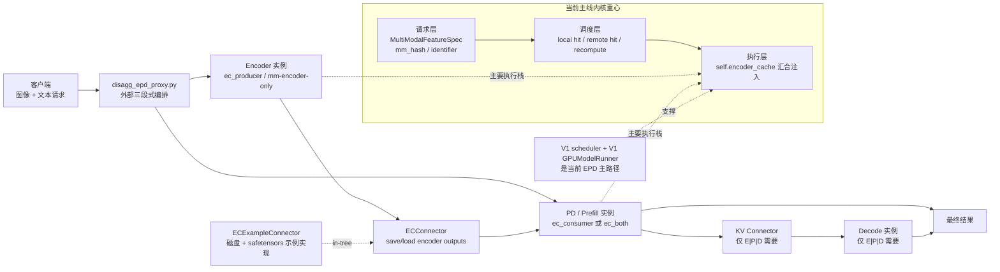

要点说明：

1. 当前主线的 EPD，本质上是“把多模态 encoder 从 prefill/decode 所在实例中拆出去”，并通过 `ECConnector` 在进程间传递 encoder outputs，而不是把整个推理流程自动做成一个内建分布式 pipeline。
2. 在线 E|PD / E|P|D 示例并不只靠引擎内部完成 orchestration，而是依赖外部代理 `examples/online_serving/disaggregated_encoder/disagg_epd_proxy.py` 做“三段式编排”。
3. 当前主线源码里 EC 相关 mixin 与完整执行链仍集中在 V1 路径；in-tree connector 只有 `ECExampleConnector`，定位是示例实现。

### 架构分析

1. 当前 vLLM 的 EPD 更像“内核能力 + 外部编排”，而不是单开关即可落地的完整产品。
2. 它解决的是多模态 encoder 与文本 generation 的耦合；与 disaggregated prefill 是正交关系，前者传 `encoder outputs`，后者传 KV cache。

---

## 1. 设计动机与背景

### 为什么要分离 Encoder？

多模态大模型（如 Qwen2.5-VL、LLaVA）通常包含两个核心组件：

| 组件                             | 职责                            | 计算特征             |
| -------------------------------- | ------------------------------- | -------------------- |
| **视觉编码器（Vision Encoder）** | 将图像/音频编码为嵌入向量       | 轻量级，GPU 利用率低 |
| **语言模型（LM Decoder）**       | 基于嵌入 + token 进行自回归生成 | 重量级，GPU/显存密集 |

将二者**耦合在同一进程**存在三个关键问题：

### 问题 1：资源浪费

视觉编码器远比语言模型轻量，但二者共享 GPU 导致编码器占用的资源无法独立调配。Encoder 和 LM 无法独立扩缩容。

### 问题 2：TTFT 被拉高

纯文本请求也必须经过含 Encoder 的完整推理pipeline，增加不必要的首 token 延迟。分离后，纯文本请求可**完全绕过 Encoder**。

### 问题 3：缓存无法跨进程复用

同一张图片在不同请求中被重复编码。进程内 Encoder Cache 仅限单 Worker 复用。分离后，通过**共享存储**实现跨进程/跨实例的 Encoder Cache 复用。

### 从 runtime 视角再看一遍

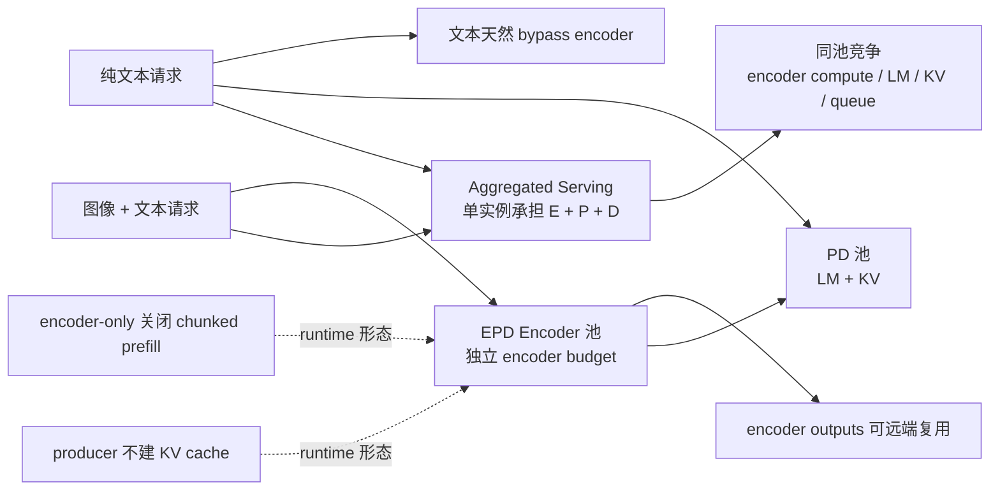

这张图对应源码里的几个关键事实：

1. encoder、prefill、decode 的资源画像不同，长期共置会带来排队干扰与扩容耦合。
2. 这种差异已经进入 runtime：scheduler 有独立的 `encoder_compute_budget` 与 `encoder_cache_manager`，纯 producer 不分配 KV cache，encoder-only 关闭 chunked prefill。
3. 文本请求在代理层和引擎层都天然可以 bypass encoder。

换句话说，vLLM 做 EPD，核心不是“切阶段”本身，而是把短时、重计算、强波动的视觉 encoder 从文本 generation 实例里拆出来，减少互相拖累。纯 PD 分离主要治理 TTFT 与 ITL；EPD 更强调消除视觉 encoder 对文本生成的干扰，所以两者的收益形态并不相同。

> 参考文档：`docs/features/disagg_encoder.md`

---

## 2. 整体架构与部署模式

### 2.1 E+PD 模式（1 Encoder + 1 PD）

最基础的 Encoder 分离模式，Encoder 独立部署，PD（Prefill+Decode）合并：

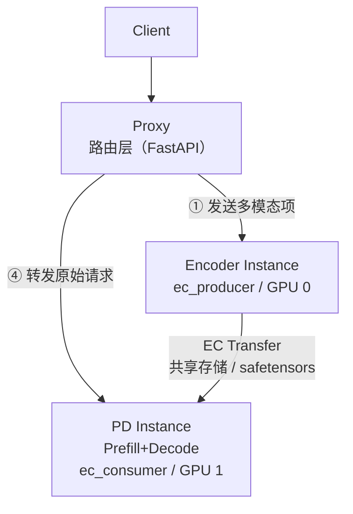

**数据流：**

1. Proxy 从请求中提取多模态项（图片/音频）
2. 每个多模态项并发发送到 Encoder 实例
3. Encoder 执行视觉编码，将结果保存到共享存储（按 `mm_hash` 索引）
4. Proxy 将原始请求转发到 PD 实例
5. PD 实例通过 EC Connector 从共享存储加载 Encoder Cache
6. PD 实例执行语言模型推理并返回结果

### 2.2 E+P+D 模式（三级分离）

在 E+PD 基础上，进一步将 Prefill 和 Decode 分离：

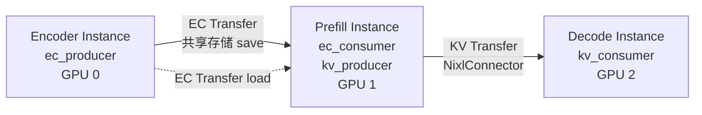

**Prefill 实例**同时是：

- EC 的 **消费者**（`ec_consumer`）：从共享存储加载 Encoder Cache
- KV 的 **生产者**（`kv_producer`）：执行 Prefill 后将 KV Cache 传给 Decode

**Decode 实例**只是 KV 的 **消费者**（`kv_consumer`），不需要 EC 配置。

### 2.3 ec_both（单实例自缓存）

同一实例既是 Producer 又是 Consumer。用于单实例场景下利用 EC 缓存实现相同图片的跨请求复用：

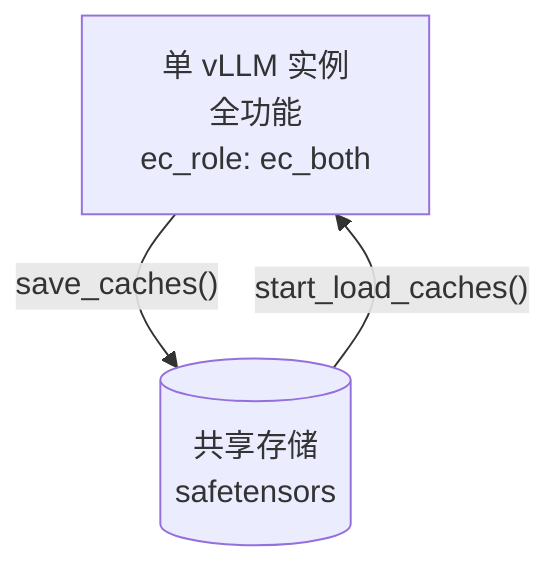

适用场景：无需跨实例传输，单机多请求下相同图片只编码一次，后续请求直接复用缓存。参考脚本：`examples/online_serving/ec_both_encoder/ec_both_encoder.sh`。

### 2.4 核心文件结构

```
vllm/
├── config/
│   └── ec_transfer.py                          # ★ ECTransferConfig 配置类
├── distributed/
│   └── ec_transfer/                            # ★ EC Transfer 核心模块
│       ├── __init__.py                         #   公开 API
│       ├── ec_transfer_state.py                #   全局单例状态管理
│       └── ec_connector/
│           ├── __init__.py
│           ├── base.py                         # ★ ECConnectorBase 抽象基类
│           ├── factory.py                      # ★ ECConnectorFactory 工厂
│           └── example_connector.py            # ★ ECExampleConnector 参考实现
├── v1/
│   ├── worker/
│   │   ├── gpu_model_runner.py                 #   集成 EC Mixin
│   │   ├── ec_connector_model_runner_mixin.py  # ★ EC 生命周期管理 Mixin
│   │   └── gpu_worker.py                       #   ensure_ec_transfer_initialized()
│   ├── core/
│   │   ├── sched/scheduler.py                  #   调度器 EC 集成
│   │   ├── encoder_cache_manager.py            #   Encoder Cache 管理器
│   │   └── sched/output.py                     #   SchedulerOutput 含 EC 元数据
│   ├── engine/core.py                          #   is_ec_consumer 判断（是否使用 sampler）
│   ├── executor/ray_executor.py                #   uses_sampler 门控
│   └── outputs.py                              #   ECConnectorOutput + make_empty_encoder_model_runner_output
├── config/multimodal.py                        #   mm_encoder_only 配置
└── engine/arg_utils.py                         #   CLI 参数

examples/online_serving/disaggregated_encoder/
├── disagg_epd_proxy.py                         # ★ EPD Proxy 路由代理
├── disagg_1e1pd_example.sh                     #   E+PD 部署脚本
├── disagg_1e1p1d_example.sh                    #   E+P+D 部署脚本
└── README.md

tests/v1/ec_connector/
├── unit/test_ec_example_connector.py           #   单元测试
└── integration/
    ├── test_epd_correctness.py                 #   正确性验证
    └── run_epd_correctness_test.sh             #   集成测试脚本
```

### 2.5 能力边界与概念地图

| 概念                  | 当前仓库中的含义                                                                                    | 传递对象                     | 典型拓扑                  | 关键模块                                  |
| --------------------- | --------------------------------------------------------------------------------------------------- | ---------------------------- | ------------------------- | ----------------------------------------- |
| aggregated serving    | 单个 vLLM 实例同时承担该请求需要的全部阶段；对多模态请求来说通常是 E+P+D 共置，对纯文本请求则没有 E | 无跨进程中间态               | `1 x vLLM`                | 常规 scheduler / worker                   |
| disaggregated encoder | 把多模态 encoder 从 PD 实例拆出，PD 侧加载远端 encoder outputs                                      | encoder outputs / embeddings | `E + PD`                  | `vllm/distributed/ec_transfer`            |
| disaggregated prefill | 把 prefill 与 decode 拆开，decode 侧加载远端 KV                                                     | KV cache + 传输参数          | `P + D`                   | `vllm/distributed/kv_transfer`            |
| E\|PD                 | EPD 的最小在线形态；E 单独实例，PD 为 combined 实例                                                 | 仅 EC                        | `1E + 1PD` 或扩展到多实例 | `disagg_epd_proxy.py` + EC connector      |
| E\|P\|D               | 在 EPD 上再叠加 PD 分离                                                                             | 先 EC，后 KV                 | `1E + 1P + 1D`            | `disagg_epd_proxy.py` + EC + KV connector |
| ec_both               | 单实例既是 EC producer 又是 EC consumer；仍可生成 token，不等于单独的 encoder-only 实例             | EC                           | 聚合节点上的混合角色      | `ec_role="ec_both"`                       |

### 2.6 EPD 解决什么，不解决什么

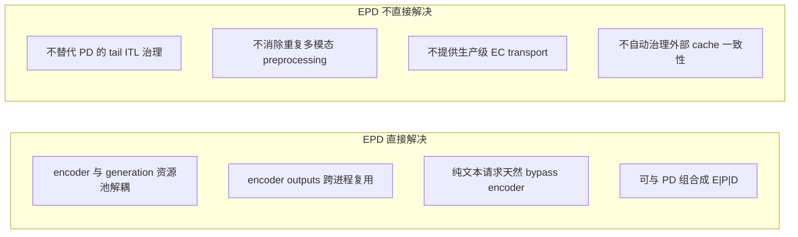

要点说明：

1. EPD 解决的是“多模态 encoder 结果如何拆出、复用、注回 generation 流水线”。
2. EPD 不会自动把整条多模态请求链都变成可复用中间态，也不会自动补齐 transport 和 cache governance。

这条边界尤其重要：当前 proxy 仍会让 E、P、D 三端分别解析和预处理原始多模态输入。对自研框架来说，不能把 EPD 误读为“只要把 vision tower 拆到另一台机器就行”。如果没有 hash、metadata、cache lifecycle、失败回退，这个设计会很快失效。

### 2.7 `ec_role` 与运行时行为矩阵

| `ec_role`     | scheduler 侧行为                                                                             | worker 侧行为                                     | 是否走 encoder-only 快路径                                                          | KV / sampler 形态                                                         | 典型部署                 |
| ------------- | -------------------------------------------------------------------------------------------- | ------------------------------------------------- | ----------------------------------------------------------------------------------- | ------------------------------------------------------------------------- | ------------------------ |
| `ec_producer` | 不参与远端 EC 载入决策；scheduler 侧基本没有 consumer 式命中/加载语义                        | 只 `save_caches()`，不 `start_load_caches()`      | 是。`execute_model()` 在 `has_ec_transfer() and not is_consumer` 时会提前返回空输出 | `get_kv_cache_spec()` 直接返回空；Ray executor 也不会把它当成正常采样实例 | 纯 encoder 节点          |
| `ec_consumer` | 参与 `has_cache_item()` / `build_connector_meta()`，把“远端载入还是本地重算”前移到 scheduler | 先 `start_load_caches()`，再走正常 prefill/decode | 否                                                                                  | 正常持有 KV cache，可与 KV connector 组合成 P/D 分离                      | PD 或 P 节点             |
| `ec_both`     | 具备与 consumer 相同的远端命中和 metadata 构建语义                                           | 同时具备 load 与 save 能力                        | 否。因为 `ec_both` 也是 consumer，不满足 `not is_consumer`                          | 仍是正常生成实例                                                          | 聚合节点或单实例复用场景 |

`ec_both` 是最容易被误读的角色。它不是“带一点 producer 能力的 encoder-only”，而是“仍然按正常生成实例运行，但同时能读写 EC”。这也解释了为什么 `ec_both` 可以用于单实例基准或重复图像命中测试，但它并不等价于真正的 E-only 节点。

### 2.8 初始化路径、请求路径、传输路径、失败路径

```mermaid
flowchart TB
  subgraph Init["初始化路径"]
    I1["CLI / ENV<br/>--ec-transfer-config<br/>--mm-encoder-only"]
    I2["ECTransferConfig"]
    I3["GPUWorker.ensure_ec_transfer_initialized()"]
    I4["ECConnectorFactory.create_connector()"]
    I1 --> I2 --> I3 --> I4
  end

  subgraph Req["请求路径"]
    R1["OpenAI Chat Request"]
    R2["renderer / parser / multimodal preprocess"]
    R3["InputProcessor.process_inputs()"]
    R4["Request"]
    R5["Scheduler.schedule()"]
    R6["GPUModelRunner.execute_model()"]
    R1 --> R2 --> R3 --> R4 --> R5 --> R6
  end

  subgraph Transfer["传输路径"]
    T1["_execute_mm_encoder()"]
    T2["self.encoder_cache"]
    T3["save_caches()"]
    T4["共享介质 / 远端存储"]
    T5["start_load_caches()"]
    T6["_gather_mm_embeddings()"]
    T1 --> T2 --> T3 --> T4 --> T5 --> T2 --> T6
  end

  subgraph Fail["失败路径"]
    F1["远端 EC 不存在"]
    F2["scheduler 回退到本地 encode"]
    F3["调度后远端文件消失"]
    F4["start_load_caches() 抛 FileNotFoundError"]
    F5["载入后仍缺项"]
    F6["_gather_mm_embeddings() 报 Encoder cache miss"]
    F1 --> F2
    F3 --> F4 --> F5 --> F6
  end
```

可以把它压缩成四句话：

1. 初始化路径是 CLI / ENV -> `ECTransferConfig` -> `GPUWorker.ensure_ec_transfer_initialized()` -> `ECConnectorFactory.create_connector()`。
2. 请求路径是 OpenAI Chat 请求 -> renderer / parser / multimodal preprocess -> `InputProcessor.process_inputs()` -> `Request` -> `Scheduler.schedule()` -> `GPUModelRunner.execute_model()`。
3. EC 数据路径是 `_execute_mm_encoder()` -> `self.encoder_cache` -> `save_caches()` -> 共享介质 -> `start_load_caches()` -> `self.encoder_cache` -> `_gather_mm_embeddings()`。
4. KV 数据路径只在 E|P|D 出现：prefill 响应把 `kv_transfer_params` 带回上层，再由 decode 请求继续使用。

### 2.9 请求进入引擎后的关键表示

每个 encoder primer 子请求与原始请求，在各自 vLLM 实例里都会走同一条标准入口：

- `OpenAIServingChat.create_chat_completion()`
- `OpenAIServingRender.render_chat()`
- `parse_chat_messages()`
- `InputPreprocessor._process_multimodal()`
- `InputProcessor.process_inputs()`

`InputProcessor` 最终会把多模态 item 折叠成 `MultiModalFeatureSpec`。其中最关键的字段有：

- `data`：真正给 vision tower 的输入
- `identifier`：用于 cache / connector 命中的 key；LoRA 场景下可变成 `lora_name:mm_hash`
- `mm_position`：该多模态 item 在 decoder 输入序列里的 placeholder 位置
- `mm_hash`：原始多模态 processor 产出的基础 hash

这里有几个很容易漏掉的细节：

1. `InputProcessor` 会先按 `mm_position` 对多模态项排序，再生成 `mm_features`。因此后续 scheduler / worker 看到的顺序，是“在 decoder 序列中的占位顺序”，不一定等同于原始 `messages` 遍历顺序。
2. `MultiModalFeatureSpec.data` 允许为 `None`。源码注释写得很明确：这是为了在 API server 与 engine core 之间跳过不必要的 IPC。所以 EPD 的调度与命中语义，真正依赖的是 `identifier` / `mm_position` / `mm_hash`，而不是始终依赖原始多模态 payload 常驻内存。
3. `PlaceholderRange` 支持 `is_embed` mask，这意味着“placeholder token 数”和“当前 step 真正需要切出的 encoder embedding 数”并不总是一一对应；后续 `_gather_mm_embeddings()` 会根据这个 mask 做稀疏切片。

---

## 3. 配置体系：ECTransferConfig

### 3.1 配置类定义

> 源码：`vllm/config/ec_transfer.py`

```python
ECProducer = Literal["ec_producer", "ec_both"]
ECConsumer = Literal["ec_consumer", "ec_both"]
ECRole = Literal[ECProducer, ECConsumer]

@config
class ECTransferConfig:
    """分布式 Encoder Cache 传输配置"""

    ec_connector: str | None = None
    """EC 连接器实现名称，如 "ECExampleConnector" """

    engine_id: str | None = None
    """引擎 ID，用于 EC 传输标识。自动生成 UUID。"""

    ec_buffer_device: str | None = "cuda"
    """EC 连接器缓冲区设备。目前仅支持 'cuda'。"""

    ec_buffer_size: float = 1e9
    """缓冲区大小（字节），推荐 1e9（约 1GB）。"""

    ec_role: ECRole | None = None
    """当前实例角色：'ec_producer' | 'ec_consumer' | 'ec_both'"""

    ec_rank: int | None = None
    """传输集群中的 rank。典型值：0=Encoder，1=PD。"""

    ec_parallel_size: int = 1
    """并行实例数。"""

    ec_ip: str = "127.0.0.1"
    """连接器 IP 地址。"""

    ec_port: int = 14579
    """连接器端口。"""

    ec_connector_extra_config: dict[str, Any] = field(default_factory=dict)
    """连接器特定的额外配置。"""

    ec_connector_module_path: str | None = None
    """动态加载自定义连接器的 Python 模块路径。"""
```

**关键属性：**

```python
@property
def is_ec_transfer_instance(self) -> bool:
    """是否为 EC 传输实例（connector 和 role 均已配置）"""
    return self.ec_connector is not None and self.ec_role in get_args(ECRole)

@property
def is_ec_producer(self) -> bool:
    """是否为生产者（Encoder 端）"""
    return self.ec_connector is not None and self.ec_role in get_args(ECProducer)

@property
def is_ec_consumer(self) -> bool:
    """是否为消费者（PD 端）"""
    return self.ec_connector is not None and self.ec_role in get_args(ECConsumer)

def get_from_extra_config(self, key, default) -> Any:
    """从 extra_config 中获取配置"""
    return self.ec_connector_extra_config.get(key, default)
```

### 3.2 角色模型

| 角色          | 说明                                       | 典型部署          |
| ------------- | ------------------------------------------ | ----------------- |
| `ec_producer` | 只生产 EC（运行 Vision Encoder，保存结果） | Encoder 实例      |
| `ec_consumer` | 只消费 EC（从共享存储加载编码结果）        | PD / Prefill 实例 |
| `ec_both`     | 同时生产和消费                             | 混合实例          |

### 3.3 Encoder 实例专用配置

Encoder 实例通常需要以下额外 CLI 参数：

```bash
vllm serve $MODEL \
    --enforce-eager              # 必须：禁用 CUDA Graph
    --no-enable-prefix-caching   # 必须：禁用前缀缓存
    --max-num-batched-tokens 114688  # 推荐：大 batch 预算
    --mm-encoder-only            # 可选：跳过语言模型，节省显存
    --gpu-memory-utilization 0.01  # Encoder 很轻量，极低显存占用
```

`mm_encoder_only` 是关键优化标志（`vllm/config/multimodal.py`）：

```python
class MultiModalConfig:
    mm_encoder_only: bool = False
    """
    When enabled, skips the language component of the model.
    This is usually only valid in disaggregated Encoder process.
    """
```

启用后，模型只加载视觉编码器权重，不加载语言模型权重，**大幅减少 Encoder 实例的显存占用**。

### 3.4 配置上的几个容易忽略的点

1. `ECTransferConfig.compute_hash()` 当前没有纳入任何 factor，返回的是空 factors 的 hash。这意味着 EC transfer 配置本身并不参与计算图哈希。
2. `engine_id` 在未显式传入时会自动生成 UUID，但当前并不参与 cache key 或 `compute_hash()`；它更像 connector 实例身份，而不是一致性边界。
3. `ec_connector_module_path` 的动态加载能力，源码注释明确写的是 “Only supported in V1”，这进一步说明当前 EPD 扩展点仍主要依附在 V1 runner / connector 栈上。
4. 从配置设计看，vLLM 把 EPD 视为“额外的 transport / scheduling capability”，而不是一种全新 engine type。

---

## 4. ECConnector 核心抽象

### 4.1 ECConnectorBase 基类

> 源码：`vllm/distributed/ec_transfer/ec_connector/base.py`

`ECConnectorBase` 是所有 EC 连接器的抽象基类，定义了 Scheduler 侧和 Worker 侧的完整接口：

```python
class ECConnectorBase(ABC):
    def __init__(self, vllm_config: "VllmConfig", role: ECConnectorRole):
        self._connector_metadata: ECConnectorMetadata | None = None
        self._vllm_config = vllm_config
        self._role = role
        # 从 ec_transfer_config 获取角色
        self._is_producer = vllm_config.ec_transfer_config.is_ec_producer
        self._is_consumer = vllm_config.ec_transfer_config.is_ec_consumer
```

#### Worker 侧方法（运行于 Worker 进程）

```python
    # ---------- 元数据生命周期 ----------

    def bind_connector_metadata(self, connector_metadata: ECConnectorMetadata) -> None:
        """
        在每次模型执行前由 Model Runner 调用。
        绑定调度器传来的元数据，用于运行时的 EC 加载决策。
        """
        self._connector_metadata = connector_metadata

    def clear_connector_metadata(self) -> None:
        """模型执行后清理元数据。"""
        self._connector_metadata = None

    # ---------- 缓存操作 ----------

    @abstractmethod
    def start_load_caches(
        self, encoder_cache: dict[str, torch.Tensor], **kwargs
    ) -> None:
        """
        从连接器加载 Encoder Cache 到 vLLM 的 encoder_cache 字典。

        在 _gather_mm_embeddings 之前调用。
        encoder_cache 的 key 是 mm_hash（多模态数据散列），value 是编码结果张量。

        Args:
            encoder_cache: mm_hash → encoder output tensor 的字典
        """

    @abstractmethod
    def save_caches(
        self, encoder_cache: dict[str, torch.Tensor], mm_hash: str, **kwargs
    ) -> None:
        """
        将 Encoder Cache 保存到连接器（共享存储/远程服务）。

        在 Encoder 执行完毕后调用。

        Args:
            encoder_cache: mm_hash → encoder output tensor 的字典
            mm_hash: 当前要保存的多模态数据的散列值
        """

    def get_finished(
        self, finished_req_ids: set[str]
    ) -> tuple[set[str] | None, set[str] | None]:
        """
        返回异步传输完成的请求 ID。
        Returns: (已完成发送的ID集合, 已完成接收的ID集合)
        """
        return None, None

    def register_caches(self, ec_caches: dict[str, torch.Tensor]):
        """注册 EC 缓存（P2P 特性预留）。"""
        return
```

#### Scheduler 侧方法（运行于调度器进程）

```python
    @abstractmethod
    def has_cache_item(self, identifier: str) -> bool:
        """
        检查指定多模态数据的 Encoder Cache 是否存在于外部存储。

        Args:
            identifier: 多模态数据标识（通常是 mm_hash）
        Returns:
            True 如果缓存存在
        """

    @abstractmethod
    def update_state_after_alloc(self, request: "Request", index: int):
        """
        Encoder Cache 分配后更新连接器状态。

        调度器分配了缓存位置后调用，连接器根据角色决定是否需要加载缓存。

        Args:
            request: 请求对象（含 mm_features）
            index: 当前多模态输入在请求中的索引
        """

    @abstractmethod
    def build_connector_meta(
        self, scheduler_output: SchedulerOutput
    ) -> ECConnectorMetadata:
        """
        为当前调度步骤构建 Worker 所需的元数据。

        注意：不应修改 scheduler_output 的字段。
        调用后重置连接器内部状态。
        """

    def update_connector_output(self, connector_output: ECConnectorOutput):
        """处理从 Worker 返回的连接器输出。"""
        return

    def request_finished(
        self, request: "Request"
    ) -> tuple[bool, dict[str, Any] | None]:
        """
        请求完成回调，在 Encoder Cache 被释放前调用。

        Returns:
            (是否延迟释放, 额外参数)
            True 表示 cache 正在异步发送，应等 get_finished 确认后再释放。
        """
        return False, None
```

### 4.2 ECConnectorRole 角色划分

```python
class ECConnectorRole(enum.Enum):
    SCHEDULER = 0  # 运行于调度器进程，负责决策
    WORKER = 1     # 运行于 Worker 进程，负责执行
```

与 KV Connector 相同的双角色设计：

- **SCHEDULER** 角色在调度器中实例化，负责判断缓存是否存在、分配后状态更新、构建元数据
- **WORKER** 角色在 Worker 进程中实例化，负责实际的缓存加载和保存

### 4.3 ECConnectorMetadata 元数据协议

```python
class ECConnectorMetadata(ABC):
    """
    抽象元数据，用于 Scheduler ECConnector → Worker ECConnector 的通信。
    由 build_connector_meta() 构建，通过 SchedulerOutput 传递到 Worker。
    """
    pass
```

具体实现由各连接器自定义，例如 `ECExampleConnectorMetadata` 包含需要加载/保存的多模态项列表。

### 4.4 ECConnectorFactory 工厂

> 源码：`vllm/distributed/ec_transfer/ec_connector/factory.py`

```python
class ECConnectorFactory:
    _registry: dict[str, Callable[[], type[ECConnectorBase]]] = {}

    @classmethod
    def register_connector(cls, name: str, module_path: str, class_name: str) -> None:
        """注册懒加载的 EC 连接器。"""
        def loader() -> type[ECConnectorBase]:
            module = importlib.import_module(module_path)
            return getattr(module, class_name)
        cls._registry[name] = loader

    @classmethod
    def create_connector(
        cls, config: "VllmConfig", role: ECConnectorRole,
    ) -> ECConnectorBase:
        """根据配置创建连接器实例。"""
        ec_transfer_config = config.ec_transfer_config
        connector_cls = cls.get_connector_class(ec_transfer_config)
        return connector_cls(config, role)

    @classmethod
    def get_connector_class(
        cls, ec_transfer_config: "ECTransferConfig"
    ) -> type[ECConnectorBase]:
        """按名称或动态路径获取连接器类。"""
        connector_name = ec_transfer_config.ec_connector
        if connector_name in cls._registry:
            return cls._registry[connector_name]()
        # 支持动态模块加载
        connector_module_path = ec_transfer_config.ec_connector_module_path
        if connector_module_path is not None:
            module = importlib.import_module(connector_module_path)
            return getattr(module, connector_name)
        raise ValueError(f"Unsupported connector type: {connector_name}")

# 注册内置连接器
ECConnectorFactory.register_connector(
    "ECExampleConnector",
    "vllm.distributed.ec_transfer.ec_connector.example_connector",
    "ECExampleConnector",
)
```

**当前已注册连接器：**

| 连接器               | 存储后端            | 用途                |
| -------------------- | ------------------- | ------------------- |
| `ECExampleConnector` | 磁盘（safetensors） | 参考实现 / 开发调试 |

> 可通过 `ec_connector_module_path` 动态加载自定义连接器，无需修改 vLLM 源码。

### 4.5 EC 全局状态管理

> 源码：`vllm/distributed/ec_transfer/ec_transfer_state.py`

```python
_EC_CONNECTOR_AGENT: ECConnectorBase | None = None

def get_ec_transfer() -> ECConnectorBase:
    """获取全局 EC Connector 实例（仅在 Worker 进程中可用）"""
    assert _EC_CONNECTOR_AGENT is not None, \
        "disaggregated EC cache is not initialized"
    return _EC_CONNECTOR_AGENT

def has_ec_transfer() -> bool:
    """检查 EC 传输是否已初始化"""
    return _EC_CONNECTOR_AGENT is not None

def ensure_ec_transfer_initialized(vllm_config: "VllmConfig") -> None:
    """
    在 Worker 进程启动时调用，初始化全局 EC Connector。
    仅在 ec_transfer_config 已配置且 _EC_CONNECTOR_AGENT 未初始化时执行。
    """
    global _EC_CONNECTOR_AGENT
    if vllm_config.ec_transfer_config is None:
        return
    if (vllm_config.ec_transfer_config.is_ec_transfer_instance
            and _EC_CONNECTOR_AGENT is None):
        _EC_CONNECTOR_AGENT = ECConnectorFactory.create_connector(
            config=vllm_config, role=ECConnectorRole.WORKER
        )
```

公开 API（`vllm/distributed/ec_transfer/__init__.py`）：

```python
from vllm.distributed.ec_transfer.ec_transfer_state import (
    ensure_ec_transfer_initialized,
    get_ec_transfer,
    has_ec_transfer,
)
```

### 4.6 抽象边界与最小接口设计

`ECConnectorBase` 这套抽象刻意收得很薄，核心目标只有两件事：

1. 让 scheduler 能回答“外部 cache 是否存在，以及这一轮需要加载哪些项”。
2. 让 worker 能把 tensor 拉进 / 写出本地 `encoder_cache`。

几个关键设计点值得单独记一下：

1. connector 在 scheduler 侧和 worker 侧不是同一个对象。scheduler 会创建 `role=SCHEDULER` 的 connector，而 worker 侧则通过 `ec_transfer_state.py` 把 connector 放进进程全局单例 `_EC_CONNECTOR_AGENT`。二者共享的是协议与配置，不共享内存状态。
2. `ECConnectorFactory` 用的是 lazy registry：只有真正命中某个 connector 名称时，才会 import 对应模块。这让扩展点保持轻量，但也意味着 connector 的初始化副作用和错误要等到 runtime 才暴露。
3. 当前 metadata 非常极简。worker 只知道“这一轮要加载哪些 key”，至于 tensor schema、模型版本、dtype、设备兼容性，并不在 connector metadata 里显式表达。
4. 这套设计的好处是 transport 细节没有写死在 scheduler / worker 里；代价是现在的接口还不足以天然承载更重的生产语义，比如版本校验、部分写入、回滚与跨硬件协商。

---

## 5. ECExampleConnector 参考实现

> 源码：`vllm/distributed/ec_transfer/ec_connector/example_connector.py`

### 5.1 整体设计

`ECExampleConnector` 是基于 **本地磁盘 + safetensors 格式**的参考实现，使用 `mm_hash`（多模态数据散列）作为缓存键，将 Encoder 输出保存为 safetensors 文件。

存储结构：

```
{shared_storage_path}/
├── {mm_hash_1}/
│   └── encoder_cache.safetensors    # 保存的 encoder 输出张量
├── {mm_hash_2}/
│   └── encoder_cache.safetensors
└── ...
```

### 5.2 元数据定义

```python
@dataclass
class MMMeta:
    """单个多模态项的元数据"""
    mm_hash: str       # 多模态数据的哈希值
    num_token: int     # encoder 输出的 token 数

    @staticmethod
    def make_meta(mm_hash, num_token) -> "MMMeta":
        return MMMeta(mm_hash=mm_hash, num_token=num_token)

@dataclass
class ECExampleConnectorMetadata(ECConnectorMetadata):
    """Scheduler → Worker 的元数据：需要加载的多模态项列表"""
    mm_datas: list[MMMeta]

    def __init__(self):
        self.mm_datas = []

    def add_mm_data(self, mm_data: MMMeta):
        self.mm_datas.append(mm_data)
```

### 5.3 save_caches：生产者保存缓存

```python
def save_caches(self, encoder_cache, mm_hash, **kwargs) -> None:
    """将 Encoder 输出保存到磁盘（仅限 Producer 角色）"""
    # 非 Producer 直接返回
    if not self.is_producer:
        return
    filename = self._generate_filename_debug(mm_hash)
    ec_cache = encoder_cache[mm_hash]
    # 保存为 safetensors 格式（先移到 CPU）
    tensors = {"ec_cache": ec_cache.detach().cpu()}
    safetensors.torch.save_file(tensors, filename)
```

关键点：

- **角色检查**：只有 `ec_producer` 或 `ec_both` 才执行保存
- **CPU 转换**：`detach().cpu()` 确保张量在保存前移到 CPU
- **safetensors 格式**：零拷贝加载友好的序列化格式

### 5.4 start_load_caches：消费者加载缓存

```python
def start_load_caches(self, encoder_cache, **kwargs) -> None:
    """从磁盘加载 Encoder Cache 到内存（Consumer 调用）"""
    from vllm.platforms import current_platform

    metadata = self._get_connector_metadata()
    assert isinstance(metadata, ECExampleConnectorMetadata)
    assert encoder_cache is not None

    # 遍历需要加载的多模态项
    for mm_data in metadata.mm_datas:
        # 已在内存中则跳过
        if mm_data.mm_hash in encoder_cache:
            continue
        filename = self._generate_filename_debug(mm_data.mm_hash)
        # 加载到当前设备（cuda/xpu）
        ec_cache = safetensors.torch.load_file(
            filename, device=current_platform.device_type
        )["ec_cache"]
        encoder_cache[mm_data.mm_hash] = ec_cache
```

关键点：

- **去重**：如果 `encoder_cache` 中已存在该 hash，跳过加载
- **设备感知**：`current_platform.device_type` 直接加载到目标设备
- **元数据驱动**：只加载 `ECExampleConnectorMetadata.mm_datas` 中指定的项

### 5.5 辅助方法

```python
def has_cache_item(self, identifier: str) -> bool:
    """调度器侧检查：缓存文件是否存在"""
    return self._found_match_for_mm_data(identifier)

def _found_match_for_mm_data(self, mm_hash) -> bool:
    filename = self._generate_filename_debug(mm_hash)
    return os.path.exists(filename)

def update_state_after_alloc(self, request: "Request", index: int) -> None:
    """分配后更新：标记需要加载的多模态项"""
    mm_hash = request.mm_features[index].identifier
    # 仅 Consumer 且缓存存在时才标记
    if not self.is_consumer or not self.has_cache_item(mm_hash):
        return
    num_encoder_token = request.get_num_encoder_embeds(index)
    self._mm_datas_need_loads[mm_hash] = num_encoder_token

def build_connector_meta(self, scheduler_output) -> ECConnectorMetadata:
    """构建元数据并重置内部状态"""
    meta = ECExampleConnectorMetadata()
    for mm_hash, num_encoder_token in self._mm_datas_need_loads.items():
        meta.add_mm_data(MMMeta.make_meta(mm_hash, num_encoder_token))
    self._mm_datas_need_loads.clear()  # 重置
    return meta
```

### 5.6 这个参考实现的真实边界

`ECExampleConnector` 能很好地说明主线接口怎么用，但它本身明显是一个参考实现，不是最终的数据面。

1. 它的 save/load 路径是一条非常明确的“GPU -> CPU -> safetensors 文件 -> 目标设备”链路：`save_caches()` 会对张量做 `detach().cpu()`，`start_load_caches()` 再用 `safetensors.torch.load_file(..., device=current_platform.device_type)` 读回目标设备。
2. `ECExampleConnector._generate_filename_debug()` 在读写两侧都会自动创建 `<shared_storage_path>/<key>/` 目录，因此“目录存在”不等价于“缓存文件已经有效写完”；真正命中依赖的还是 `encoder_cache.safetensors` 是否存在、是否可读。
3. `ECExampleConnectorMetadata` 里字段名虽然叫 `mm_hash`，但实际承载的是 load 所需的逻辑 key。无 LoRA 时它通常等于基础 `mm_hash`；有 LoRA 时，它也可能是带前缀的 `identifier`。
4. `num_token` 当前更多是协议占位与调试信息，并没有参与真正的 IO、shape 或版本校验。
5. 这也是为什么主线现在“功能可用，但生产闭环未完成”：接口已经站稳了，但 transport、一致性和校验还远没补齐。

---

## 6. 调度器集成

> 源码：`vllm/v1/core/sched/scheduler.py`

### 6.1 初始化

调度器在初始化时创建 **SCHEDULER 角色**的 EC Connector：

```python
class Scheduler:
    def __init__(self, ...):
        # 创建 EC Connector（调度器侧）
        self.ec_connector = None
        if self.vllm_config.ec_transfer_config is not None:
            self.ec_connector = ECConnectorFactory.create_connector(
                config=self.vllm_config, role=ECConnectorRole.SCHEDULER
            )

        # Encoder Cache 管理器（管理缓存容量和引用计数）
        self.encoder_cache_manager = (
            EncoderDecoderCacheManager(cache_size=encoder_cache_size)
            if self.is_encoder_decoder
            else EncoderCacheManager(cache_size=encoder_cache_size)
        )
```

### 6.2 编码器输入调度：\_try_schedule_encoder_inputs

这是 EC 分离在调度器中的**核心决策逻辑**。该方法决定哪些编码器输入需要本地计算、哪些可以从外部加载：

```python
def _try_schedule_encoder_inputs(
    self, request, num_computed_tokens, num_new_tokens,
    encoder_compute_budget, shift_computed_tokens=0,
) -> tuple[list[int], int, int, list[int]]:
    """
    返回:
        encoder_inputs_to_schedule: 需要本地编码的输入索引
        num_new_tokens: 调整后的 decoder token 数
        encoder_compute_budget: 剩余编码预算
        external_load_encoder_input: 需要从外部加载的输入索引  ← EC 核心
    """
    encoder_inputs_to_schedule = []
    external_load_encoder_input = []

    for i, mm_feature in enumerate(request.mm_features):
        # ... 判断 encoder 输出是否在当前调度范围内 ...

        # 检查是否已在本地缓存
        if self.encoder_cache_manager.check_and_update_cache(request, i):
            continue  # 本地命中，跳过

        # ★ EC 核心判断：检查是否存在于远端 Encoder Cache
        if self.ec_connector is not None and self.ec_connector.has_cache_item(
            item_identifier
        ):
            # 远端有缓存 → 走外部加载路径，不消耗本地编码预算
            mm_hashes_to_schedule.add(item_identifier)
            external_load_encoder_input.append(i)
            num_embeds_to_schedule += num_encoder_embeds
            continue

        # 远端也没有 → 需要本地编码
        num_embeds_to_schedule += num_encoder_embeds
        encoder_compute_budget -= num_encoder_embeds
        mm_hashes_to_schedule.add(item_identifier)
        encoder_inputs_to_schedule.append(i)

    return (
        encoder_inputs_to_schedule,      # 需要本地编码的
        num_new_tokens,
        encoder_compute_budget,
        external_load_encoder_input,     # 需要从外部加载的（EC Transfer）
    )
```

**决策流程图：**

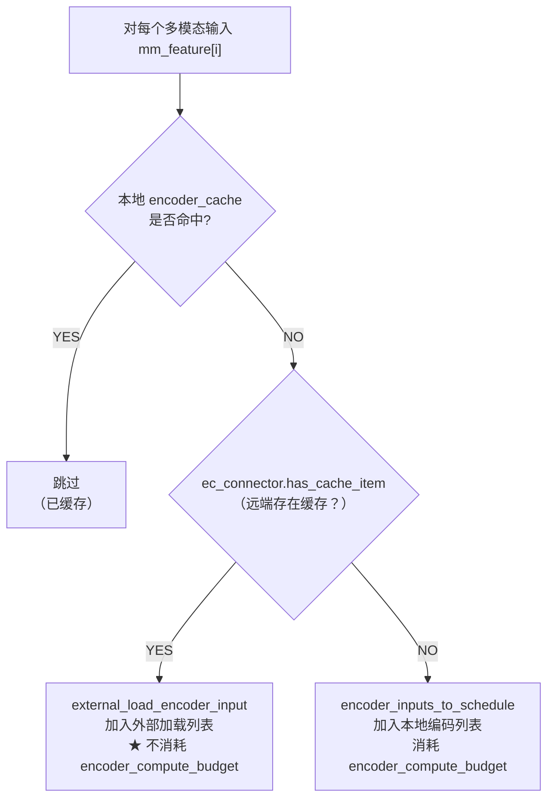

**关键洞察**：外部加载的编码器输入**不消耗编码预算**（`encoder_compute_budget`），因为它们不需要在当前实例运行 Vision Encoder。这使得 PD 实例即使没有 Encoder 能力，也能处理多模态请求。

再往下看两层，会发现 `_try_schedule_encoder_inputs()` 实际上是个三路选择器：`reuse local` / `load remote` / `recompute local`。这里还有几个容易被忽略的细节：

1. scheduler 虽然按 request 调度，但在 `_try_schedule_encoder_inputs()` 内部会额外维护 `mm_hashes_to_schedule` 与 `num_embeds_to_schedule` 这两个“按 item 粒度”的临时状态，用来避免同一步里对同一个 `identifier` 重复调度，也避免容量计算失真。
2. “远端命中”会被放进 `external_load_encoder_input`，并同样累加到 `num_embeds_to_schedule`。也就是说，它虽然不扣 encoder compute budget，但会占 encoder cache 的本地落点预算。
3. 这也是为什么 EPD 真正依赖 scheduler，而不是只靠 worker：你必须在 token budget、encoder budget、cache capacity、placeholder overlap 这几个约束下做选择。

### 6.3 分配后通知 EC Connector

调度器在分配 Encoder Cache 后通知 EC Connector：

```python
# 对于需要本地编码的输入
if encoder_inputs_to_schedule:
    scheduled_encoder_inputs[request_id] = encoder_inputs_to_schedule
    for i in encoder_inputs_to_schedule:
        self.encoder_cache_manager.allocate(request, i)
        if self.ec_connector is not None:
            self.ec_connector.update_state_after_alloc(request, i)

# 对于需要从外部加载的输入（EC Transfer）
if external_load_encoder_input:
    for i in external_load_encoder_input:
        self.encoder_cache_manager.allocate(request, i)
        if self.ec_connector is not None:
            self.ec_connector.update_state_after_alloc(request, i)
```

两种路径都调用 `update_state_after_alloc`，但 EC Connector 内部只在 Consumer 角色且缓存存在时才标记加载需求。

### 6.4 构建 EC 元数据

在调度步骤末尾，构建 EC 元数据传递给 Worker：

```python
# schedule() 方法中
if self.ec_connector is not None:
    ec_meta: ECConnectorMetadata = self.ec_connector.build_connector_meta(
        scheduler_output
    )
    scheduler_output.ec_connector_metadata = ec_meta
```

EC 元数据通过 `SchedulerOutput.ec_connector_metadata` 传递到 Worker 进程。

### 6.5 Encoder Cache Manager 配合

> 源码：`vllm/v1/core/encoder_cache_manager.py`

`EncoderCacheManager` 管理 Encoder Cache 的容量和引用计数：

```python
class EncoderCacheManager:
    cache_size: int                          # 总容量
    num_free_slots: int                      # 可用容量
    cached: dict[str, set[str]]              # mm_hash → 引用该 hash 的 request_id 集合
    freeable: OrderedDict[str, int]          # 可回收的 mm_hash → num_embeds
    freed: list[str]                         # 已释放的 mm_hash

    def check_and_update_cache(self, request, input_id) -> bool:
        """检查本地缓存是否命中"""

    def can_allocate(self, request, input_id, budget, num_scheduled) -> bool:
        """检查是否有足够空间分配"""

    def allocate(self, request, input_id) -> None:
        """分配缓存位置"""

    def free(self, request) -> None:
        """释放请求关联的缓存"""
```

EC Connector 与 Cache Manager 的关系：

- Cache Manager 管理**本地内存**中的 Encoder Cache 容量
- EC Connector 管理**外部存储**中的 Encoder Cache 传输
- 两者在 `_try_schedule_encoder_inputs` 中协作：先查本地，再查外部

### 6.6 状态推进、释放与边界条件

除了“查本地 / 查远端 / 算本地”三选一，scheduler 里还有一批非常关键的边界逻辑：

1. `schedule()` 会对需要的 item 先做逻辑 `allocate()`，再调用 `ec_connector.update_state_after_alloc()`。这一步既发生在“本地重算”路径，也发生在“远端载入”路径。
2. `_update_after_schedule()` 会推进 `num_computed_tokens`，随后调用 `_free_encoder_inputs()`。释放条件不是“encoder 已经算完”，而是“该 item 对应的 placeholder 已被消费进入 decoder KV”。
3. 当 `disable_chunked_mm_input=True` 且当前 token window 只覆盖到某个 multimodal item 的一部分时，scheduler 会把 `num_new_tokens` 回滚到该 item 开始之前，而不是让一个 MM item 被截断地进入当前 step。
4. 当 `can_allocate()` 失败时，如果 `num_computed_tokens` 已经因为 prefix caching 等原因越过了该 item 的 `start_pos`，scheduler 会把本轮 `num_new_tokens` 直接置成 `0`，而不是勉强调度一部分。这是一个非常强的正确性优先决策。
5. worker 物理释放发生在 `GPUModelRunner` 处理 `scheduler_output.free_encoder_mm_hashes` 时，从 `self.encoder_cache` 中 `pop` 掉对应 key。也就是说，逻辑释放和物理释放并不是同一时刻。
6. `reset_encoder_cache()` 只清本地逻辑 / 物理缓存；engine 注释明确说它主要用于调试，并不会尝试和外部 connector 做重新同步。

---

## 7. Worker / GPU Model Runner 集成

### 7.1 ECConnectorModelRunnerMixin

> 源码：`vllm/v1/worker/ec_connector_model_runner_mixin.py`

这是将 EC Connector 集成到 GPU Model Runner 的 Mixin 类，提供三个核心静态方法：

```python
class ECConnectorModelRunnerMixin:

    @staticmethod
    def maybe_save_ec_to_connector(
        encoder_cache: dict[str, torch.Tensor],
        mm_hash: str,
    ):
        """如果是 Producer，保存 Encoder Cache 到连接器"""
        if not has_ec_transfer():
            return
        connector = get_ec_transfer()
        connector.save_caches(encoder_cache=encoder_cache, mm_hash=mm_hash)

    @staticmethod
    def maybe_get_ec_connector_output(
        scheduler_output: "SchedulerOutput",
        encoder_cache: dict[str, torch.Tensor],
        **kwargs,
    ) -> AbstractContextManager[ECConnectorOutput | None]:
        """返回 EC 操作的 Context Manager（如果未配置 EC 则返回 nullcontext）"""
        return (
            ECConnectorModelRunnerMixin._get_ec_connector_output(
                scheduler_output, encoder_cache, **kwargs
            )
            if has_ec_transfer()
            else nullcontext()
        )

    @staticmethod
    @contextmanager
    def _get_ec_connector_output(
        scheduler_output, encoder_cache, **kwargs,
    ) -> Generator[ECConnectorOutput, None, None]:
        """
        EC 连接器完整生命周期的 Context Manager：

        进入时:
          1. bind_connector_metadata()   — 绑定调度器元数据
          2. start_load_caches()         — 如果是 Consumer，加载外部缓存

        [yield → 执行 Encoder + 嵌入收集]

        退出时:
          3. get_finished()              — 获取异步传输完成状态
          4. clear_connector_metadata()  — 清理元数据
        """
        output = ECConnectorOutput()
        ec_connector = get_ec_transfer()

        assert isinstance(ec_connector, ECConnectorBase)
        assert scheduler_output.ec_connector_metadata is not None

        ec_connector.bind_connector_metadata(
            scheduler_output.ec_connector_metadata
        )

        # Consumer 角色：在 yield 之前加载缓存
        if ec_connector.is_consumer:
            ec_connector.start_load_caches(encoder_cache, **kwargs)

        try:
            yield output
        finally:
            output.finished_sending, output.finished_recving = (
                ec_connector.get_finished(scheduler_output.finished_req_ids)
            )
            ec_connector.clear_connector_metadata()
```

### 7.2 Encoder 执行与缓存保存

> 源码：`vllm/v1/worker/gpu_model_runner.py`

GPU Model Runner 通过 Mixin 继承了 EC 功能：

```python
class GPUModelRunner(
    LoRAModelRunnerMixin,
    KVConnectorModelRunnerMixin,
    ECConnectorModelRunnerMixin,    # ← EC 能力
):
    self.encoder_cache: dict[str, torch.Tensor] = {}
```

**Encoder 执行后保存缓存（生产者路径）：**

```python
# _execute_mm_encoder() 执行视觉编码
# 编码完成后，缓存结果并通知 EC Connector
for mm_hash, output in zip(mm_hashes, encoder_outputs):
    self.encoder_cache[mm_hash] = output
    logger.debug("Finish execute for mm hash %s", mm_hash)
    # ★ 调用 Mixin 方法保存到外部存储
    self.maybe_save_ec_to_connector(self.encoder_cache, mm_hash)
```

这段执行流还有几层容易被正文略过的细节：

1. `_execute_mm_encoder()` 会先按 modality 分组批处理；如果一个 batch 中 modality 混杂，或者为了保持 item 顺序必须拆分，就会变成多个 micro-batch。
2. 某些视频 / EVS / dynamic-resolution video 场景下，源码会主动退化成“逐视频顺序编码”，以降低峰值显存，而不是强行把视频样本堆到同一个 encoder batch 里。
3. LoRA 场景下，EPD 不只是把 `identifier` 改成 `lora_name:mm_hash`。如果 tower connector LoRA 打开，runner 还会额外构造 TOWER / CONNECTOR 两套 LoRA mapping，再执行 `embed_multimodal()`。也就是说，LoRA 既影响 cache key，也影响 encoder 执行上下文。

### 7.3 缓存加载与嵌入注入

**消费者路径：加载外部 EC 并注入到模型输入**

```python
# GPU Model Runner 的 execute_model 流程
ec_connector_output = None

if self.supports_mm_inputs and is_first_rank and not is_encoder_decoder:
    # ★ Context Manager 包装 EC 加载 + Encoder 执行 + 嵌入收集
    with self.maybe_get_ec_connector_output(
        scheduler_output,
        encoder_cache=self.encoder_cache,   # 传入内存缓存字典
    ) as ec_connector_output:
        # 1. EC Consumer: start_load_caches() 已在 Context Manager 入口执行
        #    → 外部 Encoder Cache 已加载到 self.encoder_cache

        # 2. 如果请求需要本地编码（非 EC 加载的项），执行 Encoder
        self._execute_mm_encoder(scheduler_output)

        # 3. 从 encoder_cache 收集嵌入向量
        #    此时 cache 中同时包含本地编码的和外部加载的
        mm_embeds, is_mm_embed = self._gather_mm_embeddings(scheduler_output)

    # 4. 将嵌入向量注入到模型输入
    inputs_embeds_scheduled = self.model.embed_input_ids(
        self.input_ids.gpu[:num_scheduled_tokens],
        multimodal_embeddings=mm_embeds,
        is_multimodal=is_mm_embed,
    )
```

**关键洞察**：`with maybe_get_ec_connector_output(...)` 的设计非常精巧：

1. **进入** Context Manager → Consumer 通过 `start_load_caches()` 从外部加载 EC 到 `encoder_cache`
2. **yield 期间** → 执行本地 Encoder（如果有需要本地编码的项）+ 收集嵌入
3. **退出** Context Manager → 获取异步完成状态 + 清理

这确保了在 `_gather_mm_embeddings` 时，`encoder_cache` 中同时包含**本地编码的**和**从外部加载的**结果。

还有两个执行层事实对理解 EPD 很重要：

1. `self.encoder_cache` 是整个 runtime 的“合流点”。只要某个张量最终进入这个 dict，后续 prefill/decode 就不在乎它是本地算出来的，还是远端载入的。
2. `_gather_mm_embeddings()` 不只是简单切张量。它既支持 `PlaceholderRange.is_embed` 的稀疏切片，也支持多个 multimodal feature 在同一段 prompt 上重叠时通过 OR mask 合并 `is_mm_embed`，例如 `use_audio_in_video` 这类复合输入场景。

### 7.4 mm_encoder_only 模式

> 源码：`vllm/config/multimodal.py`

```python
mm_encoder_only: bool = False
"""
When enabled, skips the language component of the model.
This is usually only valid in disaggregated Encoder process.
"""
```

启用 `--mm-encoder-only` 后，GPU Model Runner 中多处跳过语言模型相关操作：

```python
if mm_config and mm_config.mm_encoder_only:
    # 跳过语言模型权重加载
    # 跳过 KV Cache 分配
    # 仅执行 Vision Encoder
```

这是 Encoder 实例的关键优化：完整模型可能需要 16GB+ 显存，但只加载 Vision Encoder 可能只需 < 1GB。

### 7.5 Encoder-Only 运行时路径详解

> 源码：`vllm/v1/worker/gpu_model_runner.py:L3807-3813`

`mm_encoder_only` 对各组件的影响：

| 组件                                   | 影响                                                                                                             |
| -------------------------------------- | ---------------------------------------------------------------------------------------------------------------- |
| **GPUModelRunner.execute_model**       | 检测到 `has_ec_transfer() and not is_consumer` → 仅运行 Encoder，返回 `make_empty_encoder_model_runner_output()` |
| **GPUModelRunner.\_dummy_run**         | `mm_encoder_only` → 跳过 LM dummy run                                                                            |
| **GPUModelRunner.\_dummy_sampler_run** | `mm_encoder_only` → 返回空 tensor                                                                                |
| **GPUModelRunner.\_dummy_pooler_run**  | `mm_encoder_only` → 返回空 tensor                                                                                |
| **GPUModelRunner.get_kv_cache_spec**   | `has_ec_transfer() and not is_consumer` → 返回空字典（不需要 KV Cache）                                          |
| **EngineCore**                         | `is_ec_consumer=False` → 不使用 sampler                                                                          |
| **RayExecutor**                        | `uses_sampler=False` → 不初始化采样器                                                                            |
| **GPUWorker**                          | Encoder-only 实例不初始化 KV Cache                                                                               |

**Encoder-Only 提前返回的实际代码路径（`execute_model` 入口）：**

```python
# execute_model 入口
if has_ec_transfer() and not get_ec_transfer().is_consumer:
    # ★ Encoder-only 实例：只运行 Encoder，不运行 LM
    with self.maybe_get_ec_connector_output(
        scheduler_output, encoder_cache=self.encoder_cache
    ) as ec_connector_output:
        self._execute_mm_encoder(scheduler_output)
        return make_empty_encoder_model_runner_output(scheduler_output)
    # 直接返回空输出，不执行 LM forward / sampling
```

**`make_empty_encoder_model_runner_output` 实现**（`vllm/v1/outputs.py:L226-253`）：

```python
def make_empty_encoder_model_runner_output(scheduler_output):
    """
    创建包含正确 per-request 索引但不含生成数据的 ModelRunnerOutput。
    每个请求返回 [0] 作为占位 token。
    """
    req_ids = list(scheduler_output.num_scheduled_tokens.keys())
    req_id_to_index = {rid: idx for idx, rid in enumerate(req_ids)}
    sampled_token_ids = [[0] for _ in req_ids]   # 占位
    pooler_output = [None for _ in req_ids]
    return ModelRunnerOutput(
        req_ids=req_ids,
        req_id_to_index=req_id_to_index,
        sampled_token_ids=sampled_token_ids,
        pooler_output=pooler_output,
    )
```

### 7.6 Scheduler → Worker 数据流总结

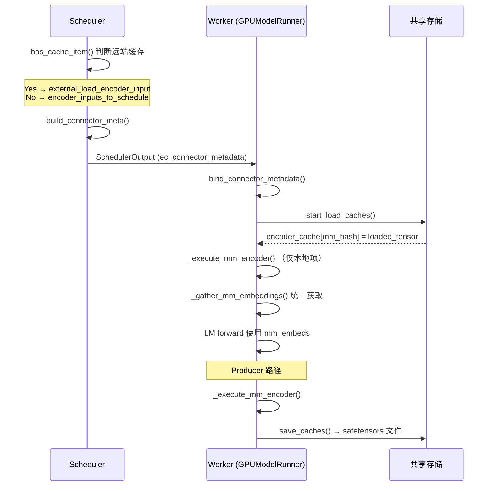

### 7.7 执行层失败路径与隐含不变量

当前 ExampleConnector 路径里，EC load 更像“step 内同步 cache load”，而不是完整的异步远端传输状态机。

1. 只要启用了 EC connector，scheduler 每一步都会构造 `ec_connector_metadata` 对象，哪怕里面是空的。原因很直接：worker 侧 mixin 在进入 connector 生命周期时会 `assert scheduler_output.ec_connector_metadata is not None`。
2. 当前实现没有 `WAITING_FOR_REMOTE_EC` 之类的请求状态；与 KV transfer 不同，EC load 在 ExampleConnector 里是同步、step 内完成的。
3. 正常 cache miss 发生在 scheduler 阶段：`has_cache_item()` 返回 `False`，该 item 会回到“本地计算 encoder”分支。
4. 更麻烦的是“调度时命中、执行时失效”：如果远端 EC 在 scheduler 认为“存在”之后被删除，当前 ExampleConnector 不做自动恢复，它会在 `start_load_caches()` 中直接抛 `FileNotFoundError`。
5. 如果某个 item 理应已经装入 `self.encoder_cache`，但到 `_gather_mm_embeddings()` 时仍未拿到，会触发 `assert encoder_output is not None`，也就是常见的 `Encoder cache miss`。
6. 尽管源码里的局部变量名经常写作 `mm_hash`，worker 侧 `self.encoder_cache` 实际沿用的是 `identifier` 这一逻辑 key；因此 LoRA-aware tower connector cache 在逻辑上天然与 base tower cache 隔离。

---

## 8. 输出数据结构

> 源码：`vllm/v1/outputs.py`

```python
@dataclass
class ECConnectorOutput:
    """EC Connector 的 Worker → Scheduler 输出"""
    finished_sending: set[str] | None = None    # 异步发送完成的请求 ID
    finished_recving: set[str] | None = None    # 异步接收完成的请求 ID

@dataclass
class ModelRunnerOutput:
    """模型运行器输出（包含 EC 结果）"""
    req_ids: list[str]
    sampled_token_ids: list[list[int]]
    ec_connector_output: ECConnectorOutput | None = None  # ← EC 输出
    kv_connector_output: KVConnectorOutput | None = None
    # ... 其他字段
```

在 `SchedulerOutput` 中：

```python
@dataclass
class SchedulerOutput:
    scheduled_encoder_inputs: dict[str, list[int]]       # 需要编码的输入
    free_encoder_mm_hashes: list[str]                    # 需要释放的 EC
    ec_connector_metadata: ECConnectorMetadata | None = None  # EC 元数据
    kv_connector_metadata: KVConnectorMetadata | None = None  # KV 元数据
```

---

## 9. EPD Proxy 路由代理

> 源码：`examples/online_serving/disaggregated_encoder/disagg_epd_proxy.py`

### 9.1 核心路由逻辑

Proxy 是一个 FastAPI 应用，将标准 OpenAI Chat Completions 请求拆分为多阶段处理：

```python
@app.post("/v1/chat/completions")
async def chat_completions(request: Request):
    req_data = await request.json()

    # 随机选择 Encoder 集群（扇出）/ Prefill / Decode 实例
    e_urls = app.state.e_urls    # Encoder 集群 URL 列表
    p_url = random.choice(app.state.p_urls) if app.state.p_urls else None
    d_url = random.choice(app.state.d_urls)

    is_streaming = req_data.get("stream", False)

    if is_streaming:
        return StreamingResponse(
            forward_stream(req_data, req_id, e_urls, p_url, d_url),
            media_type="text/event-stream",
        )
    result = await forward_non_stream(req_data, req_id, e_urls, p_url, d_url)
    return JSONResponse(content=result)
```

**核心转发流程（`forward_non_stream` / `forward_stream`）：**

```python
async def forward_non_stream(req_data, req_id, e_urls, p_url, d_url):
    # Step 1: 将多模态项发送到 Encoder 集群
    await fanout_encoder_primer(req_data, e_urls, req_id)

    # Step 2: 通过 Prefill 实例（如果存在）
    req_data = await maybe_prefill(req_data, p_url, req_id)

    # Step 3: 转发到 Decode/PD 实例
    async with decode_session.post(
        f"{d_url}/v1/chat/completions", json=req_data
    ) as resp:
        return await resp.json()
```

### 9.2 Encoder 扇出机制

```python
MM_TYPES = {"image_url", "audio_url", "input_audio"}

def extract_mm_items(request_data: dict) -> list[dict]:
    """从消息中提取所有多模态项（图片/音频）"""
    items = []
    for msg in request_data.get("messages", []):
        content = msg.get("content")
        if not isinstance(content, list):
            continue
        for item in content:
            if item.get("type") in MM_TYPES:
                items.append(item)
    return items

async def fanout_encoder_primer(orig_request, e_urls, req_id):
    """
    为每个多模态项创建独立请求，并发发送到 Encoder 集群。

    关键设计：
    1. 每个 MM 项 → 1 个独立请求（仅含该 MM 项，无文本）
    2. max_tokens=1（只做编码，不生成文本）
    3. Round-robin 分发到 Encoder 集群
    4. asyncio.gather 并发执行所有请求
    """
    mm_items = extract_mm_items(orig_request)
    if not mm_items:
        return  # 无多模态项，跳过

    tasks = []
    url_cycle = (e_urls[i % len(e_urls)] for i in range(len(mm_items)))

    for idx, (item, target_url) in enumerate(zip(mm_items, url_cycle)):
        child_req_id = f"{req_id}:{idx}:{uuid.uuid4().hex[:6]}"
        encoder_req = {
            "model": orig_request.get("model"),
            "messages": [
                {"role": "user", "content": [item]},  # 仅含 MM 项
            ],
            "max_tokens": 1,      # 只编码，不生成
            "stream": False,
        }
        tasks.append(
            encode_session.post(
                f"{target_url}/v1/chat/completions",
                json=encoder_req,
                headers={"x-request-id": child_req_id},
            )
        )

    results = await asyncio.gather(*tasks, return_exceptions=True)

    # 检查所有子请求是否成功
    for idx, r in enumerate(results):
        if isinstance(r, Exception) or r.status != 200:
            raise HTTPException(status_code=502, detail="Encoder request failed")
```

**关键设计点**：

- **一个 MM 项 = 一个请求**：Proxy 将包含 N 张图片的请求拆成 N 个独立请求
- **max_tokens=1**：Encoder 实例只需运行 Encoder 生成编码结果，并通过 EC Connector 保存。回复的 1 个 token 被丢弃
- **Round-robin**：多个 Encoder 实例时，MM 项轮流分配以负载均衡
- **并发扇出**：所有 Encoder 请求并发执行

### 9.3 Prefill 阶段（可选）

当部署了独立的 Prefill 实例时（E+P+D 模式），Proxy 在 Encode 后额外执行 Prefill：

```python
async def maybe_prefill(req_data, p_url, req_id):
    if p_url:
        prefill_response = await process_prefill_stage(req_data, p_url, req_id)
        prefill_response_json = await prefill_response.json()
        # 获取 KV 传输参数（用于 Decode 端通过 NixlConnector 加载 KV）
        kv_transfer_params = prefill_response_json.get("kv_transfer_params", {})
        if kv_transfer_params:
            req_data["kv_transfer_params"] = kv_transfer_params
        return req_data
    else:
        return req_data  # E+PD 模式：直接跳过

async def process_prefill_stage(req_data, p_url, req_id):
    """Prefill 阶段：只做 1 token 的 prefill"""
    prefill_request = req_data.copy()
    prefill_request["kv_transfer_params"] = {
        "do_remote_decode": True,
        "do_remote_prefill": False,
        "remote_engine_id": None,
        "remote_block_ids": None,
        "remote_host": None,
        "remote_port": None,
    }
    prefill_request["stream"] = False
    prefill_request["max_tokens"] = 1         # 仅 prefill
    # 发送到 Prefill 实例
    return await prefill_session.post(
        f"{p_url}/v1/chat/completions", json=prefill_request
    )
```

### 9.4 Decode 阶段

无论是 E+PD 还是 E+P+D，最终请求都转发到 Decode/PD 实例：

```python
# 非流式
async with decode_session.post(
    f"{d_url}/v1/chat/completions", json=req_data
) as resp:
    return await resp.json()

# 流式
async with decode_session.post(
    f"{d_url}/v1/chat/completions", json=req_data
) as resp:
    async for chunk in resp.content.iter_chunked(1024):
        yield chunk.decode("utf-8", errors="ignore")
```

### Proxy 启动参数

```bash
python disagg_epd_proxy.py \
    --host 0.0.0.0 \
    --port 8000 \
    --encode-servers-urls "http://e1:8001,http://e2:8001"  # Encoder 集群
    --prefill-servers-urls "disable"                        # E+PD 模式
    --decode-servers-urls "http://pd1:8002"                 # PD 实例
```

- `--prefill-servers-urls "disable"` → E+PD 模式
- `--prefill-servers-urls "http://p1:8003"` → E+P+D 模式

### 9.5 这个示例 Proxy 的真实控制面语义

`disagg_epd_proxy.py` 很适合说明主线能力如何拼起来，但它也把当前 control plane 的边界暴露得很清楚：

1. `extract_mm_items()` 只从 `messages[*].content` 的 list 形态里提取 `image_url` / `audio_url` / `input_audio` 三类 item，而不是泛化地抓取一切非文本内容。这意味着 demo proxy 的模态覆盖范围，其实比引擎内部的多模态抽象更窄。
2. `fanout_encoder_primer()` 会为每个 multimodal item 构造一个“只保留该 item、完全删除文本”的子请求，并把 `max_tokens` 固定为 `1`，以确保服务端真正走到 encoder 执行路径。
3. proxy 在控制面上是“全 barrier”语义：所有 primer 子请求都成功，后续阶段才继续；任何一个 primer 异常或非 200，整个原始请求直接失败。
4. encode 集群和 decode / prefill 集群的负载均衡策略并不相同：同一个请求内的 multimodal items 在 encoder 侧做 round-robin，prefill / decode 则是对实例列表做 `random.choice()`。
5. 这套示例编排没有 sticky session 或跨阶段亲和性概念。encode 子请求打到哪台 E、后续原始请求打到哪台 P/PD/D，都是独立决定的。
6. 这意味着示例 EPD 正确性真正依赖的不是“同一个请求一直路由到同一台机器”，而是多端能算出稳定一致的 `identifier`，并且共享 EC / KV 存储能被不同实例无状态消费。

---

## 10. E+PD 部署实战

> 源码：`examples/online_serving/disaggregated_encoder/disagg_1e1pd_example.sh`

### 完整部署命令

```bash
# 共享存储路径
EC_SHARED_STORAGE_PATH="/tmp/ec_cache"
mkdir -p "$EC_SHARED_STORAGE_PATH"

# ==================== Encoder 实例 (GPU 0) ====================
CUDA_VISIBLE_DEVICES=0 vllm serve Qwen/Qwen2.5-VL-3B-Instruct \
    --port 19534 \
    --gpu-memory-utilization 0.01 \
    --enforce-eager \
    --no-enable-prefix-caching \
    --max-num-batched-tokens 114688 \
    --max-num-seqs 128 \
    --enable-request-id-headers \
    --ec-transfer-config '{
        "ec_connector": "ECExampleConnector",
        "ec_role": "ec_producer",
        "ec_connector_extra_config": {
            "shared_storage_path": "/tmp/ec_cache"
        }
    }'

# ==================== PD 实例 (GPU 1) ====================
CUDA_VISIBLE_DEVICES=1 vllm serve Qwen/Qwen2.5-VL-3B-Instruct \
    --port 19535 \
    --gpu-memory-utilization 0.7 \
    --enforce-eager \
    --max-num-seqs 128 \
    --max-model-len 32768 \
    --enable-request-id-headers \
    --ec-transfer-config '{
        "ec_connector": "ECExampleConnector",
        "ec_role": "ec_consumer",
        "ec_connector_extra_config": {
            "shared_storage_path": "/tmp/ec_cache"
        }
    }'

# ==================== Proxy ====================
python disagg_epd_proxy.py \
    --port 10001 \
    --encode-servers-urls "http://localhost:19534" \
    --prefill-servers-urls "disable" \
    --decode-servers-urls "http://localhost:19535"
```

**关键配置说明：**

| 参数                       | Encoder 实例  | PD 实例       | 说明                 |
| -------------------------- | ------------- | ------------- | -------------------- |
| `gpu-memory-utilization`   | 0.01          | 0.7           | Encoder 极轻量       |
| `enforce-eager`            | ✅            | ✅            | 禁用 CUDA Graph      |
| `no-enable-prefix-caching` | ✅            | ❌            | Encoder 端不缓存前缀 |
| `max-num-batched-tokens`   | 114688        | 默认          | 大 batch 预算        |
| `ec_role`                  | `ec_producer` | `ec_consumer` | 生产者/消费者        |
| `shared_storage_path`      | 一致          | 一致          | **必须相同**         |

---

## 11. E+P+D 三级分离部署

> 源码：`examples/online_serving/disaggregated_encoder/disagg_1e1p1d_example.sh`

### 完整部署命令

```bash
EC_SHARED_STORAGE_PATH="/tmp/ec_cache"
export UCX_TLS=all
export UCX_NET_DEVICES=all

# ==================== Encoder 实例 (GPU 2) ====================
CUDA_VISIBLE_DEVICES=2 vllm serve Qwen/Qwen2.5-VL-3B-Instruct \
    --port 19534 \
    --gpu-memory-utilization 0.01 \
    --enforce-eager \
    --no-enable-prefix-caching \
    --max-num-batched-tokens 114688 \
    --ec-transfer-config '{
        "ec_connector": "ECExampleConnector",
        "ec_role": "ec_producer",
        "ec_connector_extra_config": {
            "shared_storage_path": "/tmp/ec_cache"
        }
    }'

# ==================== Prefill 实例 (GPU 2) ====================
# 同时是 EC Consumer + KV Producer
CUDA_VISIBLE_DEVICES=2 \
VLLM_NIXL_SIDE_CHANNEL_PORT=5559 \
vllm serve Qwen/Qwen2.5-VL-3B-Instruct \
    --port 19535 \
    --gpu-memory-utilization 0.7 \
    --enforce-eager \
    --ec-transfer-config '{
        "ec_connector": "ECExampleConnector",
        "ec_role": "ec_consumer",
        "ec_connector_extra_config": {
            "shared_storage_path": "/tmp/ec_cache"
        }
    }' \
    --kv-transfer-config '{
        "kv_connector": "NixlConnector",
        "kv_role": "kv_producer"
    }'

# ==================== Decode 实例 (GPU 3) ====================
# 仅 KV Consumer，无需 EC 配置
CUDA_VISIBLE_DEVICES=3 \
VLLM_NIXL_SIDE_CHANNEL_PORT=6000 \
vllm serve Qwen/Qwen2.5-VL-3B-Instruct \
    --port 19536 \
    --gpu-memory-utilization 0.7 \
    --enforce-eager \
    --kv-transfer-config '{
        "kv_connector": "NixlConnector",
        "kv_role": "kv_consumer"
    }'

# ==================== Proxy ====================
python disagg_epd_proxy.py \
    --port 10001 \
    --encode-servers-urls "http://localhost:19534" \
    --prefill-servers-urls "http://localhost:19535" \
    --decode-servers-urls "http://localhost:19536"
```

**三个实例的角色对比：**

|          | Encoder          | Prefill               | Decode         |
| -------- | ---------------- | --------------------- | -------------- |
| EC 角色  | `ec_producer`    | `ec_consumer`         | 无             |
| KV 角色  | 无               | `kv_producer`         | `kv_consumer`  |
| 核心操作 | 视觉编码→保存 EC | 加载 EC→Prefill→传 KV | 加载 KV→Decode |
| 显存占用 | 极低             | 中                    | 中             |

---

## 12. EC 与 KV 传输的协作关系

在 E+P+D 模式中，EC Transfer 和 KV Transfer 形成**串行管道**：

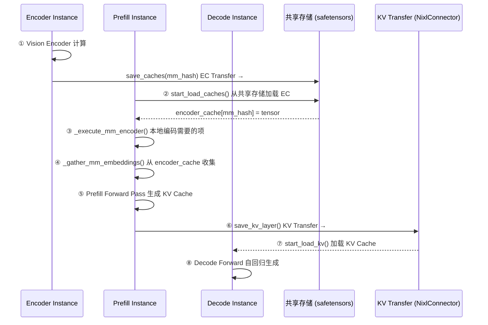

**两种传输机制的对比：**

| 特性       | EC Transfer                     | KV Transfer                    |
| ---------- | ------------------------------- | ------------------------------ |
| 传输内容   | Encoder 输出嵌入                | 注意力层 KV Cache              |
| 数据量     | 较小（嵌入向量）                | 较大（逐层 KV）                |
| 传输时机   | Encoder 执行后 → Prefill 执行前 | Prefill 执行后 → Decode 执行前 |
| 当前实现   | 磁盘/共享存储                   | RDMA/NCCL/UCX                  |
| 典型连接器 | ECExampleConnector              | NixlConnector                  |
| 异步性     | 同步磁盘 I/O                    | 全异步 RDMA                    |

---

## 13. 测试体系

> 源码：`tests/v1/ec_connector/`

### 单元测试

```
tests/v1/ec_connector/unit/test_ec_example_connector.py
```

覆盖 6 个测试类：

| 测试类                         | 内容                                                                                              |
| ------------------------------ | ------------------------------------------------------------------------------------------------- |
| `TestECExampleConnectorBasics` | Producer/Consumer 初始化、角色分配                                                                |
| `TestCacheExistence`           | `has_cache_item()` 对全存在/全不存在/部分存在的判定                                               |
| `TestStateManagement`          | `update_state_after_alloc()` 填充 `_mm_datas_need_loads`；`build_connector_meta()` 创建并清空状态 |
| `TestCacheSaving`              | Producer 保存 3 个 safetensors 文件；Consumer 跳过保存                                            |
| `TestCacheLoading`             | Consumer 加载 3 个缓存到 CUDA；跳过已缓存项；缺失文件抛出 `FileNotFoundError`                     |
| `TestMetadataBindingLifecycle` | bind → get → clear 生命周期                                                                       |

使用 `MockRequest` 模拟带有 `MultiModalFeatureSpec` 的请求。

### 集成测试

```
tests/v1/ec_connector/integration/
├── test_epd_correctness.py          # 正确性验证脚本
├── run_epd_correctness_test.sh      # 集成测试入口
├── hato.jpg                         # 测试图片
└── README.md                        # 测试文档
```

**测试流程：**

1. **Baseline 采集**：单实例运行，保存输出到 `.vllm_baseline.txt`
2. **E+PD 验证**：启动 Encoder + PD 实例，对比输出与 Baseline 一致
3. **PD Baseline 采集**：P+D 分离运行（PD 分离本身有微小差异）
4. **E+P+D 验证**：启动 Encoder + Prefill + Decode，对比输出与 PD Baseline 一致

**测试提示词：**

- 单图请求（stop_sign 图片）
- 多图请求（cherry_blossom + 本地 hato.jpg）
- 纯文本请求（验证纯文本路径不受 Encoder 分离影响）
- 使用确定性生成（`temperature=0.0`, `seed=42`）

```bash
python test_epd_correctness.py \
    --service_url "http://localhost:8000" \
    --model_name "Qwen/Qwen2.5-VL-3B-Instruct" \
    --mode baseline|disagg \
    --baseline_file ".vllm_epd_baseline.txt" \
    --use_mm_prompts
```

**四步集成测试流程**（`run_epd_correctness_test.sh`）：

```bash
# Step 1: 单实例基线，保存参考输出到 .vllm_baseline.txt
# Step 2: 1E + 1PD → 与基线对比，验证 EC Transfer 正确性
# Step 3: 1P + 1D 基线（NixlConnector 场景，P/D 分离本身有微小差异）
# Step 4: 1E + 1P + 1D → 与 PD 基线对比，验证三级分离正确性
```

### 13.3 当前还没有覆盖到的风险点

现有测试已经能证明“主路径正确性”和“部分 fallback 行为”，但距离“生产稳定性证明”还有明显缺口：

1. shape / dtype / model-version mismatch 测试仍然缺失。
2. connector 并发写读竞争测试不充分。
3. EC 外部缓存失效、deallocation 与目录生命周期测试没有补齐。
4. Model Runner V2（MRv2）路径没有形成对称覆盖。
5. 大规模 E|P|D 组合压测与长时间 soak test 仍缺位。

---

## 14. 端到端执行流程详解

以一个包含图片的 Chat Completion 请求为例，完整追踪 E+PD 模式的执行流程：

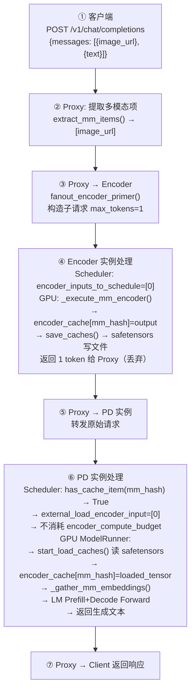

### 14.1 全链路请求生命周期

如果把 E|P|D 视作一次完整在线请求，它的生命周期可以压缩成下面九步：

1. 客户端向 `disagg_epd_proxy.py` 发送 OpenAI Chat Completion 请求。
2. 代理的 `extract_mm_items()` 从 `messages[*].content` 中抽出多模态 item。
3. `fanout_encoder_primer()` 为每个 item 构造一个只包含该 item、没有文本内容的子请求，并发打到 encoder 集群。
4. encoder 实例内部走标准 OpenAI 入口、parser、preprocess、`InputProcessor.process_inputs()`，生成 `MultiModalFeatureSpec` 与 `identifier` / `mm_hash` / `mm_position`。
5. `GPUModelRunner.execute_model()` 检测到“当前有 EC transfer 且本实例不是 consumer”，走 encoder-only 分支，执行 `_execute_mm_encoder()`，并把结果写进 `self.encoder_cache`。
6. producer 通过 `save_caches()` 把 encoder outputs 写到外部 connector。
7. Prefill 或 PD 实例收到原始完整请求后，再次独立解析出同样的 `identifier` / `mm_hash` / `mm_position`。
8. scheduler 对每个多模态 item 做三选一：本地命中、本地重算、远端载入；worker 再通过 `start_load_caches()` / `_gather_mm_embeddings()` 完成注入。
9. 如果是 E|PD，PD 直接返回最终结果；如果是 E|P|D，prefill 先回传 `kv_transfer_params`，再由 decode 消费 KV 并完成最终输出。

### 14.2 E+PD 模式时序图

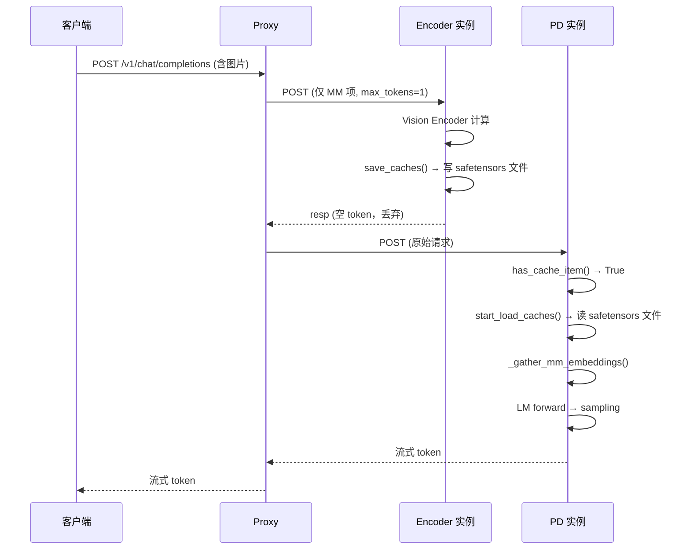

### 14.3 E+P+D 模式时序图

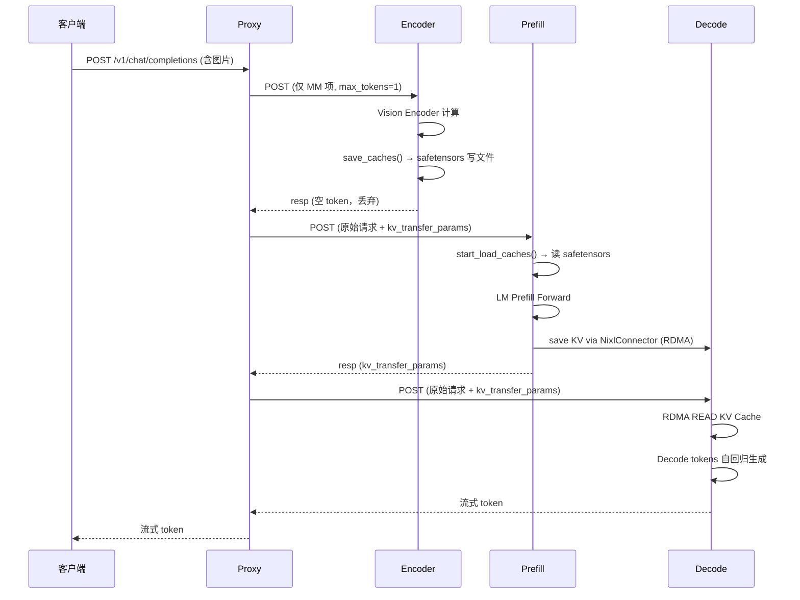

### 14.4 失败路径与 fallback

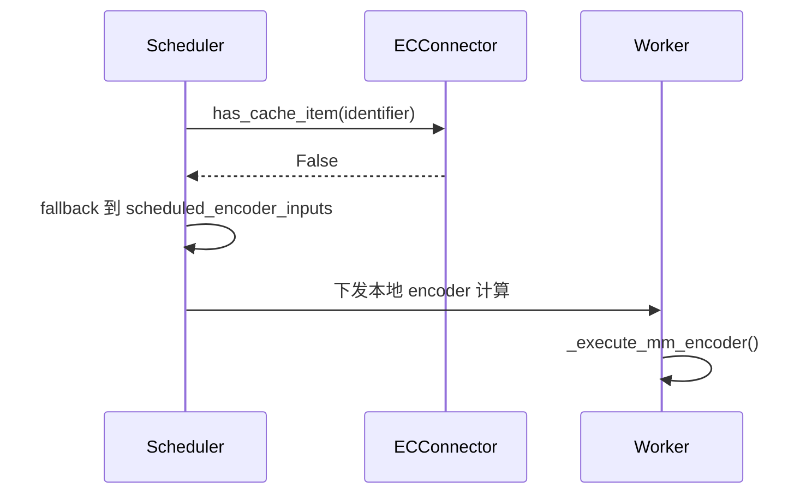

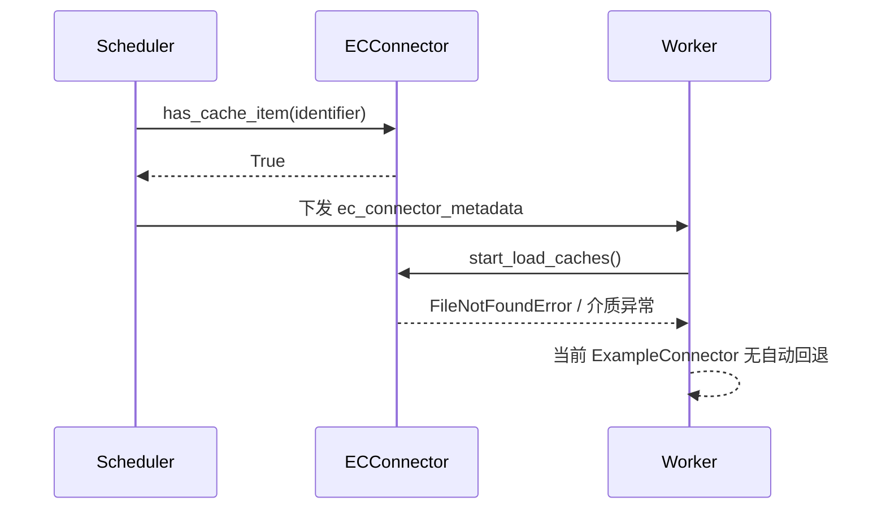

把异常路径收束一下，就是下面四类：

1. 远端 EC 根本不存在时，fallback 发生在 scheduler 阶段：`has_cache_item()` 返回 `False`，该 item 会回到“本地计算 encoder”分支。
2. 远端 EC 在 scheduler 认为“存在”之后被删除时，当前 ExampleConnector 不做恢复，它会在 `start_load_caches()` 中直接触发 `FileNotFoundError`。
3. 如果某个 item 理应已经装入 `self.encoder_cache`，但到 `_gather_mm_embeddings()` 时仍未拿到，会触发 `Encoder cache miss` 断言。
4. 文本请求不会走上述路径：没有 `mm_features`，也没有 encoder primer 子请求。

---

## 15. 总结与判断

### 15.1 架构总览图

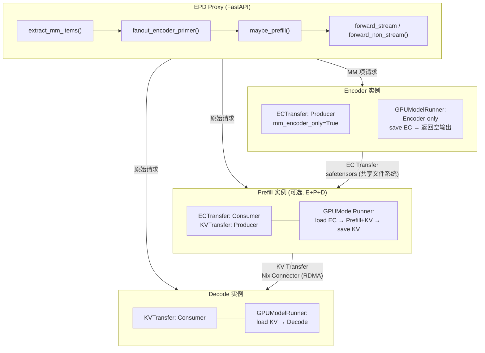

### 15.2 核心判断与设计亮点

把前文收束成四个判断，其实就够了：

1. EPD 拆出的核心中间态是 `encoder outputs`，不是整条推理 pipeline；执行面以 `self.encoder_cache` 为合流点，调度面则围绕 “local reuse / remote load / local recompute” 做三路决策。
2. 角色边界是清楚的：producer 可以走 encoder-only 快路径，不建 KV、不跑 LM；consumer 负责加载 EC 并继续 prefill/decode；`ec_both` 仍是正常生成实例，只是兼具读写 EC 的能力。
3. EC Transfer 和 KV Transfer 是正交设计，因此 E+PD 与 E+P+D 都能自然表达；但在线编排目前仍主要落在 proxy，所以现阶段更像“内核能力 + 外部控制面”。
4. 主路径当前仍落在 V1 runner，in-tree 只有 `ECExampleConnector` 一个参考实现，所以仓库状态更接近“框架骨架 + 示例数据面”，还不是完整产品。

### 15.3 设计思想与工程取舍

前文反复出现的工程矛盾，其实可以合并成三组：

1. key 稳定性与请求级解耦之间的取舍：vLLM 用 `identifier` 统一命中语义，保证 E、P、D 能对齐同一个 multimodal item；代价是三端仍会重复 parser、preprocess 与 hash。
2. 远端命中与本地容量之间的取舍：remote hit 可以省掉 encoder compute budget，但并不省 consumer 侧的本地 cache 落点和生命周期管理，所以 scheduler 必须前置参与决策。
3. 小侵入与强控制面之间的取舍：当前把更重的异步、补偿、亲和路由留在 proxy / connector 外侧，换来主引擎改动较小，但也让 barrier 语义、失败回退和一致性治理仍不完整。

### 15.4 性能收益与上限判断

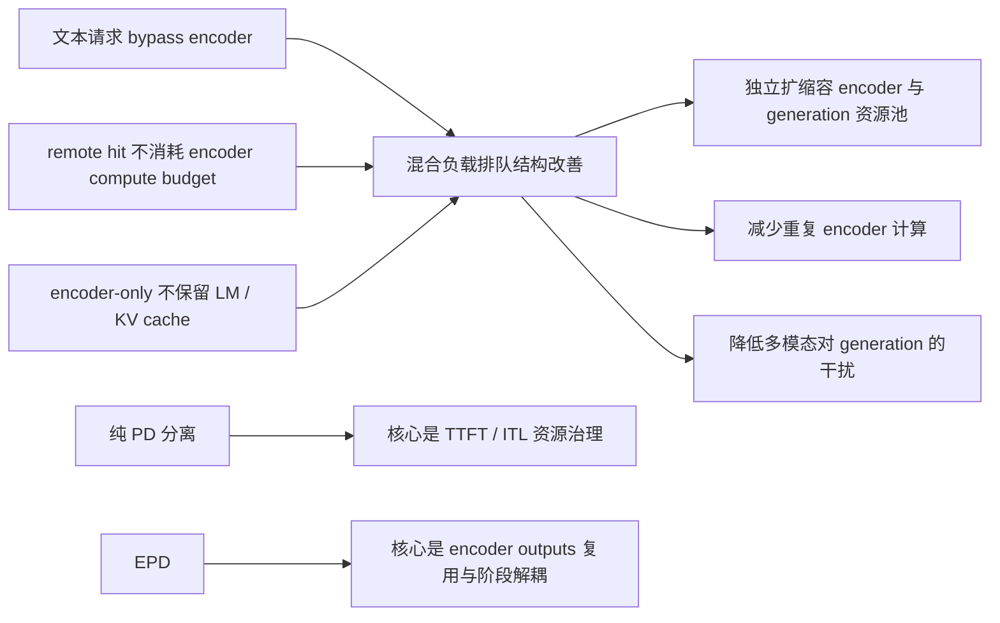

从源码能直接推出，EPD 主要面向三类收益：资源池解耦、混合负载排队改善、重复 encoder 计算消除。

再往现实一点说：

1. 收益高度依赖 workload。图像多、encoder 占比高、文本与多模态混跑时最容易体现价值；超长 decode 主导时，收益更多体现为“去干扰”和“独立扩容”。
2. EPD 更像系统级优化，收益通常先出现在 goodput 和尾延迟，再体现在单请求平均值。
3. 当前端到端上限仍主要受三件事限制：重复 preprocessing、`ECExampleConnector` 的 CPU round-trip / 文件系统开销，以及 proxy 的 barrier 式控制面。
4. 因而现阶段更适合把 EPD 看成资源池解耦与抗干扰优化，而不是“单请求绝对时延一定显著下降”的万能开关。

### 15.5 源码里的隐含不变量

这些不变量不显眼，但非常影响你对这套实现的判断：

1. 只要启用了 EC connector，scheduler 每一步都会构造 `ec_connector_metadata`，哪怕里面是空的。因为 worker 侧 mixin 会断言它不为 `None`。
2. 当前实现没有 `WAITING_FOR_REMOTE_EC` 之类的请求状态；ExampleConnector 的 load 语义是同步、step 内完成的。
3. 尽管很多局部变量名写作 `mm_hash`，worker 侧 `self.encoder_cache` 实际沿用的是 `identifier` 这一逻辑 key，因此 LoRA-aware cache 在逻辑上天然与 base tower cache 隔离。
4. `update_state_after_alloc()` 会在“本地重算”和“远端载入”两条路径上都被调用；只是 ExampleConnector 在 miss 场景下最终是 no-op。

### 15.6 局限性、未完成点与演进方向

| 现状                                    | 改进方向                      |
| --------------------------------------- | ----------------------------- |
| 仅 `ECExampleConnector`（磁盘）         | P2P 高性能连接器（RDMA/NCCL） |
| 共享存储需同一文件系统                  | 分布式存储 / 网络传输         |
| 同步磁盘 I/O                            | 完全异步传输                  |
| 无缓存淘汰策略                          | LRU / TTL 缓存管理            |
| 无传输压缩                              | 量化 / 压缩传输               |
| 无失败恢复（EC 加载失败直接抛异常）     | 类似 KV 的 recompute 回退策略 |
| Proxy 外置（独立 FastAPI 应用）         | 集成进 vLLM 核心简化部署      |
| 单一连接器注册（仅 ECExampleConnector） | 开放更多高性能实现            |

真正难补的，不是“再写一个更快的 connector”，而是把外部 cache 一致性、失败回退、重复 preprocessing 消除，以及 V1 / MRv2 路径收敛一起补齐。更现实的演进顺序仍然是：先补 connector 元数据和回退协议，再把规范化的多模态 metadata 做成正式中间产物，最后再把 proxy 里的关键编排和 runner 路径逐步收回统一控制面。

### 15.7 核心数据流总结

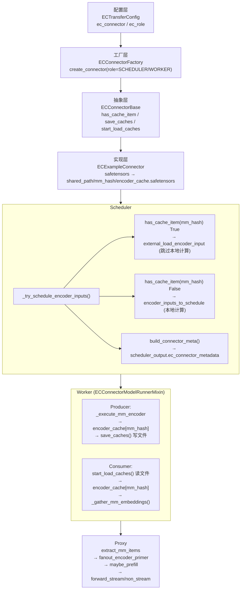

### 15.8 核心代码导航

| 功能                        | 入口文件                                                                 | 关键方法                                   |
| --------------------------- | ------------------------------------------------------------------------ | ------------------------------------------ |
| 配置                        | `vllm/config/ec_transfer.py`                                             | `ECTransferConfig`                         |
| 核心抽象                    | `vllm/distributed/ec_transfer/ec_connector/base.py`                      | `ECConnectorBase`                          |
| 参考实现                    | `vllm/distributed/ec_transfer/ec_connector/example_connector.py`         | `ECExampleConnector`                       |
| 工厂                        | `vllm/distributed/ec_transfer/ec_connector/factory.py`                   | `ECConnectorFactory`                       |
| 全局状态                    | `vllm/distributed/ec_transfer/ec_transfer_state.py`                      | `get_ec_transfer()`                        |
| 调度器集成                  | `vllm/v1/core/sched/scheduler.py`                                        | `_try_schedule_encoder_inputs()`           |
| Worker 集成                 | `vllm/v1/worker/ec_connector_model_runner_mixin.py`                      | `ECConnectorModelRunnerMixin`              |
| Model Runner (save)         | `vllm/v1/worker/gpu_model_runner.py:L2890`                               | `maybe_save_ec_to_connector()`             |
| Model Runner (load)         | `vllm/v1/worker/gpu_model_runner.py:L3213`                               | `maybe_get_ec_connector_output()`          |
| Model Runner (encoder-only) | `vllm/v1/worker/gpu_model_runner.py:L3807`                               | Encoder-Only 提前返回路径                  |
| Worker 初始化               | `vllm/v1/worker/gpu_worker.py:L1055`                                     | `ensure_ec_transfer_initialized()`         |
| 输出结构                    | `vllm/v1/outputs.py:L226`                                                | `make_empty_encoder_model_runner_output()` |
| Proxy                       | `examples/online_serving/disaggregated_encoder/disagg_epd_proxy.py`      | `fanout_encoder_primer()`                  |
| E+PD 部署                   | `examples/online_serving/disaggregated_encoder/disagg_1e1pd_example.sh`  | —                                          |
| E+P+D 部署                  | `examples/online_serving/disaggregated_encoder/disagg_1e1p1d_example.sh` | —                                          |
| ec_both 示例                | `examples/online_serving/ec_both_encoder/ec_both_encoder.sh`             | —                                          |
| 官方文档                    | `docs/features/disagg_encoder.md`                                        | —                                          |

## 16. 附录

### 16.1 关键文件 / 类 / 函数索引

| 类别          | 文件                                                                | 关键类 / 函数                                                                                                                                                       | 作用                                                          |
| ------------- | ------------------------------------------------------------------- | ------------------------------------------------------------------------------------------------------------------------------------------------------------------- | ------------------------------------------------------------- |
| 文档          | `docs/features/disagg_encoder.md`                                   | 全文                                                                                                                                                                | 官方 EPD 定义、动机、开发说明                                 |
| 文档          | `docs/features/disagg_prefill.md`                                   | 全文                                                                                                                                                                | 官方 PD 分离定义与能力边界                                    |
| 示例          | `examples/online_serving/disaggregated_encoder/disagg_epd_proxy.py` | `extract_mm_items` / `fanout_encoder_primer` / `maybe_prefill` / `process_prefill_stage` / `forward_non_stream` / `forward_stream`                                  | 在线 E\|PD / E\|P\|D 编排                                     |
| 示例          | `examples/online_serving/ec_both_encoder/ec_both_encoder.sh`        | 全文                                                                                                                                                                | `ec_both` 单实例基准与重复图像命中示例                        |
| 配置          | `vllm/config/ec_transfer.py`                                        | `ECTransferConfig`                                                                                                                                                  | EC transfer 配置与角色定义                                    |
| 配置          | `vllm/config/multimodal.py`                                         | `MultiModalConfig`                                                                                                                                                  | `mm_encoder_only`、processor cache、MM IPC 等多模态运行时开关 |
| 抽象          | `vllm/distributed/ec_transfer/ec_connector/base.py`                 | `ECConnectorBase` / `ECConnectorRole` / `ECConnectorMetadata`                                                                                                       | EC connector 最小抽象                                         |
| 工厂          | `vllm/distributed/ec_transfer/ec_connector/factory.py`              | `ECConnectorFactory.create_connector`                                                                                                                               | connector 创建与动态加载                                      |
| 示例实现      | `vllm/distributed/ec_transfer/ec_connector/example_connector.py`    | `ECExampleConnector` / `ECExampleConnectorMetadata` / `MMMeta`                                                                                                      | 磁盘版 EC connector                                           |
| 初始化        | `vllm/distributed/ec_transfer/ec_transfer_state.py`                 | `ensure_ec_transfer_initialized`                                                                                                                                    | worker 侧 connector 全局初始化                                |
| 多模态表示    | `vllm/multimodal/inputs.py`                                         | `PlaceholderRange` / `MultiModalFeatureSpec`                                                                                                                        | 多模态占位与 cache key 表示                                   |
| 入口解析      | `vllm/entrypoints/chat_utils.py`                                    | `_parse_chat_message_content_mm_part` / `parse_chat_messages`                                                                                                       | OpenAI chat 多模态内容解析                                    |
| 预处理        | `vllm/inputs/preprocess.py`                                         | `_process_multimodal`                                                                                                                                               | 多模态预处理                                                  |
| 输入转换      | `vllm/v1/engine/input_processor.py`                                 | `_get_mm_identifier` / `process_inputs` / `_validate_model_input`                                                                                                   | 生成 `EngineCoreRequest` 与 `mm_features`                     |
| 请求对象      | `vllm/v1/request.py`                                                | `Request` / `RequestStatus`                                                                                                                                         | 运行态请求与 `kv_transfer_params`                             |
| 引擎核心      | `vllm/v1/engine/core.py`                                            | `add_request` / `_initialize_kv_caches`                                                                                                                             | KV connector 校验、无 KV cache 场景下禁用 chunked prefill     |
| 调度          | `vllm/v1/core/sched/scheduler.py`                                   | `schedule` / `_try_schedule_encoder_inputs` / `_update_after_schedule` / `_free_encoder_inputs` / `reset_encoder_cache`                                             | EPD 调度与状态推进                                            |
| 调度输出      | `vllm/v1/core/sched/output.py`                                      | `SchedulerOutput` / `NewRequestData`                                                                                                                                | 跨 scheduler -> worker 的 step 输出                           |
| 逻辑缓存      | `vllm/v1/core/encoder_cache_manager.py`                             | `EncoderCacheManager` / `EncoderDecoderCacheManager` / `compute_mm_encoder_budget`                                                                                  | encoder cache 容量、引用与回收                                |
| worker mixin  | `vllm/v1/worker/ec_connector_model_runner_mixin.py`                 | `maybe_save_ec_to_connector` / `_get_ec_connector_output`                                                                                                           | worker 内 connector 生命周期                                  |
| worker 执行   | `vllm/v1/worker/gpu_model_runner.py`                                | `_batch_mm_inputs_from_scheduler` / `_execute_mm_encoder` / `_gather_mm_embeddings` / `_preprocess` / `execute_model` / `get_kv_cache_spec` / `reset_encoder_cache` | 真正的 encoder 运行、EC 保存/加载、注入                       |
| worker 初始化 | `vllm/v1/worker/gpu_worker.py`                                      | `use_v2_model_runner` / `ensure_ec_transfer_initialized` 调用点                                                                                                     | 决定 V1/V2 runner 与 EC 初始化                                |
| 执行器        | `vllm/v1/executor/ray_executor.py`                                  | `uses_sampler`                                                                                                                                                      | 区分 producer 与 consumer 的采样语义                          |
| LM 跳过       | `vllm/model_executor/models/interfaces.py`                          | `_mark_language_model`                                                                                                                                              | `--mm-encoder-only` 下跳过语言模型                            |
| KV 参数桥接   | `vllm/entrypoints/openai/chat_completion/protocol.py`               | `to_sampling_params` 中对 `kv_transfer_params` 的处理                                                                                                               | P 阶段 -> D 阶段参数桥接                                      |
| 输出桥接      | `vllm/v1/engine/output_processor.py`                                | 处理 `engine_core_output.kv_transfer_params`                                                                                                                        | 把 KV 传输参数带回上层响应                                    |
| 调试 API      | `vllm/entrypoints/serve/cache/api_router.py`                        | `/reset_encoder_cache`                                                                                                                                              | 调试用 encoder cache reset                                    |

### 16.2 术语表

| 术语                  | 含义                                                    |
| --------------------- | ------------------------------------------------------- |
| EC                    | Encoder Cache，通常指可复用的 encoder outputs           |
| EC connector          | 在不同 vLLM 实例之间传递 / 保存 / 载入 EC 的抽象        |
| `mm_hash`             | 多模态 processor 产出的基础 hash                        |
| `identifier`          | 实际参与 cache / connector 命中的 key；可能带 LoRA 前缀 |
| `mm_position`         | 多模态 placeholder 在 decoder 输入中的位置区间          |
| E\|PD                 | Encoder 与 combined Prefill/Decode 分离                 |
| E\|P\|D               | Encoder、Prefill、Decode 三段分离                       |
| aggregated serving    | 不做阶段分离的普通单实例 serving                        |
| disaggregated prefill | 只拆 prefill 与 decode，通过 KV connector 连接          |
| encoder-only instance | 只跑多模态 encoder 的 producer 实例                     |
| `ec_both`             | 既是 EC producer 又是 EC consumer 的混合角色            |
