## 摘要

**从模型分层、stage 边界协议到调度器、KV cache 与 decode 反馈闭环，这篇文章系统梳理 vLLM 中 Pipeline Parallelism 的真实运行机制。**

vLLM 里的 Pipeline Parallelism（PP）不是“把层均匀切到多张卡上”的开关，而是一套会同时牵动调度器、连续批处理（continuous batching）、KV cache、执行器拓扑，以及 prefill / decode 两条运行路径的推理机制。本文聚焦四件事：它到底解决什么问题、源码里如何落地、为什么 stage 切分不能只看层数，以及它在真实部署里何时划算、何时只是“能跑起来”。

如果只记一条结论：**vLLM 的 PP 本质上是一套推理运行时机制，而不只是模型层切分。**

> 说明：本文基于 vLLM `main` 分支的 commit `4eefbf9609e5ddb996e3ac37e192e92466ec35cc`（研究时间：`2026-04-03`）进行分析，目标仓库为 <https://github.com/vllm-project/vllm>。

---

## 先说结论

1. 在推理系统里，PP 首先是容量手段：让模型装下、给 KV cache 腾空间；只有在通信成本低、stage 足够均衡时，它才进一步转化成性能优化。
2. 推理 PP 切分的是模型层图，不是请求；stage 是“持有一段层与参数，并对边界激活做接力处理”的执行边界。
3. vLLM 的 PP 不是纯运行时透明机制，模型必须显式暴露跨 stage 中间态、首尾段职责以及层归属这些结构知识。
4. 因此层切分不能机械均分。首段 embedding、末段 `norm` / `lm_head` 天然更特殊，`get_pp_indices` 也正是围绕这种不对称做工程化处理。
5. “层数均分”不等于“负载均分”，而“模型能放下”也不等于“系统跑得划算”。
6. PP 的主通信是 stage 边界激活传输，TP 的主通信是层内集合通信（collective）；两者优劣会被硬件拓扑明显改写。
7. prefill 更容易摊薄通信与气泡，decode 更容易暴露最慢 stage、调度空泡和 sampled token 反馈链路。
8. 推理 PP 不能直接套训练里的 1F1B 心智模型，因为它没有 backward，batch 又由连续批处理动态形成。
9. 对在线推理，真正该看的不是单次 forward，而是 TTFT、TPOT、稳态吞吐、KV cache 容量与尾延迟的综合平衡。
10. `SupportsPP`、`IntermediateTensors`、`make_empty_intermediate_tensors`、`PPMissingLayer` 这些抽象共同构成了 vLLM PP 的实现主线，也说明它已经是“推理系统特有的 PP”。

---

## 理解 vLLM PP 之前，先建立 10 个基本判断

### 1. PP 的本质到底是什么，切分对象是什么

PP 的本质不是“把一个模型放到多张卡上”这么宽泛，而是：

- 沿层方向把模型切成多个连续 stage
- 每个 stage 只持有自己那一段参数
- 一次前向中的中间激活沿着 stage 顺序流动
- 最终由末段产出用于 logits / sampling 的结果

因此，PP 的切分对象是模型层图，不是请求本身，也不是 token 本身。

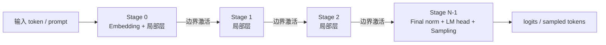

### 2. PP 在推理里要解决什么问题，不解决什么问题

PP 真正解决的是：

- 单卡装不下权重
- 需要跨多卡、跨节点承载单个模型副本
- 某些拓扑下，想避免 TP 式高频集合通信（collective）
- 想把单卡上被权重占掉的显存腾出来给 KV cache

PP 不直接解决的是：

- 单请求一定更低延迟
- decode 一定更快
- stage 自动均衡
- 模型自动拥有 PP 能力

更准确地说，PP 是“让系统有资格运行”的手段，然后才是“让系统有机会更高效”的手段。

### 3. 推理场景下的 PP 与训练场景下的 PP 有哪些关键不同

训练里的 PP 直觉往往来自：

- GPipe
- 1F1B
- 固定 micro-batch
- 前向与反向交错

而推理里至少有四个本质差别：

- 没有反向传播（backward），无法靠 backward 自然填满流水线
- decode 是逐步生成，每一步都依赖上一步 sample 结果
- 连续批处理（continuous batching）让“本步 batch”是动态形成的，不是固定 micro-batch
- KV cache 是分布在 stage 本地的长期状态，不只是瞬时激活

### 4. 为什么推理 PP 不能只看“层切分”，还必须连同 scheduler / batching / prefill / decode 一起理解

因为推理服务不是一张静态图，而是一条动态流水线：

- 新请求不断进入
- 老请求不断退出
- prefill 与 decode 交错
- 请求长度不一致
- 同一个 scheduler step 中，不同请求的工作量不同

这意味着即使层切分完全合理，如果 scheduler 无法持续向流水线注入足够多波次，或者 decode 尾部阶段长期成为瓶颈，PP 仍然可能表现很差。

### 5. PP、TP、DP、EP 各自解决什么问题

| 并行方式 | 切分对象   | 主要目标                                         | 主要通信形态                             | 典型收益                   | 典型风险                  |
| -------- | ---------- | ------------------------------------------------ | ---------------------------------------- | -------------------------- | ------------------------- |
| PP       | 层 / stage | 装下模型、跨节点扩展、某些拓扑下降低集合通信压力 | stage 边界激活传输                       | 每卡权重变薄               | 气泡、串行深度、首尾不均  |
| TP       | 单层张量   | 单层算子拆分、扩大单步并行算力                   | all-reduce / all-gather / reduce-scatter | 单层算力扩展、每层参数分片 | 集合通信对拓扑极敏感      |
| DP       | 模型副本   | 扩大系统总吞吐                                   | 副本级调度与同步                         | 总并发扩展                 | 权重重复、负载均衡问题    |
| EP       | 专家       | MoE 扩展                                         | all-to-all / token 路由                  | 专家容量扩展               | dispatch 成本高、路由复杂 |

### 6. 什么叫流水线气泡（pipeline bubble），在推理里它是如何体现的

bubble 可以理解成“某些 stage 本来应该在工作，但因为流水线没有灌满、已经排空、或者被最慢 stage 卡住而空转”的时间。

在推理里 bubble 主要有三种来源：

- warmup bubble：流水线刚开始时，后段还没活干
- drain bubble：流水线收尾时，前段已经闲下来了
- imbalance bubble：某个 stage 明显更慢，其他 stage 持续等待它

### 7. 什么叫 stage 负载不均，为什么首尾 stage 往往更特殊

因为首尾 stage 不是纯 block 容器：

- 首段往往还有 embedding、输入准备、多模态 embedding
- 末段往往还有 final norm、lm_head、logits、sampling

所以就算 block 数量均分，首尾 stage 依然可能更重。

### 8. 什么时候 PP 比 TP 更合适，什么时候反之

PP 更合适：

- 模型需要跨节点
- GPU 没有 NVLink
- 模型层数与 GPU 数不整齐
- 深而窄的模型更适合按层切

TP 更合适：

- 单机高速互连很强
- 更关心单请求 latency
- 想减少模型前向路径中的串行 stage 深度

### 9. 为什么“层数均分”不等于“负载均分”

因为真实负载由四类因素共同决定：

- 本 stage 的 block 数
- block 类型与局部张量形状
- 首尾特殊模块
- stage 边界通信与调度成本

层数只解释一部分，不解释全部。

### 10. 为什么推理系统中的 PP 需要从“服务级指标”而不是“单步算子时间”来评价

因为线上要优化的是：

- TTFT
- TPOT
- 稳态吞吐
- 可服务并发
- 显存利用率
- 尾延迟

而不是单次 matmul 最快。  
PP 的价值必须放在整条服务链路里判断。

---

## 推理 PP 的理论模型

这一节只保留几个最有用的公式，目的是帮助理解 PP 在推理里的主要矛盾，而不是建立一套过于严格的形式化模型。

| 符号     | 含义                                              |
| -------- | ------------------------------------------------- |
| $L$      | transformer block 总数                            |
| $P$      | pipeline stage 数                                 |
| $l_s$    | stage $s$ 持有的 block 数                         |
| $N$      | 一个 prefill wave 的总 token 数                   |
| $Q$      | 一个 prefill wave 的长度平方和，即 $\sum_i n_i^2$ |
| $B$      | decode step 中的活跃序列数                        |
| $\bar t$ | decode 时的平均上下文长度                         |
| $H$      | hidden size                                       |
| $W$      | pipeline 中重叠的 wave 数                         |

### 计算模型

把 decoder-only 模型写粗一点，可以看成：

$$
F = H_{\mathrm{out}} \circ B_{L-1} \circ \cdots \circ B_1 \circ B_0 \circ H_{\mathrm{in}}.
$$

PP 做的事情，就是把这些 block 按层切成 $P$ 段连续 stage。  
如果第 $s$ 段负责一小段局部网络，那么它的工作可以简单写成：

$$
x_{s+1} = f_s(x_s; W_s, KV_s).
$$

其中：

- $x_s$ 是上一 stage 传来的边界激活
- $W_s$ 是本 stage 权重
- $KV_s$ 是本 stage 所属层的 KV cache

#### stage 是什么

从理论上讲，stage 就是一段连续层。  
从工程上讲，stage 是一个真实执行边界，通常对应一个 PP rank，或者一组 TP ranks；它同时拥有：

- 本地参数
- 本地 KV cache
- 本地中间态 buffer
- 与前后 stage 的通信关系

#### 数据在 stage 间流动的本质是什么

PP 的数据流不是“请求对象”在移动，而是“请求在当前 step 的中间表示”在移动。  
对 decoder-only 模型，这些中间表示通常至少包含：

- `hidden_states`
- `residual`

#### 一次请求 / 一个 batch / 一个 token step 如何在 pipeline 中演化

推理里至少要分两种相位：

- prefill：把 prompt 批量灌进模型
- decode：每一步生成少量新 token

它们的逻辑不同：

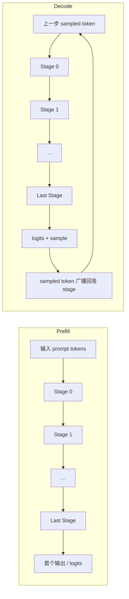

prefill 更接近一次单向链式传播；decode 则多了一步 sample，再把新 token 送回首段继续下一轮。  
所以 decode 不只是“再跑一次前向”，而是“前向 + sample + token 反馈闭环”。

### 性能模型

#### 1. 单 stage 服务时间

先把一个 stage 的时间拆简单一点：

$$
T_s \approx T_{\mathrm{compute},s} + T_{\mathrm{comm},s} + T_{\mathrm{runtime},s}.
$$

其中：

- $T_{\mathrm{compute},s}$：本 stage 真正做层计算的时间
- $T_{\mathrm{comm},s}$：和前后 stage 传激活的时间
- $T_{\mathrm{runtime},s}$：launch、buffer 管理、sample 等杂项时间

#### 2. prefill 的计算量：主要看总 token 数和长度平方项

设一个 prefill wave 里一共有 $N$ 个 token，长度平方和为 $Q = \sum_i n_i^2$，stage $s$ 持有 $l_s$ 个 block。  
那么它的主体计算量可以粗略写成：

$$
T_{\mathrm{prefill},s} \propto l_s \left(\alpha N H^2 + \beta Q H\right).
$$

其中：

- $\alpha N H^2$ 对应投影、MLP 这类近似线性于 token 数的主体项
- $\beta Q H$ 对应 attention 带来的长度平方项

这直接说明：

- prompt 越长，prefill 越容易被 attention 的平方项主导
- prefill 的主体矛盾通常是算力，而不是固定时延

#### 3. decode 的计算量：不再有平方项，而更像线性项加固定开销

设一个 decode step 中有 $B$ 条活跃序列，平均上下文长度为 $\bar t$。  
由于每条序列这一步只新增一个 query token，而历史 KV 已缓存，因此可以粗略写成：

$$
T_{\mathrm{decode},s} \propto l_s \left(\alpha' B H^2 + \beta' B \bar t H\right).
$$

其中：

- $\alpha' B H^2$ 对应本步 token 的投影、MLP 等固定形态计算
- $\beta' B \bar t H$ 对应 query 和历史 KV 的交互，随上下文长度线性增长

因此 prefill 与 decode 的主导项不同：前者更受 token 数和 attention 平方项影响，后者更容易被固定开销与反馈路径放大。

#### 4. stage 间通信模型：prefill 更多是带宽问题，decode 更容易变成时延问题

假设 stage 边界需要传 $m$ 份主激活，元素字节数是 $b$，链路带宽是 $\mathrm{BW}$。  
那么边界数据量可以粗略写成：

$$
A \approx m \cdot n_{\mathrm{act}} \cdot H \cdot b.
$$

通信时间则近似为：

$$
T_{\mathrm{comm}} \approx \alpha + \frac{A}{\mathrm{BW}}.
$$

对 decoder-only 模型，可以把两种相位记成：

- prefill：$n_{\mathrm{act}} \approx N$
- decode：$n_{\mathrm{act}} \approx B$

所以两者的边界数据量大致是：

$$
A_{\mathrm{prefill}} \approx m N H b, \qquad
A_{\mathrm{decode}} \approx m B H b.
$$

decode 的边界数据量虽然通常更小，但这不代表 decode 更容易隐藏通信，因为同时还有两件事：

- decode 本身的计算时间更短
- 固定时延、launch、sample 没有按同样比例缩小

通常：

- prefill 更像带宽项 $\frac{A}{\mathrm{BW}}$ 主导
- decode 更容易让固定时延 $\alpha$ 和运行时杂项显形

#### 5. 从单 stage 推到整条 pipeline：cycle time、bubble 与利用率

如果所有 stage 都比较均衡，而且 pipeline 中能同时重叠 $W$ 个 wave，那么一个常见的近似式是：

$$
U \approx \frac{W}{P + W - 1}.
$$

这个公式表达的是最经典的直觉：

- $W$ 太小，流水线灌不满，bubble 很重
- $W$ 足够大，利用率会提升

如果记最慢 stage 的时间为：

$$
\tau \approx \max_s T_s,
$$

那么系统的稳态吞吐大体就由它决定，单靠增加 wave 数并不能补救严重失衡的 stage。

#### 6. 吞吐、TTFT、TPOT 如何从这个模型里导出

稳态波次吞吐可以粗略写成：

$$
\mathrm{Throughput} \approx \frac{1}{\tau}.
$$

对服务指标，更重要的是：

$$
\mathrm{TTFT} \approx T_{\mathrm{queue}} + \sum_{s=0}^{P-1} T_{\mathrm{prefill},s}
$$

$$
\mathrm{TPOT} \approx \max_s T_{\mathrm{decode},s} + T_{\mathrm{feedback}}
$$

其中：

- $T_{\mathrm{queue}}$：请求进入 prefill 前的排队与 admission 等待
- $T_{\mathrm{feedback}}$：sampled token 回到调度器并重新进入下一轮 decode 的时间

于是一个生成 $m$ 个输出 token 的请求，其端到端延迟可近似写成：

$$
\mathrm{Latency} \approx \mathrm{TTFT} + m \cdot \mathrm{TPOT}.
$$

这个式子把 PP 的两个服务事实写得很清楚：

- TTFT 更接近“整条 prefill 链路一次跑穿”的代价
- TPOT 更接近“最慢 decode stage 节拍 + 末段反馈闭环”的代价

#### 7. 为什么推理 PP 不能直接套训练里的 1F1B 心智模型

训练中的 1F1B 依赖 forward / backward 共同填满流水线；推理没有 backward，而且 decode 还多了 token 反馈闭环。下一步 decode 的起点更接近：

$$
\Delta_{\mathrm{decode}} \approx \max(T_{\mathrm{pipeline}}, T_{\mathrm{feedback}}).
$$

这意味着 decode 节拍不仅由流水线决定，还受 sample、回传和下一轮 step 装配影响。

#### 8. 从公式反推：PP 在什么条件下更可能值得

先看最基本的容量约束：

$$
\mathrm{Mem}_s \le \mathrm{Mem}_{\mathrm{gpu}}.
$$

如果希望 PP 不只是“能跑”，而且“值得跑”，通常要同时满足：

- $W$ 不能太小，否则流水线灌不满
- stage 不能差得太多，否则最慢 stage 锁死吞吐
- 边界通信不能太贵，否则 PP 收益会被吃掉
- $T_{\mathrm{feedback}}$ 不能太长，否则 decode 会被反馈闭环卡住

### 内存模型

为了把“fit”和“worth it”明确区分开，可以把 stage $s$ 的总显存占用写成：

$$
\mathrm{Mem}_s \approx \mathrm{Mem}_{\mathrm{weight},s} + \mathrm{Mem}_{\mathrm{KV},s} + \mathrm{Mem}_{\mathrm{runtime},s}.
$$

#### 1. 权重显存如何随 PP 变化

如果只看 block 权重，PP 后每卡权重大体接近按 stage 数分摊；但真实情况不是简单的 $\frac{1}{P}$，因为还有结构性不公平项：

- 首段 embedding
- 末段 final norm
- 末段 lm_head
- tied embedding 时首尾权重绑定

所以更准确的表达是：

$$
\mathrm{Mem}_{\mathrm{weight},s} \approx \mathrm{Mem}_{\mathrm{blocks},s} + \mathrm{Mem}_{\mathrm{special},s}.
$$

#### 2. KV cache 是否因 PP 改变其分布或约束

PP 不会让全局 KV cache 消失，它改变的是：

- 哪个 stage 持有哪一部分层的 KV cache
- 每个 worker 的可用显存有多少能留给 KV
- 统一配置时必须向最紧的 stage 对齐

因此，PP 带来的 KV 收益通常是间接收益：权重变薄后，每卡更容易给 KV cache 留出空间。

#### 3. 中间激活 / 中间态的存在形式与生命周期

PP 中间态的生命周期通常很短：

1. 当前 stage 产出
2. 发送给下一 stage
3. 下一 stage 消费
4. 当步结束即可被覆盖

但在推理系统里，它还要适配 profiling、persistent buffer 与 CUDA graph 这类运行时约束。

### 通信模型

#### 1. stage 间传输激活，与 TP 中 all-reduce / all-gather 的本质差异

PP 主要在 stage 边界传激活，通信次数近似与边界数相关，以 point-to-point 为主；TP 则在层内多个关键算子点做 collective，通信次数与层数和算子结构强相关。

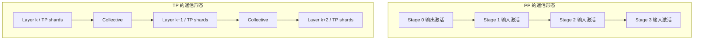

#### 2. 什么时候激活传输更便宜，什么时候 collective 更便宜

激活传输更便宜的典型场景是边界数少、hidden size 可控、collective 在当前拓扑下较差；collective 更便宜的典型场景则是节点内互连很强、TP group 不大且更看重单请求 latency。根因在于 TP 更依赖频繁、稳定、低延迟 collective，而 PP 更依赖较少次的大块边界传输。

#### 3. 节点内 / 节点间 PP 的通信成本差异

PP 边界若在节点内，通常代价较低。  
PP 边界若跨节点，则：

- 延迟更高
- 带宽更紧
- 尾部 jitter 更明显

这就是为什么现实部署里常见：

- 节点内用 TP
- 节点间用 PP

### 系统边界

这一节的公式最终只是在说明一件事：PP 先解决容量与部署问题，是否值得再看 wave 是否充足、stage 是否均衡、边界通信是否便宜，以及 decode 反馈闭环是否进入关键路径。只分析单步前向，不足以判断真实服务表现。

---

## vLLM 中 PP 的整体架构

### 总体架构图

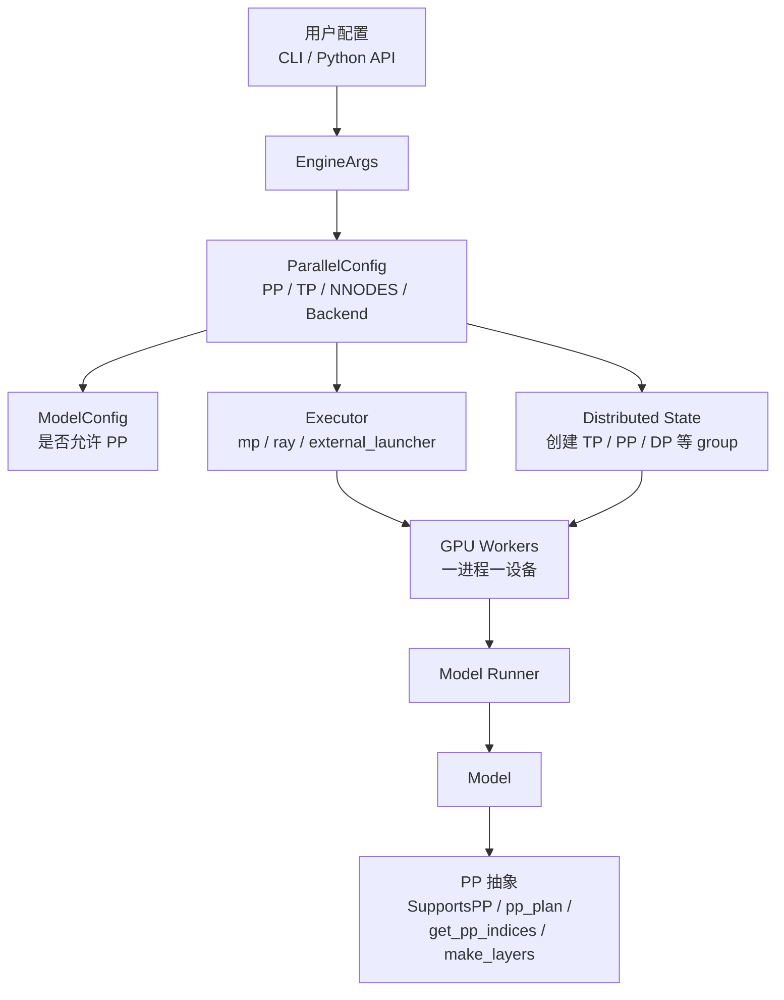

这一章只做源码落点映射，不再重复前文的抽象判断。  
把图里的链路压成一句话就是：

`pipeline_parallel_size -> ParallelConfig -> group / executor / worker -> model runner -> SupportsPP 模型实现`

也就是说，PP 在 vLLM 里首先是**进程与执行拓扑配置**，然后才是**层切分策略**。

### 单个 DP 副本内部的 PP + TP 拓扑

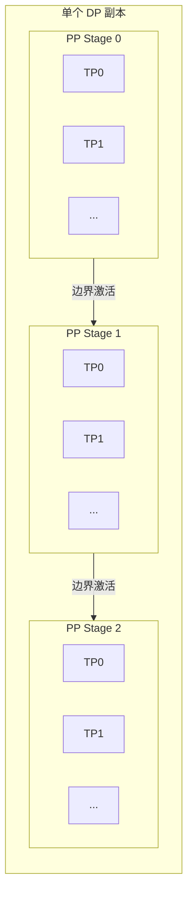

这张图只需要记住一件事：**PP 负责把模型切成串行 stage，TP 负责把单个 stage 内的算子继续切碎。**

### 控制流图

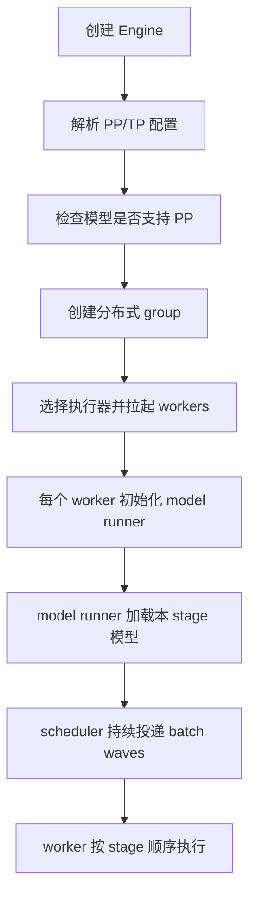

### 数据流图

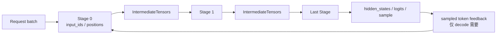

### 用户如何开启 PP

入口只有两个：Python API 的 `LLM(..., pipeline_parallel_size=...)`，以及 CLI 的 `--pipeline-parallel-size`。  
真正值得记的是它不会停在配置层，而会继续改写 `ParallelConfig`、rank 布局、worker 数量和模型分段边界。

### `pipeline_parallel_size` 如何影响 worker 数量、rank 组织与执行拓扑

在单个 DP 副本内部，可以把设备组织理解成 `PP x TP x PCP` 这样的多维展开；PP group 决定 stage 链，TP group 决定 stage 内部的 shard 关系。  
所以 `PP` 一变，跟着变化的不是“某几层归谁算”而已，而是整套 rank 拓扑。

### 单机 / 多机时执行器如何选型

源码里可选 `mp`、`ray`、`external_launcher`。  
这里不用展开默认分支，记住它们的作用就够了：执行器负责把上面的并行拓扑真正变成一组存活的 GPU workers。

### worker、model runner 和 model 各自负责什么

| 对象         | 责任                                                    |
| ------------ | ------------------------------------------------------- |
| worker       | 一进程一设备，管理生命周期、通信上下文和设备资源        |
| model runner | 组织本步输入，调用局部 forward，并处理图捕获/缓存等状态 |
| model        | 定义 PP 能力本身：层切分、首尾职责和 stage 边界协议     |

### 理论模型中的 stage、token flow 与 batch wave 在 vLLM 中的落点

| 理论概念     | 在 vLLM 中的落点                                           |
| ------------ | ---------------------------------------------------------- |
| stage        | 一个 PP rank 对应的一段执行单元                            |
| 层分区       | `get_pp_indices`、`make_layers`                            |
| 跨段数据     | `IntermediateTensors`                                      |
| batch wave   | engine / executor 推进的 scheduled batches                 |
| 首尾职责差异 | 模型里的 `is_first_rank` / `is_last_rank` 以及对应分支逻辑 |

---

## vLLM PP 源码深度解析

### 配置入口

#### 1. 哪些配置项直接决定 PP 行为

最核心的配置项只有六个：`pipeline_parallel_size`、`tensor_parallel_size`、`distributed_executor_backend`、`nnodes`、`node_rank`、`prefill_context_parallel_size`。  
其中真正的“总开关”是 `pipeline_parallel_size`：它既决定 stage 数，也会连带影响 world size、group 划分、执行器拓扑和层切分边界。

#### 2. 这些配置项如何从 CLI / Python API 传到运行时

传递链路可以压成 `LLM / CLI -> EngineArgs -> ParallelConfig -> ModelConfig / Executor / Worker`。  
源码上最重要的含义是：PP 从一开始就是系统级配置，不是模型局部 flag。

#### 3. 关键配置对象是什么

核心对象是 `ParallelConfig`。  
围绕 PP 的大部分判断——world size、backend、group 组织、batch wave 上限——都从这里继续下沉。

#### 4. PP 不是独立开关：兼容性与运行时约束矩阵

源码里真正值得注意的是 feature gate，而不是参数名本身：

| 条件 / 组合                                             | 运行时行为                        | 说明                              |
| ------------------------------------------------------- | --------------------------------- | --------------------------------- |
| 模型未实现 `SupportsPP`                                 | 直接报错                          | 模型必须显式给出 stage 边界协议   |
| `distributed_executor_backend` 不支持 PP                | 直接报错                          | 执行器必须真能拉起多 stage worker |
| `mm_tensor_ipc='torch_shm'` 且 `PP > 1`                 | 直接报错                          | 多模态张量共享与 PP 组合仍有限制  |
| `async_scheduling=True` 但 backend / speculative 不兼容 | 显式开启时报错                    | async 会改写 decode 反馈路径      |
| `--kv-transfer-config` 打开                             | PP 可运行，但部分 KV 管理逻辑降级 | 远端 KV 与本地 PP 不是完全正交    |
| `PP > 1` 或非 fullgraph 路径继续走 native `rms_norm`    | warning 或后续报错                | 编译/图分段与 PP 仍有实现级耦合   |

这一层看完，基本就能明白：源码里的 PP 不是“切层函数”而是“一组牵动 executor、group 和反馈链路的系统开关”。

### 分布式与 Group 组织

#### 1. TP group / PP group / world rank / local rank 是如何组织的

当前实现的核心抽象是：**每个 rank 同时属于多个 group**。  
其中 world rank / local rank 负责编号，PP group 决定你处在第几段，TP group 决定你在该段内部承担哪一份 shard。

#### 2. 谁负责创建 group

这些 group 由统一的 distributed 初始化逻辑一次性展开，再按不同维度投影出来；它不是“先建 PP 再补 TP”的串行流程。

#### 3. group 的划分逻辑是什么

更直观的理解方式，是把 rank 布局看成一个 `DP x PP x PCP x TP` 的多维张量；不同 group 的构建，本质上是在这个张量上沿不同维度切片。

#### 4. 这些 group 后续被谁使用

| group    | 后续用途                                  |
| -------- | ----------------------------------------- |
| PP group | stage 间 send/recv、首尾判断、sample 反馈 |
| TP group | stage 内部张量并行与 collective           |
| DP group | 副本级协同                                |

#### 5. 这些组织方式如何映射回理论中的 pipeline / stage 概念

理论模型里的 stage 到源码里就变成了“一个 PP rank 对应的一组执行单元”；若同时启用 TP，这组执行单元还会在内部再组成一个 TP group。

### 层切分（Layer Partition）

#### 1. 负责 PP 层切分（layer partition）的核心逻辑

核心逻辑很直接：按总层数与 `pp_size` 计算每段起止 layer，尽量均分，但对余数层做有偏置的分配。  
这个偏置不是小技巧，而是 vLLM 对“首尾通常更重”的工程化编码。

#### 2. 均匀切分 / 非均匀切分 / 余数层分配策略

自动策略不会机械地把余数从前往后塞，而是优先把余数留给中间段；`pp_size > 2` 且余数不大时，会尽量避开首尾。  
源码背后的判断很朴素：首段常带 embedding，末段常带 norm / lm_head / sampling。

#### 3. 手工指定 partition 的机制

当前实现也允许通过环境变量手工指定各 stage 层数，所以 layer partition 在工程上本来就是一个可调超参数。

#### 4. 例子：80 层模型的切分

##### PP = 3

- Stage 0：27 层
- Stage 1：27 层
- Stage 2：26 层

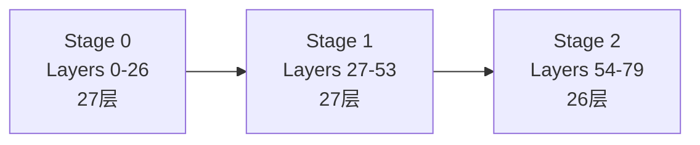

##### PP = 4

- Stage 0：20 层
- Stage 1：20 层
- Stage 2：20 层
- Stage 3：20 层

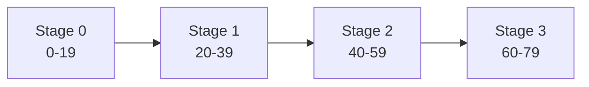

##### 82 层，PP = 4

- Stage 0：20 层
- Stage 1：21 层
- Stage 2：21 层
- Stage 3：20 层

这正体现了“余数优先给中间段”的默认偏置。

#### 5. 这种分配策略隐含了怎样的工程假设

这一策略隐含的假设只有一句话：**控制最大 stage 负载，比追求形式上的层数绝对均等更重要。**

### 模型接口契约

#### 1. `SupportsPP` 的意义

在 vLLM 中，一个模型支持 PP，不是“能在多卡上跑”这么泛。  
它至少要回答四个问题：

- 首段接什么输入
- 中间段接什么输入
- 非末段要输出什么中间态
- 末段要输出什么最终结果

这就是 `SupportsPP` 的意义：把这些结构知识显式暴露给 runtime。

#### 2. 一个模型要支持 PP，必须满足哪些 forward 语义

forward 语义也很清楚：首段从 `input_ids` / `inputs_embeds` 出发，中间段从 `intermediate_tensors` 出发，非末段返回新的 `IntermediateTensors`，末段返回最终输出。

#### 3. `IntermediateTensors` 的角色是什么

`IntermediateTensors` 可以直接理解成 **stage ABI**：它既是跨段协议，也是运行时中间态容器。  
对 Llama 这类模型，最常见的键就是 `hidden_states` 和 `residual`。

#### 4. `make_empty_intermediate_tensors` 是为了解决什么问题

`make_empty_intermediate_tensors` 解决的是 profiling、预分配固定地址 buffer、CUDA graph 稳定输入布局这些运行时问题。  
也正因为如此，`IntermediateTensors` 不能随意漂移；它不只是 dataclass，而是要同时满足可传输、可图捕获、可动态 shape 标注的边界对象。源码里它甚至还能携带 `kv_connector_output`，说明 stage 边界上传递的也可能是运行时状态，而不只是激活。

#### 5. 为什么“模型是否支持 PP”不是纯运行时（runtime）层就能自动解决

因为 runtime 并不知道 embedding 在哪里、lm_head 在哪里、residual 是否跨段、tied embedding 怎么处理、多模态输入在哪一段准备。  
这些都属于模型结构知识，所以 vLLM 的做法是显式声明，而不是自动猜。

### 模型实例化与缺层占位

#### 1. 只实例化本 stage 层、其余位置占位

vLLM 的做法是：每个 rank 仍保留“完整层序列”的外观，但只实例化本 stage 负责的层，其余位置用占位层补齐。  
这样既保住统一的模型结构和层编号，又让显存只为本 stage 的参数买单。

#### 2. `PPMissingLayer` 的角色

`PPMissingLayer` 可以理解成“结构上的空层”，作用是维持模块树、名称稳定性和 state dict 对齐。

#### 3. 这套设计为什么重要

它的重要性在于同时满足两件事：不为每个 PP rank 重写一套模型类，同时又让每个 rank 只持有自己那部分参数。

#### 4. 对 state dict 加载和代码复用的价值

因此权重加载、统一前向结构、attention/KV cache/层号映射这些逻辑都还能继续按原始层编号复用。

### 具体模型案例分析

这里用 Llama 做例子，只看最关键的 stage 职责分工。

#### 1. Llama 的 stage 职责划分

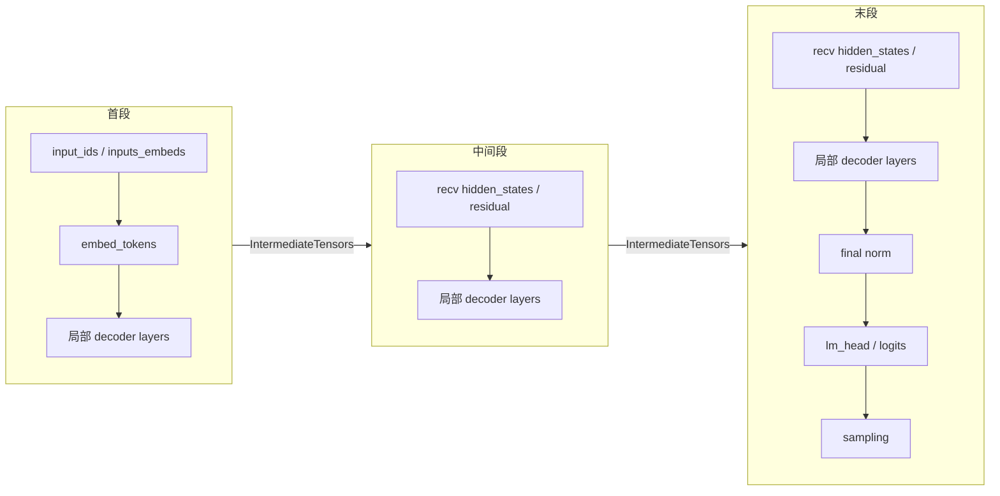

Llama 上的源码含义可以直接概括成三条：

1. 首段负责 embedding 和输入入口，中间段只消费上一段交来的中间态。
2. 末段负责 final norm、lm_head、logits，若 tied embedding 打开，首尾耦合还会更强。
3. `IntermediateTensors` 往往不只带一个张量，对 Llama 来说最典型的是 `hidden_states` 与 `residual`。

#### 2. 一个 token batch 如何从 stage0 流到最后 stage

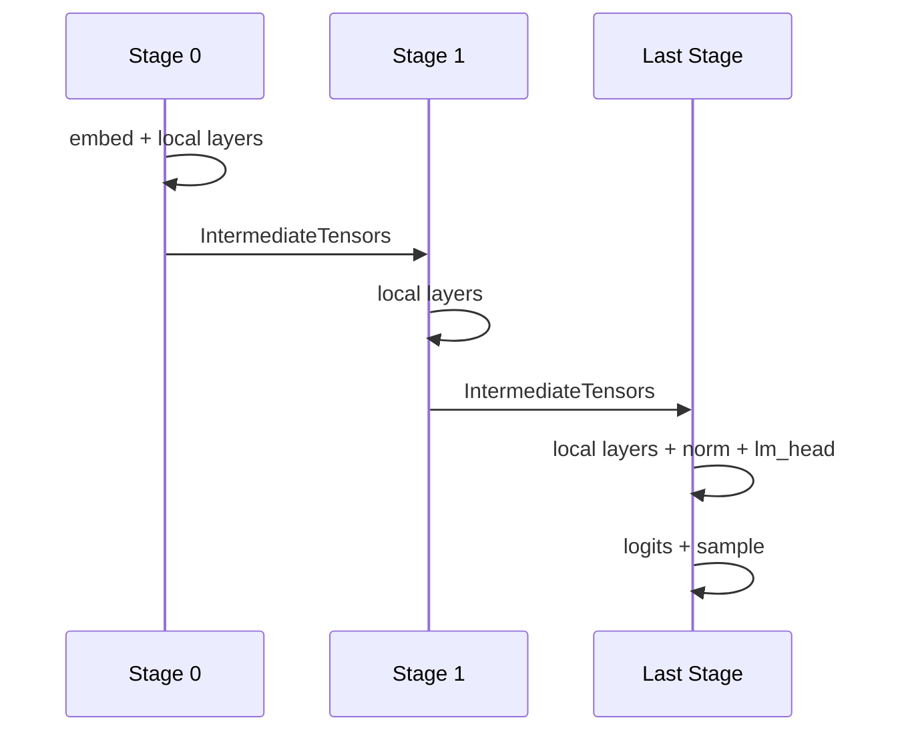

这个 case 的系统含义也就足够清楚了：首尾不对称来自模型结构本身，PP 运行时只能消费这套结构知识，不能替模型“猜出来”。

### 运行时执行路径

#### 1. 当前版本的运行时现实

当前仓库里同时存在默认主路径的 V1 GPU model runner，以及更偏 async-first 的 MRV2 路径。  
读源码时最好把“当前默认行为”和“正在演化的 async 方向”分开看。

#### 2. batch 在 PP 下是怎样流动的

worker 侧的主逻辑只有四步：非首段先 `recv`，然后本地 forward；非末段把新的 `IntermediateTensors` 继续 `send`；末段产出本步结果。

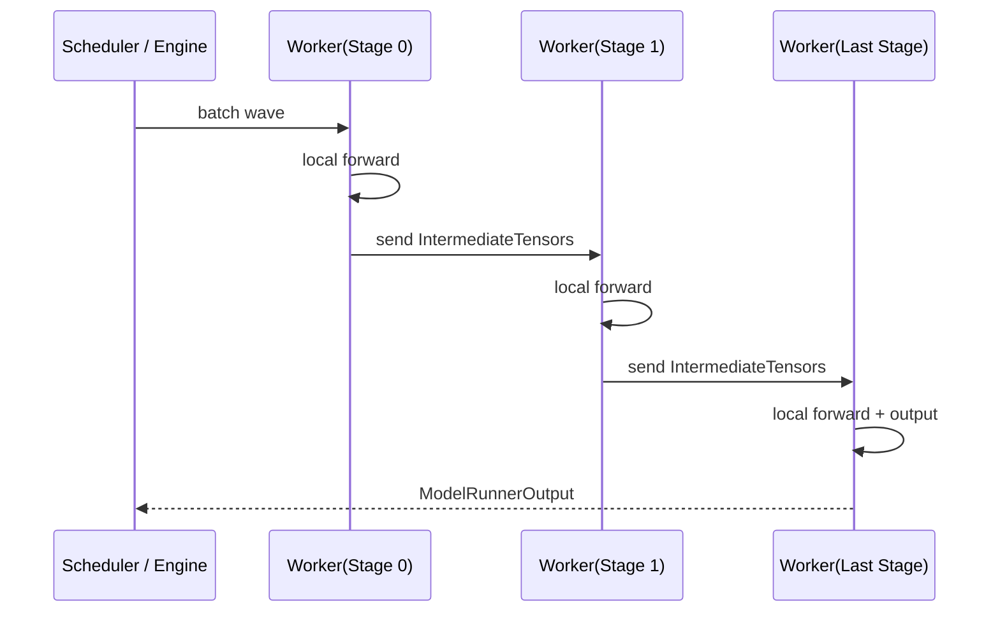

#### 3. prefill 的时序图

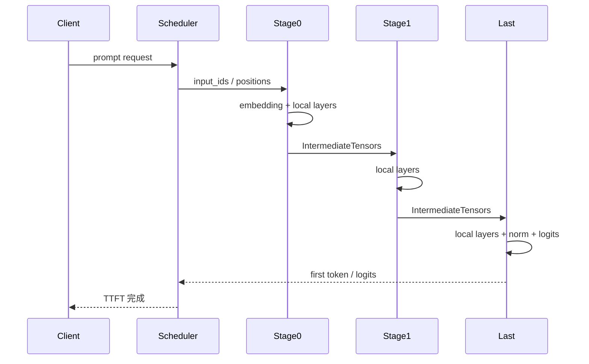

prefill 基本就是一次从头灌到尾的单向流水。

#### 4. decode 的两条真实时序路径

decode 真正要看的不是“最后段做 sample”，而是 sampled token 之后如何回到前段 worker。  
源码里至少要分清两条反馈路径，否则很容易把不同配置下的 `T_fb` 混成一项。

##### 非 async scheduling 下的 PP decode

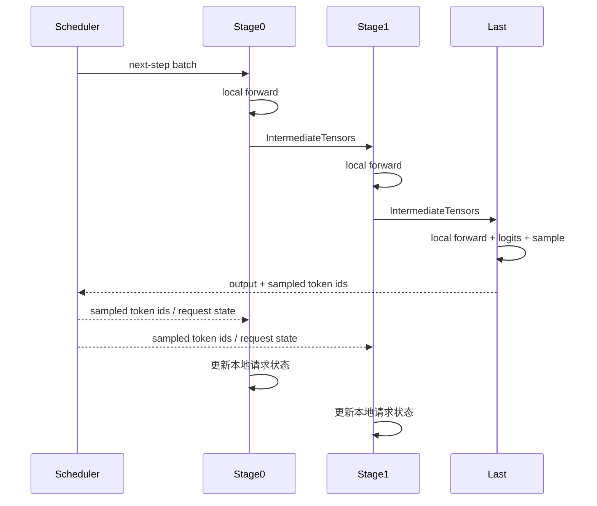

这里最后段不会直接把 sampled token 回送给前段，而是经由 scheduler / engine 中转；因此 `T_fb` 里会混入更多控制面和主机侧调度成本。

##### async scheduling 下的 PP decode

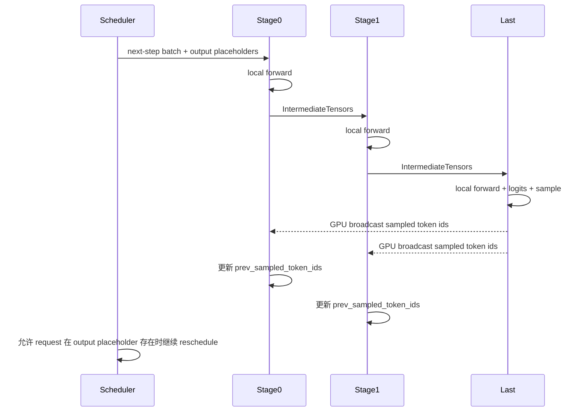

这里 sampled token 不再完全绕回 scheduler，而是由最后一个 PP rank 在 device group 上 broadcast，前段 worker 直接写回 `prev_sampled_token_ids`。  
所以更贴近源码的说法是：非 async PP 的反馈链偏 scheduler 回路，async PP 的反馈链偏 device-side broadcast；两者的 `T_fb` 组成并不相同。

##### `output placeholders` 的系统含义

`output placeholders` 是 async PP 能成立的关键：scheduler 先预留未来 token 位置，worker 再用真实 sampled token 回填。  
这带来了 `num_computed_tokens` 与 `num_output_placeholders` 的状态分离，本质上是一种 token-level credit 机制，让调度可以先于最终输出确认推进。

#### 5. PP 对 continuous batching 的影响

连续批处理把 PP 从“静态流水线问题”变成了“动态饱和问题”：每一步 wave 都可能不同，prefill / decode 交错，请求持续进出，stage 边界看到的是动态批形而不是固定 micro-batch。

#### 6. 是否存在按 PP size 并发多个 batch 波次的机制

有，但它的含义是“让多路 scheduled batches 同时占住不同 stage”，不是训练式固定 micro-batch 流水，而是为了减少 bubble 的多波次重叠。

#### 7. async scheduling 与当前实现的关系

vLLM 的总体方向越来越偏向 async-first，但当前默认路径仍带着不少历史兼容层；读这一段源码时不要把未来方向误当成当前默认行为。

#### 8. 为什么 decode 尤其容易暴露 pipeline 空泡、stage 尾延迟和调度约束

decode 会把真实关键路径放大出来：每步算量小、sample 固定在末段、反馈链必须闭环，stage 边界通信也更难隐藏。

---

## vLLM PP 的性能模型与工程取舍

### 1. 一个更贴近推理系统的 stage 时间模型

把 stage 时间写成

`T_s = T_layers,s + T_special,s + T_boundary,s + T_runtime,s`

就足够解释 vLLM 里的大部分性能现象：`T_layers,s` 是局部 block 计算，`T_special,s` 是 embedding / norm / lm_head / sample 这类首尾额外工作，`T_boundary,s` 是 send/recv 边界激活，`T_runtime,s` 则是调度、buffer copy、状态更新与图捕获配合。  
这也是为什么“层数均分”在这里从来不等于“stage 时间均分”。

### 2. stage 计算负载

真实负载除了 block 数，还会被 embedding、final norm、lm_head、多模态前处理、sample 回传和本地 KV 访存形态改写。  
所以 vLLM 的层切分策略主动把余数往中间段倾斜，并不是保守，而是为了降低最慢 stage 的出现概率。

### 3. stage 间激活传输

PP 的边界通信相对 TP 来说更粗、更少，这让它在弱互连下更有机会占优；但一旦单步算量很小，边界通信就会迅速显眼。  
因此 prefill 往往更能摊薄通信，而 decode 更容易把它暴露出来。

### 4. 流水线气泡

性能上最值得记的一句话是：**没有足够多的 wave 去填满流水线，PP 就只是在增加串行深度。**  
这也是为什么连续批处理、async scheduling 和多 wave 重叠在 vLLM 里不是配角，而是决定利用率的主体。

### 5. 首尾 stage 不均衡

首尾不均衡在 vLLM 里是结构事实，不是偶发噪声：首段偏输入侧，末段偏输出侧，中间段才最接近“纯 block 容器”。  
工程上真正该优化的是最慢 stage，而不是平均 stage，因此默认切分和手工 partition 都应围绕这个目标展开。

### 6. prefill / decode 瓶颈是否相同

不相同。  
prefill 更像大块计算问题，通信和 bubble 更容易被摊薄；decode 则更像关键路径问题，sample、反馈链和最慢 stage 都会直接映射到 TPOT。

### 7. PP 与 TP 组合时谁是主要通信瓶颈

完全取决于拓扑。  
强互连单机里，TP collective 往往仍可接受，此时 PP 的串行深度更醒目；跨节点或无 NVLink 时，TP 的高频 collective 更容易失控，PP 反而更可能是更稳的选择。

### 8. PP 对 KV cache、可服务并发、显存分布的影响

PP 的第一层收益是每卡权重减少，第二层收益才是 KV cache 余量、可服务并发和更高 batch 上限。  
但这类收益始终由最紧 stage 决定，所以“平均显存更松”不等于“系统上限真的更高”。

### 9. 在什么硬件拓扑下，PP 可能优于 TP

更典型的场景是无 NVLink、跨节点、模型很深且层切分自然、或者需要不均匀切分来适配资源的时候。

### 10. 在什么情况下，PP 只是“能跑起来”，但吞吐 / 延迟未必划算

如果模型只是刚好需要几张卡才能装下、负载以 decode 为主、末段显著偏重、stage 边界又跨慢链路，或者线上流量根本灌不满流水线，那么 PP 的价值通常只是“系统终于能跑”，而不是“吞吐 / 延迟已经最优”。

### 11. 单机多卡时的常见 PP / TP 组合

单机多卡的经验判断其实很简单：强互连机器优先 TP，必要时少量 PP；没有 NVLink 的机器里，PP 的吸引力会上升；层数与 GPU 数不整齐时，PP 也通常更灵活。

### 12. 多机多卡时的常见 PP / TP 组合

多机多卡里最常见的经验仍然是“节点内 TP、节点间 PP”，因为这通常最符合两类通信各自擅长的链路层级。

### 13. 为什么没有 NVLink 时 PP 可能更合适

因为 TP 对高频 collective 更敏感；没有 NVLink 时，这类集合通信更容易先变成瓶颈，而 PP 的边界激活传输有时反而更省。

### 14. 当模型层数与 GPU 数不能整除时，PP 的工程意义是什么

PP 的现实优势之一，就是允许不均匀切分和手工切分，让“不整齐的资源”仍然能被高效利用。

### 15. 为什么部署问题常常比单机基准测试（benchmark）更复杂

因为线上还有请求长度分布、尾延迟、TTFT SLA、突发流量和节点间 jitter。  
所以离线 benchmark 的最优点，通常只是部署决策的起点，而不是终点。

---

## 如何把性能模型落到指标与实验

### 1. 文中理论量分别对应哪些现成指标

vLLM 已经提供了不少可以和这些理论量对齐的现成指标。

| 理论量                          | 更接近的现成指标                                                                           | 应该怎么理解                                           |
| ------------------------------- | ------------------------------------------------------------------------------------------ | ------------------------------------------------------ |
| `TTFT`                          | `vllm:time_to_first_token_seconds`                                                         | 整条 prefill 链路一次跑穿后的首 token 延迟             |
| `TPOT`                          | `vllm:inter_token_latency_seconds`                                                         | decode 稳态下每个输出 token 的节拍                     |
| `T_queue`                       | `vllm:request_queue_time_seconds`                                                          | 请求进入 engine 后，在真正执行前等待了多久             |
| prefill / decode 成本拆分       | `vllm:request_prefill_time_seconds`、`vllm:request_decode_time_seconds`                    | 把 TTFT/TPOT 拆成更接近 phase 的时间块                 |
| KV 压力                         | `vllm:kv_cache_usage_perc`                                                                 | 判断 PP 是否只是让权重更薄，还是也真的提升了 KV 余量   |
| 流水线饱和程度 `U`              | `output_throughput`、`tokens/s/GPU`、`num_requests_running / waiting / swapped` 的联合观察 | `U` 不是单一指标，而是吞吐和队列状态共同反映的系统状态 |
| 拓扑影响下的通信代价 `rho_comm` | 不直接暴露为单一指标，需要通过不同 TP/PP 配置和不同链路上的 TPOT / 吞吐对比来反推          | 它更像“实验推断量”，不是“现成监控项”                   |

需要注意的是：  
`TTFT`、`TPOT`、`queue time`、`prefill/decode time` 并不是互相重复的指标，而是对应了本文前面公式里不同项的观测窗口。

### 2. 如何设计最小实验矩阵来识别 `U`、`gamma`、`rho_comm`、`T_fb`

可以用下面的最小实验矩阵来识别每个理论量。

| 目标                                           | 固定什么                   | 改什么                                                                   | 重点看什么                                  | 想识别的量                                 |
| ---------------------------------------------- | -------------------------- | ------------------------------------------------------------------------ | ------------------------------------------- | ------------------------------------------ |
| 判断流水线是否灌满                             | 模型、硬件、PP/TP 拓扑固定 | 扫描 `max_concurrency`、`max_num_batched_tokens`                         | `tokens/s/GPU`、TTFT、TPOT、running/waiting | `U` 与 fill/drain bubble                   |
| 判断 stage 是否均衡                            | 模型、硬件、PP size 固定   | 对比默认切分与 `VLLM_PP_LAYER_PARTITION` 手工切分                        | TPOT、TTFT、吞吐变化                        | `gamma`                                    |
| 判断 sampled token 反馈链是否已成瓶颈          | 模型、硬件、PP size 固定   | 对比 `async_scheduling` 关 / 开                                          | TPOT、queue time、decode time               | `T_fb` 的控制面占比                        |
| 判断拓扑是否更适合 PP 还是 TP                  | 总 GPU 数与模型固定        | 对比 `TP-only`、`PP-only`、`TP+PP`，并分别放在 NVLink 强与跨节点弱链路上 | `tokens/s/GPU`、TPOT、尾延迟                | `rho_comm` 与 topology sensitivity         |
| 判断 PP 带来的收益是“算得更快”还是“只是装得下” | 模型固定                   | 对比不同 PP size 下 KV cache usage、吞吐、TTFT                           | KV usage、吞吐、TTFT 同时看                 | capacity gain 与 performance gain 是否分离 |

如果把这张表和前面的性能模型一起看，就会发现：

- `U` 主要靠并发 sweep 识别
- `gamma` 主要靠 partition 对照识别
- `rho_comm` 主要靠拓扑对照识别
- `T_fb` 主要靠 async 与非 async decode 对照识别

这四类实验基本就能把本文前面的半定量模型落到真实系统上。

### 3. 一个经常被误解的事实：PP 不减少全局工作量

很多人对 PP 的一个直觉误区是：既然一层只放在一张卡上跑，那系统是不是“总共少算了一些东西”。  
对 decoder-only 推理来说，这个直觉通常是错的。

更接近事实的写法是 `F_global^PP(phi) ≈ F_global^1(phi)`，以及 `F_per_gpu^PP(phi) ≈ F_global^PP(phi) / P`。

也就是说：

- PP 通常不改变全局 FLOPs 量级
- PP 改变的是每张卡承担多少层、多少权重、多少局部访存

如果 stage 足够均衡，那么还可以近似写成 `B_read,per_gpu^PP(phi) ≈ B_read,global(phi) / P`。

这和仓库里的性能量纲测试是对得上的：  
在 `PP=4` 或 `PP=6` 的模拟配置（mock config）下，全局（global）与单 GPU（per-GPU）的 attention / FFN FLOPs 和读字节量都呈近似 `P` 倍关系。

这条事实非常重要，因为它直接改变我们对 PP 收益来源的理解：

- PP 的收益不是“系统少做了多少总计算”
- PP 的收益更像“每卡工作量被切薄后，系统能否用重叠、拓扑和更大的有效 batch 把 wall-clock 时间拉下来”

因此，PP 真正可能带来加速的来源通常只有四类：

- 原本模型装不下，现在能跑且能留出更多 KV 空间
- 每卡权重更薄后，可支持更高 batch / concurrency
- pipeline overlap 抵消了部分 stage 串行深度
- 在弱互连拓扑上，PP 的边界激活传输比 TP collective 更便宜

如果这四点都不成立，那么即使 `F_per_gpu` 下降，也不代表 `Latency` 或 `Throughput` 一定改善。

## vLLM PP 与 TP/DP/EP 的关系

### 一张对比图

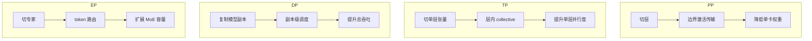

### 1. PP 与 TP 的关系

PP 与 TP 在 vLLM 中通常是组合关系，不是二选一。  
常见理解方式是：

- PP 负责把模型切成多个 stage
- TP 负责在每个 stage 内把单层算子再切开

### 2. PP 与 DP 的关系

DP 是“复制副本”，PP 是“切开单副本”。  
一个实用心智是：

- PP / TP 决定单副本如何装下、如何跑
- DP 决定系统有几个副本对外提供吞吐

### 3. PP 与 EP 的关系

EP 针对 MoE 专家扩展。  
PP 与 EP 并不是一个层面的事：

- PP 处理的是层切分
- EP 处理的是专家切分与 token 路由

### 4. 服务决策上如何理解这四者

一个更好的决策顺序是：

1. 先让单副本装下
2. 再让单副本在当前拓扑下尽量高效
3. 最后再决定副本数

从这个角度看：

- PP 常常先解决第 1 步
- TP 常常主要服务第 2 步
- DP 主要服务第 3 步

---

## 对推理 PP 的进一步思考

前面的分析可以收束成四个判断：

1. 推理 PP 的核心不是切层，而是运行时：wave 能不能灌满流水线、decode 的 sampled token 怎么反馈、scheduler 怎么处理动态批形、KV cache 怎么按 stage 分布，才真正决定效果。
2. PP 往往先解决部署与容量问题：模型装不下或拓扑不理想时，它先让单副本可运行；只有在通信便宜、stage 均衡、流水线饱和时，才进一步兑现吞吐收益。
3. 连续批处理和 decode 让推理 PP 明显不同于训练 PP：收益通常取决于最慢 stage、边界链路和反馈路径，而不只是模型大小或层数。
4. 服务侧最终看的仍是 TTFT、TPOT、吞吐和显存的联立；vLLM 围绕这些目标，才引入 `IntermediateTensors`、`make_empty_intermediate_tensors`、多 wave 重叠和 decode 反馈处理等设计。

---

## 参考资料

### 官方文档

- [并行与扩展（Parallelism and Scaling）](https://docs.vllm.ai/en/latest/serving/parallelism_scaling.html)
- [优化与调优（Optimization and Tuning）](https://docs.vllm.ai/en/latest/configuration/optimization.html)
- [架构概览（Architecture Overview）](https://docs.vllm.ai/en/latest/design/arch_overview.html)
- [Model Runner V2](https://docs.vllm.ai/en/latest/design/model_runner_v2.html)
- [指标（Metrics）](https://docs.vllm.ai/en/latest/design/metrics.html)
- [P2P NCCL Connector](https://docs.vllm.ai/en/latest/design/p2p_nccl_connector.html)
- [支持的模型（Supported Models）](https://docs.vllm.ai/en/latest/models/supported_models.html)

---

## 结语

如果只用一句话概括：

**vLLM 当前的 Pipeline Parallelism，本质上是一套“以模型结构知识定义 stage 边界、以服务运行时维持 pipeline 饱和、以硬件拓扑决定通信成本”的推理系统机制。它首先解决部署和容量问题，随后才在合适的负载与拓扑条件下转化为真实性能收益。**

因此，学习 vLLM 的 PP，最重要的不是死记某个类或某个函数，而是建立下面这条稳定心智链：`层切分 -> stage 边界 -> 中间态协议 -> batch waves -> decode 反馈 -> KV cache 分布 -> 服务指标取舍`。
