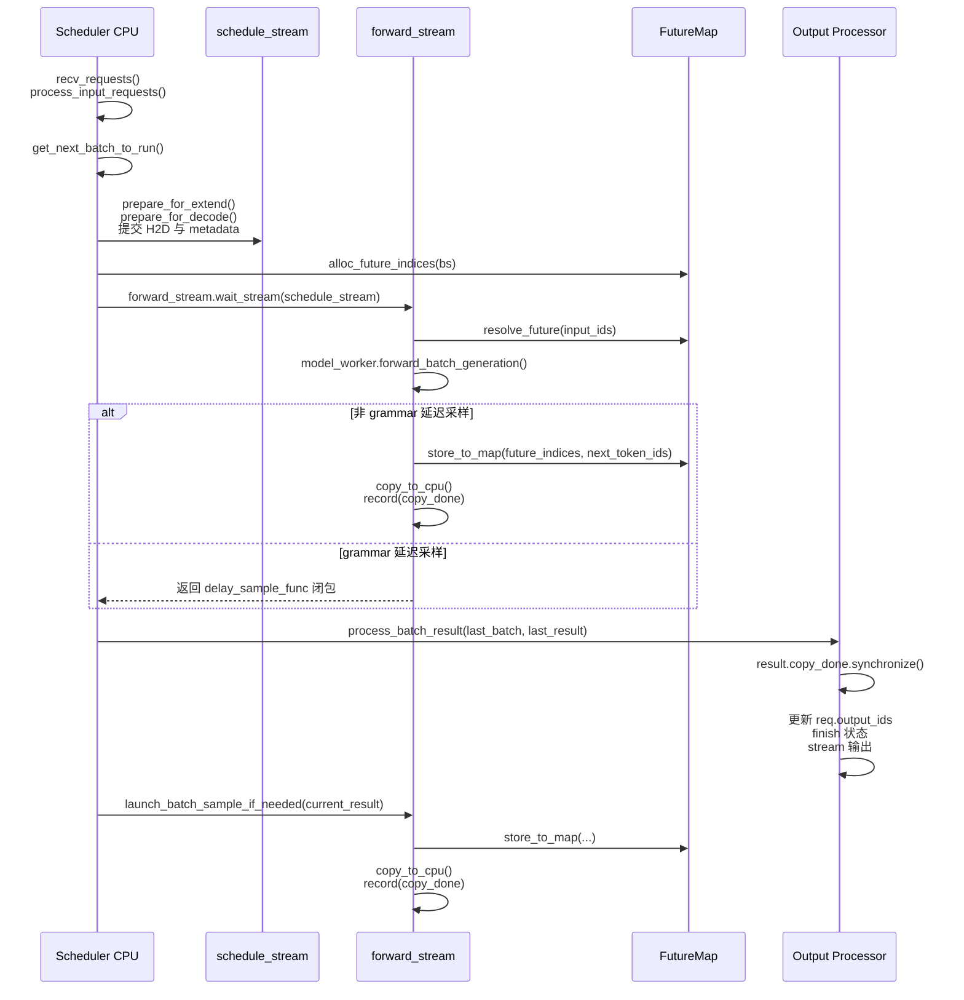
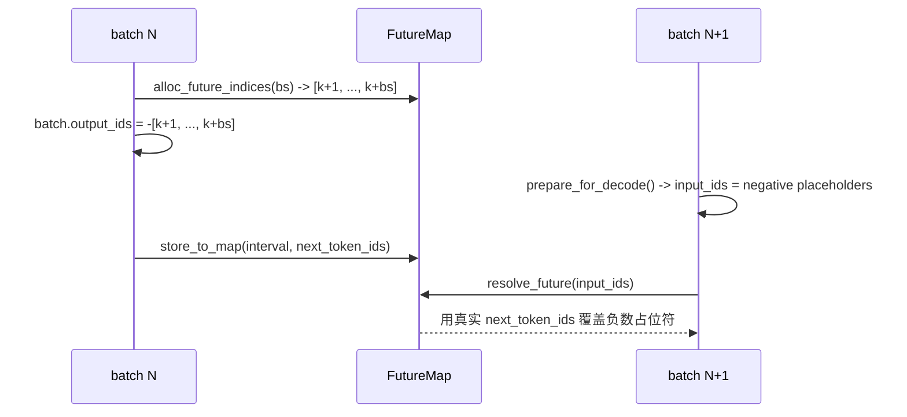
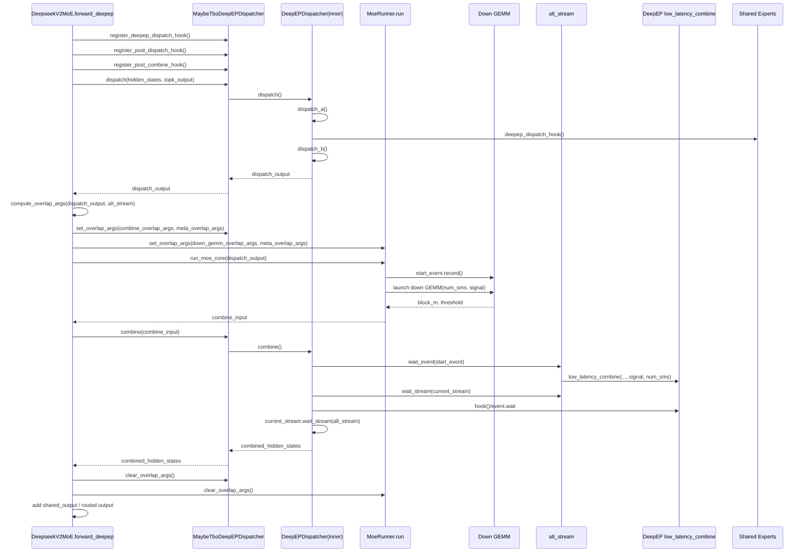
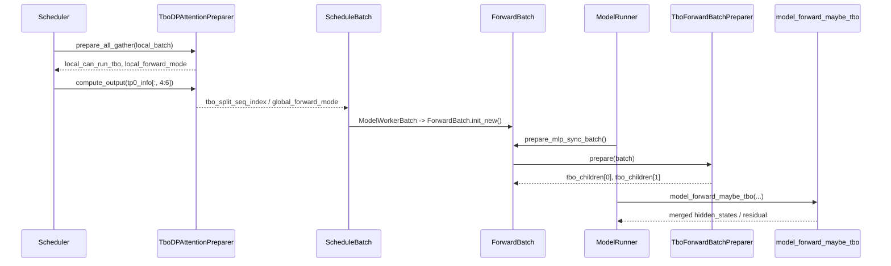
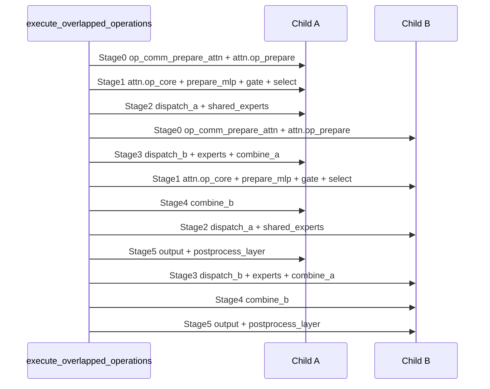
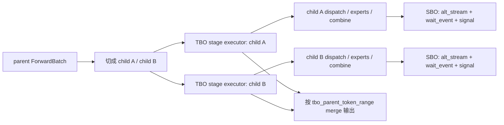

本文基于 SGLang 源码（commit `98f38b14d`）梳理 CPU-GPU Overlap、Single Batch Overlap（SBO）与 Two Batch Overlap（TBO）的真实实现。重点不是复述概念，而把这三层 overlap 分别落到 scheduler、model executor、attention backend、MoE dispatcher 与模型 `forward()` 的真实代码上。

整篇文章的阅读顺序按这个层次展开：

- 第三章先看默认就会走到的 CPU-GPU Overlap 基线。
- 第四章再下钻到单个 MoE layer 内部的 SBO。
- 第五章拆开 TBO 的 child batch、stage executor 和外围适配。
- 第六章最后做一次横向收束，解释 SBO 与 TBO 到底是什么关系。

## 结论摘要

1. 当前 SGLang 的 overlap 不是单一机制，而是三层可叠加的实现：scheduler 层的 CPU-GPU Overlap、单个 MoE layer 内部的 SBO，以及 child batch 级流水的 TBO。

2. CPU-GPU Overlap 是默认基线。它的本质不是多 stream 并行算两个 batch，而是把“当前批 GPU forward”和“上一批 CPU 结果处理”做成一拍延迟的流水线。

3. 这条基线链路的关键抓手是 `schedule_stream`、`forward_stream`、`result_queue`、`batch_record_buf` 和 `FutureMap`；其中 `FutureMap` 用“负数占位符 + 环形缓冲区”解决了 overlap 模式下下一拍 `input_ids` 先于真实 sampled token 落地的问题。

4. CPU-GPU Overlap 虽然默认开启，但并不是无条件生效。启动期和运行期都存在自动降级逻辑，PP、部分 speculative 路径、特定设备与部分模型组合都会让它退回串行。

5. SBO 不是把 batch 拆开，而是单个 MoE layer 内部的通信-计算重叠。它依赖 `compute_overlap_args()`、`alt_stream`、`wait_event`、`signal` 和 `SboFlags`，把 combine 与 down GEMM / shared experts 的执行关系显式编码出来。

6. TBO 也不是“再开一条 stream”。它的核心是把一个 parent batch 切成两个 child batch，再通过 `YieldOperation`、`_StageExecutor` 和 `delta_stages` 组织 stage 级交错执行。

7. 因为 TBO 切的是 `ForwardBatch`，而不是某个 layer 内中间 tensor，所以它会同时影响 attention backend、dispatcher、CUDA Graph 和 DP attention 一致性；它在实现层面是一个跨 scheduler、model executor 与 MoE dispatcher 的系统级特性。

8. SBO 和 TBO 可以叠加，但它们不是同一层优化。最准确的理解方式是：L1 用来隐藏宿主调度与结果处理，L3 用来搭 child batch 流水，L2 再嵌在某个 child 的 MoE layer 内继续压榨通信-计算重叠。

---

## 一、概述

先把全文地图立起来。当前源码里的 overlap 不是一个开关对应一套实现，而是三层不同粒度的机制；它们既不是完全替代关系，也不是总会同时出现，而是在满足各自前提时可以逐层叠加。

| 层次   | 名称                       | 这一层真正重叠什么                                                   | 默认状态     | 主要抓手                                                         | 对应章节 |
| ------ | -------------------------- | -------------------------------------------------------------------- | ------------ | ---------------------------------------------------------------- | -------- |
| **L1** | CPU-GPU Overlap Schedule   | 当前批 GPU forward 与上一批 CPU 结果处理                             | **默认开启** | `schedule_stream`、`forward_stream`、`result_queue`、`FutureMap` | 第三章   |
| **L2** | Single Batch Overlap (SBO) | 单个 MoE layer 内部的 combine 通信与 down GEMM / shared experts 计算 | 默认关闭     | `compute_overlap_args()`、hook、`alt_stream`、`signal`           | 第四章   |
| **L3** | Two Batch Overlap (TBO)    | 两个 child batch 在 decoder layer 级别的 stage 交错执行              | 默认关闭     | `ForwardBatch.tbo_*`、`YieldOperation`、`_StageExecutor`         | 第五章   |

如果把三层都打开，并且当前模型 / batch / backend 也满足对应前提，那么它们的关系更接近下面这张“理解上的包裹图”：

```text
┌─────────────────────────────────────────────────────┐
│  L1: CPU-GPU Overlap (Scheduler 级别)                │
│  ┌───────────────────────────────────────────────┐  │
│  │  L3: TBO (Forward 内部，child batch 级流水)    │  │
│  │  ┌─────────────────────────────────────────┐  │  │
│  │  │  L2: SBO (MoE layer 内部，stream 级别)   │  │  │
│  │  └─────────────────────────────────────────┘  │  │
│  └───────────────────────────────────────────────┘  │
└─────────────────────────────────────────────────────┘
```

这篇文档之所以要把三层分开讲，是因为它们关心的对象根本不同：

- 第三章讲的是 scheduler 和宿主侧流水，是默认基线。
- 第四章讲的是单个 MoE layer 内部的临时状态，例如 `dispatch_output`、`wait_event`、`signal`。
- 第五章讲的是 child batch 元数据，例如 `tbo_children`、`tbo_parent_token_range`、`tbo_padded_len`。
- 第六章最后再把 SBO 与 TBO 放回同一张坐标系里比较，避免把它们误认为同一种优化。

如果只关心默认就会走到的 overlap 主路径，先读第三章即可；如果关心 DeepSeek / Qwen3 / MiMo 这类 MoE 模型里通信和计算到底怎么互相穿插，再继续读第四、五、六章。

---

## 二、配置与启用方式

这一章只回答两个问题：

1. 用户能通过哪些开关表达“我想打开哪层 overlap”。
2. 源码还会在哪些地方二次判定“这个开关这次能不能真正生效”。

要先分清一件事：对 SGLang 来说，`server_args` 更像是“声明意图”，并不等于功能一定会在当前模型、当前 batch、当前 backend 上真正跑起来。

### 2.1 Server Args 配置（`python/sglang/srt/server_args.py`）

最外层的用户开关只有四个：

```python
disable_overlap_schedule: bool = False          # 禁用调度层 overlap（默认开启）
enable_two_batch_overlap: bool = False           # 启用 TBO
enable_single_batch_overlap: bool = False        # 启用 SBO
tbo_token_distribution_threshold: float = 0.48   # TBO 拆分平衡阈值（控制 two-chunk split）
```

把它们翻译成“用户意图”和“真实含义”更清楚：

| 配置项                             | 用户表达的意图                     | 默认值  | 还需要额外满足什么                                                                |
| ---------------------------------- | ---------------------------------- | ------- | --------------------------------------------------------------------------------- |
| `disable_overlap_schedule`         | 关闭 CPU-GPU Overlap 基线          | `False` | 即使不主动关闭，启动期和运行期也可能被源码自动禁用                                |
| `enable_single_batch_overlap`      | 尝试打开 SBO                       | `False` | 需要走到支持的 MoE 路径，而且后端要支持对应的 overlap 模式                        |
| `enable_two_batch_overlap`         | 尝试打开 TBO                       | `False` | 需要 `moe_a2a_backend != "none"`，且本轮 batch 能算出合法的 `tbo_split_seq_index` |
| `tbo_token_distribution_threshold` | 控制 TBO 是否退化到 two-chunk 拆分 | `0.48`  | 只在 TBO 的 extend 拆分逻辑里生效                                                 |

这里最值得提前记住的一点是：`enable_two_batch_overlap=True` 只是“允许进入 TBO 决策链”，并不等于每一轮 batch 都一定能跑 TBO；真正能不能跑，要到第五章里的 scheduler / `ForwardBatch` 准备阶段才能定下来。

### 2.2 环境变量

环境变量大多不是“新开一层 overlap”的总开关，而是对现有路径做更细的行为修正：

| 环境变量                                              | 默认值                 | 影响范围         | 说明                                                            |
| ----------------------------------------------------- | ---------------------- | ---------------- | --------------------------------------------------------------- |
| `SGLANG_DISABLE_CONSECUTIVE_PREFILL_OVERLAP`          | `false`                | CPU-GPU Overlap  | 禁止连续两个 prefill 之间继续做 overlap，优先优化第一批 TTFT    |
| `SGLANG_DEEPEP_LL_COMBINE_SEND_NUM_SMS`               | Blackwell: 32, 其他: 3 | SBO              | 控制 SBO combine 通信侧默认拿走多少个 SM                        |
| `SGLANG_BLACKWELL_OVERLAP_SHARED_EXPERTS_OUTSIDE_SBO` | `false`                | SBO              | 在 Blackwell 路径下把 shared experts 放到 SBO 外部的备用 stream |
| `SGLANG_TBO_DEBUG`                                    | `false`                | TBO              | 打开 TBO 相关调试日志                                           |
| `SGLANG_OPERATIONS_ENABLE_PROFILE`                    | `0`                    | TBO / operations | 打开 operations 层 NVTX profiling                               |
| `SGLANG_NPU_USE_MULTI_STREAM`                         | —                      | NPU 路径         | NPU 上的多 stream 行为开关                                      |

如果把这一章压缩成一句话，可以这样记：

- `server_args` 决定“要不要尝试开启某层 overlap”。
- 环境变量决定“已经打开的路径具体怎么跑”。
- 真正的运行结果还要再经过后面各章会展开的源码判定链。

---

## 三、CPU-GPU Overlap Schedule（基线 Overlap）

**核心源码**：

- `python/sglang/srt/managers/scheduler.py`
- `python/sglang/srt/managers/overlap_utils.py`
- `python/sglang/srt/managers/schedule_batch.py`
- `python/sglang/srt/managers/tp_worker.py`
- `python/sglang/srt/managers/utils.py`
- `python/sglang/srt/managers/scheduler_output_processor_mixin.py`

### 3.1 这层 overlap 到底在重叠什么

CPU-GPU Overlap Schedule 不是“把一个 batch 拆成两个 GPU stream 并行算”，而是把 **同一调度线程上的两类工作** 做成一拍延迟的流水线：

1. `schedule_stream` 上提交下一批次需要的 H2D/元数据准备。
2. `forward_stream` 上执行当前批次 forward。
3. CPU 同步处理上一批次已经完成的结果。

稳态下它形成的是一个 **深度为 1 的两阶段流水线**：

```text
迭代 N:
  CPU: schedule(batch N) + process_result(batch N-1)
  GPU:               forward(batch N)
```

和普通串行循环相比，差别不在“做了更多 GPU 并发”，而在于：**上一批结果处理被推迟到下一批 forward 期间执行**，从而隐藏 CPU 侧的采样后处理、请求状态更新、流式输出等开销。

### 3.2 入口：Scheduler 如何切到 overlap 事件循环

真正决定是否进入 overlap 主循环的是 `dispatch_event_loop()`：

```python
def run_event_loop(self) -> None:
    # schedule_stream 用来承载调度阶段提交的异步 GPU 准备工作。
    self.schedule_stream = self.device_module.Stream(priority=0)
    if self.device == "cpu":
        # CPU 模式下没有真实的设备流同步，覆写成空操作即可。
        self.schedule_stream.synchronize = lambda: None
    # 整个 scheduler 事件循环都运行在 schedule_stream 上下文中。
    with self.device_module.StreamContext(self.schedule_stream):
        dispatch_event_loop(self)


def dispatch_event_loop(scheduler: Scheduler):
    # 按运行模式分发到不同事件循环；overlap 主路径在这里切入。
    if disaggregation_mode == DisaggregationMode.NULL:
        if scheduler.enable_pdmux:
            scheduler.event_loop_pdmux()
        elif server_args.pp_size > 1:
            scheduler.event_loop_pp()
        elif scheduler.enable_overlap:
            scheduler.event_loop_overlap()
        else:
            scheduler.event_loop_normal()
```

这里最关键的实现细节是：**整个 scheduler event loop 都运行在 `with StreamContext(self.schedule_stream)` 的上下文中**。这意味着后续 `prepare_for_extend()`、`prepare_for_decode()` 里那些 `tensor(...).to(device, non_blocking=True)`、KV slot 分配、部分 GPU metadata 准备操作，都是作为 `schedule_stream` 上的异步工作被提交出去的。

所以：

- `schedule_stream` 不是“CPU 线程”。
- 它是 **CPU 调度阶段所发出的 GPU-side 准备工作** 的承载 stream。
- `forward_stream.wait_stream(schedule_stream)` 才是把“调度阶段准备完成”传给真正 forward 的同步点。

### 3.3 初始化：Overlap 依赖哪些运行时状态

`Scheduler.init_overlap()` 只做三件事：

```python
def init_overlap(self):
    # 初始化与当前 device 绑定的 stream 上下文。
    self.device_module = torch.get_device_module(self.device)

    self.forward_stream_ctx = self.device_module.stream(self.forward_stream)
    self.copy_stream = self.device_module.Stream()
    self.copy_stream_ctx = self.device_module.stream(self.copy_stream)

    if not self.enable_overlap:
        # overlap 关闭时无需维护 future token 映射。
        self.future_map = None
        return

    # overlap 开启后，FutureMap 负责解析“未来 token 占位符”。
    self.future_map = FutureMap(
        self.max_running_requests,
        self.chunked_prefill_size,
        self.model_config.context_len,
        self.device,
        self.spec_algorithm,
    )
    # 保留最近两个 worker batch 的 Python 引用，避免底层 tensor 被过早回收。
    self.batch_record_buf = [None] * 2
    self.batch_record_ct = 0
```

这里真正影响 CPU-GPU overlap 主链路的是四个对象：

| 对象                       | 所在位置      | shape / 类型                   | 作用                                                                                       | 何时使用                      |
| -------------------------- | ------------- | ------------------------------ | ------------------------------------------------------------------------------------------ | ----------------------------- |
| `schedule_stream`          | `Scheduler`   | CUDA stream                    | 承载调度阶段产生的 H2D / GPU metadata 准备                                                 | 整个 event loop 生命周期      |
| `forward_stream`           | `ModelRunner` | CUDA stream                    | 承载真实模型 forward 和 delayed sample                                                     | 每个 batch forward            |
| `future_map.token_ids_buf` | `FutureMap`   | `[future_buffer_len]`, `int64` | 保存“上一拍才会产出的真实 token id”                                                        | decode 下一拍开始前解析占位符 |
| `batch_record_buf`         | `Scheduler`   | 长度 2 的 Python list          | 保持最近两个 `ModelWorkerBatch` 的 Python 引用，避免其底层 GPU tensor 被 torch GC 提前回收 | overlap forward 期间          |

`batch_record_buf` 虽然看起来“很土”，但它非常关键。因为 overlap 模式下，调度线程会在下一拍继续改写原始 `ScheduleBatch`，如果没有额外引用，某些只被 `ModelWorkerBatch` 持有的 GPU tensor 可能在 forward 尚未结束时就失去 Python 引用，进而被 allocator 回收。

### 3.4 调度阶段到底准备了哪些张量

这一层 overlap 能成立，前提是下一批 batch 的 GPU 输入必须在上一批结果处理之前就准备好。SGLang 通过 `ScheduleBatch.prepare_for_extend()` 和 `prepare_for_decode()` 完成这件事。

#### 3.4.1 extend / prefill 路径

```python
def prepare_for_extend(self):
    # 进入 extend/prefill 模式，先从请求里整理 packed token 与长度信息。
    self.forward_mode = ForwardMode.EXTEND

    input_ids = [r.fill_ids[len(r.prefix_indices):] for r in reqs]
    extend_num_tokens = sum(len(ids) for ids in input_ids)
    seq_lens = [len(r.fill_ids) for r in reqs]
    prefix_lens = [len(r.prefix_indices) for r in reqs]
    extend_lens = [r.extend_input_len for r in reqs]

    # 异步 H2D，把输入 token 和长度元数据提前放到 schedule_stream。
    input_ids_tensor = torch.tensor(
        list(chain.from_iterable(input_ids)), dtype=torch.int64, pin_memory=_pin
    ).to(self.device, non_blocking=True)
    seq_lens_tensor = torch.tensor(seq_lens, dtype=torch.int64, pin_memory=_pin).to(
        self.device, non_blocking=True
    )

    # GPU 侧和 CPU 侧各保留一份长度信息，后续分别给 forward/backend 与宿主后处理使用。
    self.prefix_lens = prefix_lens
    self.extend_lens = extend_lens
    self.seq_lens = seq_lens_tensor
    self.seq_lens_cpu = torch.tensor(seq_lens, dtype=torch.int64)
    self.extend_num_tokens = extend_num_tokens

    # 提前为本轮 extend 分配 KV cache 写入位置和 req pool 槽位。
    out_cache_loc, req_pool_indices_tensor, req_pool_indices = alloc_for_extend(self)

    self.input_ids = input_ids_tensor
    self.req_pool_indices = req_pool_indices_tensor
    self.out_cache_loc = out_cache_loc
    # sampling_info 也在调度阶段准备好，forward 可直接消费。
    self.sampling_info = SamplingBatchInfo.from_schedule_batch(
        self, self.model_config.vocab_size
    )
```

这一步产出的关键数据及 shape：

| 字段               | shape                         | 含义                                      |
| ------------------ | ----------------------------- | ----------------------------------------- |
| `input_ids`        | `[sum(extend_lens)]`, `int64` | packed 的 extend token 序列               |
| `seq_lens`         | `[bs]`, `int64`               | 每个 request 当前总长度                   |
| `seq_lens_cpu`     | `[bs]`, `int64` on CPU        | CPU 侧长度镜像，后处理和部分 backend 需要 |
| `out_cache_loc`    | `[sum(extend_lens)]`, `int64` | 新 token 对应 KV cache 写入位置           |
| `req_pool_indices` | `[bs]`, `int64`               | request 在 req pool 中的槽位              |

#### 3.4.2 decode 路径

decode 路径最关键的地方在于，它会把上一拍 `run_batch()` 写回的 `batch.output_ids` 直接转成下一拍的 `input_ids`：

```python
def prepare_for_decode(self):
    # decode 阶段会直接消费上一拍留下的 output_ids。
    self.forward_mode = ForwardMode.DECODE

    if self.sampling_info.penalizer_orchestrator.is_required:
        if self.enable_overlap:
            # overlap 下真实 sampled token 还没落回 batch，只能先从 req 状态里取“已确认”的最后一个 token。
            delayed_output_ids = torch.tensor(
                [
                    req.output_ids[-1] if len(req.output_ids)
                    else req.origin_input_ids[-1]
                    for req in self.reqs
                ],
                dtype=torch.int64,
                device=self.device,
            )
            self.sampling_info.penalizer_orchestrator.cumulate_output_tokens(
                delayed_output_ids
            )
        else:
            self.sampling_info.penalizer_orchestrator.cumulate_output_tokens(
                self.output_ids.to(torch.int64)
            )

    # 下一拍 decode 的 input_ids 直接来自上一拍 output_ids；它此时可能仍是负数占位符。
    self.input_ids = self.output_ids
    self.output_ids = None
    # decode 每个 request 本轮只写 1 个新 token 的 KV 位置。
    self.out_cache_loc = alloc_for_decode(self, token_per_req=1)

    if self.enable_overlap:
        # overlap 下长度需要先行 +1，与“未来 token”保持一致。
        self.seq_lens = self.seq_lens + 1
        self.seq_lens_cpu = self.seq_lens_cpu + 1
        self.orig_seq_lens = self.orig_seq_lens + 1
```

decode 下关键字段 shape：

| 字段            | shape                     | 含义                                                     |
| --------------- | ------------------------- | -------------------------------------------------------- |
| `input_ids`     | `[bs]`, `int64`           | 每个 request 下一步 decode 需要 embedding 的 1 个 token  |
| `output_ids`    | `[bs]`, `int64` 或 `None` | overlap 中它在上一拍结束时可能暂时是“负数 future 占位符” |
| `out_cache_loc` | `[bs]`, `int64`           | 每个 request 本轮 decode 新写入的 1 个 KV 位置           |

这也是 overlap 机制的关键转折点：**在 overlap 模式下，decode 的 `input_ids` 允许暂时是负数占位符，而不是已经落地的真实 token id。**

### 3.5 主循环：真实的 overlap 执行顺序

`event_loop_overlap()` 是核心：

```python
def event_loop_overlap(self):
    # 队列里保存“上一拍 launch 的 batch 快照 + 结果”。
    self.result_queue = deque()

    def pop_and_process():
        # 处理队首上一拍结果。
        tmp_batch, tmp_result = self.result_queue.popleft()
        self.process_batch_result(tmp_batch, tmp_result)

    while True:
        # 1) 接收新请求并更新调度状态。
        recv_reqs = self.recv_requests()
        self.process_input_requests(recv_reqs)
        if self._engine_paused:
            continue

        # 2) 选择下一批，并判断本轮是否必须退回串行。
        batch = self.get_next_batch_to_run()
        self.cur_batch = batch
        disable_overlap_for_batch = self.is_disable_overlap_for_batch(batch)

        if disable_overlap_for_batch:
            # 特殊场景下先清掉上一拍，避免和当前 batch 发生顺序冲突。
            pop_and_process()

        if batch:
            # 3) 先 launch 当前批次，再把快照连同结果压入队列。
            batch_result = self.run_batch(batch)
            self.result_queue.append((batch.copy(), batch_result))
        else:
            batch_result = None
            self.cancel_bubble_timer()

        if self.last_batch:
            if not disable_overlap_for_batch:
                # 4) 稳态下在当前 forward 期间处理上一拍结果，实现 CPU/GPU overlap。
                pop_and_process()
        elif batch is None:
            self.self_check_during_idle()

        if self.is_generation:
            # grammar 延迟采样必须放在上一拍结果处理之后。
            self.launch_batch_sample_if_needed(batch_result)

        # 5) 把当前 batch 记成“上一拍”，供下一轮消费。
        self.last_batch = batch
```

这个循环有几个非常容易误读、但很关键的细节：

1. `result_queue` 虽然是 `deque`，但在普通 overlap 稳态下队列深度基本只有 1。
2. 队列里保存的是 `(batch.copy(), batch_result)`，不是原始 `batch`。
3. “当前批次 launch” 总是先发生，“上一批结果处理” 后发生，因此 CPU 处理能压在 GPU forward 下面。
4. `launch_batch_sample_if_needed()` 被刻意放在 `process_batch_result()` 之后，因为 grammar 约束场景需要先让上一批更新 grammar 状态。

对应的稳态时序如下：



### 3.6 为什么队列里放的是 `batch.copy()`，不是原 batch

这是 overlap 正确性的另一个关键点。

`get_next_batch_to_run()` 会在下一轮一开始就直接修改 `self.last_batch`：

```python
def get_next_batch_to_run(self) -> Optional[ScheduleBatch]:
    if self.last_batch and self.last_batch.forward_mode.is_extend():
        # extend batch 可能会在下一轮开头继续被过滤或并入 running_batch。
        self.last_batch.filter_batch(
            chunked_req_to_exclude=list(chunked_req_to_exclude)
        )
        if not self.last_batch.is_empty():
            if self.running_batch.is_empty():
                self.running_batch = self.last_batch
            else:
                self.running_batch.merge_batch(self.last_batch)
```

而 `ScheduleBatch.copy()` 不是深拷贝；它做的是一个**字段裁剪后的结构快照**：

- 只保留 `process_batch_result()` 真正会访问的那部分字段。
- 对 `reqs` 这个 list 容器做一层 `reqs[:]`，切断和原 batch 在“请求列表结构”上的共享。
- 但 list 里的 `Req` 对象本身并不会复制，仍然是同一批真实请求对象。

源码里也明确写了这一点：

```python
def copy(self):
    # 这里只保留 process_batch_result() 真正会访问到的字段。
    # 对 reqs 列表做浅拷贝，避免原 batch 上的原地修改（如 filter_batch/merge_batch）
    # 污染这份快照；Req 对象本身仍与原 batch 共享。
    return ScheduleBatch(
        reqs=self.reqs[:],
        req_to_token_pool=self.req_to_token_pool,
        req_pool_indices=self.req_pool_indices,
        model_config=self.model_config,
        forward_mode=self.forward_mode,
        out_cache_loc=self.out_cache_loc,
        return_logprob=self.return_logprob,
        spec_algorithm=self.spec_algorithm,
        seq_lens_cpu=self.seq_lens_cpu,
        enable_overlap=self.enable_overlap,
        prefill_stats=self.prefill_stats,
    )
```

这么做的原因是：

- 原始 `last_batch` 在下一轮调度时会被 `filter_batch()`、`merge_batch()`、`prepare_for_decode()` 原地修改。
- 结果处理必须看到“launch 当时的 batch 结构和 req 顺序”，不能被后续调度污染。
- 但结果处理又必须回写真实 `Req`，例如更新 `req.output_ids`、finish 状态、grammar 状态、stream 输出等；因此这里**不能**深拷贝 `Req`。
- 因而 overlap 队列里放的不是一个“完全隔离的深拷贝 batch”，而是一个“batch 结构快照 + 真实 req 引用”。

### 3.7 `FutureMap`：负数占位符是怎么工作的

这是 CPU-GPU Overlap Schedule 最核心的部分。

#### 3.7.1 `FutureMap` 的真实结构

```python
@dataclass
class FutureIndices:
    indices: torch.Tensor
    interval: Optional[slice] = None


class FutureMap:
    def __init__(self, max_running_requests, chunked_prefill_size,
                 context_len, device, spec_algo=None):
        # future_ct 是环形分配指针，指向下一段 future 槽位。
        self.future_ct = 0
        self.device = device
        self.spec_algo = spec_algo

        # chunked prefill 会让同一 request 同时挂起多个 future token，先估算最坏 chunk 数。
        max_num_chunks = (
            (context_len + chunked_prefill_size - 1) // chunked_prefill_size
            if chunked_prefill_size else 0
        )
        # future_limit 是可轮转的逻辑槽位数；buffer_len 额外留出回旋空间。
        self.future_limit = max_running_requests * (3 + max_num_chunks)
        self.future_buffer_len = self.future_limit + 2 * max_running_requests

        if self.spec_algo.is_none():
            # 非 speculative 路径只需要一个 token id 环形缓冲区。
            self.token_ids_buf = torch.empty(
                (self.future_buffer_len,), dtype=torch.int64, device=self.device
            )

    def alloc_future_indices(self, bs: int) -> FutureIndices:
        # 为当前 batch 分配连续 future 槽位，并推进环形指针。
        cur_future_ct = self.future_ct
        self.future_ct = (cur_future_ct + bs) % self.future_limit
        start = cur_future_ct + 1
        end = cur_future_ct + 1 + bs
        indices = torch.arange(start, end, dtype=torch.int64, device=self.device)
        return FutureIndices(indices=indices, interval=slice(start, end))

    def resolve_future(self, model_worker_batch: ModelWorkerBatch):
        # forward 前原地解析负数占位符，把它们替换成真实 token。
        _resolve_future_token_ids(model_worker_batch.input_ids, self.token_ids_buf)

    def store_to_map(self, future_indices: FutureIndices,
                     batch_result: GenerationBatchResult):
        # 将本轮 sample 得到的真实 token 写回对应的 future 槽位。
        self.token_ids_buf[future_indices.interval] = batch_result.next_token_ids
```

几个关键点：

- `FutureIndices.indices` 的 shape 是 `[bs]`，一一对应当前 batch 的每个 request。
- `FutureMap.token_ids_buf` 的 shape 是 `[future_buffer_len]`，它是所有 request 共用的环形 token 缓冲区。
- `future_limit` 不是 batch 数，而是“在 overlap + chunked prefill 下，可能同时悬空的 future token 槽位预算”。

源码注释已经说明了这件事：它要覆盖“running decode batch + 若干 prefill chunk”的组合，因此会比直觉上的 `max_running_requests` 保守得多。

#### 3.7.2 为什么是“负数占位符”

替换逻辑非常直接：

```python
def _resolve_future_token_ids_native(input_ids, future_token_ids_map):
    input_ids[:] = torch.where(
        # input_ids < 0 表示“未来 token 槽位编号”，需要查表替换。
        input_ids < 0,
        future_token_ids_map[torch.clamp(-input_ids, min=0)],
        # 正常 token id 保持不变。
        input_ids,
    )
```

也就是说：

- 正常 token id 保持不变。
- 小于 0 的 token id 被解释为“未来 token 槽位编号”。
- `-input_ids` 就是 `FutureIndices.indices`。

SGLang 在 overlap 模式里把这套机制塞进 `ScheduleBatch.output_ids`：

```python
# 为当前 batch 预留 future 槽位。
future_indices = self.future_map.alloc_future_indices(bs)
...
# scheduler 侧暂存的是负数占位符，下一拍 decode 再统一解析。
future_indices_or_next_token_ids = -future_indices.indices
batch.output_ids = future_indices_or_next_token_ids
```

然后在下一轮 decode 准备阶段，把这个“负数 output_ids”原封不动变成 `input_ids`：

```python
def prepare_for_decode(self):
    ...
    # 把上一拍留下的 output_ids 直接变成当前拍 input_ids。
    self.input_ids = self.output_ids
    self.output_ids = None
```

接着当前批次真正 launch 前，再在 `forward_stream` 上统一解析：

```python
with self.forward_stream_ctx:
    # forward 真正开始前，在 forward_stream 上统一解析 future 占位符。
    self.forward_stream.wait_stream(self.schedule_stream)
    self.future_map.resolve_future(model_worker_batch)
    batch_result = self.model_worker.forward_batch_generation(model_worker_batch)
```

这就形成了一个完整闭环：



### 3.8 `run_batch()`：真正 launch 当前批次时做了什么

`Scheduler.run_batch()` 在 overlap 路径下的真实逻辑如下：

```python
def run_batch(self, batch: ScheduleBatch, pp_proxy_tensors=None):
    if self.is_generation:
        # overlap 路径会先把 ScheduleBatch 转成更贴近模型执行的 ModelWorkerBatch。
        worker_batch_or_batch = batch.get_model_worker_batch()

        if self.enable_overlap:
            model_worker_batch = worker_batch_or_batch
            # 保留最近两个 worker batch 的引用，避免其底层 GPU tensor 被提前释放。
            self.record_batch_in_overlap(model_worker_batch)

            # forward 专用 sampling_info 需要复制，避免和调度线程共享可变状态。
            model_worker_batch.sampling_info = (
                model_worker_batch.sampling_info.copy_for_forward()
            )

            bs = len(model_worker_batch.seq_lens)
            # 为本批每个 request 预分配 future 槽位。
            future_indices = self.future_map.alloc_future_indices(bs)

            with self.forward_stream_ctx, self.record_bubble_metrics(batch):
                # 先等 schedule_stream 上的 H2D / metadata 准备完成。
                self.forward_stream.wait_stream(self.schedule_stream)
                self.future_map.resolve_future(model_worker_batch)
                # 真正 launch 当前 batch 的 forward。
                batch_result = self.model_worker.forward_batch_generation(
                    model_worker_batch
                )
                # copy_done 用于通知 CPU：何时可以安全读取 D2H 结果。
                batch_result.copy_done = self.device_module.Event()
                if batch_result.delay_sample_func is None:
                    # 非延迟采样路径：立即把 token 写回 FutureMap，并发起 D2H。
                    self.future_map.store_to_map(future_indices, batch_result)
                    batch_result.copy_to_cpu(return_logprob=batch.return_logprob)
                else:
                    # grammar 延迟采样路径：先记住 future_indices，稍后再补写。
                    batch_result.future_indices = future_indices

            # scheduler 侧只保存负数占位符；真实 token 将在下一拍从 FutureMap 解析出来。
            future_indices_or_next_token_ids = -future_indices.indices
            batch.output_ids = future_indices_or_next_token_ids
```

这里有四个关键实现细节：

1. `sampling_info.copy_for_forward()` 必须复制。
   因为 forward 期间 sampler/grammar 可能会修改它，而 scheduler 线程下一拍还要继续拿原始 batch 做调度。

2. `record_batch_in_overlap()` 先于 forward。
   它把 `ModelWorkerBatch` 放进长度为 2 的环形 Python 缓冲，防止相关 GPU tensor 失去引用。

3. `forward_stream.wait_stream(schedule_stream)` 是唯一硬同步点。
   它保证调度阶段提交的 H2D / metadata 准备在 forward 前都已完成。

4. `batch.output_ids` 不保存真实 token，而是保存 `-future_indices.indices`。
   真实 token 则写进 `FutureMap`，供下一拍解析。

### 3.9 `TpModelWorker.forward_batch_generation()`：什么时候立即 sample，什么时候延迟 sample

是否能在 forward 结束后立刻得到 `next_token_ids`，取决于 grammar 场景：

```python
def forward_batch_generation(self, model_worker_batch: ModelWorkerBatch, ...):
    # 先执行模型 forward，拿到 logits 与是否可复用 CUDA Graph 的信息。
    out = self.model_runner.forward(forward_batch, ...)
    logits_output, can_run_cuda_graph = out.logits_output, out.can_run_graph
    batch_result = GenerationBatchResult(
        logits_output=logits_output,
        can_run_cuda_graph=can_run_cuda_graph,
        expert_distribution_metrics=out.expert_distribution_metrics,
    )

    if (
        self.enable_overlap
        and not self.enable_spec
        and model_worker_batch.sampling_info.grammars is not None
    ):
        def sample_batch_func():
            # grammar + overlap 场景下，把真正的 sample 延迟到稍后执行。
            batch_result.next_token_ids = self.model_runner.sample(
                logits_output, forward_batch
            )
            return batch_result

        batch_result.delay_sample_func = sample_batch_func
        return batch_result

    if not model_worker_batch.is_prefill_only:
        # decode / mixed batch 直接采样出 next token。
        batch_result.next_token_ids = self.model_runner.sample(
            logits_output, forward_batch
        )
    else:
        # pure prefill 不需要真实 next token，这里放一个占位 tensor。
        batch_result.next_token_ids = torch.zeros(
            len(model_worker_batch.seq_lens),
            dtype=torch.long,
            device=model_worker_batch.input_ids.device,
        )
```

`GenerationBatchResult` 在 overlap 路径下和第三章最相关的字段如下：

| 字段                              | shape / 类型                                                   | 说明                                                          |
| --------------------------------- | -------------------------------------------------------------- | ------------------------------------------------------------- |
| `next_token_ids`                  | 非 speculative 时通常是 `[bs]`                                 | 当前 batch 真正采样出的 token                                 |
| `logits_output.next_token_logits` | `[#seq, vocab_size]`                                           | 采样前 logits；grammar 延迟采样时会先保留它                   |
| `logits_output.hidden_states`     | decode 常见为 `[bs, hidden_size]`；prefill 视 capture 模式而定 | 仅在请求要求返回 hidden states 时消费                         |
| `copy_done`                       | CUDA Event                                                     | D2H 是否可被 CPU 安全读取的完成标志                           |
| `delay_sample_func`               | Python closure / `None`                                        | grammar overlap 下延迟到上一批结果处理后再执行                |
| `future_indices`                  | `FutureIndices` / `None`                                       | 只有 delayed sample 路径才暂存，sample 完后再写回 `FutureMap` |

### 3.10 D2H 拷贝：当前版本的真实实现

这版代码里，`GenerationBatchResult.copy_to_cpu()` 直接在当前 stream 上发起 `.to("cpu", non_blocking=True)`，然后记录 `copy_done`：

```python
def copy_to_cpu(self, return_logprob: bool):
    if return_logprob:
        ...
    if self.logits_output.hidden_states is not None:
        # 仅在需要时把 hidden states 异步拷回 CPU。
        self.logits_output.hidden_states = self.logits_output.hidden_states.to(
            "cpu", non_blocking=True
        )
    # next_token_ids 总是需要给 CPU 侧后处理消费。
    self.next_token_ids = self.next_token_ids.to("cpu", non_blocking=True)

    if self.accept_lens is not None:
        # speculative 路径的 acceptance 长度若存在，也一并异步拷回。
        self.accept_lens = self.accept_lens.to("cpu", non_blocking=True)

    # 在当前 stream 上记录拷贝完成事件，供 CPU 侧 synchronize。
    self.copy_done.record()
```

然后上一拍结果在 CPU 侧处理前，会先 `synchronize()`：

```python
if result.copy_done is not None:
    # CPU 真正读取结果前，先等待异步 D2H 完成。
    result.copy_done.synchronize()
```

因此，当前主路径的真实同步模型是：

- D2H 请求在 `forward_stream` 上发起。
- `copy_done` 事件也记录在当前 stream 上。
- CPU 在 `process_batch_result_*()` 里等待 `copy_done`。

这和很多概念性介绍里“forward_stream 记录 event，copy_stream 单独拷贝”的写法并不一致；那种说法更接近 PP 路径，而不是这一版单机 overlap 主路径。

### 3.11 上一批结果在 CPU 上具体处理什么

CPU 侧真正被 overlap 隐藏掉的，不是一个抽象的 “postprocess”，而是 `process_batch_result_prefill()` / `process_batch_result_decode()` 里的大量真实逻辑。

#### 3.11.1 prefill / extend 结果处理

```python
def process_batch_result_prefill(self, batch, result):
    if result.copy_done is not None:
        # 上一拍 D2H 未完成时，CPU 这里会显式等待。
        result.copy_done.synchronize()

    logits_output = result.logits_output
    # 转成 Python list，便于逐 request 更新宿主侧状态。
    next_token_ids = result.next_token_ids.tolist()

    for i, (req, next_token_id) in enumerate(zip(batch.reqs, next_token_ids)):
        if req.finished() or req.is_retracted:
            # 已完成或已回收的请求不再处理。
            continue

        if req.is_chunked <= 0:
            # 非 chunked 情况：正式落 token，并更新 finish / cache / 返回值。
            req.output_ids.append(next_token_id)
            req.check_finished()
            if req.finished():
                release_kv_cache(req, self.tree_cache)
            elif not batch.decoding_reqs or req not in batch.decoding_reqs:
                self.tree_cache.cache_unfinished_req(req)

            if batch.return_logprob:
                self.add_logprob_return_values(...)

            if req.grammar is not None:
                # grammar 也要跟着消费这个 token，保持状态同步。
                req.grammar.accept_token(next_token_id)
                req.grammar.finished = req.finished()
        else:
            # chunked prefill 只推进剩余 chunk 计数，不立即输出 token。
            req.is_chunked -= 1
```

这一步做的事情包括：

- 等待上一拍 D2H 完成。
- 把 `next_token_ids` 落到 `req.output_ids`。
- 更新 finish 状态。
- 将未完成请求插回 radix/tree cache。
- 计算和累积 logprob / hidden states。
- 更新 grammar 状态。
- 最终 `stream_output()` 发给 detokenizer / HTTP worker。

#### 3.11.2 decode 结果处理

```python
def process_batch_result_decode(self, batch, result):
    if result.copy_done is not None:
        # decode 结果在 CPU 侧消费前同样要先等 D2H。
        result.copy_done.synchronize()

    logits_output, next_token_ids = result.logits_output, result.next_token_ids

    if batch.spec_algorithm.is_none() or batch.is_spec_v2:
        if batch.is_spec_v2:
            # spec v2 overlap 需要先把暂存结果解析回真实 token 序列。
            next_token_ids = self._resolve_spec_overlap_token_ids(result, batch)
        else:
            next_token_ids = next_token_ids.tolist()

    for i, req in enumerate(batch.reqs):
        if self.enable_overlap and (req.finished() or req.is_retracted):
            # overlap 下已结束 / 已回收的请求直接跳过。
            continue

        next_token_id = next_token_ids[i]
        if batch.spec_algorithm.is_none():
            # 普通 decode 每轮只追加一个 token。
            req.output_ids.append(next_token_id)
        else:
            # speculative 路径可能一次性接受多个 token。
            req.output_ids.extend(next_token_id)

        req.check_finished(...)
        # 统一处理 finished request 的 cache 回收及后续善后。
        self._handle_finished_req(req, i, logits_output)

        if req.return_logprob:
            ...
        if req.grammar is not None:
            # decode 路径同样要推进 grammar 状态。
            req.grammar.accept_token(next_token_id)
            req.grammar.finished = req.finished()

    # 最后把这一拍可输出的内容统一流式发出去。
    self.stream_output(batch.reqs, batch.return_logprob)
```

decode 下 CPU 侧还会额外做：

- speculative acceptance length 统计。
- reasoning token 更新。
- Mamba track state 更新。
- finished request 的 KV cache 释放。
- 流式文本输出。

换句话说，**CPU-GPU Overlap 真正要隐藏的是这整坨 CPU 请求管理逻辑，而不是单独某个 `tolist()`。**

### 3.12 grammar 延迟采样为什么必须放到最后

这是 overlap 主流程里最容易被忽略的一个顺序约束。

`launch_batch_sample_if_needed()` 只在 `batch_result.delay_sample_func is not None` 时生效：

```python
def launch_batch_sample_if_needed(self, batch_result):
    # 只有 grammar 延迟采样路径才会走到这里。
    if batch_result is None or batch_result.delay_sample_func is None:
        return

    with self.forward_stream_ctx:
        # 采样前仍然要遵守 schedule_stream -> forward_stream 的依赖。
        self.forward_stream.wait_stream(self.schedule_stream)
        # 真正执行延迟 sample，并复用原来的 batch_result 容器。
        _batch_result = batch_result.delay_sample_func()
        assert _batch_result is batch_result
        # 采样完成后立刻补写 FutureMap，再发起 D2H。
        self.future_map.store_to_map(batch_result.future_indices, batch_result)
        batch_result.copy_to_cpu(return_logprob=self.cur_batch.return_logprob)

    # 清掉闭包和 logits 引用，避免大块 GPU 内存被闭包长期持有。
    batch_result.delay_sample_func = None
    if batch_result.logits_output is not None:
        batch_result.logits_output.next_token_logits = None
```

它之所以一定放在“上一批结果处理之后”，是因为：

1. grammar 状态可能依赖上一批输出 token 的接受结果。
2. 当前批的 `future_indices` 只有在 sample 真正完成后才能写入 `FutureMap`。
3. 下一轮 decode 会立刻消费这些 future 占位符，所以这一步必须在本轮结束前补齐。

同时这里还显式把 `delay_sample_func` 和 `next_token_logits` 清掉，原因是它们会把 `forward_batch`、`vocab_mask`、`next_token_logits` 等大块 GPU 内存继续挂在闭包上，不清理会稳定泄漏显存。

### 3.13 动态禁用：不是所有 batch 都允许 overlap

即便全局启用了 overlap，`event_loop_overlap()` 也会按 batch 动态关掉：

```python
def is_disable_overlap_for_batch(self, batch: ScheduleBatch) -> bool:
    if self.require_mlp_sync:
        # 某些路径下 extend 判断要改看 is_extend_in_batch。
        is_extend = lambda b: b and b.is_extend_in_batch
    else:
        is_extend = lambda b: b and b.forward_mode.is_extend()

    batch_is_extend = is_extend(batch)
    last_batch_is_extend = is_extend(self.last_batch)

    disable_overlap_for_batch = (
        # 可通过环境变量禁止连续两个 prefill 重叠，优先优化第一批 TTFT。
        envs.SGLANG_DISABLE_CONSECUTIVE_PREFILL_OVERLAP.get()
        and batch_is_extend
        and last_batch_is_extend
    )

    need_grammar_sync = (
        # spec v2 + grammar + decode 场景下，需要先把上一拍结果彻底处理完。
        batch
        and batch.is_spec_v2
        and batch.has_grammar
        and batch.forward_mode.is_decode()
        and len(self.result_queue) > 0
    )

    # 任一条件成立时，本轮都退回串行处理。
    return disable_overlap_for_batch or need_grammar_sync
```

含义分别是：

- 连续两个 prefill：可按环境变量关闭 overlap，优先优化第一批 TTFT。
- spec v2 + grammar + decode：当前实现不支持和 overlap 并用，需要先把上一拍清掉。

### 3.14 静态禁用：哪些配置会在启动期直接关掉 overlap

`ServerArgs` 会在初始化阶段直接把 `disable_overlap_schedule` 置为 `True`。这一版代码里最核心的几类情况如下：

```python
def _handle_pipeline_parallelism(self):
    if self.pp_size > 1:
        # Pipeline Parallelism 当前直接禁用 overlap schedule。
        self.disable_overlap_schedule = True

def _handle_mps_backends(self):
    if self.device == "mps":
        # Apple MPS 后端不走这套 overlap。
        self.disable_overlap_schedule = True

if envs.SGLANG_EMBEDDINGS_SPARSE_HEAD.is_set():
    # 稀疏 embedding head 与 overlap 组合当前不支持。
    self.disable_overlap_schedule = True

if self.mamba_scheduler_strategy == "no_buffer" and not self.disable_radix_cache:
    # Mamba no_buffer + radix cache 组合会在启动时关闭 overlap。
    self.disable_overlap_schedule = True

if self.speculative_algorithm == "NGRAM":
    # NGRAM speculative decoding 当前不支持 overlap。
    self.disable_overlap_schedule = True

if not self.disable_overlap_schedule:
    self.disable_overlap_schedule = True
    # diffusion LLM 推理会统一关闭 overlap。
    logger.warning("Overlap schedule is disabled because of using diffusion LLM inference")
```

再结合 `_handle_speculative_decoding()`，可以整理成：

- `pp_size > 1` 的 Pipeline Parallelism。
- `mps` 设备。
- 稀疏 embedding head。
- Mamba `no_buffer + radix cache` 组合。
- speculative decoding 但没有打开 spec v2。
- NGRAM speculative decoding。
- diffusion LLM 推理。

注意：speculative decoding 不是一刀切禁用。EAGLE / STANDALONE 在 `SGLANG_ENABLE_SPEC_V2=True` 时，反而会显式把 overlap 重新打开，并切到 v2 overlap worker。

### 3.15 与 speculative v2、disaggregation 的关系

CPU-GPU overlap 不是只服务普通 decode。

#### 3.15.1 speculative v2

当 speculative v2 开启时，`FutureMap` 不再只保存 `token_ids_buf`，而是延迟保存整组 draft 输入：

- `topk_p_buf`: `[future_buffer_len, topk]`
- `topk_index_buf`: `[future_buffer_len, topk]`
- `verified_id_buf`: `[future_buffer_len, ...]`
- `new_seq_lens_buf`: `[future_buffer_len, ...]`
- 可选 `hidden_states_buf`: `[future_buffer_len, hidden_size]`

对应代码在 `FutureMap._lazy_init_buf()` 与 `EagleDraftInput.future_indices / new_seq_lens / verify_done` 一侧。它本质上把“未来 token 占位”扩展成了“未来 speculative draft 输入占位”。

#### 3.15.2 disaggregation 变体

`dispatch_event_loop()` 还会把 overlap 分发到两个变体：

```python
# disaggregation prefill / decode 也沿用 PP、overlap、normal 三套事件循环骨架。
if disaggregation_mode == DisaggregationMode.PREFILL:
    if server_args.pp_size > 1:
        scheduler.event_loop_pp_disagg_prefill()
    elif scheduler.enable_overlap:
        scheduler.event_loop_overlap_disagg_prefill()
    else:
        scheduler.event_loop_normal_disagg_prefill()
elif disaggregation_mode == DisaggregationMode.DECODE:
    if server_args.pp_size > 1:
        scheduler.event_loop_pp_disagg_decode()
    elif scheduler.enable_overlap:
        scheduler.event_loop_overlap_disagg_decode()
    else:
        scheduler.event_loop_normal_disagg_decode()
```

它们和普通 `event_loop_overlap()` 共用同一套骨架：

- 先 launch 当前 batch。
- 再处理上一批结果。
- 最后执行 `launch_batch_sample_if_needed()`。

差别只在 batch 获取和结果处理：

- `event_loop_overlap_disagg_prefill()` 在每轮还要处理 `disagg_prefill_inflight_queue`，把 prefill 结果转成 KV 传输任务。
- `event_loop_overlap_disagg_decode()` 在调度前还要 `process_decode_queue()`，从远端 prefill 节点拉回可 decode 的请求。

### 3.16 小结：这一层 overlap 的完整闭环

把整个实现压缩成一句话，就是：

1. 调度线程在 `schedule_stream` 上准备下一批 batch 的 GPU 输入。
2. `run_batch()` 在 `forward_stream` 上等待这些准备完成，然后 launch 当前 forward。
3. 当前 batch 的“下一 token”不直接写回下一拍，而是先写成 `FutureMap` 槽位编号。
4. CPU 在当前 forward 进行期间，同步处理上一批结果并更新请求状态。
5. 下一拍 decode 真正开始前，再由 `resolve_future()` 把负数占位符替换成真实 token。

这就是 SGLang CPU-GPU Overlap Schedule 的实现本质：**用一个一拍延迟的 batch pipeline，把“调度 + 结果处理”从“阻塞 forward 的串行后处理”改造成“forward 期间完成的并行宿主工作”。**

---

## 四、Single Batch Overlap（SBO）详解

**核心源码**：

- `python/sglang/srt/batch_overlap/single_batch_overlap.py`
- `python/sglang/srt/models/deepseek_v2.py`
- `python/sglang/srt/layers/moe/token_dispatcher/base.py`
- `python/sglang/srt/layers/moe/token_dispatcher/deepep.py`
- `python/sglang/srt/layers/moe/fused_moe_triton/layer.py`
- `python/sglang/srt/layers/moe/moe_runner/runner.py`
- `python/sglang/srt/layers/moe/moe_runner/deep_gemm.py`
- `python/sglang/srt/layers/deep_gemm_wrapper/entrypoint.py`
- `python/sglang/srt/layers/quantization/modelopt_quant.py`
- `python/sglang/srt/batch_overlap/two_batch_overlap.py`

### 4.1 先说结论：SBO 在这版代码里到底“实现”到了哪一层

SBO 这一层不要只盯着 `single_batch_overlap.py`。从代码职责看，它分成了四层：

| 层次         | 代表文件                                  | 作用                                                                                                         | 这一版是否真的接线                    |
| ------------ | ----------------------------------------- | ------------------------------------------------------------------------------------------------------------ | ------------------------------------- |
| 开关与资源层 | `batch_overlap/single_batch_overlap.py`   | 定义 `SboFlags`、`CombineOverlapArgs`、`DownGemmOverlapArgs`、`compute_overlap_args()`                       | 是                                    |
| Hook 注入层  | `token_dispatcher/base.py`                | 提供 `post_dispatch` / `pre_combine` / `post_combine` 等 hook，允许模型在 dispatch/combine 前后植入 SBO 逻辑 | 是                                    |
| 调度执行层   | `fused_moe_triton/layer.py`               | 固定执行骨架：`dispatch -> run_moe_core -> combine`                                                          | 是                                    |
| 模型编排层   | `models/deepseek_v2.py::forward_deepep()` | 决定何时注册 hook、何时计算 overlap 参数、何时清理状态                                                       | **是，且这是当前最完整的 SBO 主路径** |

因此，第四章如果只分析 `single_batch_overlap.py`，会漏掉最关键的事实：

1. `compute_overlap_args()` 只是“算好要给谁多少 SM、要不要分配 signal/event”。
2. 真正把这些参数交给 dispatcher 和专家 kernel 的，是 `forward_deepep()` 注册的一组 hook。
3. 真正消费这些参数的，是 `DeepEP low_latency combine` 和 `DeepGEMM / FlashInfer CuteDSL` 的 down GEMM 路径。

再往前走一步，当前版本还有几个非常容易混淆的“实现边界”：

- `DeepEPDispatcher` 的 **low-latency combine** 会真正读取 `overlap_args`。
- `DeepEPDispatcher` 的 **normal combine** 代码里**没有**消费 `overlap_args`。
- `MoriEPDispatcher` 也暴露了 `set_overlap_args()/clear_overlap_args()`，但当前工作区里没有看到像 `DeepseekV2MoE.forward_deepep()` 这样的完整模型侧注入闭环，而且它的 `_combine_core()` 也没有像 DeepEP low-latency 那样真正使用 `signal/event/stream` 参数。
- `glm4_moe.py` / `glm4_moe_lite.py` 只复用了 `SboFlags.fuse_shared_experts_inside_sbo()` 这个布尔开关，没有接 `compute_overlap_args()` 这套完整链路。

所以，本章后面重点讲的是：

- **SBO 通用框架**：SGLang 把单 batch overlap 需要的 hook、参数结构、stream/event 都准备好了。
- **SBO 当前真实闭环**：`DeepseekV2MoE.forward_deepep()` + `DeepEPDispatcher` + `MoeRunner` + `DeepGEMM/FlashInfer CuteDSL`。

### 4.2 SBO 想解决的不是“多 batch 并发”，而是单个 MoE layer 内部的通信-计算穿插

对 `DeepseekV2MoE.forward_deepep()` 这条路径来说，MoE 主干可以压缩成下面这条链：

```text
hidden_states
  -> gate(router_logits)
  -> topk(topk_ids, topk_weights)
  -> dispatcher.dispatch(...)
  -> experts.run_moe_core(...)
       -> expert up/gate gemm
       -> down gemm
  -> dispatcher.combine(...)
  -> add shared experts output
```

SBO 不是把一个 batch 切成两个 micro-batch，这件事是 TBO 干的。SBO 做的是：

- 仍然只处理**一个 batch / 一个 MoE layer**。
- 在这个 layer 内部，把 **combine 通信** 和 **down GEMM / shared experts 计算** 交错起来。
- 用两个 CUDA stream、一个 `torch.cuda.Event`、以及一个 signal tensor，把“什么时候通信可以开始、通信最多占多少 SM、通信应该等计算推进到哪一步”显式编码出来。

### 4.3 开关、模式和真实分支关系

SBO 的总开关很简单：

```python
# server_args.py
# SBO 总开关，默认关闭。
enable_single_batch_overlap: bool = False

# moe/utils.py
# 运行时用这个全局常量派生更细粒度的 SBO 模式判断。
IS_SBO_ENABLED = server_args.enable_single_batch_overlap
```

真正决定走哪种 SBO 细分模式的是 `SboFlags`：

```python
class SboFlags:
    # TODO 后续可能还会补更多模式，例如 dispatch-gateup gemm 双流重叠等。

    @classmethod
    def enable_combine_down_gemm_two_stream_overlap(cls):
        return (
            is_sbo_enabled()
            # 目前只有 CuteDSL，或非 Blackwell 的 DeepGEMM 后端真正支持这一路。
            and (
                get_moe_runner_backend().is_flashinfer_cutedsl()
                or (get_moe_runner_backend().is_deep_gemm() and not is_blackwell())
            )
        )

    @classmethod
    def enable_combine_shared_two_stream_overlap(cls):
        return (
            is_sbo_enabled()
            # combine-shared 与 dispatch-shared 互斥；Blackwell 默认更接近这一路。
            and not cls.enable_dispatch_shared_one_stream_overlap()
            and not envs.SGLANG_BLACKWELL_OVERLAP_SHARED_EXPERTS_OUTSIDE_SBO.get()
        )

    @classmethod
    def enable_dispatch_shared_one_stream_overlap(cls):
        # 非 Blackwell 默认倾向把 shared experts 插到 dispatch 中间。
        return is_sbo_enabled() and not is_blackwell()

    @classmethod
    def fuse_shared_experts_inside_sbo(cls):
        # 只要任一 shared-experts overlap 模式开启，就把 shared experts 融到 SBO 内部。
        return (
            cls.enable_combine_shared_two_stream_overlap()
            or cls.enable_dispatch_shared_one_stream_overlap()
        )
```

这几个 flag 之间的关系，代码上要特别注意两点：

1. `enable_dispatch_shared_one_stream_overlap()` 和 `enable_combine_shared_two_stream_overlap()` **互斥**。
   原因是后者显式要求 `not enable_dispatch_shared_one_stream_overlap()`。

2. `enable_combine_down_gemm_two_stream_overlap()` 和 “shared experts 要不要融合进 SBO” **并不互斥**。
   也就是说，在非 Blackwell + `deep_gemm`/`flashinfer_cutedsl` 的情况下，可能同时出现：
   - dispatch 阶段把 shared experts 提前算掉；
   - combine 阶段再和 down GEMM 做真正的双 stream 重叠。

把它翻译成“当前版本的真实分支图”，更清楚：

| 分支                           | 条件                                                                               | shared experts 在哪一步启动                                             | combine 和谁重叠                      | 主路径文件                         |
| ------------------------------ | ---------------------------------------------------------------------------------- | ----------------------------------------------------------------------- | ------------------------------------- | ---------------------------------- |
| Dispatch-Shared + Combine-Down | 非 Blackwell，且 `deep_gemm` / `flashinfer_cutedsl` 满足                           | `deepep_dispatch_hook`，发生在 `dispatch_a()` 之后、`dispatch_b()` 之前 | combine 与 down GEMM                  | `deepseek_v2.py::forward_deepep()` |
| Dispatch-Shared Only           | 非 Blackwell，但 backend 不支持 combine-down                                       | `deepep_dispatch_hook`                                                  | 没有额外的 combine-down signal 协作   | `deepseek_v2.py::forward_deepep()` |
| Combine-Shared                 | Blackwell 默认路径，且 `SGLANG_BLACKWELL_OVERLAP_SHARED_EXPERTS_OUTSIDE_SBO=false` | `pre_combine_hook`，在当前 stream 上排队 shared experts                 | combine 与 shared experts             | `deepseek_v2.py::forward_deepep()` |
| Shared Outside SBO             | `SGLANG_BLACKWELL_OVERLAP_SHARED_EXPERTS_OUTSIDE_SBO=true`                         | shared experts 不走 SBO 内部融合分支                                    | 是否还有 combine-down，取决于 backend | `deepseek_v2.py::forward_deepep()` |

### 4.4 关键对象、shape、作用、调用时机

这一节只列 SBO 主链路真正关心的数据。shape 尽量只写源码里能直接确认的，或能从消费方接口直接推出的。

| 数据 / 对象                                      | shape / 类型                                                                                                               | 作用                                                                                                                | 何时创建                                                  | 何时消费                                                                  |
| ------------------------------------------------ | -------------------------------------------------------------------------------------------------------------------------- | ------------------------------------------------------------------------------------------------------------------- | --------------------------------------------------------- | ------------------------------------------------------------------------- |
| `hidden_states`                                  | `[num_tokens, hidden_size]`                                                                                                | 进入 MoE block 的 token hidden states                                                                               | `DeepseekV2MoE.forward_deepep()` 入参                     | `gate`、`shared_experts`、`dispatcher.dispatch()`                         |
| `router_logits`                                  | `[num_tokens, n_experts]`                                                                                                  | 路由分数                                                                                                            | `self.gate(hidden_states, ...)`                           | `self.topk(...)`                                                          |
| `topk_ids`                                       | `[num_tokens, top_k]`                                                                                                      | 每个 token 选中的 expert id                                                                                         | `self.topk(...)`                                          | `dispatcher.dispatch()`、`combine()`                                      |
| `topk_weights`                                   | `[num_tokens, top_k]`                                                                                                      | 每个 token 的路由权重                                                                                               | `self.topk(...)`                                          | `dispatcher.dispatch()`、`combine()`                                      |
| `DeepEPLLDispatchOutput.hidden_states`           | `[num_local_experts, token_num_padded, hidden_size]`                                                                       | low-latency dispatch 后按 local expert 打包的 hidden states                                                         | `deepep.py::_DeepEPDispatcherImplLowLatency.dispatch_b()` | `compute_overlap_args()`、`MoeRunner.run()`                               |
| `DeepEPLLDispatchOutput.masked_m`                | `[num_local_experts]`                                                                                                      | 每个 local expert 的有效 token 数；`ep_moe/kernels.py` 明确要求 `input.shape[0] == masked_m.shape[0]`               | `deepep.py::_dispatch_core()`                             | masked grouped GEMM、量化 kernel                                          |
| `DeepEPLLDispatchOutput.expected_m`              | Python `int`                                                                                                               | DeepEP low-latency 估算的每 expert 静态容量，公式是 `(num_tokens * group_size * topk + num_experts) // num_experts` | `deepep.py::_DeepEPDispatcherImplLowLatency.dispatch_a()` | `DeepGEMM` kernel 选择与编译 hook                                         |
| `CombineOverlapArgs.stream`                      | `torch.cuda.Stream`                                                                                                        | combine 通信要切过去执行的 stream，实际就是 `alt_stream`                                                            | `compute_overlap_args()`                                  | `deepep.py::_combine_core()`                                              |
| `CombineOverlapArgs.wait_event`                  | `torch.cuda.Event`                                                                                                         | combine 在 `alt_stream` 上开跑之前必须等待的事件                                                                    | `compute_overlap_args()`                                  | `deepep.py::_combine_core()`                                              |
| `CombineOverlapArgs.num_sms`                     | `int`                                                                                                                      | 分给通信侧的 SM 数量                                                                                                | `compute_overlap_args()`                                  | `DeepEP low_latency_combine()`                                            |
| `CombineOverlapArgs.signal`                      | Blackwell: `[num_local_experts]` 的 `uint32`；非 Blackwell: `[num_local_experts * ceil(token_num_padded / 64)]` 的 `int32` | 计算侧和通信侧共享的 block 级 signal tensor                                                                         | `compute_overlap_args()`                                  | down GEMM / `low_latency_combine()`                                       |
| `DownGemmOverlapArgs.num_sms`                    | `int`                                                                                                                      | 分给 down GEMM 的 SM 数量                                                                                           | `compute_overlap_args()`                                  | `DeepGEMM` / `FlashInfer CuteDSL`                                         |
| `DownGemmOverlapArgs.start_event`                | `torch.cuda.Event`                                                                                                         | down GEMM 开始时记录；combine 在 `alt_stream` 上等待它                                                              | `compute_overlap_args()`                                  | `deep_gemm.py`、`flashinfer_cutedsl_moe.py`、`deepep.py::_combine_core()` |
| `meta_overlap_args["compute_num_sms"]`           | `int`                                                                                                                      | 当前 stream 上预留给计算的 SM 数预算                                                                                | `compute_overlap_args()`                                  | `shared experts`、kernel 配置                                             |
| `meta_overlap_args["record_event_after_down"]`   | `torch.cuda.Event`                                                                                                         | 只有“combine-shared”模式才会写入；表示“等 down GEMM 完成后再放 combine”                                             | `compute_overlap_args()`                                  | `deepseek_v2.py::_pre_combine_hook()`                                     |
| `meta_overlap_args["block_m"]` / `["threshold"]` | Python `int`                                                                                                               | 非 Blackwell low-latency combine 需要的分块元信息，来自 down GEMM 的返回值                                          | `deep_gemm.py` 在 `run_moe_core()` 内写回                 | `deepep.py::_combine_core()`                                              |

关于 `DeepEPLLDispatchOutput.hidden_states` 的三维 shape，源码里有两处非常关键的“硬证据”：

```python
# single_batch_overlap.py
hidden_states = dispatch_output.hidden_states
num_local_experts, num_tokens_static, hidden_dim = hidden_states.shape

# ep_moe/kernels.py
"""
input shape [expert_num, token_num_padded, hidden_dim]
...
masked_m shape [expert_num],
"""
assert input.shape[0] == masked_m.shape[0]
```

所以这里的 SBO **不是**在原始 `[num_tokens, hidden_size]` 上做 overlap，而是在 DeepEP low-latency dispatch 之后，已经被整理成 “按 local expert 打包的 3D 布局” 上继续做后续的 GEMM 和 combine。

### 4.5 `single_batch_overlap.py` 里到底做了什么

`single_batch_overlap.py` 的关键函数其实很少，核心就是下面这段：

```python
@dataclass
class CombineOverlapArgs:
    # 这里的 overlap 标志只表示“是否与 down gemm 重叠”，
    # 不是泛指所有双 stream overlap。
    overlap: bool
    stream: torch.cuda.Stream
    wait_event: torch.cuda.Event
    num_sms: Optional[int] = None
    signal: Optional[torch.Tensor] = None
    block_m: Optional[int] = 64
    threshold: Optional[int] = 0


@dataclass
class DownGemmOverlapArgs:
    # 计算侧会用它拿到 SM 配额、signal tensor 与 start_event。
    num_sms: int
    signal: torch.Tensor
    start_event: torch.cuda.Event


def compute_overlap_args(dispatch_output, alt_stream):
    # 只有 combine-down 或 combine-shared 开启时，才需要构造 overlap 参数。
    if not (
        SboFlags.enable_combine_down_gemm_two_stream_overlap()
        or SboFlags.enable_combine_shared_two_stream_overlap()
    ):
        return None, None, {}

    # 这里假定 dispatch_output 已经是 DeepEP low-latency 的 3D packed 布局。
    hidden_states = dispatch_output.hidden_states

    num_local_experts, num_tokens_static, hidden_dim = hidden_states.shape

    # 读取设备总 SM 数，并切分给通信侧与计算侧。
    total_num_sms = torch.cuda.get_device_properties(
        device="cuda"
    ).multi_processor_count

    if envs.SGLANG_DEEPEP_LL_COMBINE_SEND_NUM_SMS.is_set():
        # 环境变量可以覆盖 combine 通信侧的默认 SM 预算。
        communicate_num_sms = envs.SGLANG_DEEPEP_LL_COMBINE_SEND_NUM_SMS.get()
    else:
        communicate_num_sms = 32 if is_blackwell() else 3
    compute_num_sms = total_num_sms - communicate_num_sms

    assert alt_stream is not None
    # combine 将切到 alt_stream 上执行，并在 wait_event 处等待起跑。
    combine_wait_event = torch.cuda.Event()
    combine_overlap_args = CombineOverlapArgs(
        overlap=False,
        num_sms=communicate_num_sms,
        stream=alt_stream,
        wait_event=combine_wait_event,
    )
    # 这个共享 dict 会在 down GEMM 与 combine 之间继续回填和传递。
    meta_overlap_args = dict(
        compute_num_sms=compute_num_sms,
    )
    down_gemm_overlap_args = None

    if SboFlags.enable_combine_down_gemm_two_stream_overlap():
        # combine-down 模式下，需要 signal tensor 让计算侧和通信侧做细粒度协作。
        # TODO 可改用 zero_allocator，避免这里额外的 torch.zeros 分配。
        # 注意：当前 v2 路径里 Blackwell 使用 uint32，而不是 int32。
        if is_blackwell():
            combine_signal = torch.zeros(
                num_local_experts, dtype=torch.uint32, device=hidden_states.device
            )
        else:
            MIN_BLOCK_M = 64
            combine_signal_size = num_local_experts * (
                (num_tokens_static + MIN_BLOCK_M - 1) // MIN_BLOCK_M
            )
            combine_signal = torch.zeros(
                combine_signal_size, dtype=torch.int32, device=hidden_states.device
            )

        down_gemm_overlap_args = DownGemmOverlapArgs(
            signal=combine_signal,
            start_event=combine_wait_event,
            num_sms=compute_num_sms,
        )
        combine_overlap_args.overlap = True
        combine_overlap_args.signal = combine_signal
        combine_overlap_args.threshold = compute_num_sms
    else:
        # combine-shared 模式下，不做 signal 协作，只在 down 之后打一条 event 边界。
        meta_overlap_args |= dict(
            record_event_after_down=combine_wait_event,
        )

    return combine_overlap_args, down_gemm_overlap_args, meta_overlap_args
```

这段代码有 5 个必须讲清楚的实现细节：

1. 它的输入已经是假定为 **DeepEP low-latency packed dispatch output** 的三维张量了。
   因此它不是一个“普适于所有 dispatcher 输出格式”的函数。

2. 它把 GPU SM 硬切成两部分。

| 架构         | 通信侧默认 SM | 计算侧默认 SM        |
| ------------ | ------------- | -------------------- |
| Blackwell    | `32`          | `total_num_sms - 32` |
| 非 Blackwell | `3`           | `total_num_sms - 3`  |

3. `combine_wait_event` 在两种模式下语义不同。

- 在 **combine-down** 模式里，它就是 `DownGemmOverlapArgs.start_event`，表示“down GEMM 已经开始，可以让 combine 上 alt stream 开跑”。
- 在 **combine-shared** 模式里，它通过 `meta_overlap_args["record_event_after_down"]` 交给 `pre_combine_hook`，表示“等 down GEMM 完全排队结束后，再允许 combine 开跑”。

4. `meta_overlap_args` 不是静态常量字典，它会在后面被**继续回填**。
   在 `deep_gemm.py` 里，down GEMM 内核返回的 `block_m` / `threshold` 会被写回这个 dict；之后 combine 阶段还要再读它。

5. `CombineOverlapArgs.overlap` 的含义很窄。
   它不是“有没有双 stream”的总开关，而是“当前 combine 是否要和 down GEMM 做细粒度 signal 协作”。

### 4.6 hook 是 SBO 真正成立的关键

SBO 能成立，不是因为 `single_batch_overlap.py` 很复杂，而是因为 dispatcher 给了模型一个很好的切入点。

`BaseDispatcher` 的 hook 机制如下：

```python
class BaseDispatcher(ABC):
    def __init__(self):
        self.quant_config: Optional[dict] = None

        # overlap 参数由模型层在 post_dispatch hook 中注入。
        self.overlap_args: Optional[CombineOverlapArgs] = None
        self.meta_overlap_args: Optional[dict] = None

        # 四类 hook 分别钩住 dispatch/combine 的前后时机。
        self._pre_dispatch_hooks: Optional[_PreDispatchHooks] = None
        self._post_dispatch_hooks: Optional[_PostDispatchHooks] = None
        self._pre_combine_hooks: Optional[_PreCombineHooks] = None
        self._post_combine_hooks: Optional[_PostCombineHooks] = None
        self._original_dispatch_func: Optional[Callable] = None
        self._original_combine_func: Optional[Callable] = None

    def _dispatch_with_hook(
        self, hidden_states: torch.Tensor, topk_output: TopKOutput
    ) -> DispatchOutput:
        if self._pre_dispatch_hooks is not None:
            # pre hook 可以改写输入，再交给原始 dispatch 实现。
            hidden_states, topk_output = self._pre_dispatch_hooks(
                self, hidden_states, topk_output
            )
        dispatch_output = self._original_dispatch_func(
            hidden_states=hidden_states, topk_output=topk_output
        )
        if self._post_dispatch_hooks is not None:
            # post hook 可以基于完整 dispatch_output 继续注入 SBO 参数。
            dispatch_output = self._post_dispatch_hooks(self, dispatch_output)
        return dispatch_output

    def _combine_with_hook(self, combine_input: CombineInput) -> torch.Tensor:
        if self._pre_combine_hooks is not None:
            # combine 前 hook 常用于记录 event 或排 shared experts。
            combine_input = self._pre_combine_hooks(self, combine_input)
        hidden_states = self._original_combine_func(combine_input=combine_input)
        if self._post_combine_hooks is not None:
            # combine 后 hook 主要做清理，防止状态泄漏到下一层。
            hidden_states = self._post_combine_hooks(self, hidden_states)
        return hidden_states

    def set_overlap_args(
        self, combine_overlap_args: CombineOverlapArgs, meta_overlap_args: dict
    ) -> None:
        # 将 combine 侧 overlap 参数和共享元数据挂到 dispatcher 上。
        self.overlap_args = combine_overlap_args
        self.meta_overlap_args = meta_overlap_args

    def clear_overlap_args(self) -> None:
        # 每层 / 每批结束后清理，避免串到下一次调用。
        self.overlap_args = None
        self.meta_overlap_args = None
```

而 `FusedMoE.forward_impl()` 的执行骨架是固定的：

```python
def forward_impl(self, hidden_states: torch.Tensor, topk_output: TopKOutput):
    origin_hidden_states_dim = hidden_states.shape[-1]
    assert self.quant_method is not None

    # 先 dispatch，把 token 重新排布到专家计算所需的布局。
    dispatch_output = self.dispatcher.dispatch(
        hidden_states=hidden_states, topk_output=topk_output
    )

    # run_moe_core 负责真正的 routed experts 计算。
    combine_input = self.run_moe_core(
        dispatch_output=dispatch_output,
    )

    with use_symmetric_memory(
        get_tp_group(), disabled=not is_allocation_symmetric()
    ):
        # combine 再把专家输出收回原 token 布局。
        final_hidden_states = self.dispatcher.combine(combine_input=combine_input)
        final_hidden_states = final_hidden_states[
            ..., :origin_hidden_states_dim
        ].contiguous()

    if self.reduce_results and (self.moe_tp_size > 1 or self.moe_ep_size > 1):
        # TP / EP 场景下还要做一次 all-reduce。
        final_hidden_states = tensor_model_parallel_all_reduce(final_hidden_states)

    return final_hidden_states
```

因此，从执行时机上看，四种 hook 的位置非常清楚：

| hook                   | 触发位置                                                                     | 最适合做什么                                                            |
| ---------------------- | ---------------------------------------------------------------------------- | ----------------------------------------------------------------------- |
| `deepep_dispatch_hook` | `DeepEPDispatcher.dispatch()` 内部，`dispatch_a()` 之后、`dispatch_b()` 之前 | 利用 dispatch 的异步阶段，提前插入 shared experts                       |
| `post_dispatch_hook`   | `dispatch()` 完整返回后、`run_moe_core()` 之前                               | 读取 `dispatch_output`，计算 `overlap_args` 并注入 dispatcher / experts |
| `pre_combine_hook`     | `run_moe_core()` 完成返回 `combine_input` 后、真正 `combine()` 之前          | 记录 event、排队 shared experts、准备 combine 和 shared/down 的重叠     |
| `post_combine_hook`    | `combine()` 返回后                                                           | 清理 overlap 状态，防止泄漏到下一层 / 下一批                            |

### 4.7 `forward_deepep()` 才是这版 SBO 的真实总控

下面这段来自 `DeepseekV2MoE.forward_deepep()`。为了聚焦 SBO，我保留了所有和 hook、shared experts、`compute_overlap_args()`、清理顺序直接相关的主干逻辑：

```python
def forward_deepep(
    self,
    hidden_states: torch.Tensor,
    forward_batch: ForwardBatch,
) -> torch.Tensor:
    shared_output = None
    # SBO 只在 shared experts 允许融入 SBO，且当前不是 nextn 路径时开启。
    sbo_enabled_flag = self._fuse_shared_experts_inside_sbo and not self.is_nextn
    # 非 Blackwell：shared experts 插到 dispatch 中间。
    sbo_overlap_dispatch_flag = (
        sbo_enabled_flag and SboFlags.enable_dispatch_shared_one_stream_overlap()
    )
    # Blackwell 默认更偏向把 shared experts 放到 combine 前后做双流重叠。
    sbo_overlap_combine_flag = (
        sbo_enabled_flag and SboFlags.enable_combine_shared_two_stream_overlap()
    )

    if hidden_states.shape[0] > 0:
        # router_logits 的 shape 是 (num_tokens, n_experts)。
        router_logits = self.gate(hidden_states, forward_batch=forward_batch)
        if not sbo_enabled_flag:
            if self.alt_stream is not None:
                # 非 SBO 分支下，可直接把 shared experts 提前丢到 alt_stream。
                self.alt_stream.wait_stream(torch.cuda.current_stream())
                with torch.cuda.stream(self.alt_stream):
                    shared_output = self._forward_shared_experts(hidden_states)
                    # 记录这份输出的归属 stream，并留下事件给主 stream 汇合。
                    shared_output.record_stream(self.alt_stream)
                    shared_event = self.alt_stream.record_event()
            else:
                shared_output = self._forward_shared_experts(hidden_states)
        # 计算 routed experts 的 top-k 路由结果。
        topk_output = self.topk(
            hidden_states,
            router_logits,
            num_token_non_padded=forward_batch.num_token_non_padded,
            expert_location_dispatch_info=ExpertLocationDispatchInfo.init_new(
                layer_id=self.layer_id,
            ),
        )
    else:
        # 空 batch 也返回一个空的 topk 结果，保持后续接口一致。
        topk_output = self.topk.empty_topk_output(hidden_states.device)

    if sbo_overlap_dispatch_flag:
        # 非 Blackwell：shared experts 插在 dispatch 中间，combine 再去和 down GEMM 重叠。
        shared_output = None

        def _deepep_dispatch_hook(dispatcher: BaseDispatcher):
            nonlocal shared_output
            # 这个 hook 发生在 dispatch_a() 与 dispatch_b() 之间。
            shared_output = self._forward_shared_experts(hidden_states)
            # 只对当前这一次 forward 生效，执行后立刻移除。
            for handle in deepep_dispatch_hook_handle:
                handle.remove()

        def _post_dispatch_hook(
            dispatcher: BaseDispatcher, dispatch_output: DispatchOutput
        ):
            # 基于 packed dispatch 输出生成 overlap 参数，并同时注入 dispatcher 与 experts。
            combine_overlap_args, down_gemm_overlap_args, meta_overlap_args = (
                compute_overlap_args(dispatch_output, self.alt_stream)
            )
            dispatcher.set_overlap_args(
                combine_overlap_args=combine_overlap_args,
                meta_overlap_args=meta_overlap_args,
            )
            self.experts.set_overlap_args(
                down_gemm_overlap_args=down_gemm_overlap_args,
                meta_overlap_args=meta_overlap_args,
            )
            # 只让这组参数作用于当前这一层当前这一拍。
            post_dispatch_hook_handle.remove()

        def _post_combine_hook(
            dispatcher: BaseDispatcher, hidden_states: torch.Tensor
        ):
            # combine 完成后立刻清理状态，避免泄漏到下一层 / 下一批。
            dispatcher.clear_overlap_args()
            self.experts.clear_overlap_args()
            post_combine_hook_handle.remove()

        # TBO 开启时这里拿到的是外层包装 dispatcher，但 overlap 参数会向内广播。
        assert isinstance(self.experts.dispatcher, MaybeTboDeepEPDispatcher)
        deepep_dispatch_hook_handle = (
            self.experts.dispatcher.register_deepep_dispatch_hook(
                _deepep_dispatch_hook
            )
        )
        post_dispatch_hook_handle = (
            self.experts.dispatcher.register_post_dispatch_hook(_post_dispatch_hook)
        )
        post_combine_hook_handle = (
            self.experts.dispatcher.register_post_combine_hook(_post_combine_hook)
        )

    elif sbo_overlap_combine_flag:
        # Blackwell 默认：shared experts 放到 pre_combine 阶段，与 combine 双流重叠。
        shared_output = None

        def _post_dispatch_hook(
            dispatcher: BaseDispatcher, dispatch_output: DispatchOutput
        ):
            # 先把 combine / down GEMM 所需的 overlap 参数注入进去。
            combine_overlap_args, down_gemm_overlap_args, meta_overlap_args = (
                compute_overlap_args(dispatch_output, self.alt_stream)
            )
            dispatcher.set_overlap_args(
                combine_overlap_args=combine_overlap_args,
                meta_overlap_args=meta_overlap_args,
            )
            self.experts.set_overlap_args(
                down_gemm_overlap_args=down_gemm_overlap_args,
                meta_overlap_args=meta_overlap_args,
            )

            post_dispatch_hook_handle.remove()

        def _pre_combine_hook(
            dispatcher: BaseDispatcher, combine_input: CombineInput
        ):
            nonlocal shared_output

            if (
                e := dispatcher.meta_overlap_args.get("record_event_after_down")
            ) is not None:
                # combine-shared 模式下，用它标记“当前 stream 已经推进到 down 之后”。
                e.record()

            # TODO 对非 deep_gemm 后端，也许还能进一步收缩 shared experts 可用 SM。
            with deep_gemm_wrapper.configure_deep_gemm_num_sms(
                # shared experts 也遵守 compute_num_sms 的 SM 预算。
                dispatcher.meta_overlap_args["compute_num_sms"]
            ):
                shared_output = self._forward_shared_experts(hidden_states)

            # 这个 hook 也只在当前 forward 中执行一次。
            pre_combine_hook_handle.remove()

        def _post_combine_hook(
            dispatcher: BaseDispatcher, hidden_states: torch.Tensor
        ):
            # combine 完成后清理 overlap 状态。
            dispatcher.clear_overlap_args()
            self.experts.clear_overlap_args()
            post_combine_hook_handle.remove()

        post_dispatch_hook_handle = (
            self.experts.dispatcher.register_post_dispatch_hook(_post_dispatch_hook)
        )
        pre_combine_hook_handle = self.experts.dispatcher.register_pre_combine_hook(
            _pre_combine_hook
        )
        post_combine_hook_handle = (
            self.experts.dispatcher.register_post_combine_hook(_post_combine_hook)
        )
    elif envs.SGLANG_BLACKWELL_OVERLAP_SHARED_EXPERTS_OUTSIDE_SBO.get():
        # 在 GB200 上：shared experts 走 alt_stream，down GEMM 与 DeepEP Combine 尝试重叠。

        def _post_dispatch_hook(
            dispatcher: BaseDispatcher, dispatch_output: DispatchOutput
        ):
            # 即便 shared experts 不走 SBO 内部融合，combine/down 的 overlap 参数仍在这里注入。
            combine_overlap_args, down_gemm_overlap_args, meta_overlap_args = (
                compute_overlap_args(dispatch_output, self.alt_stream)
            )
            dispatcher.set_overlap_args(
                combine_overlap_args=combine_overlap_args,
                meta_overlap_args=meta_overlap_args,
            )
            self.experts.set_overlap_args(
                down_gemm_overlap_args=down_gemm_overlap_args,
                meta_overlap_args=meta_overlap_args,
            )

            post_dispatch_hook_handle.remove()

        def _pre_combine_hook(
            dispatcher: BaseDispatcher, combine_input: CombineInput
        ):
            if (
                e := dispatcher.meta_overlap_args.get("record_event_after_down")
            ) is not None:
                # 若存在“down 之后再启动 combine”的事件，就在这里记录。
                e.record()
            pre_combine_hook_handle.remove()

        def _post_combine_hook(
            dispatcher: BaseDispatcher, hidden_states: torch.Tensor
        ):
            # 与其他分支一样，combine 结束后必须清理状态。
            dispatcher.clear_overlap_args()
            self.experts.clear_overlap_args()
            post_combine_hook_handle.remove()

        post_dispatch_hook_handle = (
            self.experts.dispatcher.register_post_dispatch_hook(_post_dispatch_hook)
        )
        pre_combine_hook_handle = self.experts.dispatcher.register_pre_combine_hook(
            _pre_combine_hook
        )
        post_combine_hook_handle = (
            self.experts.dispatcher.register_post_combine_hook(_post_combine_hook)
        )

    # 真正触发 routed experts 主路径；前面注册的 hook 都会在内部生效。
    final_hidden_states = self.experts(
        hidden_states=hidden_states,
        topk_output=topk_output,
    )

    if (
        hidden_states.shape[0] > 0
        and not sbo_enabled_flag
        and self.alt_stream is not None
    ):
        # 非 SBO 但 shared experts 走了 alt_stream 时，主 stream 需要在合并前等待。
        torch.cuda.current_stream().wait_event(shared_event)

    if shared_output is not None:
        # 有 shared_output 时，把 shared experts 输出和 routed experts 输出合并。
        x = shared_output
        if self.experts.should_fuse_routed_scaling_factor_in_topk or _use_aiter:
            # 某些后端已在 topk / runner 内部融合了缩放，这里直接相加。
            x.add_(final_hidden_states)
        else:
            # 否则按 routed_scaling_factor 做加权相加。
            x.add_(final_hidden_states, alpha=self.routed_scaling_factor)
        final_hidden_states = x
    else:
        if not (
            self.experts.should_fuse_routed_scaling_factor_in_topk or _use_aiter
        ):
            # 没有 shared_output 时，仅对 routed experts 输出补上缩放。
            final_hidden_states *= self.routed_scaling_factor

    return final_hidden_states
```

这一段代码里，SBO 的核心不是 `self.experts(...)` 本身，而是**在它调用之前注册的 hook**。按真实触发顺序拆开看会更清楚：

#### 4.7.1 非 SBO 分支

- `shared_output` 提前放到 `alt_stream` 上跑。
- 之后 routed experts 主路径正常执行。
- 最后当前 stream 显式 `wait_event(shared_event)`，再做加法。

这其实只是“shared experts 双流”，还不是本章要讲的 SBO 主闭环。

#### 4.7.2 Dispatch-Shared 分支

这个分支只在 `enable_dispatch_shared_one_stream_overlap()` 为真时进入，也就是非 Blackwell。

关键时序是：

1. `register_deepep_dispatch_hook(_deepep_dispatch_hook)`
2. `register_post_dispatch_hook(_post_dispatch_hook)`
3. `register_post_combine_hook(_post_combine_hook)`
4. 调用 `self.experts(...)`
5. `dispatcher.dispatch()` 内部先走 `dispatch_a()`
6. 然后触发 `_deepep_dispatch_hook()`，把 shared experts 直接塞到 dispatch 中间
7. `dispatch_b()` 返回后，再由 `_post_dispatch_hook()` 读取 `dispatch_output`，计算并注入 `overlap_args`
8. combine 完成后，`_post_combine_hook()` 清理状态

这里最容易漏掉的一点是：`_deepep_dispatch_hook()` 发生在 `dispatch_a()` 和 `dispatch_b()` 之间，而 `_post_dispatch_hook()` 发生在整个 `dispatch()` 返回之后。这两个 hook 不是同一个时机。

#### 4.7.3 Combine-Shared 分支

这个分支的关键不是“shared experts 提前跑”，而是：

1. `post_dispatch_hook` 先把 `compute_num_sms`、`record_event_after_down` 等元数据准备好。
2. `run_moe_core()` 在当前 stream 上先排 routed experts 的 kernel。
3. `pre_combine_hook` 中先 `e.record()`，把“down GEMM 已经在当前 stream 上排到这里了”这个事实变成 event。
4. 然后仍在当前 stream 上，用 `configure_deep_gemm_num_sms(compute_num_sms)` 约束 shared experts 能用的 SM。
5. 真正的 combine 之后在 `alt_stream` 上等待这个 event，再和 shared experts 重叠。

所以这里的 event 语义不是“down GEMM 开始”，而是“current stream 已经推进到 down 之后”。

### 4.8 Dispatcher 和专家 kernel 是怎么真正消费 overlap 参数的

模型侧把参数注册进去以后，真正的消费路径分成两半：

- **计算半边**：`MoeRunner` / `DeepGEMM` / `FlashInfer CuteDSL` 消费 `DownGemmOverlapArgs`
- **通信半边**：`DeepEP low_latency_combine()` 消费 `CombineOverlapArgs`

先看 `MoeRunner` 怎么把参数往下传：

```python
class MoeRunner:
    def run(
        self, dispatch_output: DispatchOutput, quant_info: MoeQuantInfo, lora_info=None
    ) -> CombineInput:
        if self.fused_func is not None and not self.lora_enabled:
            # fused 路径不走下面这套 dispatch -> runner -> combine 编排。
            return self.fused_func(dispatch_output, quant_info, self.config)

        assert self.runner_core is not None
        dispatch_format = dispatch_output.format.value
        runner_format = self.runner_core.runner_backend.value
        # 先选出从 dispatch 布局到 runner 布局的预排列函数。
        self.pre_permute_func = PermuteMethodPool.get_pre_permute(
            dispatch_format, runner_format
        )

        # running_state 是 overlap 的共享上下文，会沿 runner 流程一直往下传。
        running_state = {}
        if self.down_gemm_overlap_args is not None:
            running_state["down_gemm_overlap_args"] = self.down_gemm_overlap_args
        if self.meta_overlap_args is not None:
            running_state["meta_overlap_args"] = self.meta_overlap_args

        # 预排列后得到 runner core 真正需要的输入布局。
        runner_input = self.pre_permute_func(
            dispatch_output, quant_info, self.config, running_state
        )

        # 进入具体 runner backend（如 DeepGEMM / CuteDSL）。
        runner_output = self.runner_core.run(
            runner_input, quant_info, running_state
        )

        combine_format = dispatch_output.format.value
        # 再把 runner 输出转回 combine 所需的布局。
        self.post_permute_func = PermuteMethodPool.get_post_permute(
            runner_format, combine_format
        )
        combine_input = self.post_permute_func(
            runner_output, quant_info, self.config, running_state
        )
        return combine_input
```

在 `DeepGemmRunnerCore.run()` 里，down GEMM 侧真正会做两件事：

```python
down_gemm_overlap_args = running_state.get("down_gemm_overlap_args", None)
if down_gemm_overlap_args is None:
    gemm_overlap_args_dict = {}
else:
    # start_event 把“down GEMM 的起跑线”显式暴露给 combine 侧。
    down_gemm_overlap_args.start_event.record()
    max_block_n = (
        # H20 + 小 expected_m 时，DeepGEMM 会走更保守的 block_n 配置。
        160 if (_DEEPGEMM_ON_H20 and runner_input.expected_m <= 64) else 256
    )
    gemm_overlap_args_dict = {
        "overlap_args": down_gemm_overlap_args,
        "max_block_n": max_block_n,
    }

deep_gemm_return_value = deep_gemm_wrapper.grouped_gemm_nt_f8f8bf16_masked(
    (down_input, down_input_scale),
    (w2_weight, w2_scale),
    down_output,
    masked_m,
    expected_m,
    **gemm_overlap_args_dict,
)
meta_overlap_args = running_state.get("meta_overlap_args", None)
if meta_overlap_args is not None:
    # DeepGEMM 真正选完 kernel 后，再把 block_m / threshold 回填给 combine 侧。
    block_m, threshold = deep_gemm_return_value
    meta_overlap_args["block_m"] = block_m
    meta_overlap_args["threshold"] = threshold
```

这里要抓住 3 个点：

1. `start_event.record()` 不是在 combine 侧调用，而是在 down GEMM 侧调用。
2. `block_m` / `threshold` 不是 `compute_overlap_args()` 里预先知道的，而是 down GEMM 真正选完 kernel 以后才写回 `meta_overlap_args`。
3. 这意味着 `meta_overlap_args` 是一个“跨 dispatch -> moe runner -> combine”的共享上下文字典。

继续往下看 `deep_gemm_wrapper`：

```python
def grouped_gemm_nt_f8f8bf16_masked(
    lhs: Tuple[torch.Tensor, torch.Tensor],
    rhs: Tuple[torch.Tensor, torch.Tensor],
    out: torch.Tensor,
    masked_m: torch.Tensor,
    expected_m: int,
    overlap_args: Optional[Any] = None,
    max_block_n: int = 256,
):
    ...
    with configure_deep_gemm_num_sms(
        # 通过上下文把计算侧 SM 预算传给 DeepGEMM。
        overlap_args.num_sms if overlap_args is not None else None
    ):
        return deep_gemm.fp8_m_grouped_gemm_nt_masked(
            lhs,
            rhs,
            out,
            masked_m,
            expected_m,
            **(
                dict(
                    # overlap 打开时，内核会额外读取 signal 并启用细粒度协作。
                    enable_overlap=True,
                    max_block_n=max_block_n,
                    signal=overlap_args.signal,
                )
                if overlap_args is not None
                else {}
            ),
        )
```

也就是说，down GEMM 侧真正收到的 SBO 信息只有 3 类：

- `num_sms`：限制计算侧 SM 数
- `signal`：计算侧写信号，给 combine 侧看
- `enable_overlap=True`：打开内核里的 overlap 逻辑

如果 backend 不是 `deep_gemm`，而是 `flashinfer_cutedsl`，参数最终会走到 `modelopt_quant.py`：

```python
down_gemm_overlap_args: Optional[DownGemmOverlapArgs] = getattr(
    layer, "down_gemm_overlap_args", None
)

out = flashinfer_cutedsl_moe_masked(
    hidden_states=x,
    ...
    **(
        dict(
            # CuteDSL 后端把同一组 overlap 参数翻译成自己的接口字段。
            down_sm_count=down_gemm_overlap_args.num_sms,
            down_signals=down_gemm_overlap_args.signal,
            down_start_event=down_gemm_overlap_args.start_event,
        )
        if down_gemm_overlap_args is not None
        else {}
    ),
)
```

再看 combine 半边。在 DeepEP low-latency 实现里，`overlap_args` 真正被消费的地方是 `_combine_core()` 和 `combine_b()`：

```python
def _combine_core(
    self,
    hidden_states: torch.Tensor,
    topk_ids: torch.Tensor,
    topk_weights: torch.Tensor,
):
    buffer = self._get_buffer()
    # overlap_args / meta_overlap_args 由 post_dispatch hook 预先注入。
    overlap_args = self.overlap_args
    meta_overlap_args = self.meta_overlap_args

    ctx = nullcontext()
    if overlap_args is not None:
        # combine 真正开跑前，先在 alt_stream 上等到约定的起跑事件。
        overlap_args.stream.wait_event(overlap_args.wait_event)
        ctx = torch.cuda.stream(overlap_args.stream)

        if is_blackwell():
            # Blackwell 与非 Blackwell 传给 DeepEP 的参数格式不同。
            overlap_args_dict = dict(
                overlap=overlap_args.overlap,
                src_signals=overlap_args.signal,
                src_signal_expect_value=overlap_args.threshold,
            )
        else:
            overlap_args_dict = dict(
                overlap=overlap_args.overlap,
                packed_recv_count=self.packed_recv_count,
                comp_signal=overlap_args.signal,
                block_m=meta_overlap_args["block_m"],
                threshold=meta_overlap_args["threshold"],
                num_sms=overlap_args.num_sms,
            )
    else:
        overlap_args_dict = {}

    with ctx:
        # low_latency_combine 会在当前上下文（可能是 alt_stream）里真正发起通信。
        combined_hidden_states, event, hook = buffer.low_latency_combine(
            x=hidden_states,
            topk_idx=topk_ids,
            topk_weights=topk_weights,
            handle=self.handle,
            async_finish=not self.return_recv_hook,
            return_recv_hook=self.return_recv_hook,
            **overlap_args_dict,
        )

    # 这一轮 combine 用完后，及时清掉临时状态。
    self.packed_recv_count = self.handle = None
    return combined_hidden_states, event, hook


def combine_b(self, hidden_states, event, hook):
    overlap_args = self.overlap_args
    if overlap_args is not None:
        # 先让 alt_stream 等当前 stream，确保前置计算都已经排队。
        overlap_args.stream.wait_stream(self.device_module.current_stream())

    # 再等待通信真正完成。
    hook() if self.return_recv_hook else event.current_stream_wait()

    if overlap_args is not None:
        # 最后把 alt_stream 与当前 stream 合流。
        self.device_module.current_stream().wait_stream(overlap_args.stream)

    return hidden_states
```

这里又有几个决定性细节：

1. combine 真正切到 `alt_stream` 的地方，是 `ctx = torch.cuda.stream(overlap_args.stream)`。
2. `wait_event` 是 combine 跑之前唯一的“起跑线”。
3. `hook()` / `event.current_stream_wait()` 只保证通信完成，不负责和当前 stream 合并；stream 合并靠前后的 `wait_stream()`。
4. 非 Blackwell low-latency combine 还依赖 `block_m` / `threshold`，所以它和前面 down GEMM 的回填存在明确的数据依赖。

### 4.9 一张基于真实代码顺序的 Mermaid 时序图

下面这张图描述的是**最完整、最典型**的 SBO 主路径：`DeepseekV2MoE.forward_deepep()` 在非 Blackwell 上注册 dispatch-shared hook，同时 `combine` 和 `down GEMM` 在双 stream 上重叠。



这张图里最关键的 3 个时刻分别是：

1. `deepep_dispatch_hook()`：shared experts 被塞进 dispatch 中间。
2. `start_event.record()`：down GEMM 开始的时间点被显式暴露出来。
3. `alt_stream.wait_event(start_event)`：combine 不再在当前 stream 串行排队，而是独立在 `alt_stream` 上发起。

### 4.10 各模式的完整执行流程

把不同模式彻底摊开，代码逻辑如下。

#### 4.10.1 非 Blackwell：`dispatch_shared_one_stream_overlap` + `combine_down_gemm_two_stream_overlap`

这是当前版本最“满”的 SBO 路径。

执行顺序：

1. `forward_deepep()` 先完成 `gate + topk`。
2. 注册 `deepep_dispatch_hook`、`post_dispatch_hook`、`post_combine_hook`。
3. `dispatcher.dispatch_a()` 先发起 dispatch。
4. `deepep_dispatch_hook()` 在 dispatch 中间直接启动 shared experts。
5. `dispatch_b()` 返回 `DeepEPLLDispatchOutput`。
6. `post_dispatch_hook()` 调 `compute_overlap_args()`：
   - 分 SM；
   - 创建 `combine_wait_event`；
   - 创建 `signal`；
   - 给 dispatcher 注入 `CombineOverlapArgs`；
   - 给 experts/MoeRunner 注入 `DownGemmOverlapArgs`。
7. `run_moe_core()` 在当前 stream 上继续发 routed experts kernel。
8. down GEMM 里 `start_event.record()`。
9. combine 在 `alt_stream` 上 `wait_event(start_event)` 后启动。
10. 当前 stream 和 `alt_stream` 在 `combine_b()` 中合流。
11. `post_combine_hook()` 清理 overlap 状态。
12. `shared_output` 和 routed experts 输出相加。

这一路里，shared experts 利用的是 **dispatch 阶段的空隙**，combine 利用的是 **down GEMM 阶段的空隙**。

#### 4.10.2 Blackwell 默认：`combine_shared_two_stream_overlap`

这一条路径的特点是 shared experts 不再插到 dispatch 中间，而是挪到 `pre_combine_hook()`。

在**常见的 Blackwell + deep_gemm 路径**里，执行顺序通常是：

1. `post_dispatch_hook()` 计算 overlap 参数。
2. 因为这时 `enable_combine_down_gemm_two_stream_overlap()` 通常不成立，`compute_overlap_args()` 不创建 `DownGemmOverlapArgs`，而是在 `meta_overlap_args` 里放 `record_event_after_down=combine_wait_event`。
3. `run_moe_core()` 在当前 stream 上先把 routed experts kernel 排好。
4. `pre_combine_hook()` 先 `e.record()`，表示“当前 stream 已经推进到 down 之后”。
5. 仍在当前 stream 上，用 `configure_deep_gemm_num_sms(compute_num_sms)` 约束 shared experts 可用的 SM。
6. combine 在 `alt_stream` 上等待这个 event，然后和 shared experts 重叠。

所以这条**默认 deep_gemm 形态**重叠的是：

```text
current_stream: down GEMM -> record event -> shared experts
alt_stream:                    wait event -> combine
```

不过这里一定要补一句代码级限定：

- `combine_shared_two_stream_overlap()` 并不自动排斥 `combine_down_gemm_two_stream_overlap()`。
- 如果 backend 是 `flashinfer_cutedsl`，那么 `compute_overlap_args()` 仍可能同时返回 `DownGemmOverlapArgs`。
- 换句话说，`record_event_after_down` 只在 **combine-down 不成立** 时才会写入 `meta_overlap_args`。

#### 4.10.3 `SGLANG_BLACKWELL_OVERLAP_SHARED_EXPERTS_OUTSIDE_SBO=true`

这个分支的作用是把 shared experts 从 SBO 的“内部统一编排”里拿出去。代码上仍然会注册 `post_dispatch_hook` / `pre_combine_hook` / `post_combine_hook`，但 shared experts 不再由 `sbo_overlap_combine_flag` 这条内部路径负责。

这里要特别谨慎：注释写的是

```python
# 在 GB200 上：shared experts 放到 alt_stream，down GEMM 与 DeepEP Combine 尝试重叠。
```

但从真实代码看，`compute_overlap_args()` 是否真的会给出 `DownGemmOverlapArgs`，仍然取决于 backend 是否满足 `enable_combine_down_gemm_two_stream_overlap()`。因此这一分支里“combine-down 是否也同时成立”，不能脱离 backend 单独宣称。

### 4.11 这一版 SBO 的适用边界和容易误判的地方

这里把最容易误写错的结论集中列一下：

1. `single_batch_overlap.py` 不是“完整实现文件”，它只是参数工厂。

2. 当前版本里，真正消费 `overlap_args` 的 combine 实现在 `DeepEPDispatcher._DeepEPDispatcherImplLowLatency._combine_core()`。
   `_DeepEPDispatcherImplNormal.combine_*()` 没有使用这些 overlap 参数。

3. 这也意味着，本章描述的“完整 SBO 通信-计算重叠闭环”最直接对应的是 **DeepEP low-latency** 这条 decode 风格路径；不要把 normal dispatch/combine 也写成完全等价支持。

4. `compute_overlap_args()` 对输入格式有强假设。
   它默认 `dispatch_output.hidden_states` 是 `[num_local_experts, token_num_padded, hidden_size]` 的 3D packed 布局，而不是普通的 `[num_tokens, hidden_size]`。

5. `meta_overlap_args` 是运行时共享状态，不是只读配置。
   `compute_overlap_args()` 先写入 `compute_num_sms` / `record_event_after_down`，`DeepGEMM` 再回填 `block_m` / `threshold`，combine 最后再读它。

6. SBO 和 TBO 在设计上是可叠加的。
   `MaybeTboDeepEPDispatcher` 在 TBO 打开时会创建两个 inner dispatcher，并把 `set_overlap_args()` / `clear_overlap_args()` 广播给所有 inner dispatcher。所以 TBO 管“子 batch 之间怎么穿插”，SBO 管“单个子 batch 内部 combine 和 compute 怎么穿插”。

```python
class MaybeTboDeepEPDispatcher(BaseDispatcher):
    def __init__(self, **kwargs):
        super().__init__()
        # 开启 TBO 时，为两个子 batch 分别准备一个 inner dispatcher。
        num_inner_dispatchers = 2 if is_tbo_enabled() else 1
        if get_moe_a2a_backend().is_deepep():
            self._inners = [
                DeepEPDispatcher(**kwargs) for _ in range(num_inner_dispatchers)
            ]
        ...

    def set_overlap_args(
        self, combine_overlap_args: CombineOverlapArgs, meta_overlap_args: dict
    ):
        super().set_overlap_args(combine_overlap_args, meta_overlap_args)
        for inner in self._inners:
            # overlap 参数要广播到所有 inner dispatcher，保证两个子 batch 行为一致。
            inner.set_overlap_args(combine_overlap_args, meta_overlap_args)
```

7. `MoriEPDispatcher` 当前只是“接口层看起来兼容 SBO”，但这版代码里没有看到像 `DeepseekV2MoE.forward_deepep()` 这样完整的模型侧 `compute_overlap_args()` 注入闭环，它自己的 `_combine_core()` 也没有像 DeepEP low-latency 那样消费 `stream/event/signal`。

### 4.12 小结：SBO 的完整闭环应该怎么记

如果只记一条主线，可以记成下面这 8 步：

1. `forward_deepep()` 先完成 `gate + topk`。
2. 它根据 `SboFlags` 决定注册哪一类 hook。
3. `dispatcher.dispatch()` 产出 packed `dispatch_output`。
4. `post_dispatch_hook()` 调 `compute_overlap_args()`，把 stream/event/signal/SM 预算注入 dispatcher 和 experts。
5. `run_moe_core()` 在当前 stream 上继续 routed experts 计算，down GEMM 内核记录 `start_event`，并把 `block_m/threshold` 回填到 `meta_overlap_args`。
6. `dispatcher.combine()` 切到 `alt_stream`，按 `wait_event + signal + num_sms` 启动 `low_latency_combine()`。
7. `combine_b()` 用 `wait_stream()` 和 recv hook/event 把通信结果与当前 stream 合流。
8. `post_combine_hook()` 清理状态，最后再把 shared experts 输出和 routed experts 输出相加。

从源码角度看，SBO 真正高明的地方不是“用了两个 stream”这么简单，而是它把：

- stream 切换、
- event 边界、
- SM 配额、
- signal tensor、
- dispatch/combine hook、
- kernel 返回的 block 元信息

全部串成了一个跨 `model -> dispatcher -> moe runner -> kernel -> dispatcher` 的闭环。这也是为什么这层 overlap 一定要按真实代码逻辑来读，而不能只看概念图。

---

## 五、Two Batch Overlap（TBO）详解

**核心源码**：

- `python/sglang/srt/batch_overlap/two_batch_overlap.py`
- `python/sglang/srt/batch_overlap/operations.py`
- `python/sglang/srt/batch_overlap/operations_strategy.py`
- `python/sglang/srt/layers/attention/tbo_backend.py`
- `python/sglang/srt/model_executor/forward_batch_info.py`
- `python/sglang/srt/managers/scheduler_dp_attn_mixin.py`
- `python/sglang/srt/model_executor/model_runner.py`
- `python/sglang/srt/models/deepseek_v2.py`

### 5.1 它真正重叠的是什么

TBO 不是简单地“开两个 CUDA stream 同时跑两个 batch”。从当前代码实现看，它做的是三件事：

1. 把一个 `ForwardBatch` 拆成两个 **子 batch**。
2. 把每一层 MoE forward 拆成多个 **operation**，再用 `YieldOperation` 切成 **stage**。
3. 用 `delta_stages` 控制两个子 batch 的 stage 交错顺序，让 A 的 dispatch/combine 通信与 B 的 attention / gate / expert 计算在时间上错开。

更精确地说：

- TBO 自己**不直接创建额外的 TBO 专属 stream**；
- 它主要依赖 `execute_overlapped_operations()` 的**执行顺序编排**来制造 overlap；
- 具体 dispatch/combine 后端（DeepEP / Mooncake / Mori / Nixl）仍然可能在各自实现里使用异步通信，但 TBO 这一层的关键是“**把两个子批次安排成交错的 stage 流水线**”。

在 decode 路径下，DeepSeek 的默认策略是 `delta_stages = 2`，即让 A 先跑两个 stage，再进入 A/B 交错；在 prefill 路径下，默认是 `delta_stages = 0`，两个子 batch 同步进入 stage 0。

### 5.2 开关、前置条件与运行时入口

TBO 的启用不是单点开关，而是一条完整的运行时链路。

先看最外层配置与初始化：

```python
# python/sglang/srt/server_args.py
enable_two_batch_overlap: bool = False
tbo_token_distribution_threshold: float = 0.48

# 检查 two batch overlap
if self.enable_two_batch_overlap and self.moe_a2a_backend == "none":
    raise ValueError(
        "When enabling two batch overlap, moe_a2a_backend cannot be 'none'."
    )
```

```python
# python/sglang/srt/layers/moe/utils.py
MOE_A2A_BACKEND = MoeA2ABackend(server_args.moe_a2a_backend)
DEEPEP_MODE = DeepEPMode(server_args.deepep_mode)
DEEPEP_CONFIG = server_args.deepep_config or ""
IS_TBO_ENABLED = server_args.enable_two_batch_overlap
IS_SBO_ENABLED = server_args.enable_single_batch_overlap
TBO_TOKEN_DISTRIBUTION_THRESHOLD = server_args.tbo_token_distribution_threshold


def is_tbo_enabled() -> bool:
    global IS_TBO_ENABLED
    if IS_TBO_ENABLED is None:
        IS_TBO_ENABLED = False
    return IS_TBO_ENABLED
```

```python
# python/sglang/srt/model_executor/model_runner.py
def init_attention_backend(self):
    """初始化 attention kernel backend。"""
    if self.server_args.enable_pdmux:
        self.attn_backend = self._get_attention_backend(init_new_workspace=True)
        ...
    elif self.server_args.enable_two_batch_overlap and not self.is_draft_worker:
        # TBO 打开时，attention backend 不是单实例，
        # 而是 primary + 2 children 的包装器。
        self.attn_backend = TboAttnBackend.init_new(self._get_attention_backend)
    else:
        self.attn_backend = self._get_attention_backend()
```

这几个点决定了 TBO 的几个硬前提：

| 条件                                      | 代码位置                                              | 说明                                       |
| ----------------------------------------- | ----------------------------------------------------- | ------------------------------------------ |
| `enable_two_batch_overlap=True`           | `server_args.py`                                      | 用户显式打开 TBO                           |
| `moe_a2a_backend != "none"`               | `server_args.py`                                      | TBO 依赖 EP 通信后端                       |
| 非 draft worker                           | `model_runner.py`                                     | draft worker 不走 `TboAttnBackend`         |
| 当前 batch 最终得到 `tbo_split_seq_index` | `scheduler_dp_attn_mixin.py` / `two_batch_overlap.py` | 这是 `ForwardBatch.can_run_tbo` 的直接来源 |

从整体时序上看，TBO 是这样接入一轮 forward 的：



### 5.3 谁决定“这一轮能不能跑 TBO”

当前代码里，**本轮 batch 的 TBO 决策**是通过 scheduler 的 `maybe_prepare_mlp_sync_batch()` 链路完成的，而不是在模型 forward 里临时拍脑袋决定。

```python
# python/sglang/srt/managers/scheduler.py
new_batch = self.get_new_batch_prefill()
...
ret = self.maybe_prepare_mlp_sync_batch(ret, need_sync=need_mlp_sync)
```

`need_mlp_sync` 的来源是：

```python
# python/sglang/srt/utils/common.py
def require_gathered_buffer(server_args: ServerArgs):
    return require_mlp_tp_gather(server_args) or require_attn_tp_gather(server_args)


def require_mlp_sync(server_args: ServerArgs):
    return server_args.enable_dp_attention or require_gathered_buffer(server_args)
```

也就是说，TBO 决策会挂在“MLP sync / gathered buffer”这条路径上，这样做的原因是：

- TBO 子 batch 需要和 DP/TP/CP 的 padding、buffer 长度、global forward mode 保持一致；
- 如果多 rank 之间前向模式不一致，TBO 不能安全启用。

`TboDPAttentionPreparer` 的本地决策代码如下：

```python
# python/sglang/srt/batch_overlap/two_batch_overlap.py
class TboDPAttentionPreparer:
    def prepare_all_gather(
        self,
        local_batch: ScheduleBatch,
    ):
        deepep_mode = get_deepep_mode()
        enable_a2a_moe = not get_moe_a2a_backend().is_none()
        enable_two_batch_overlap = is_tbo_enabled()

        self.enable_two_batch_overlap = enable_two_batch_overlap

        if local_batch is not None:
            token_num_per_seq = get_token_num_per_seq(
                forward_mode=local_batch.forward_mode, spec_info=local_batch.spec_info
            )

            if (
                local_batch.forward_mode.is_target_verify()
                or local_batch.forward_mode.is_decode()
            ):
                num_tokens = local_batch.batch_size() * token_num_per_seq
            elif local_batch.forward_mode.is_prebuilt():
                num_tokens = 0
            else:
                num_tokens = local_batch.extend_num_tokens

            self.local_tbo_split_seq_index = compute_split_seq_index(
                forward_mode=local_batch.forward_mode,
                num_tokens=num_tokens,
                extend_lens=local_batch.extend_lens,
                token_num_per_seq=token_num_per_seq,
            )

            resolved_deepep_mode = deepep_mode.resolve(local_batch.is_extend_in_batch)
            local_can_run_tbo = (self.local_tbo_split_seq_index is not None) and not (
                (
                    local_batch.forward_mode.is_extend()
                    and not local_batch.forward_mode.is_target_verify()
                )
                and enable_a2a_moe
                and (resolved_deepep_mode.is_low_latency())
            )
        else:
            self.local_tbo_split_seq_index = 0
            local_can_run_tbo = True

        local_forward_mode = self._compute_local_forward_mode(local_batch)
        return local_can_run_tbo, local_forward_mode
```

这里有两个容易忽略但非常关键的细节：

1. **prefill + low-latency DeepEP 不允许 TBO**。  
   这不是文档层约定，而是 `prepare_all_gather()` 里的硬逻辑。

2. `decode` / `target_verify` 的 token 总数不是直接看 `input_ids.shape[0]`，而是  
   `batch_size * token_num_per_seq`。  
   其中：
   - decode: `token_num_per_seq = 1`
   - target verify: `token_num_per_seq = spec_info.draft_token_num`

聚合阶段则要求所有 rank 的前向模式一致：

```python
def compute_output(self, partial_global_info):
    # 只做一次 D2H 拷贝，然后在 CPU 上聚合。
    cpu_data = partial_global_info[:, :2].cpu()
    local_can_run_tbo_aggregated = min(cpu_data[:, 0].tolist())
    forward_modes = cpu_data[:, 1].tolist()

    global_forward_mode, forward_mode_agree = self._compute_global_forward_mode(
        forward_modes
    )

    can_run_tbo = (
        self.enable_two_batch_overlap
        and local_can_run_tbo_aggregated
        and forward_mode_agree
    )

    tbo_split_seq_index = self.local_tbo_split_seq_index if can_run_tbo else None
    global_forward_mode = global_forward_mode if can_run_tbo else None
    return tbo_split_seq_index, global_forward_mode
```

`MLPSyncBatchInfo` 在 all-gather 时传的是一个 shape 为 `[6]` 的小向量：

| 下标 | 含义                     |
| ---- | ------------------------ |
| `0`  | `num_tokens`             |
| `1`  | `num_tokens_for_logprob` |
| `2`  | `can_cuda_graph`         |
| `3`  | `is_extend_in_batch`     |
| `4`  | `local_can_run_tbo`      |
| `5`  | `local_forward_mode`     |

聚合后的全局张量 shape 为 `[dp_size, tp_size * cp_size, 6]`。  
最终 `ScheduleBatch.tbo_split_seq_index` 与 `ScheduleBatch.global_forward_mode` 就是在这里写回的。

### 5.4 拆分算法：先算 `seq` 边界，再算 `token` 边界

TBO 拆分是两步：

1. 先算 `tbo_split_seq_index`，即**序列维**上的分界；
2. 再算 `tbo_split_token_index`，即**token 维**上的分界。

核心代码如下：

```python
# python/sglang/srt/batch_overlap/two_batch_overlap.py
def get_token_num_per_seq(
    forward_mode: ForwardMode,
    spec_info: Optional[SpecInput] = None,
):
    if forward_mode.is_target_verify():
        return spec_info.draft_token_num
    elif forward_mode.is_decode():
        return 1
    elif forward_mode.is_idle():
        return 0
    else:
        # 对 extend，不使用固定 token_num_per_seq。
        return None


def compute_split_seq_index(
    forward_mode: ForwardMode,
    num_tokens: int,
    extend_lens: Optional[Sequence[int]],
    token_num_per_seq: Optional[int],
) -> Optional[int]:
    if forward_mode == ForwardMode.EXTEND:
        assert extend_lens is not None
        return _split_extend_seqs(extend_lens)
    elif forward_mode.is_target_verify() or forward_mode.is_decode():
        assert token_num_per_seq is not None
        return (num_tokens // token_num_per_seq) // 2
    elif forward_mode.is_idle() or forward_mode.is_prebuilt():
        assert num_tokens == 0
        return 0
    else:
        raise NotImplementedError()


def _is_two_chunk_split_enabled(extend_lens: Sequence[int]) -> bool:
    if extend_lens is None:
        return False

    vanilla_split_seq_index = _split_array_by_balanced_sum(extend_lens)
    left_sum = sum(extend_lens[:vanilla_split_seq_index])
    overall_sum = sum(extend_lens)
    threshold = get_tbo_token_distribution_threshold()
    assert threshold <= 0.5, f"{threshold=}"
    return left_sum < overall_sum * threshold or left_sum > overall_sum * (
        1 - threshold
    )


def _split_extend_seqs(arr: Sequence[int]) -> int:
    if _is_two_chunk_split_enabled(arr):
        return _split_array_by_cum_less_than_half(arr)
    return _split_array_by_balanced_sum(arr)


def _split_array_by_cum_less_than_half(arr: Sequence[int]) -> int:
    left_sum = 0
    overall_sum = sum(arr)
    half_sum = overall_sum // 2
    chosen_index = 0

    for i in range(len(arr)):
        left_sum += arr[i]
        if left_sum > half_sum:
            chosen_index = i
            break

    return chosen_index


def _split_array_by_balanced_sum(arr: Sequence[int]) -> int:
    overall_sum = sum(arr)
    left_sum = 0
    min_diff = float("inf")
    best_index = 0

    for i in range(1, len(arr)):
        left_sum += arr[i - 1]
        right_sum = overall_sum - left_sum
        diff = abs(left_sum - right_sum)
        if diff <= min_diff:
            min_diff = diff
            best_index = i
        else:
            break

    return best_index
```

`token` 维的切分则由下面这个函数完成：

```python
def compute_split_token_index(
    split_seq_index: int,
    forward_mode: "ForwardMode",
    extend_seq_lens: Optional[Sequence[int]],
    token_num_per_seq: Optional[int],
) -> int:
    if forward_mode == ForwardMode.EXTEND:
        assert extend_seq_lens is not None
        if _is_two_chunk_split_enabled(extend_seq_lens):
            # two-chunk 模式下按总 token 数对半切。
            return sum(extend_seq_lens) // 2
        return sum(extend_seq_lens[:split_seq_index])
    elif forward_mode.is_target_verify() or forward_mode.is_decode():
        assert token_num_per_seq is not None
        return split_seq_index * token_num_per_seq
    elif forward_mode.is_idle():
        assert split_seq_index == 0
        return 0
    else:
        raise NotImplementedError
```

三种模式的语义非常明确：

| 模式            | `tbo_split_seq_index`                 | `tbo_split_token_index`                       | 含义                                         |
| --------------- | ------------------------------------- | --------------------------------------------- | -------------------------------------------- |
| `DECODE`        | `batch_size // 2`                     | 同上                                          | 每条请求只有 1 个 token，按请求数对半        |
| `TARGET_VERIFY` | `(num_tokens / draft_token_num) // 2` | `split_seq_index * draft_token_num`           | 每条请求有 `draft_token_num` 个 verify token |
| `EXTEND`        | 先按 `extend_lens` 决定               | 普通模式按序列边界；two-chunk 按总 token 对半 | 支持把同一条长序列切到两个子 batch           |

#### 5.4.1 two-chunk 为什么存在

如果 `extend_lens = [4, 100]`：

- 普通 balanced-sum 会得到 `split_seq_index = 1`
- 左侧 token 数 `4`，右侧 `100`
- 左右占比是 `3.8% / 96.2%`

这远远超出默认阈值 `0.48` 的允许范围，于是 `_is_two_chunk_split_enabled()` 返回 `True`。

这时：

- `tbo_split_seq_index` 由 `_split_array_by_cum_less_than_half()` 得到
- `tbo_split_token_index = sum(extend_lens) // 2 = 52`

接下来 child A 会拿到：

- 第 0 条序列的全部 4 个 token
- 第 1 条序列的前 48 个 token

child B 会拿到：

- 第 1 条序列的后 52 个 token

也就是说，**two-chunk 允许一条序列同时出现在两个子 batch 中**。这是 TBO 能在 prefill 中处理“一个特别长的序列拖垮平衡”问题的关键。

#### 5.4.2 speculative / target verify 也有专门的 split

`target_verify` 不是简单切 `input_ids`。`split_spec_info()` 会把 speculative 相关字段一起切开：

```python
def split_spec_info(
    spec_info: Optional[EagleVerifyInput],
    start_seq_index: int,
    end_seq_index: int,
    start_token_index: int,
    end_token_index: int,
):
    if spec_info is None:
        return None
    if spec_info.draft_token is not None:
        draft_token = spec_info.draft_token[start_token_index:end_token_index]
    else:
        draft_token = None

    if spec_info.custom_mask is not None and spec_info.draft_token is not None:
        custom_mask_start = _compute_mask_offset(start_seq_index, spec_info)
        ...
        custom_mask = spec_info.custom_mask[custom_mask_start:custom_mask_end]
    else:
        custom_mask = spec_info.custom_mask

    ...
    output_spec_info = replace(
        spec_info,
        custom_mask=custom_mask,
        draft_token=draft_token,
        positions=positions,
        retrive_index=retrive_index,
        retrive_next_token=retrive_next_token,
        retrive_next_sibling=retrive_next_sibling,
        retrive_cum_len=retrive_cum_len,
        seq_lens_cpu=seq_lens_cpu,
        seq_lens_sum=seq_lens_sum,
    )
    return output_spec_info
```

因此当前实现的 TBO 并不是“只支持普通 decode/prefill”，它显式照顾了 target-verify 的 `draft_token` 和 `custom_mask`。

### 5.5 `ForwardBatch` 怎么被拆成两个子 `ForwardBatch`

真正把父 batch 变成两个可执行子 batch 的，是 `TboForwardBatchPreparer`。  
先看 `ForwardBatch` 里和 TBO 直接相关的字段：

```python
# python/sglang/srt/model_executor/forward_batch_info.py
@dataclass
class ForwardBatch:
    ...
    # For two-batch overlap
    tbo_split_seq_index: Optional[int] = None
    tbo_parent_token_range: Optional[Tuple[int, int]] = None
    tbo_padded_len: Optional[int] = None
    tbo_children: Optional[List[ForwardBatch]] = None

    @property
    def can_run_tbo(self):
        return self.tbo_split_seq_index is not None
```

这些字段的调用时机如下：

| 字段                     | 类型 / shape                     | 何时写入                      | 作用                                                       |
| ------------------------ | -------------------------------- | ----------------------------- | ---------------------------------------------------------- |
| `tbo_split_seq_index`    | `Optional[int]`                  | scheduler 聚合 TBO 决策时     | 父 batch 的序列切分点                                      |
| `tbo_parent_token_range` | `Tuple[int, int]`                | child batch 构造时            | child 对应父 batch 的 token 半开区间                       |
| `tbo_padded_len`         | `int`                            | child batch 构造时            | child 在 token 维补零后的长度，按 `attention_tp_size` 对齐 |
| `tbo_children`           | `List[ForwardBatch]`，长度恒为 2 | `prepare_mlp_sync_batch()` 中 | 子 batch A/B 的容器                                        |

进入 `ModelRunner` 后，如果当前 batch 带有 `global_num_tokens_cpu`，会先做 MLP sync / padding，再做 TBO child 准备：

```python
# python/sglang/srt/model_executor/model_runner.py
if forward_batch.global_num_tokens_cpu is not None:
    forward_batch.prepare_mlp_sync_batch(self)
else:
    forward_batch.prepare_attn_tp_scatter_input(self)
```

```python
# python/sglang/srt/model_executor/forward_batch_info.py
def prepare_mlp_sync_batch(self, model_runner: ModelRunner):
    from sglang.srt.batch_overlap.two_batch_overlap import TboForwardBatchPreparer
    ...
    self._pad_inputs_to_size(model_runner, num_tokens, bs)
    self.global_num_tokens_cpu = global_num_tokens
    self.global_num_tokens_gpu.copy_(global_num_tokens_pinned, non_blocking=True)

    TboForwardBatchPreparer.prepare(
        batch=self, is_draft_worker=model_runner.is_draft_worker
    )
    # TODO: 这里额外保证每个子 batch 的 input_ids 都对齐到 attn_tp_size。
    if self.tbo_children:
        for child in self.tbo_children:
            child._pad_inputs_to_size(
                model_runner, child.tbo_padded_len, child.batch_size
            )
```

这一段的顺序非常重要：

1. **先**把父 batch 做 DP/TP/CP 维度上的 padding；
2. **再**从父 batch 构造 `tbo_children`；
3. **最后**再对每个 child 做一次 `tbo_padded_len` 级别的 token 对齐。

也就是说，TBO child padding 不是唯一一次 padding，而是叠加在父 batch 的全局 padding 之后。

#### 5.5.1 `prepare_raw()`：真正生成 child A / child B

```python
# python/sglang/srt/batch_overlap/two_batch_overlap.py
class TboForwardBatchPreparer:
    @classmethod
    def prepare(cls, batch: ForwardBatch, is_draft_worker: bool = False):
        if batch.tbo_split_seq_index is None or is_draft_worker:
            return

        tbo_children_num_token_non_padded = (
            cls.compute_tbo_children_num_token_non_padded(batch)
        )
        cls.prepare_raw(
            batch, tbo_children_num_token_non_padded=tbo_children_num_token_non_padded
        )

    @classmethod
    def prepare_raw(
        cls, batch: ForwardBatch, tbo_children_num_token_non_padded: torch.Tensor
    ):
        from sglang.srt.layers.attention.tbo_backend import TboAttnBackend

        tbo_split_token_index = cls._compute_split_token_index(batch)

        is_enable_two_chunk = (
            batch.forward_mode == ForwardMode.EXTEND
            and _is_two_chunk_split_enabled(batch.extend_seq_lens_cpu)
        )

        assert isinstance(batch.attn_backend, TboAttnBackend)
        attn_backend_child_a, attn_backend_child_b = batch.attn_backend.children

        [out_num_token_non_padded_a, out_num_token_non_padded_b] = (
            tbo_children_num_token_non_padded
        )

        child_a = cls.filter_batch(
            batch,
            start_token_index=0,
            end_token_index=tbo_split_token_index,
            start_seq_index=0,
            end_seq_index=(
                batch.tbo_split_seq_index + 1
                if is_enable_two_chunk
                else batch.tbo_split_seq_index
            ),
            output_attn_backend=attn_backend_child_a,
            out_num_token_non_padded=out_num_token_non_padded_a,
        )
        child_b = cls.filter_batch(
            batch,
            start_token_index=tbo_split_token_index,
            end_token_index=batch.input_ids.shape[0],
            start_seq_index=batch.tbo_split_seq_index,
            end_seq_index=batch.batch_size,
            output_attn_backend=attn_backend_child_b,
            out_num_token_non_padded=out_num_token_non_padded_b,
        )

        if is_enable_two_chunk:
            cls.derive_fields_related_to_seq_len_for_two_chunk(
                batch,
                child_a=child_a,
                child_b=child_b,
                tbo_split_seq_index=batch.tbo_split_seq_index,
            )

        assert batch.tbo_children is None
        batch.tbo_children = [child_a, child_b]
```

这个函数的核心逻辑很清楚：

- `child_a`、`child_b` 使用的是 **不同的 child attention backend**；
- `start_token_index/end_token_index` 决定 token 维切片；
- `start_seq_index/end_seq_index` 决定序列维切片；
- two-chunk 时，`child_a` 的 seq 范围会故意多包含一个序列头，后续再改写长度字段。

#### 5.5.2 `filter_batch()`：字段到底怎么切

`filter_batch()` 是 TBO 实现里最值得仔细读的函数之一，因为它把父 batch 的字段逐项分成三类：

1. **按 token 维切**；
2. **按 seq 维切**；
3. **直接复制元数据**。

```python
@classmethod
def filter_batch(
    cls,
    batch: ForwardBatch,
    *,
    start_token_index: int,
    end_token_index: int,
    start_seq_index: int,
    end_seq_index: int,
    output_attn_backend: AttentionBackend,
    out_num_token_non_padded: torch.Tensor,
):
    assert end_token_index >= start_token_index
    num_tokens = batch.input_ids.shape[0]
    num_seqs = batch.batch_size

    output_dict = dict()

    # token 维字段：[num_tokens, ...]
    for key in [
        "input_ids",
        "positions",
        "out_cache_loc",
    ]:
        old_value = getattr(batch, key)
        assert old_value.shape[0] == num_tokens
        output_dict[key] = old_value[start_token_index:end_token_index]

    attention_tp_size = get_attention_tp_size()
    output_dict["tbo_padded_len"] = (
        (end_token_index - start_token_index - 1) // attention_tp_size + 1
    ) * attention_tp_size

    # seq 维字段：[batch_size, ...]
    for key in [
        "req_pool_indices",
        "seq_lens",
        "seq_lens_cpu",
        "extend_seq_lens",
        "extend_prefix_lens",
        "extend_start_loc",
        "extend_prefix_lens_cpu",
        "extend_seq_lens_cpu",
        "extend_logprob_start_lens_cpu",
        "lora_ids",
        "rids",
    ]:
        old_value = getattr(batch, key)
        if old_value is None:
            continue
        elif batch.forward_mode.is_target_verify() and (
            key == "extend_seq_lens"
            or key == "extend_prefix_lens"
            or key == "extend_start_loc"
            or key == "extend_prefix_lens_cpu"
            or key == "extend_seq_lens_cpu"
            or key == "extend_logprob_start_lens_cpu"
        ):
            output_dict[key] = None
            continue
        assert len(old_value) == num_seqs
        output_dict[key] = old_value[start_seq_index:end_seq_index]

    output_spec_info = split_spec_info(
        spec_info=batch.spec_info,
        start_token_index=start_token_index,
        end_token_index=end_token_index,
        start_seq_index=start_seq_index,
        end_seq_index=end_seq_index,
    )
    output_dict["spec_info"] = output_spec_info

    # 这些字段对两个 child 都保持一致，直接拷贝引用/值
    for key in [
        "forward_mode",
        "is_extend_in_batch",
        "all_extend_in_batch",
        "return_logprob",
        "req_to_token_pool",
        "token_to_kv_pool",
        "can_run_dp_cuda_graph",
        "dp_padding_mode",
        "global_forward_mode",
        "is_prefill_only",
        "spec_algorithm",
        "capture_hidden_mode",
        "padded_static_len",
        "mrope_positions",
        "split_index",
        "orig_seq_lens",
    ]:
        output_dict[key] = getattr(batch, key)

    extend_num_tokens = _compute_extend_num_tokens(
        output_dict["input_ids"], output_dict["forward_mode"]
    )

    output_dict.update(
        dict(
            batch_size=end_seq_index - start_seq_index,
            seq_lens_sum=(
                output_dict["seq_lens_cpu"].sum()
                if "seq_lens_cpu" in output_dict
                else None
            ),
            extend_num_tokens=extend_num_tokens,
            attn_backend=output_attn_backend,
            num_token_non_padded=out_num_token_non_padded,
            num_token_non_padded_cpu=None,
            tbo_split_seq_index=None,
            tbo_parent_token_range=(start_token_index, end_token_index),
            tbo_children=None,
            original_global_num_tokens_cpu=None,
            global_num_tokens_gpu=None,
            global_num_tokens_cpu=None,
            global_dp_buffer_len=global_dp_buffer_len,
            ...
        )
    )
```

这段代码对应的 shape 关系可以总结成下表：

| 字段                                     | 父 batch shape                            | child 处理方式             | child shape                                           |
| ---------------------------------------- | ----------------------------------------- | -------------------------- | ----------------------------------------------------- |
| `input_ids`                              | `[parent_num_tokens]`                     | token slice                | `[child_num_tokens_raw]`                              |
| `positions`                              | `[parent_num_tokens]`                     | token slice                | `[child_num_tokens_raw]`                              |
| `out_cache_loc`                          | `[parent_num_tokens]`                     | token slice                | `[child_num_tokens_raw]`                              |
| `hidden_states`                          | 不在 `ForwardBatch`，在运行时输入 dict 中 | token slice + zero pad     | `[tbo_padded_len, hidden_size]`                       |
| `req_pool_indices`                       | `[parent_bs]`                             | seq slice                  | `[child_bs]`                                          |
| `seq_lens` / `seq_lens_cpu`              | `[parent_bs]`                             | seq slice                  | `[child_bs]`                                          |
| `extend_seq_lens` / `extend_prefix_lens` | `[parent_bs]`                             | seq slice / two-chunk 修正 | `[child_bs]`                                          |
| `num_token_non_padded`                   | 标量 `int32 tensor`                       | 按 child 重新生成          | 标量                                                  |
| `tbo_parent_token_range`                 | 父无此值                                  | 新写入                     | `(start_token, end_token)`                            |
| `tbo_padded_len`                         | 父无此值                                  | 新写入                     | `ceil_align(child_num_tokens_raw, attention_tp_size)` |

有一个很好的“防漏网”保护：

```python
errors = []
for field in dataclasses.fields(ForwardBatch):
    if getattr(batch, field.name) is not None and field.name not in output_dict:
        errors.append(
            f"Field {field.name} has value, but is not yet supported ..."
        )
if len(errors) > 0:
    raise Exception(...)
```

这意味着：**只要 `ForwardBatch` 新增了非空字段，而 TBO 没有显式支持，split 就会直接报错**。  
所以 `filter_batch()` 实际上就是 TBO 对 `ForwardBatch` 的“兼容性白名单”。

#### 5.5.3 two-chunk 模式下，child 的长度字段会被二次修正

```python
@classmethod
def derive_fields_related_to_seq_len_for_two_chunk(
    cls,
    batch: ForwardBatch,
    *,
    child_a: ForwardBatch,
    child_b: ForwardBatch,
    tbo_split_seq_index: int,
):
    extend_seq_lens_cpu = batch.extend_seq_lens_cpu
    overall_seq_lens_sum = sum(extend_seq_lens_cpu)
    half_seq_lens_sum = overall_seq_lens_sum // 2
    left_last_seq_token_num = half_seq_lens_sum - sum(
        extend_seq_lens_cpu[:tbo_split_seq_index]
    )
    right_first_seq_token_num = (
        extend_seq_lens_cpu[tbo_split_seq_index] - left_last_seq_token_num
    )

    # 深拷贝后再改，避免父 batch 和两个 child 共享同一份 Python list。
    child_a.extend_seq_lens_cpu = copy.deepcopy(child_a.extend_seq_lens_cpu)
    child_a.extend_seq_lens_cpu[-1] = left_last_seq_token_num
    child_b.extend_seq_lens_cpu = copy.deepcopy(child_b.extend_seq_lens_cpu)
    child_b.extend_seq_lens_cpu[0] = right_first_seq_token_num

    for child in [child_a, child_b]:
        _update_device_and_sum_field_from_cpu_field(
            batch=child,
            cpu_field="extend_seq_lens_cpu",
            device_field="extend_seq_lens",
            sum_field="extend_num_tokens",
        )

    child_a.seq_lens_cpu = copy.deepcopy(child_a.seq_lens_cpu)
    child_a.seq_lens_cpu[-1] = (
        child_a.extend_seq_lens_cpu[-1] + child_a.extend_prefix_lens_cpu[-1]
    )
    _update_device_and_sum_field_from_cpu_field(
        batch=child_a,
        cpu_field="seq_lens_cpu",
        device_field="seq_lens",
        sum_field="seq_lens_sum",
    )

    child_b.extend_prefix_lens_cpu = copy.deepcopy(child_b.extend_prefix_lens_cpu)
    child_b.extend_prefix_lens_cpu[0] += left_last_seq_token_num
    _update_device_and_sum_field_from_cpu_field(
        batch=child_b,
        cpu_field="extend_prefix_lens_cpu",
        device_field="extend_prefix_lens",
        sum_field=None,
    )
    _, child_b.extend_start_loc = compute_position(
        get_global_server_args().attention_backend,
        child_b.extend_prefix_lens,
        child_b.extend_seq_lens,
        child_b.extend_num_tokens,
    )
```

这一步的目的，是让 child A / B 都拥有**自洽的 `extend_seq_lens`、`extend_prefix_lens`、`seq_lens`、`extend_start_loc`**。  
否则虽然 token slice 是对的，但 attention 与 KV 写入位置都会错。

### 5.6 真正进入模型前向：怎么切输入、怎么补零、怎么合并输出

TBO 的前向入口是 `model_forward_maybe_tbo()`：

```python
# python/sglang/srt/batch_overlap/two_batch_overlap.py
def model_forward_maybe_tbo(
    layers,
    enable_tbo: bool,
    positions: torch.Tensor,
    forward_batch: ForwardBatch,
    hidden_states: torch.Tensor,
    input_data_scatter_mode: ScatterMode,
    residual: Optional[torch.Tensor],
    zero_allocator: Optional[BumpAllocator] = None,
):
    inputs = dict(
        positions=positions,
        hidden_states=hidden_states,
        forward_batch=forward_batch,
        residual=residual,
        zero_allocator=zero_allocator,
    )
    layer_input_scatter_mode = layers[0].layer_scatter_modes.layer_input_mode
    operations_strategy = OperationsStrategy.init_new_tbo(
        layers, forward_batch.global_forward_mode
    )
    if enable_tbo:
        return _model_forward_tbo(
            inputs=inputs,
            operations_strategy=operations_strategy,
            input_data_scatter_mode=input_data_scatter_mode,
            layer_input_scatter_mode=layer_input_scatter_mode,
        )
    else:
        return _model_forward_non_tbo(inputs, operations_strategy)
```

这里有两个关键点：

1. `operations_strategy` 用的是 `forward_batch.global_forward_mode`，不是本地 rank 的 `forward_mode`。  
   这是为了保证多 rank 一致。

2. 进入 `_model_forward_tbo()` 之前，先把输入切成两个 child 输入 dict。

#### 5.6.1 TBO splitter 会先把数据变成统一 scatter 视图

```python
def _model_forward_tbo_split_inputs(
    hidden_states: torch.Tensor,
    residual: torch.Tensor,
    positions: torch.Tensor,
    forward_batch: ForwardBatch,
    zero_allocator: Optional[BumpAllocator],
    input_data_scatter_mode: ScatterMode,
    layer_input_scatter_mode: ScatterMode,
) -> List[Dict]:
    tbo_splitter_scatter_mode = ScatterMode.TP_ATTN_FULL
    context = CommunicateContext.init_new()

    hidden_states, residual = CommunicateSummableTensorPairFn.execute(
        hidden_states_input_mode=input_data_scatter_mode,
        residual_input_mode=input_data_scatter_mode,
        output_mode=tbo_splitter_scatter_mode,
        hidden_states=hidden_states,
        residual=residual,
        forward_batch=forward_batch,
        context=context,
    )

    inputs_arr = _model_forward_tbo_split_inputs_raw(
        hidden_states=hidden_states,
        residual=residual,
        positions=positions,
        forward_batch=forward_batch,
        zero_allocator=zero_allocator,
    )

    def _post_transform(hidden_states, residual, forward_batch, **kwargs):
        hidden_states, residual = CommunicateSummableTensorPairFn.execute(
            hidden_states_input_mode=tbo_splitter_scatter_mode,
            residual_input_mode=tbo_splitter_scatter_mode,
            output_mode=layer_input_scatter_mode,
            hidden_states=hidden_states,
            residual=residual,
            forward_batch=forward_batch,
            context=context,
        )
        return dict(
            hidden_states=hidden_states,
            residual=residual,
            forward_batch=forward_batch,
            **kwargs,
        )

    return [_post_transform(**inputs) for inputs in inputs_arr]
```

这段代码背后的意思是：

- 如果上一层输出不是 `TP_ATTN_FULL` 这种适合按 token 连续切片的布局，
- TBO splitter 会**先把 `hidden_states` / `residual` 变到统一布局**；
- 完成 child 切片后，再把每个 child 变换回稀疏层期待的 `layer_input_scatter_mode`。

也就是说，TBO 不是盲目 `tensor[:split]`，它显式处理了稀疏层前后的 scatter mode。

#### 5.6.2 child 输入的真正切片与补零

```python
def _model_forward_filter_inputs(
    hidden_states: torch.Tensor,
    residual: torch.Tensor,
    positions: torch.Tensor,
    output_forward_batch: ForwardBatch,
    tbo_subbatch_index: int,
) -> Dict:
    token_slice = slice(*output_forward_batch.tbo_parent_token_range)
    hidden_states = hidden_states[token_slice]
    residual = None if residual is None else residual[token_slice]
    positions = positions[token_slice]

    assert output_forward_batch.tbo_padded_len is not None
    padded_len = output_forward_batch.tbo_padded_len

    def _pad(x):
        nonlocal padded_len
        if x is None:
            return None
        if x.shape[0] == padded_len:
            return x
        res = torch.zeros((padded_len, *x.shape[1:]), dtype=x.dtype, device=x.device)
        res[: x.shape[0]] = x
        return res

    return dict(
        hidden_states=_pad(hidden_states),
        residual=_pad(residual),
        positions=_pad(positions),
        forward_batch=output_forward_batch,
        tbo_subbatch_index=tbo_subbatch_index,
    )
```

输入 shape 到这里变成：

| 张量            | 切片前                             | child 切片后                          | child pad 后                    |
| --------------- | ---------------------------------- | ------------------------------------- | ------------------------------- |
| `hidden_states` | `[parent_num_tokens, hidden_size]` | `[child_num_tokens_raw, hidden_size]` | `[tbo_padded_len, hidden_size]` |
| `residual`      | 同上或 `None`                      | 同上                                  | 同上                            |
| `positions`     | `[parent_num_tokens]`              | `[child_num_tokens_raw]`              | `[tbo_padded_len]`              |

`tbo_subbatch_index` 会一路透传到 MoE dispatcher，用来路由到 `dispatcher._inners[0/1]`。

#### 5.6.3 交错执行与输出合并

```python
def _model_forward_tbo(
    inputs,
    operations_strategy: OperationsStrategy,
    input_data_scatter_mode: ScatterMode,
    layer_input_scatter_mode: ScatterMode,
):
    inputs_arr = _model_forward_tbo_split_inputs(
        **inputs,
        input_data_scatter_mode=input_data_scatter_mode,
        layer_input_scatter_mode=layer_input_scatter_mode,
    )
    original_hidden_states_len = inputs["hidden_states"].shape[0]
    del inputs

    context = (
        empty_context()
        if _is_hip
        else deep_gemm_wrapper.configure_deep_gemm_num_sms(
            operations_strategy.deep_gemm_num_sms
        )
    )

    with context:
        outputs_arr = execute_overlapped_operations(
            inputs_arr=inputs_arr,
            operations_arr=[operations_strategy.operations] * 2,
            delta_stages=[0, operations_strategy.tbo_delta_stages],
        )

    return _model_forward_tbo_merge_outputs(*outputs_arr, original_hidden_states_len)
```

```python
def _model_forward_tbo_merge_outputs(output_a, output_b, original_len):
    def _handle_key(name):
        value_a = output_a[name]
        value_b = output_b[name]
        assert (value_a is None) == (value_b is None)
        if value_a is None:
            return None
        s0, t0 = output_a["forward_batch"].tbo_parent_token_range
        s1, t1 = output_b["forward_batch"].tbo_parent_token_range
        res = torch.zeros(
            (original_len, *value_a.shape[1:]),
            dtype=value_a.dtype,
            device=value_a.device,
        )
        res[slice(s0, t0)] = value_a[: t0 - s0]
        res[slice(s1, t1)] = value_b[: t1 - s1]
        return res

    return _handle_key("hidden_states"), _handle_key("residual")
```

这里做的不是简单 `torch.cat([a, b])`，而是：

- 按 `tbo_parent_token_range` 回填；
- 只取 child 的**有效 token 部分**，自动去掉 `tbo_padded_len` 带来的尾部 padding。

### 5.7 `operations.py`：TBO 的 stage 执行引擎

TBO 的执行框架非常紧凑，核心只有三层概念：

1. `Operation`：一个可执行函数；
2. `YieldOperation`：stage 分隔符；
3. `_StageExecutor`：按 stage 驱动执行。

```python
# python/sglang/srt/batch_overlap/operations.py
class YieldOperation:
    pass


@dataclass
class ExecutionOperation:
    debug_name: str
    fn: Callable


def _convert_operations_to_stages(operations: List[Operation]) -> List[Stage]:
    operations = _decorate_operations(operations)
    operation_chunks = list(
        _chunk_by_separator(operations, lambda op: isinstance(op, YieldOperation))
    )
    assert all(len(chunk) > 0 for chunk in operation_chunks)
    return operation_chunks
```

真正的交错逻辑如下：

```python
def execute_overlapped_operations(
    inputs_arr: Sequence,
    operations_arr: Sequence,
    delta_stages: Sequence[int],
) -> Sequence:
    # 先写死成双 batch overlap；如果以后要扩成多 batch，这里再泛化。
    inputs_a, inputs_b = inputs_arr
    operations_a, operations_b = operations_arr
    delta_stage_a, delta_stage_b = delta_stages
    assert delta_stage_a == 0
    delta_stage = delta_stage_b

    stages_a = _convert_operations_to_stages(operations_a)
    stages_b = _convert_operations_to_stages(operations_b)
    executor_a = _StageExecutor("a", stages_a, inputs=inputs_a)
    executor_b = _StageExecutor("b", stages_b, inputs=inputs_b)

    # Phase 1: A 先行 delta_stage 步。
    for _ in range(delta_stage):
        executor_a.next()

    # Phase 2: A/B 交错推进。
    for _ in range(executor_a.num_stages - delta_stage):
        executor_a.next()
        executor_b.next()

    # Phase 3: B 把剩余的 delta_stage 步跑完。
    for _ in range(delta_stage):
        executor_b.next()

    assert executor_a.done and executor_b.done
    return [executor_a.output, executor_b.output]
```

`_StageExecutor` 则负责 stage 内部的细节：

```python
class _StageExecutor:
    def __init__(self, debug_name: str, stages: List[Stage], inputs: dict):
        self._debug_name = debug_name
        self._stages = stages
        self._index = 0
        self._stage_state = _StateDict()
        self._stage_output = inputs

        # DP attention 相关
        forward_batch: ForwardBatch = inputs["forward_batch"]
        self._global_dp_buffer_len = forward_batch.global_dp_buffer_len
        self._local_dp_buffer_len = forward_batch.tbo_padded_len
        self._global_num_tokens = forward_batch.global_num_tokens_cpu
        self._is_dp_max_padding = forward_batch.dp_padding_mode.is_max_len()

    def next(self):
        assert not self.done

        stage = self._stages[self._index]

        # 当前实现每次 stage 都会重新设置 DP buffer 长度，
        # 因为两个子 batch 的 padded_len 可能不同。
        set_dp_buffer_len(
            self._global_dp_buffer_len,
            self._local_dp_buffer_len,
            self._is_dp_max_padding,
            self._global_num_tokens,
        )

        with _annotate_region(debug_name=f"{self._debug_name}{self._index}"):
            for op in stage:
                with _annotate_region(debug_name=op.debug_name):
                    self._stage_output = op.fn(
                        state=self._stage_state,
                        **(
                            self._stage_output if self._stage_output is not None else {}
                        ),
                    )

        self._index += 1
```

这一段有三个很深的实现细节：

#### 5.7.1 `stage_output` 大部分时候是 `None`

很多 op 只操作 `state`，并不返回 dict。  
例如 `op_gate()`、`op_dispatch_a()`、`op_combine_b()` 都是“往 `state` 里写东西”。

真正把 stage 间输入重新拼成 dict 的，通常是 layer 末尾的 `op_comm_postprocess_layer()`。  
所以执行流是：

- stage 内：主要靠 `_StateDict` 串状态；
- 层与层之间：主要靠 `op_comm_postprocess_layer()` 返回的 dict 串输入。

#### 5.7.2 `_StateDict` 不是普通 dict，它禁止覆盖已有 key

```python
class _StateDict:
    def __setattr__(self, key, value):
        if key == "_data":
            super().__setattr__(key, value)
            return
        assert (
            key not in self._data
        ), f"`{key}` already exist, are you sure you want to override it?"
        self._data[key] = value
```

这意味着开发者必须显式 `pop()` 或 `del` 某个 state，再写入同名 state。  
它是一个很强的“防止生命周期写错”的保护。

#### 5.7.3 `OperationsStrategy.concat()` 不会在层与层之间自动插入 `Yield`

```python
@classmethod
def concat(cls, items: List["OperationsStrategy"]) -> "OperationsStrategy":
    return OperationsStrategy(
        operations=[x for item in items for x in item.operations],
        deep_gemm_num_sms=_assert_all_same(...),
        tbo_delta_stages=_assert_all_same(...),
    )
```

这意味着：**stage 边界可以跨层传播**。  
例如 DeepSeek decode 的一个 layer 最后两步是：

- `layer.mlp.op_output`
- `layer.op_comm_postprocess_layer`

下一层开头是：

- `next_layer.op_comm_prepare_attn`
- `next_layer.self_attn.op_prepare`

因为中间没有额外 `YieldOperation`，这几步会被 `_convert_operations_to_stages()` 放进**同一个 stage**。  
这是当前 TBO 能形成“层间连续流水”的重要原因之一。

### 5.8 `operations_strategy.py`：真实支持的模型与 stage 形状

当前 checkout 里，`OperationsStrategy.init_new_tbo()` 只显式支持 3 类 layer：

```python
# python/sglang/srt/batch_overlap/operations_strategy.py
@staticmethod
def init_new_tbo(
    layers: torch.nn.ModuleList,
    forward_mode: ForwardMode,
) -> "OperationsStrategy":
    layer_name = layers[0].__class__.__name__
    if layer_name == "DeepseekV2DecoderLayer":
        ...
    elif layer_name == "Qwen3MoeDecoderLayer":
        ...
    elif layer_name == "MiMoV2DecoderLayer":
        ...
    else:
        raise NotImplementedError
```

所以这版代码里“真正完成 strategy 注册”的 TBO 模型范围是：

| layer class              | 文件                                        | 当前状态                       |
| ------------------------ | ------------------------------------------- | ------------------------------ |
| `DeepseekV2DecoderLayer` | `python/sglang/srt/models/deepseek_v2.py`   | 已注册                         |
| `Qwen3MoeDecoderLayer`   | `python/sglang/srt/models/qwen3_moe.py`     | 已注册                         |
| `MiMoV2DecoderLayer`     | `python/sglang/srt/models/mimo_v2_flash.py` | 已注册                         |
| `Glm4MoeDecoderLayer`    | `python/sglang/srt/models/glm4_moe.py`      | 当前未在 `init_new_tbo()` 注册 |
| `MiniMaxM2DecoderLayer`  | `python/sglang/srt/models/minimax_m2.py`    | 当前未在 `init_new_tbo()` 注册 |

也就是说，尽管 `glm4_moe.py` / `minimax_m2.py` 已经定义了 `op_*` 方法和 `model_forward_maybe_tbo()` 调用点，但**从当前 `operations_strategy.py` 来看，它们还没有被正式纳入 strategy dispatch**。文档必须按这个真实边界来写，不能把“已有接口”误当成“已完全打通”。

#### 5.8.1 DeepSeek prefill / decode 策略

```python
# python/sglang/srt/batch_overlap/operations_strategy.py
def _compute_moe_deepseek_blog_prefill(layer):
    device_properties = torch.cuda.get_device_properties(device="cuda")
    total_num_sms = device_properties.multi_processor_count
    deep_gemm_num_sms = None
    if not _is_hip:
        # prefill 下给 DeepEP 通信留出一部分 SM，其余 SM 给 deep_gemm。
        deep_gemm_num_sms = total_num_sms - DeepEPConfig.get_instance().num_sms

    return OperationsStrategy(
        deep_gemm_num_sms=deep_gemm_num_sms,
        tbo_delta_stages=0,
        operations=[
            layer.op_comm_prepare_attn,
            layer.self_attn.op_prepare,
            layer.self_attn.op_core,
            layer.op_comm_prepare_mlp,
            layer.mlp.op_gate,
            layer.mlp.op_select_experts,
            layer.mlp.op_dispatch_a,
            operations.YieldOperation(),
            layer.mlp.op_dispatch_b,
            layer.mlp.op_experts,
            layer.mlp.op_combine_a,
            operations.YieldOperation(),
            layer.mlp.op_shared_experts,
            layer.mlp.op_combine_b,
            layer.mlp.op_output,
            layer.op_comm_postprocess_layer,
        ],
    )


def _compute_moe_deepseek_blog_decode(layer):
    return OperationsStrategy(
        deep_gemm_num_sms=None,
        tbo_delta_stages=2,
        operations=[
            layer.op_comm_prepare_attn,
            layer.self_attn.op_prepare,
            operations.YieldOperation(),
            layer.self_attn.op_core,
            layer.op_comm_prepare_mlp,
            layer.mlp.op_gate,
            layer.mlp.op_select_experts,
            operations.YieldOperation(),
            layer.mlp.op_dispatch_a,
            layer.mlp.op_shared_experts,
            operations.YieldOperation(),
            layer.mlp.op_dispatch_b,
            layer.mlp.op_experts,
            layer.mlp.op_combine_a,
            operations.YieldOperation(),
            layer.mlp.op_combine_b,
            operations.YieldOperation(),
            layer.mlp.op_output,
            layer.op_comm_postprocess_layer,
        ],
    )
```

DeepSeek 的 decode / prefill 差异可以直接从 stage 数看出来：

| 路径    | `delta_stages` | stage 数 | 特点                                                    |
| ------- | -------------- | -------- | ------------------------------------------------------- |
| prefill | `0`            | 3        | 两个 child 同步起跑，prefill 下还会限制 deep_gemm SM 数 |
| decode  | `2`            | 6        | A 先行 2 个 stage，通信与后续 child attention 交错      |

Qwen3 与 MiMoV2 的策略总体类似，但：

- Qwen3 / MiMoV2 没有 DeepSeek 里的 `op_shared_experts`；
- 它们的 decode stage 数也不同于 DeepSeek。

### 5.9 DeepSeek 实际 `op_*`：每个 stage 到底做什么

TBO 只是 stage 执行器；真正“stage 里做什么”是模型自己定义的。  
下面用 DeepSeek V2 展开，因为它是当前 TBO 实现最完整、最容易对照源码的一条路径。

#### 5.9.1 attention 部分

```python
# python/sglang/srt/models/deepseek_v2.py
def op_prepare(self, state):
    state.attn_intermediate_state = self.forward_prepare(
        positions=state.positions,
        hidden_states=state.pop("hidden_states_after_comm_pre_attn"),
        forward_batch=state.forward_batch,
        zero_allocator=state.zero_allocator,
    )


def op_core(self, state):
    result = self.forward_core(state.pop("attn_intermediate_state"))
    # forward_core 对 NSA 模型可能返回 (hidden_states, topk_indices)。
    # 在 TBO 路径里，topk_indices 不会跨层传递，所以这里直接丢弃。
    if isinstance(result, tuple):
        state.hidden_states_after_attn = result[0]
    else:
        state.hidden_states_after_attn = result
```

#### 5.9.2 layer communicator 部分

```python
def op_comm_prepare_attn(
    self,
    state,
    positions: torch.Tensor,
    hidden_states: torch.Tensor,
    forward_batch: ForwardBatch,
    residual: Optional[torch.Tensor],
    zero_allocator: BumpAllocator,
    tbo_subbatch_index: Optional[int] = None,
):
    state.hidden_states_after_comm_pre_attn, state.residual_after_input_ln = (
        self.layer_communicator.prepare_attn(hidden_states, residual, forward_batch)
    )
    if get_moe_a2a_backend().is_mori():
        state.num_tokens = hidden_states.shape[0]
    state.update(
        dict(
            forward_batch=forward_batch,
            positions=positions,
            zero_allocator=zero_allocator,
            tbo_subbatch_index=tbo_subbatch_index,
        )
    )


def op_comm_prepare_mlp(self, state):
    state.hidden_states_mlp_input, state.residual_after_comm_pre_mlp = (
        self.layer_communicator.prepare_mlp(
            state.pop("hidden_states_after_attn"),
            state.pop("residual_after_input_ln"),
            state.forward_batch,
        )
    )


def op_comm_postprocess_layer(self, state):
    hidden_states, residual = self.layer_communicator.postprocess_layer(
        state.pop("hidden_states_mlp_output"),
        state.pop("residual_after_comm_pre_mlp"),
        state.forward_batch,
    )

    output = dict(
        positions=state.positions,
        hidden_states=hidden_states,
        residual=residual,
        forward_batch=state.forward_batch,
        zero_allocator=state.zero_allocator,
        tbo_subbatch_index=state.tbo_subbatch_index,
    )

    state.clear(
        expect_keys={
            "positions",
            "forward_batch",
            "zero_allocator",
            "tbo_subbatch_index",
        }
    )
    return output
```

这段代码说明了两个重要事实：

1. `op_comm_postprocess_layer()` 是**层间输入交接点**。  
   它把下一层要用的 `positions` / `hidden_states` / `residual` / `forward_batch` 重新打成 dict 返回。

2. `tbo_subbatch_index` 是从最外层 splitter 传进来的，并且会一直跟着这一条 child 执行链走到底。

#### 5.9.3 MoE 部分

```python
def op_gate(self, state):
    if is_non_idle_and_non_empty(
        state.forward_batch.forward_mode, state.hidden_states_mlp_input
    ):
        # router_logits: (num_tokens, n_experts)
        state.router_logits = self.gate(state.hidden_states_mlp_input)
    else:
        state.router_logits = None


def op_shared_experts(self, state):
    hidden_states_mlp_input = state.pop("hidden_states_mlp_input")
    if (self.num_fused_shared_experts == 0) and is_non_idle_and_non_empty(
        state.forward_batch.forward_mode, hidden_states_mlp_input
    ):
        state.shared_output = self.shared_experts(hidden_states_mlp_input)
    else:
        state.shared_output = None


def op_select_experts(self, state):
    router_logits = state.pop("router_logits")
    hidden_states = state.hidden_states_mlp_input

    if router_logits is not None:
        with get_global_expert_distribution_recorder().with_current_layer(
            self.layer_id
        ):
            state.topk_output = self.topk(
                hidden_states=hidden_states,
                router_logits=router_logits,
                num_token_non_padded=state.forward_batch.num_token_non_padded,
                expert_location_dispatch_info=ExpertLocationDispatchInfo.init_new(
                    layer_id=self.layer_id,
                ),
            )
    else:
        state.topk_output = self.topk.empty_topk_output(hidden_states.device)


def op_dispatch_a(self, state):
    if self.ep_size > 1:
        self.experts.dispatcher.dispatch_a(
            hidden_states=state.hidden_states_mlp_input,
            topk_output=state.pop("topk_output"),
            tbo_subbatch_index=state.get("tbo_subbatch_index"),
        )


def op_dispatch_b(self, state):
    if self.ep_size > 1:
        with get_global_expert_distribution_recorder().with_current_layer(
            self.layer_id
        ):
            state.dispatch_output = self.experts.dispatcher.dispatch_b(
                tbo_subbatch_index=state.get("tbo_subbatch_index"),
            )


def op_experts(self, state):
    state.combine_input = self.experts.run_moe_core(
        dispatch_output=state.dispatch_output,
    )


def op_combine_a(self, state):
    if self.ep_size > 1:
        self.experts.dispatcher.combine_a(
            combine_input=state.pop("combine_input"),
            tbo_subbatch_index=state.get("tbo_subbatch_index"),
        )
        state.pop("dispatch_output")


def op_combine_b(self, state):
    if self.ep_size > 1:
        state.hidden_states_after_combine = self.experts.dispatcher.combine_b(
            tbo_subbatch_index=state.get("tbo_subbatch_index"),
        )


def op_output(self, state):
    final_hidden_states = state.pop("hidden_states_after_combine")
    ...
    state.hidden_states_mlp_output = final_hidden_states
```

这里最值得注意的是：

- `dispatch_a` / `dispatch_b` 是**分阶段的异步 dispatch**；
- `combine_a` / `combine_b` 同理，也是分阶段 combine；
- `topk_output`、`dispatch_output`、`combine_input` 全靠 `_StateDict` 在 stage 之间传递；
- `state.forward_batch.num_token_non_padded` 会参与 `topk()`，确保 padding token 不污染路由。

#### 5.9.4 DeepSeek decode 路径下的真实 stage 语义

按照当前 strategy，DeepSeek decode 的 6 个 stage 可以还原成下表：

| Stage | 操作                                                                          | 关键 state / 数据 shape                                                                                                                                          |
| ----- | ----------------------------------------------------------------------------- | ---------------------------------------------------------------------------------------------------------------------------------------------------------------- |
| 0     | `op_comm_prepare_attn` → `self_attn.op_prepare`                               | `hidden_states_after_comm_pre_attn`: `[tbo_padded_len, hidden_size]`；`residual_after_input_ln`: 同 shape；`attn_intermediate_state`: attention backend 私有结构 |
| 1     | `self_attn.op_core` → `op_comm_prepare_mlp` → `op_gate` → `op_select_experts` | `hidden_states_mlp_input`: `[tbo_padded_len, hidden_size]`；`router_logits`: `[tbo_padded_len, n_experts]`；`topk_output`: 路由结果对象                          |
| 2     | `op_dispatch_a` → `op_shared_experts`                                         | 启动异步 dispatch；`shared_output`: `[tbo_padded_len, hidden_size]` 或 `None`                                                                                    |
| 3     | `op_dispatch_b` → `op_experts` → `op_combine_a`                               | `dispatch_output`: dispatcher 私有对象；`combine_input`: expert 核心输出                                                                                         |
| 4     | `op_combine_b`                                                                | `hidden_states_after_combine`: `[tbo_padded_len, hidden_size]`                                                                                                   |
| 5     | `op_output` → `op_comm_postprocess_layer`                                     | `hidden_states_mlp_output`: `[tbo_padded_len, hidden_size]`；返回给下一层的 `hidden_states` / `residual`                                                         |

decode 的实际交错时序如下：



从这个时序图可以看到，decode 下真正被隐藏掉的，不是“同一个操作内部的 latency”，而是：

- A 的 dispatch / combine 阶段；
- 被 B 的 attention / gate / select / expert 等后续工作穿插覆盖。

### 5.10 模型 `forward()` 怎么切到 TBO 路径

以 DeepSeek V2 为例，模型 `forward()` 并不是“整网全部 TBO”，而是：

1. 先跑一段 normal path；
2. 遇到适合 TBO 的后半段 sparse 层，再切到 `model_forward_maybe_tbo()`。

```python
# python/sglang/srt/models/deepseek_v2.py
def forward(
    self,
    input_ids: torch.Tensor,
    positions: torch.Tensor,
    forward_batch: ForwardBatch,
    input_embeds: torch.Tensor = None,
    pp_proxy_tensors: Optional[PPProxyTensors] = None,
) -> Union[torch.Tensor, PPProxyTensors]:
    ...
    zero_allocator = BumpAllocator(
        buffer_size=total_num_layers * 2 * (2 if forward_batch.can_run_tbo else 1),
        dtype=torch.float32,
        device=device,
    )
    ...
    normal_start_layer = self.start_layer
    normal_end_layer = self.end_layer
    if forward_batch.can_run_tbo:
        if (
            self.first_k_dense_replace > normal_start_layer
            and self.first_k_dense_replace < normal_end_layer
        ):
            normal_end_layer = self.first_k_dense_replace
        elif self.first_k_dense_replace < normal_start_layer:
            normal_end_layer = normal_start_layer = 0
    ...
    for i in range(normal_start_layer, normal_end_layer):
        layer = self.layers[i]
        hidden_states, residual, topk_indices = layer(...)

    if normal_end_layer != self.end_layer:
        hidden_states, residual = model_forward_maybe_tbo(
            layers=self.layers[normal_end_layer : self.end_layer],
            enable_tbo=True,
            positions=positions,
            forward_batch=forward_batch,
            hidden_states=hidden_states,
            residual=residual,
            input_data_scatter_mode=self.layers[
                normal_end_layer - 1
            ].layer_scatter_modes.layer_output_mode,
            zero_allocator=zero_allocator,
        )
```

两点值得特别强调：

1. `zero_allocator` 的 `buffer_size` 会在 `can_run_tbo=True` 时乘 2。  
   这是因为 TBO 两个 child 会同时推进 stage，需要更多临时 buffer。

2. 不是所有层都走 TBO。  
   这和 `first_k_dense_replace`、layer sparse/dense 边界有关，当前实现是**有选择地只对后段 sparse MoE 层使用 TBO**。

### 5.11 attention backend 与 dispatcher 如何配合 TBO

#### 5.11.1 `TboAttnBackend`

```python
# python/sglang/srt/layers/attention/tbo_backend.py
class TboAttnBackend(AttentionBackend):
    def __init__(self, primary: AttentionBackend, children: List[AttentionBackend]):
        super().__init__()
        self.primary = primary
        self.children = children

    @classmethod
    def init_new(cls, creator: Callable[[], AttentionBackend]):
        return cls(
            primary=creator(),
            children=[creator() for _ in range(2)],
        )

    def init_forward_metadata(self, forward_batch: "ForwardBatch"):
        self.primary.init_forward_metadata(forward_batch=forward_batch)
        if forward_batch.tbo_children is not None:
            for child, forward_batch_child in zip(
                self.children, forward_batch.tbo_children, strict=True
            ):
                if forward_batch_child.batch_size > 0:
                    child.init_forward_metadata(forward_batch=forward_batch_child)
```

这个包装器的设计要点是：

- `primary` 始终对应**完整 batch**；
- `children[0/1]` 对应两个 child batch；
- child attention metadata 只有在 `forward_batch.tbo_children` 已经构造好之后才初始化。

另一个经常被忽略的点是：很多 attention method dispatch 仍然会先取 `primary` 来做类型判断。

```python
# python/sglang/srt/models/deepseek_common/attention_backend_handler.py
backend = forward_batch.attn_backend
if isinstance(backend, TboAttnBackend):  # 如果开了 TBO，先取 primary backend
    backend = backend.primary
```

所以 `TboAttnBackend` 不是“替换”原 backend，而是“**把原 backend 包一层并附带两个 child backend**”。

#### 5.11.2 `MaybeTboDeepEPDispatcher`

TBO 要求两个 child 拥有**各自独立的 dispatcher 实例**，否则 A/B 的通信 buffer 会互相覆盖。

dispatcher 的创建点在：

```python
# python/sglang/srt/layers/moe/fused_moe_triton/layer.py
def create_moe_dispatcher(moe_runner_config: MoeRunnerConfig) -> BaseDispatcher:
    a2a_backend = get_moe_a2a_backend()
    if a2a_backend.is_none():
        return StandardDispatcher(moe_runner_config)
    elif (
        a2a_backend.is_deepep()
        or a2a_backend.is_mooncake()
        or a2a_backend.is_mori()
        or a2a_backend.is_nixl()
    ):
        return MaybeTboDeepEPDispatcher(
            group=...,
            router_topk=moe_runner_config.top_k,
            permute_fusion=True,
            num_experts=moe_runner_config.num_experts,
            num_local_experts=moe_runner_config.num_local_experts,
            hidden_size=moe_runner_config.hidden_size,
            params_dtype=moe_runner_config.params_dtype,
            deepep_mode=get_deepep_mode(),
            async_finish=True,
            return_recv_hook=True,
        )
```

```python
# python/sglang/srt/batch_overlap/two_batch_overlap.py
class MaybeTboDeepEPDispatcher(BaseDispatcher):
    def __init__(self, **kwargs):
        super().__init__()
        num_inner_dispatchers = 2 if is_tbo_enabled() else 1
        if get_moe_a2a_backend().is_deepep():
            self._inners = [
                DeepEPDispatcher(**kwargs) for _ in range(num_inner_dispatchers)
            ]
        elif get_moe_a2a_backend().is_mooncake():
            self._inners = [
                MooncakeEPDispatcher(**kwargs) for _ in range(num_inner_dispatchers)
            ]
        elif get_moe_a2a_backend().is_mori():
            self._inners = [
                MoriEPDispatcher(instance_id=i, **kwargs)
                for i in range(num_inner_dispatchers)
            ]
        elif get_moe_a2a_backend().is_nixl():
            self._inners = [
                NixlEPDispatcher(**kwargs) for _ in range(num_inner_dispatchers)
            ]

    def _execute(self, name, tbo_subbatch_index: Optional[int] = None, **kwargs):
        return getattr(self._inners[tbo_subbatch_index or 0], name)(**kwargs)

    def dispatch_a(self, **kwargs):
        return self._execute("dispatch_a", **kwargs)

    def dispatch_b(self, **kwargs):
        return self._execute("dispatch_b", **kwargs)

    def combine_a(self, **kwargs):
        return self._execute("combine_a", **kwargs)

    def combine_b(self, **kwargs):
        return self._execute("combine_b", **kwargs)
```

这意味着：

- `tbo_subbatch_index=0` 的通信永远走 `_inners[0]`；
- `tbo_subbatch_index=1` 的通信永远走 `_inners[1]`；
- TBO child A/B 的 dispatch/combine 状态完全隔离。

### 5.12 CUDA Graph 与 capture/replay 适配

TBO 不是 CUDA Graph 的反义词，当前代码明确给它写了插件。

先看 capture batch size 过滤逻辑：

```python
# python/sglang/srt/model_executor/cuda_graph_runner.py
def get_batch_sizes_to_capture(model_runner: ModelRunner, num_tokens_per_bs=1):
    server_args = model_runner.server_args
    capture_bs = server_args.cuda_graph_bs
    num_max_requests = model_runner.req_to_token_pool.size

    mul_base = 1
    if server_args.enable_two_batch_overlap:
        mul_base *= 2
        num_tokens_per_bs = 1  # tbo 不测试其它 num_tokens_per_bs，直接固定为 1

    if require_gathered_buffer(server_args):
        mul_base *= get_attention_tp_size()
    ...
```

TBO 开启后：

- `mul_base` 先乘 2；
- capture 的 batch size 只保留能和 “双子 batch + TP/CP 对齐要求” 同时兼容的值。

TBO plugin 本身是：

```python
# python/sglang/srt/batch_overlap/two_batch_overlap.py
class TboCudaGraphRunnerPlugin:
    def __init__(self):
        self._tbo_children_num_token_non_padded = torch.zeros((2,), dtype=torch.int32)

    def capture_one_batch_size(self, batch: ForwardBatch, num_tokens: int):
        if not is_tbo_enabled():
            return
        token_num_per_seq = get_token_num_per_seq(
            forward_mode=batch.forward_mode, spec_info=batch.spec_info
        )

        batch.tbo_split_seq_index = compute_split_seq_index(
            forward_mode=batch.forward_mode,
            num_tokens=num_tokens,
            extend_lens=None,
            token_num_per_seq=token_num_per_seq,
        )
        assert batch.tbo_split_seq_index is not None, f"{num_tokens=}"

        self._tbo_children_num_token_non_padded[...] = (
            TboForwardBatchPreparer.compute_tbo_children_num_token_non_padded(batch)
        )

        TboForwardBatchPreparer.prepare_raw(
            batch,
            tbo_children_num_token_non_padded=self._tbo_children_num_token_non_padded,
        )

    def replay_prepare(
        self,
        forward_mode: ForwardMode,
        bs: int,
        num_token_non_padded: int,
        spec_info: Optional[SpecInput],
    ):
        token_num_per_seq = get_token_num_per_seq(
            forward_mode=forward_mode, spec_info=spec_info
        )
        tbo_split_seq_index, tbo_split_token_index = (
            compute_split_indices_for_cuda_graph_replay(
                forward_mode=forward_mode,
                cuda_graph_num_tokens=bs * token_num_per_seq,
                spec_info=spec_info,
            )
        )

        self._tbo_children_num_token_non_padded[...] = (
            TboForwardBatchPreparer.compute_tbo_children_num_token_non_padded_raw(
                tbo_split_token_index=tbo_split_token_index,
                num_token_non_padded=num_token_non_padded,
            )
        )
```

replay 时，`cuda_graph_runner.py` 会先更新这部分 TBO split 元数据，再初始化 attention backend：

```python
# python/sglang/srt/model_executor/cuda_graph_runner.py
if self.enable_two_batch_overlap:
    self.tbo_plugin.replay_prepare(
        forward_mode=self.capture_forward_mode,
        bs=bs,
        num_token_non_padded=len(forward_batch.input_ids),
        spec_info=forward_batch.spec_info,
    )
...
attn_backend.init_forward_metadata_replay_cuda_graph(...)
```

### 5.13 一轮 TBO forward 的完整执行流程

把前面所有组件串起来，一轮真正的 TBO 执行可以总结成下面 10 步：

1. Scheduler 选出当前要跑的 `ScheduleBatch`，然后通过 `maybe_prepare_mlp_sync_batch()` 进入 MLP sync / TBO 决策链。
2. `TboDPAttentionPreparer.prepare_all_gather()` 在本地计算 `tbo_split_seq_index`，并判断当前 forward mode、DeepEP mode 是否允许 TBO。
3. 所有 rank all-gather 后，`compute_output()` 只在“所有 rank 同意 + 所有 rank forward mode 一致”时写回 `ScheduleBatch.tbo_split_seq_index` 与 `global_forward_mode`。
4. `ScheduleBatch` 被转成 `ModelWorkerBatch`，再由 `ForwardBatch.init_new()` 变成真正给模型执行的 `ForwardBatch`。
5. `ModelRunner.run()` 发现 `global_num_tokens_cpu` 非空，于是先调用 `ForwardBatch.prepare_mlp_sync_batch()` 做全局 padding。
6. `TboForwardBatchPreparer.prepare()` 根据父 batch 的 `tbo_split_seq_index` 生成两个 child `ForwardBatch`，并为每个 child 计算 `tbo_parent_token_range`、`tbo_padded_len`、child attention backend。
7. `TboAttnBackend.init_forward_metadata()` 同时为父 batch 的 `primary` backend 与两个 child backend 准备 metadata。
8. 模型 `forward()` 在进入后段 sparse MoE 层时检查 `forward_batch.can_run_tbo`，如果为真，就调用 `model_forward_maybe_tbo()`。
9. `model_forward_maybe_tbo()` 把 `hidden_states` / `residual` / `positions` 先统一到可切片的 scatter 视图，再按 child token range 切开、补零、打上 `tbo_subbatch_index`，随后交给 `execute_overlapped_operations()` 做 A/B stage 交错。
10. 每个 child 的 dispatch/combine 都会通过 `MaybeTboDeepEPDispatcher` 路由到不同 inner dispatcher；最终 `_model_forward_tbo_merge_outputs()` 把两个 child 的有效 token 区间写回父 batch 顺序，去掉 child 内部 padding。

如果只记一个最核心的实现事实，那就是：

> TBO 的本质不是“多开一个 stream”，而是“把一个父 `ForwardBatch` 变成两个带独立 attention backend / dispatcher / token range / padded_len 的 child batch，然后用 stage 级执行器把它们交错推进”。

这个定义和当前代码是一一对应的。

---

## 六、SBO 与 TBO 对比

第四章已经把 SBO 的完整闭环讲开，第五章也把 TBO 的执行链逐段拆开了。因此这一章不再重复源码细节，而是只回答一个问题：**两者到底是不是同一类机制，以及它们在真实代码里是怎么拼到一起的。**

先给结论：

- SBO 解决的是“**一个 batch、一个 MoE 层内部**，通信和计算怎么再挤出并行”。
- TBO 解决的是“**一个 parent batch 切成两个 child batch** 之后，整层执行怎么交错成流水”。
- 二者不是互斥关系，而是外层 TBO、内层 SBO 的叠加关系。

### 6.1 两者根本不在同一抽象层

从真实代码结构看，SBO 和 TBO 的抓手完全不同。

| 对比维度                 | SBO                                                             | TBO                                                                                                                     |
| ------------------------ | --------------------------------------------------------------- | ----------------------------------------------------------------------------------------------------------------------- |
| 入口开关                 | `is_sbo_enabled()`、`SboFlags.*`                                | `is_tbo_enabled()`、`ForwardBatch.can_run_tbo`                                                                          |
| 主要载体                 | `CombineOverlapArgs`、`DownGemmOverlapArgs`、hook、`alt_stream` | `ForwardBatch.tbo_*`、`TboAttnBackend`、`OperationsStrategy`、`execute_overlapped_operations()`                         |
| 作用范围                 | 单个 MoE 层内部                                                 | 整个 decoder layer 的 attention + MoE stage                                                                             |
| 数据切分粒度             | 不切 batch，只在 dispatch / combine / down gemm 之间做 overlap  | 把 parent batch 切成两个 child batch，并为每个 child 构造独立 `ForwardBatch`                                            |
| 并发手段                 | 双 stream + event + signal tensor + SM 分区                     | 单 stream 下的 stage interleaving                                                                                       |
| 关键同步点               | `wait_event`、`signal`、hook 回调                               | `YieldOperation()` 切 stage，`delta_stages` 决定 A/B 错位                                                               |
| 结果回收方式             | combine 后清理 overlap args，当前 layer 内闭环                  | child 输出按 `tbo_parent_token_range` merge 回 parent token 顺序                                                        |
| 当前源码里的完整上层接线 | 最完整的是 `deepseek_v2.py::forward_deepep()`                   | `OperationsStrategy.init_new_tbo()` 当前只注册了 `DeepseekV2DecoderLayer`、`Qwen3MoeDecoderLayer`、`MiMoV2DecoderLayer` |

如果用一句话压缩：

- SBO 是 **layer 内 MoE 通信/计算 overlap**。
- TBO 是 **layer 级 child-batch 流水**。

所以第四章和第五章虽然都叫“batch overlap”，但它们讲的其实不是同一层优化。

### 6.2 一张表看清关键数据、shape 和生命周期

第六章真正需要补的，不是再次展开源码，而是把两边关键数据放到一起看。

| 项目                     | SBO                                                  | TBO                                                                   |
| ------------------------ | ---------------------------------------------------- | --------------------------------------------------------------------- |
| 代表性张量 / 字段        | `dispatch_output.hidden_states`                      | child `hidden_states` / `residual` / `positions`                      |
| 典型 shape               | `[num_local_experts, num_tokens_static, hidden_dim]` | `[tbo_padded_len, hidden_dim]`、`[tbo_padded_len]`                    |
| 视角                     | 已经按 expert 重排后的 MoE 内部视角                  | 仍然是 token 视角，只是切成 child 子批次                              |
| 创建位置                 | dispatch 之后                                        | parent batch 切 child 之后                                            |
| 生命周期                 | layer 内临时值，combine 结束就清理                   | 跨完整 layer stage，直到 merge 完 child 输出                          |
| 是否需要回写 parent 顺序 | 不需要，combine 之后直接回当前 layer hidden states   | 需要，通过 `tbo_parent_token_range` 把两个 child 输出写回 parent 顺序 |
| 是否跨 attention / MLP   | 不跨，主要在 MoE 内部                                | 要跨，attention backend 和 MLP stage 都得知道 child metadata          |

这张表其实也解释了为什么两章不能简单合并：

- 第四章讲的是 `dispatch_output`、`signal`、`wait_event` 这些 **layer 内瞬时状态**。
- 第五章讲的是 `tbo_children`、`tbo_parent_token_range`、`tbo_padded_len` 这些 **跨完整 layer 流水的 child batch 元数据**。

### 6.3 两者为什么能叠加：真正的交汇点只有一个

第四章和第五章各自的执行链已经展开过了；如果第六章还要保留一段源码证据，最值得保留的其实只有交汇点本身，也就是 `MaybeTboDeepEPDispatcher`。

```python
class MaybeTboDeepEPDispatcher(BaseDispatcher):
    def __init__(self, **kwargs):
        super().__init__()
        num_inner_dispatchers = 2 if is_tbo_enabled() else 1
        if get_moe_a2a_backend().is_deepep():
            self._inners = [
                DeepEPDispatcher(**kwargs) for _ in range(num_inner_dispatchers)
            ]

    def _execute(self, name, tbo_subbatch_index: Optional[int] = None, **kwargs):
        return getattr(self._inners[tbo_subbatch_index or 0], name)(**kwargs)

    def set_overlap_args(
        self, combine_overlap_args: CombineOverlapArgs, meta_overlap_args: dict
    ):
        super().set_overlap_args(combine_overlap_args, meta_overlap_args)
        for inner in self._inners:
            inner.set_overlap_args(combine_overlap_args, meta_overlap_args)

    def clear_overlap_args(self):
        super().clear_overlap_args()
        for inner in self._inners:
            inner.clear_overlap_args()
```

这段代码说明了三件事：

- TBO 打开时，dispatcher 不再是单实例，而是 `2` 个 inner dispatcher。
- child A / child B 会分别命中各自的 `dispatch_a` / `dispatch_b` / `combine_a` / `combine_b`。
- SBO 在 `post_dispatch_hook()` 里生成的 overlap 参数，会继续广播给所有 inner dispatcher，因此不会因为 TBO 的存在而丢失。

也就是说，真实的组合关系不是“先跑 SBO 再跑 TBO”或者“二选一”，而是：

- TBO 在外层负责 child A / child B 的 stage 交错。
- SBO 在内层负责某个 child 的 combine 与 down gemm / shared experts overlap。

### 6.4 一张图看外层 TBO、内层 SBO



这张图要表达的重点只有一个：`TBO` 和 `SBO` 不是平铺在同一层的两套调度器，而是“**外层流水 + 内层重叠**”的关系。

### 6.5 这一章真正要帮读者避免的误判

1. `forward_deepep()` 存在，不等于 TBO 完整支持。
   当前 TBO 真正的策略注册点是 `OperationsStrategy.init_new_tbo()`；在这个 checkout 里，它只对 `DeepseekV2DecoderLayer`、`Qwen3MoeDecoderLayer`、`MiMoV2DecoderLayer` 返回策略。不要把“某个模型也有 DeepEP forward 分支”直接写成“它已经完全接入 TBO”。

2. 第四章和第五章不是重复，而是各讲一层。
   第四章解决的是“一个 MoE layer 内部怎么 overlap”；第五章解决的是“两个 child batch 怎么流水”。只有把两章都看完，再回来读这一章，才能把整体关系对齐。

3. 调优时要先判断问题属于哪一层。
   如果问题出在 `signal`、`num_sms`、`alt_stream`，应该先沿 SBO 链路看；如果问题出在 `tbo_split_seq_index`、`tbo_padded_len`、`delta_stages`、child attention metadata，则应该沿 TBO 链路看。

4. 两者收益边界不同。
   SBO 更依赖后端能力和 SM 分配策略；TBO 更依赖 child 切分后每个子批次是否仍然足够“胖”。因此它们虽然可以叠加，但收益来源不是同一个地方。

所以从源码实现的角度，最准确的总结不是“SGLang 有两套 batch overlap 实现可二选一”，而是：

- SBO 是 layer 内 MoE 通信/计算 overlap 的细粒度机制。
- TBO 是跨 child batch 的 layer 级流水机制。
- 当前实现允许 TBO 在外层搭流水，SBO 在内层继续压榨 MoE 阶段的并行度。

---

## 七、关键源码文件索引

### Batch Overlap 核心包

| 文件                                                      | 说明                                                                                         |
| --------------------------------------------------------- | -------------------------------------------------------------------------------------------- |
| `python/sglang/srt/batch_overlap/single_batch_overlap.py` | SBO 实现：SboFlags、CombineOverlapArgs、DownGemmOverlapArgs、compute_overlap_args（SM 分区） |
| `python/sglang/srt/batch_overlap/two_batch_overlap.py`    | TBO 实现：batch 拆分、合并、model_forward_maybe_tbo、MaybeTboDeepEPDispatcher、DP 协调       |
| `python/sglang/srt/batch_overlap/operations.py`           | 操作执行引擎：YieldOperation、execute_overlapped_operations、\_StageExecutor                 |
| `python/sglang/srt/batch_overlap/operations_strategy.py`  | 操作策略：DeepSeek/Qwen3/MiMo 的 prefill/decode 策略与 delta_stages 配置                     |

### Scheduler / Manager 层

| 文件                                                    | 说明                                                        |
| ------------------------------------------------------- | ----------------------------------------------------------- |
| `python/sglang/srt/managers/scheduler.py`               | Scheduler 主体：event_loop_overlap、run_batch、init_overlap |
| `python/sglang/srt/managers/overlap_utils.py`           | FutureMap：循环缓冲区管理 future token IDs                  |
| `python/sglang/srt/managers/scheduler_dp_attn_mixin.py` | DP Attention TBO 协调                                       |
| `python/sglang/srt/managers/tp_worker.py`               | TpModelWorker：forward_batch_generation、延迟采样           |

### Model Executor 层

| 文件                                                     | 说明                                                                        |
| -------------------------------------------------------- | --------------------------------------------------------------------------- |
| `python/sglang/srt/model_executor/forward_batch_info.py` | ForwardBatch：TBO 字段（tbo_split_seq_index、tbo_children、can_run_tbo 等） |
| `python/sglang/srt/model_executor/model_runner.py`       | ModelRunner：forward_stream 创建、TboAttnBackend 初始化                     |
| `python/sglang/srt/model_executor/cuda_graph_runner.py`  | CudaGraphRunner：TBO CUDA Graph 支持                                        |

### Attention / MoE 层

| 文件                                                      | 说明                                                             |
| --------------------------------------------------------- | ---------------------------------------------------------------- |
| `python/sglang/srt/layers/attention/tbo_backend.py`       | TboAttnBackend：primary + 2 children attention backend           |
| `python/sglang/srt/layers/moe/utils.py`                   | is_tbo_enabled()、is_sbo_enabled() 全局状态                      |
| `python/sglang/srt/layers/moe/token_dispatcher/deepep.py` | DeepEP Dispatcher：combine_a/combine_b 拆分，SBO alt_stream 使用 |
| `python/sglang/srt/layers/moe/token_dispatcher/moriep.py` | MoriEP Dispatcher：SBO overlap args 使用                         |
| `python/sglang/srt/layers/moe/token_dispatcher/base.py`   | BaseDispatcher：set_overlap_args / clear_overlap_args            |
| `python/sglang/srt/layers/moe/moe_runner/deep_gemm.py`    | Down GEMM 中使用 DownGemmOverlapArgs 限制 SM 并传递 signal       |
| `python/sglang/srt/layers/moe/moe_runner/runner.py`       | MoeRunner：持有并传递 overlap args                               |

### 模型文件

| 文件                                        | 说明                                                                               |
| ------------------------------------------- | ---------------------------------------------------------------------------------- |
| `python/sglang/srt/models/deepseek_v2.py`   | DeepSeek V2/V3：alt*stream 创建、forward_deepep SBO hook、op*\* 操作定义、TBO 入口 |
| `python/sglang/srt/models/qwen2_moe.py`     | Qwen3 MoE：TBO 支持                                                                |
| `python/sglang/srt/models/mimo_v2_flash.py` | MiMo V2：TBO 支持                                                                  |
| `python/sglang/srt/models/minimax_m2.py`    | MiniMax M2：TBO 支持                                                               |
| `python/sglang/srt/models/glm4_moe.py`      | GLM4 MoE：TBO 支持                                                                 |

### 配置和测试

| 文件                                                     | 说明                                          |
| -------------------------------------------------------- | --------------------------------------------- |
| `python/sglang/srt/server_args.py`                       | 所有 overlap 相关的 ServerArgs 定义和验证逻辑 |
| `docs/advanced_features/expert_parallelism.md`           | TBO 和 SBO 的官方文档                         |
| `test/manual/test_two_batch_overlap.py`                  | TBO 手动测试                                  |
| `test/registered/scheduler/test_no_overlap_scheduler.py` | 禁用 overlap 的回归测试                       |

### 全部 Overlap 相关配置汇总

| 配置项                                                | 类型       | 默认值                 | 说明                                        |
| ----------------------------------------------------- | ---------- | ---------------------- | ------------------------------------------- |
| `--disable-overlap-schedule`                          | Server arg | `False`                | 禁用 CPU-GPU overlap scheduler              |
| `--enable-two-batch-overlap`                          | Server arg | `False`                | 启用 TBO                                    |
| `--enable-single-batch-overlap`                       | Server arg | `False`                | 启用 SBO                                    |
| `--tbo-token-distribution-threshold`                  | Server arg | `0.48`                 | TBO token 分布阈值（控制 two-chunk split）  |
| `SGLANG_DISABLE_CONSECUTIVE_PREFILL_OVERLAP`          | 环境变量   | `false`                | 禁用连续 prefill batch 的 overlap           |
| `SGLANG_DEEPEP_LL_COMBINE_SEND_NUM_SMS`               | 环境变量   | Blackwell: 32, 其他: 3 | SBO combine 通信 SM 数量                    |
| `SGLANG_BLACKWELL_OVERLAP_SHARED_EXPERTS_OUTSIDE_SBO` | 环境变量   | `false`                | Blackwell 上 shared experts 放到备用 stream |
| `SGLANG_TBO_DEBUG`                                    | 环境变量   | `false`                | TBO 调试模式                                |
| `SGLANG_OPERATIONS_ENABLE_PROFILE`                    | 环境变量   | `0`                    | 启用 NVTX profiling                         |
