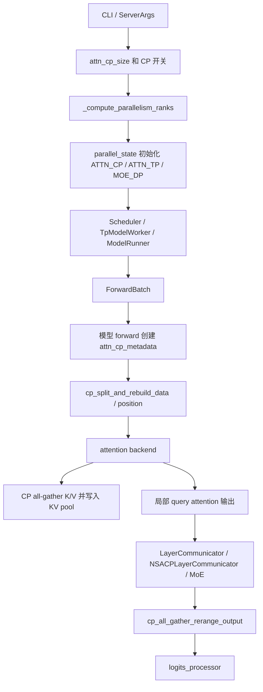
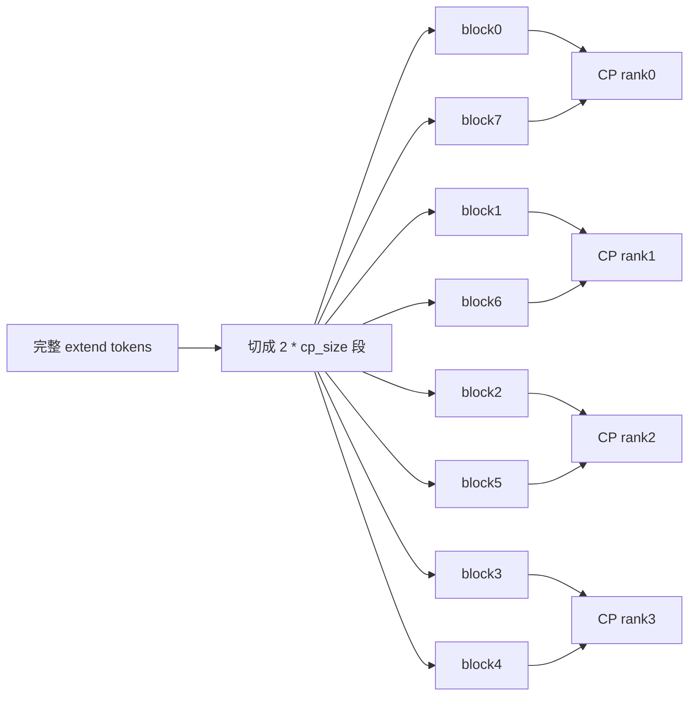
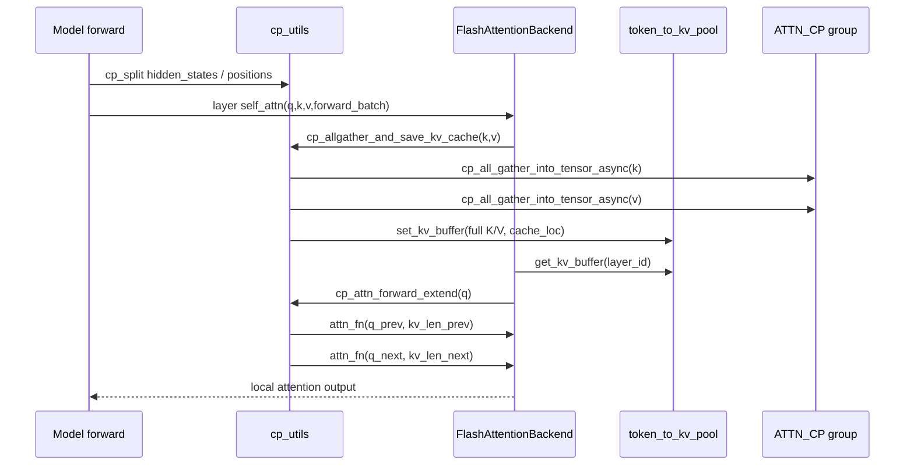
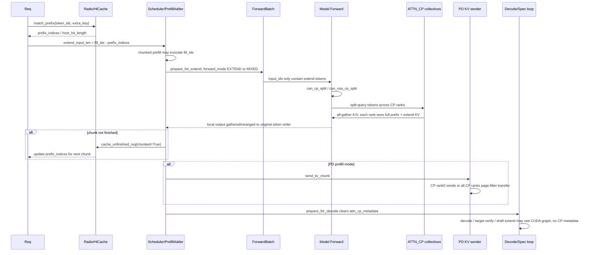
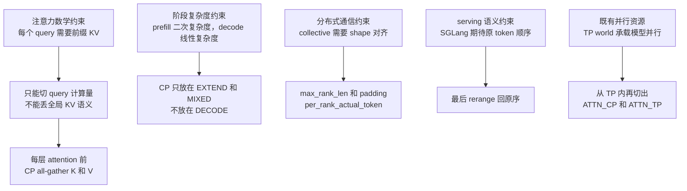
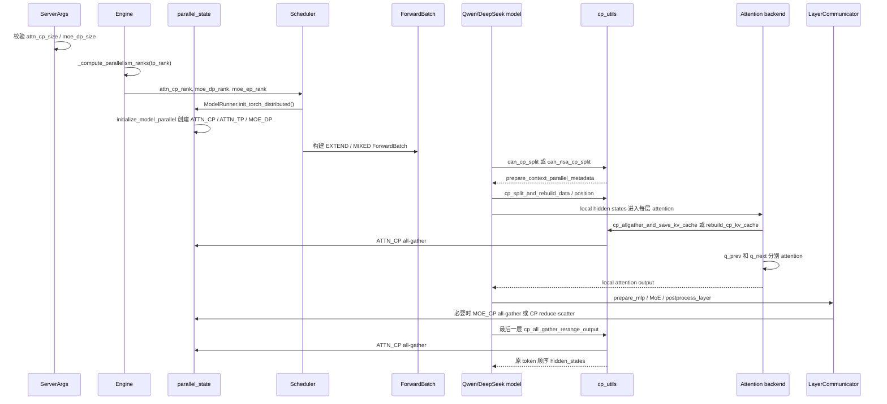

> 本文只描述当前源码(20260507)已经实现的行为。凡是注释、文档或测试里出现但源码路径没有闭环支持的能力，都会在边界章节单独说明。

## 1. 总览：SGLang 里有两套 CP 入口

SGLang 当前的 context parallel 实现不是一个单独模块，而是从 server args、rank 拆分、scheduler、`ForwardBatch`、模型 forward、attention backend、KV cache、MoE communicator、PD/HiCache 多处拼起来的一条 prefill 专用执行链。

为了避免一上来陷入细节，本文先用一张总图和文件索引建立入口，再按执行顺序展开：配置和 rank 先定出 CP group，scheduler 和 `ForwardBatch` 决定哪些 batch 能走 CP，模型和 attention backend 负责 split、all-gather 和 rerange。等单条链路讲完后，再把它放回 DP attention、MoE、PD、HiCache、CUDA graph 和 SpecDecoding 这些周边能力里看，最后用边界、测试和完整时序收束。

源码里有两类 CP 开关：

| 类型            | 开关                                                              | 主要模型路径                                                                          | split 模式                            | 当前实现重点                                                                                                                   |
| --------------- | ----------------------------------------------------------------- | ------------------------------------------------------------------------------------- | ------------------------------------- | ------------------------------------------------------------------------------------------------------------------------------ |
| 普通 prefill CP | `--enable-prefill-context-parallel` + `--attn-cp-size`            | `Qwen2MoeModel` / `Qwen3MoeModel`，也可被共享 FlashAttention backend 使用             | `prefill_cp_mode=in-seq-split`        | batch=1 的 zigzag sequence split，KV all-gather，attention 按 prev/next 两段跑，最终 all-gather 回原 token 顺序                |
| NSA prefill CP  | `--enable-nsa-prefill-context-parallel` + `--nsa-prefill-cp-mode` | `DeepseekV2ForCausalLM` / `DeepseekV2Model` / `DeepseekModelNextN` / GLM DSA 派生路径 | `round-robin-split` 或 `in-seq-split` | DeepSeek V3.2 DSA 长 prefill 优化；round-robin 支持多 batch，in-seq 复用 zigzag metadata；NSACP communicator 改写 layer 内通信 |

最核心的设计是：

1. `tp_rank` 被解释成 `attention DP -> attention CP -> attention TP` 三维坐标。
2. prefill token 在 CP 维度切开，每个 CP rank 只算本 rank 的 query。
3. 每层 attention 前，局部 K/V 通过 CP all-gather 重组成完整 KV cache，使本 rank 的局部 query 仍能看到完整历史上下文。
4. 模型最后一层后，再把各 CP rank 的局部 hidden states all-gather 并恢复原 token 顺序，交给 logits processor。
5. decode 不使用 CP。`ScheduleBatch.prepare_for_decode()` 会清空 `attn_cp_metadata`。



## 2. 关键文件索引

下面这张表先给出阅读地图。后文不会按文件表逐个展开，而是按一次 prefill CP 的真实执行顺序引用这些文件。

| 文件                                                                                 | 作用                                                                                              |
| ------------------------------------------------------------------------------------ | ------------------------------------------------------------------------------------------------- |
| `python/sglang/srt/server_args.py`                                                   | CLI 参数、默认值、DeepSeek NSA CP 自动配置、CP 约束校验                                           |
| `python/sglang/srt/entrypoints/engine.py`                                            | 非 Ray 启动时根据 `tp_rank` 计算 `attn_cp_rank` / `moe_dp_rank` / `moe_ep_rank`                   |
| `python/sglang/srt/distributed/parallel_state.py`                                    | 创建 `_ATTN_CP`、`_ATTN_TP`、`_MOE_DP`、`_MOE_EP` 等 process group                                |
| `python/sglang/srt/layers/dp_attention.py`                                           | 暴露 attention TP/CP/DP rank、group 和 collectives                                                |
| `python/sglang/srt/model_executor/forward_batch_info.py`                             | `ForwardMode.is_context_parallel_extend()`、`ForwardBatch.attn_cp_metadata`、DP/CP padding        |
| `python/sglang/srt/layers/utils/cp_utils.py`                                         | CP 元数据、zigzag split、round-robin split 路由、KV all-gather、输出 rerange、CP attention helper |
| `python/sglang/srt/layers/attention/nsa/utils.py`                                    | NSA CP 开关、round-robin split、NSA seqlen padding、`nsa_use_prefill_cp()`                        |
| `python/sglang/srt/layers/attention/nsa_backend.py`                                  | NSA metadata 中按 CP split 后重建 `cu_seqlens`、`page_table`、indexer 范围                        |
| `python/sglang/srt/layers/attention/flashattention_backend.py`                       | CUDA FlashAttention CP 分支：KV all-gather + q prev/next attention                                |
| `python/sglang/srt/hardware_backend/npu/attention/ascend_backend.py`                 | Ascend NPU CP 分支，K/V 合并 all-gather，FIA CP attention                                         |
| `python/sglang/srt/hardware_backend/musa/attention/flashattention_backend.py`        | MUSA CP 分支，逻辑与 CUDA FlashAttention 类似                                                     |
| `python/sglang/srt/layers/communicator.py`                                           | 通用 layer 通信模式、`MOE_FULL`、CP/MoE token all-gather                                          |
| `python/sglang/srt/layers/communicator_nsa_cp.py`                                    | NSA CP 专用 communicator，避免普通 TP/DP 通信逻辑破坏 CP scattered layout                         |
| `python/sglang/srt/models/qwen2_moe.py` / `qwen3_moe.py`                             | 普通 prefill CP 的模型接入                                                                        |
| `python/sglang/srt/models/deepseek_v2.py` / `deepseek_nextn.py` / `glm4_moe_lite.py` | NSA CP 的模型接入                                                                                 |
| `python/sglang/srt/disaggregation/*`                                                 | PD disaggregation 下 CP rank bootstrap、poll sync、KV transfer 过滤                               |
| `python/sglang/srt/mem_cache/*` / `managers/cache_controller.py`                     | HiCache / storage backend 携带 `attn_cp_rank` 和 `attn_cp_size`                                   |

## 3. 配置入口与校验

CP 的第一层入口在 `ServerArgs`。这一章先看用户能打开哪些开关，再看 DeepSeek NSA CP 的自动改写和通用约束；这些值会直接决定后面的 rank 拆分和 process group 形态。

### 3.1 CLI 参数和 ServerArgs 字段

`ServerArgs` 里 CP 相关字段分成并行度字段和 prefill CP 开关：

```python
# python/sglang/srt/server_args.py
attn_cp_size: int = 1
moe_dp_size: int = 1

# Context parallelism used in the long sequence prefill phase of DeepSeek v3.2
enable_nsa_prefill_context_parallel: bool = False
nsa_prefill_cp_mode: str = "round-robin-split"

# Context parallelism
enable_prefill_context_parallel: bool = False
prefill_cp_mode: str = "in-seq-split"
```

CLI 映射：

```python
--attention-context-parallel-size / --attn-cp-size
--moe-data-parallel-size / --moe-dp-size
--enable-nsa-prefill-context-parallel
--nsa-prefill-cp-mode     # round-robin-split 或 in-seq-split
--enable-prefill-context-parallel
--prefill-cp-mode         # 当前只有 in-seq-split
```

`from_cli_args()` 会把 argparse 名称折回 dataclass 字段：

```python
args.tp_size = args.tensor_parallel_size
args.pp_size = args.pipeline_parallel_size
args.attn_cp_size = args.attention_context_parallel_size
args.moe_dp_size = args.moe_data_parallel_size
args.dp_size = args.data_parallel_size
args.ep_size = args.expert_parallel_size
```

### 3.2 DeepSeek NSA CP 的自动配置

普通 `--enable-prefill-context-parallel` 不会自动改 `attn_cp_size`，用户必须显式设置 `--attn-cp-size > 1`。

DeepSeek V3.2 / GLM DSA 的 `--enable-nsa-prefill-context-parallel` 会在 `_handle_model_specific_adjustments()` 里改写多个参数。CUDA/ROCm 路径下源码逻辑是：

```python
if self.enable_nsa_prefill_context_parallel:
    logger.warning(
        "Context parallel feature is still under experiment. It has only been verified on Hopper platform."
    )
    if self.nsa_prefill_cp_mode == "in-seq-split":
        self.enable_dp_attention = True
        self.moe_dense_tp_size = 1
        self.moe_a2a_backend = "deepep"
        self.ep_size = self.tp_size
        logger.warning(
            "For in-seq split mode, we have the following restrictions: moe_dense_tp_size == 1, moe_a2a_backend == deepep, ep_size == tp_size, batch_size == 1"
        )
    else:
        self.enable_dp_attention = True
        self.moe_dense_tp_size = 1
        assert self.dp_size == 1, "For round-robin split mode, dp attention is not supported."
    assert self.tp_size == 8, (
        "Current multi-machine CP support suffers from precision issues. "
        "So context parallel only support Single machine(tp_size == 8)"
    )
    self.attn_cp_size = self.tp_size // self.dp_size
```

这段代码有几个直接后果：

| 模式            | 自动行为                                                                                                                       |
| --------------- | ------------------------------------------------------------------------------------------------------------------------------ |
| NSA in-seq      | `enable_dp_attention=True`、`moe_dense_tp_size=1`、`moe_a2a_backend=deepep`、`ep_size=tp_size`、`attn_cp_size=tp_size/dp_size` |
| NSA round-robin | 要求 `dp_size==1`，设置 `moe_dense_tp_size=1`，随后 `attn_cp_size=tp_size`                                                     |
| 非 NPU/XPU      | 强约束 `tp_size == 8`，这里的 `tp_size` 是每个 PP stage 内的 TP world size                                                     |
| PD decode       | `enable_nsa_prefill_context_parallel` 时禁止 `disaggregation_mode == "decode"`                                                 |

注意：`__post_init__()` 中 `_handle_piecewise_cuda_graph()` 在 `_handle_model_specific_adjustments()` 之前执行，所以如果 `attn_cp_size` 是 NSA CP 后续自动设置出来的，`_handle_piecewise_cuda_graph()` 里 `attn_cp_size > 1` 这条禁用条件不会先看到它。普通 CP 显式传入 `--attn-cp-size` 时则会被该条件看到。

### 3.3 通用 CP 约束

`_handle_context_parallelism()` 校验的是最终 `attn_cp_size`、`moe_dp_size` 和 `ep_size`：

```python
if self.attn_cp_size > 1:
    assert self.tp_size % self.attn_cp_size == 0
    assert self.tp_size % (self.dp_size * self.attn_cp_size) == 0
    assert not self.enable_aiter_allreduce_fusion

if self.moe_dp_size > 1:
    assert self.tp_size % self.moe_dp_size == 0
    assert self.ep_size * self.moe_dp_size <= self.tp_size
    assert self.pp_size == 1
    if self.ep_size > 1:
        assert self.ep_size * self.moe_dp_size == self.tp_size
    assert not self.enable_aiter_allreduce_fusion

if self.attn_cp_size != self.moe_dp_size:
    assert self.moe_dp_size == 1
```

这里的含义是：

- `attn_cp_size` 必须整除 `tp_size`。
- 开 DP attention 时，`dp_size * attn_cp_size` 必须整除 `tp_size`。
- 如果 `moe_dp_size > 1`，当前不支持 PP。
- `attn_cp_size != moe_dp_size` 只允许 `moe_dp_size == 1`，也就是“CP 比 MoE DP 更细”的场景。
- AITER allreduce fusion 与 CP / MoE DP 都互斥。

## 4. Rank 拆分与并行组

### 4.1 tp_rank 如何拆成 ATTN_DP / ATTN_CP / ATTN_TP

非 Ray 启动路径在 `python/sglang/srt/entrypoints/engine.py` 中计算 rank：

```python
def _compute_parallelism_ranks(server_args: ServerArgs, tp_rank: int):
    attn_dp_size = server_args.dp_size if server_args.enable_dp_attention else 1

    # Parallelism hierarchy (outermost to innermost):
    # - Attention: Global(TP) -> DP -> ATTN_CP -> ATTN_TP (innermost)
    # - MoE: Global(TP) -> MOE_DP -> EP -> MOE_TP (innermost)
    attn_tp_size = server_args.tp_size // attn_dp_size // server_args.attn_cp_size
    attn_cp_rank = (tp_rank // attn_tp_size) % server_args.attn_cp_size
    moe_dp_rank = tp_rank // (server_args.tp_size // server_args.moe_dp_size)
    moe_ep_rank = (
        tp_rank
        % (server_args.tp_size // server_args.moe_dp_size)
        // (server_args.tp_size // server_args.moe_dp_size // server_args.ep_size)
    )
    return attn_cp_rank, moe_dp_rank, moe_ep_rank
```

同一公式也出现在 `compute_dp_attention_world_info()`：

```python
attn_dp_size = dp_size if enable_dp_attention else 1
attn_tp_size = tp_size // attn_dp_size // attn_cp_size
attn_tp_rank = tp_rank % attn_tp_size
attn_dp_rank = tp_rank // (attn_tp_size * attn_cp_size)
```

因此 attention 侧 rank layout 是：

```text
tp_rank = (attn_dp_rank * attn_cp_size + attn_cp_rank) * attn_tp_size + attn_tp_rank
```

例子 1：`tp_size=8, dp_attention=False, attn_cp_size=2`

```text
attn_tp_size = 8 / 1 / 2 = 4
tp_rank:       0 1 2 3 4 5 6 7
attn_tp_rank: 0 1 2 3 0 1 2 3
attn_cp_rank: 0 0 0 0 1 1 1 1
ATTN_CP 组:   [0,4], [1,5], [2,6], [3,7]
ATTN_TP 组:   [0,1,2,3], [4,5,6,7]
```

例子 2：`tp_size=8, dp_size=2, enable_dp_attention=True, attn_cp_size=4`

```text
attn_tp_size = 8 / 2 / 4 = 1
tp_rank:       0 1 2 3 | 4 5 6 7
attn_dp_rank:  0 0 0 0 | 1 1 1 1
attn_cp_rank:  0 1 2 3 | 0 1 2 3
attn_tp_rank:  0 0 0 0 | 0 0 0 0
ATTN_CP 组:   [0,1,2,3], [4,5,6,7]
ATTN_TP 组:   每个 rank 单独成组
```

### 4.2 parallel_state 创建 ATTN_CP / ATTN_TP / MOE_DP

`initialize_model_parallel()` 先创建普通 TP 组，然后根据 `attention_context_model_parallel_size` 建 `_ATTN_CP`：

```python
attn_dp_size = attention_data_parallel_size
attn_cp_size = attention_context_model_parallel_size
attn_tp_size = tensor_model_parallel_size // attn_cp_size // attn_dp_size

if attn_cp_size == tensor_model_parallel_size:
    _ATTN_CP = _TP
else:
    group_ranks = []
    for tp_group_idx in range(num_tensor_model_parallel_groups):
        for dp_idx in range(attn_dp_size):
            for attn_tp_idx in range(attn_tp_size):
                st = (
                    tp_group_idx * tensor_model_parallel_size
                    + dp_idx * attn_tp_size * attn_cp_size
                    + attn_tp_idx
                )
                en = (
                    tp_group_idx * tensor_model_parallel_size
                    + (dp_idx + 1) * attn_tp_size * attn_cp_size
                    + attn_tp_idx
                )
                ranks = list(range(st, en, attn_tp_size))
                group_ranks.append(ranks)
    _ATTN_CP = init_model_parallel_group(..., group_name="attn_cp")
```

ATTN_TP 的构造则把 `CP * DP` 合并成外层，每个组里是连续的 `attn_tp_size` 个 rank：

```python
for tp_group_idx in range(num_tensor_model_parallel_groups):
    for cp_dp_combined_idx in range(attn_cp_size * attn_dp_size):
        st = tp_group_idx * tensor_model_parallel_size + cp_dp_combined_idx * attn_tp_size
        en = tp_group_idx * tensor_model_parallel_size + (cp_dp_combined_idx + 1) * attn_tp_size
        ranks = list(range(st, en))
        group_ranks.append(ranks)
```

MoE DP 与 CP 有一个重要耦合点：

```python
if attn_cp_size > moe_dp_size:
    # When moe_dp_size < attn_cp_size, CP ranks must share tokens before MoE.
    # The MOE_DP group includes these CP partners, so the existing DP
    # allgather/scatter handles the token sharing.
    _MOE_DP = _ATTN_CP
```

这意味着当 `attn_cp_size > moe_dp_size` 时，MoE DP group 直接复用 CP group。后面的 `LayerCommunicator` 可以通过 `get_moe_cp_group()` 走同一个 group，把 CP rank 间的 token 补齐给 MoE。

### 4.3 process group getter 和 collectives

`dp_attention.py` 对外暴露 CP group：

```python
def get_attention_cp_group() -> GroupCoordinator:
    return get_attn_cp_group()

def get_attention_cp_rank() -> int:
    return get_attn_context_model_parallel_rank()

def get_attention_cp_size() -> int:
    return get_attn_context_model_parallel_world_size()

def attn_cp_all_gather_into_tensor(output: torch.Tensor, input: torch.Tensor):
    return get_attention_cp_group().all_gather_into_tensor(output, input)

def attn_cp_reduce_scatter_tensor(output: torch.Tensor, input: torch.Tensor):
    return get_attention_cp_group().reduce_scatter_tensor(output, input)
```

CP 的 async all-gather 最终走 `GroupCoordinator.cp_all_gather_into_tensor_async()`：

```python
def cp_all_gather_into_tensor_async(self, output, input, stream):
    pynccl_comm = self.pynccl_comm
    if pynccl_comm is None or pynccl_comm.disabled:
        self.all_gather_into_tensor(output, input)
    else:
        pynccl_comm.cp_all_gather_into_tensor(output, input, stream=stream)
```

`pynccl.py` 里对应实现直接在指定 CUDA stream 上调用 `ncclAllGather`，避免 `torch.distributed.all_gather_into_tensor` 的事件同步带来的 CPU launch blocking：

```python
def cp_all_gather_into_tensor(self, output_tensor, input_tensor, stream, sizes=None):
    assert input_tensor.device == self.device
    self.nccl.ncclAllGather(
        buffer_type(input_tensor.data_ptr()),
        buffer_type(output_tensor.data_ptr()),
        input_tensor.numel(),
        ncclDataTypeEnum.from_torch(input_tensor.dtype),
        self.comm,
        cudaStream_t(stream.cuda_stream),
    )
```

## 5. Scheduler 与 ForwardBatch 生命周期

### 5.1 Scheduler 启动和广播

Scheduler 初始化时保存 `attn_cp_rank` / `attn_cp_size`，并用 `compute_dp_attention_world_info()` 得到 attention TP/DP 信息：

```python
self.attn_cp_rank = attn_cp_rank
self.attn_cp_size = server_args.attn_cp_size
self.attn_tp_rank, self.attn_tp_size, self.attn_dp_rank = (
    compute_dp_attention_world_info(
        server_args.enable_dp_attention,
        self.tp_rank,
        self.tp_size,
        self.dp_size,
        self.attn_cp_size,
    )
)
```

DP attention 场景下，只有 `attn_tp_rank == 0 and attn_cp_rank == 0` 的 rank 先拆 work/control request，然后广播给 ATTN_TP group，再广播给 ATTN_CP group：

```python
if self.server_args.enable_dp_attention:
    if self.attn_tp_rank == 0 and self.attn_cp_rank == 0:
        work_reqs, control_reqs = self._split_work_and_control_reqs(recv_reqs)
    else:
        work_reqs = None
        control_reqs = None

    if self.attn_tp_size != 1:
        work_reqs = broadcast_pyobj(..., self.attn_tp_cpu_group, src=self.attn_tp_group.ranks[0])

    if self.attn_cp_size != 1:
        work_reqs = broadcast_pyobj(..., self.attn_cp_cpu_group, src=self.attn_cp_group.ranks[0])
```

这保证一个 DP shard 内的所有 CP rank 看到同一批 prefill work。

### 5.2 ForwardMode 中哪些模式算 CP extend

`ForwardMode.is_context_parallel_extend()` 当前定义：

```python
def is_context_parallel_extend(self, include_draft_extend_v2: bool = False):
    return (
        self == ForwardMode.EXTEND
        or self == ForwardMode.MIXED
        or (
            self == ForwardMode.DRAFT_EXTEND_V2
            if include_draft_extend_v2
            else False
        )
    )
```

实际 CP call site 基本使用默认参数，所以当前真正进入 CP 的主路径是 `EXTEND` 和 `MIXED`。`DRAFT_EXTEND_V2` 只有调用方显式传 `include_draft_extend_v2=True` 时才算。

`ForwardBatch` 持有 CP metadata：

```python
attn_cp_metadata: Optional[ContextParallelMetadata] = None
```

decode 前会清掉旧 metadata：

```python
def prepare_for_decode(self):
    self.forward_mode = ForwardMode.DECODE
    ...
    # Clear context parallel metadata - CP is only for prefill, not decode
    if hasattr(self, "attn_cp_metadata") and self.attn_cp_metadata is not None:
        self.attn_cp_metadata = None
```

### 5.3 MLP sync padding 必须同时对齐 ATTN_TP 和 ATTN_CP

DP gather / reduce-scatter 需要所有参与 rank 的 collective shape 一致。`ForwardBatch.prepare_mlp_sync_batch()` 先按 attention TP size 对齐，再按 CP size 对齐：

```python
global_num_tokens = self.global_num_tokens_cpu
attn_tp_size = get_attention_tp_size()

for i in range(sync_group_size):
    global_num_tokens[i] = ceil_align(global_num_tokens[i], attn_tp_size)

attn_cp_size = get_attention_cp_size()
for i in range(sync_group_size):
    global_num_tokens[i] = ceil_align(global_num_tokens[i], attn_cp_size)
```

这件事对 round-robin NSA CP 也重要，因为按 `token_idx % cp_size` 分片后，很多 collective 要求每个 rank 的 token 数可对齐。

## 6. `ContextParallelMetadata`：in-seq / zigzag 的完整状态

`python/sglang/srt/layers/utils/cp_utils.py` 中定义：

```python
@dataclass
class ContextParallelMetadata:
    split_list: List[int] = None
    max_rank_len: List[int] = None
    zigzag_index: List[int] = None
    per_rank_actual_token: List[int] = None
    reverse_split_len: List[int] = None
    cp_reverse_index: List[int] = None

    # metadata for attention
    kv_len_prev: int = -1
    kv_len_next: int = -1
    actual_seq_q_prev: int = -1
    actual_seq_q_next: int = -1
    kv_len_prev_tensor: torch.Tensor = None
    kv_len_next_tensor: torch.Tensor = None
    actual_seq_q_prev_tensor: torch.Tensor = None
    actual_seq_q_next_tensor: torch.Tensor = None

    total_seq_lens: torch.Tensor = None
```

字段生命周期：

| 字段                                      | 类型 / shape                                              | 创建时机                              | 消费位置                                                         | 作用                                      |
| ----------------------------------------- | --------------------------------------------------------- | ------------------------------------- | ---------------------------------------------------------------- | ----------------------------------------- |
| `split_list`                              | Python `List[int]`，长度 `2 * cp_size`                    | `prepare_context_parallel_metadata()` | `cp_split_and_rebuild_data()`、`cp_split_and_rebuild_position()` | 原序列切成 `2*cp_size` 段后，每段真实长度 |
| `zigzag_index`                            | Python list，普通 batch=1 时长度 2                        | 同上                                  | split 阶段                                                       | 当前 CP rank 取哪两个 segment             |
| `per_rank_actual_token`                   | Python list，长度 `cp_size`                               | 同上                                  | all-gather 去 padding、MoE CP all-gather padding                 | 每个 CP rank 的真实 token 数              |
| `max_rank_len`                            | Python list，长度 `cp_size`，每项通常是 `ceil(T/cp_size)` | 同上                                  | `torch.split(input_tensor_full, max_rank_len)`                   | collective 输出按每 rank 最大长度切分     |
| `reverse_split_len`                       | Python list，长度 `2*cp_size`                             | 同上                                  | output / KV rerange                                              | all-gather 后按 zigzag 拼接顺序切段       |
| `cp_reverse_index`                        | Python list，长度 `2*cp_size`                             | 同上                                  | output / KV rerange                                              | 把 zigzag 顺序恢复成原始 segment 顺序     |
| `kv_len_prev` / `kv_len_next`             | Python int                                                | 同上                                  | FlashAttention `cache_seqlens`                                   | 当前 rank 两段 query 各自能看到的 KV 长度 |
| `actual_seq_q_prev` / `actual_seq_q_next` | Python int                                                | 同上                                  | FlashAttention `max_seqlen_q` 和 `cu_seqlens_q`                  | 当前 rank 两段 query 的真实长度           |
| `*_tensor`                                | CUDA int32 tensor，shape `[1]`                            | 同上                                  | backend attention call                                           | FlashAttention 期望 tensor 而不是 scalar  |
| `total_seq_lens`                          | tensor 标量，原始 extend token 数                         | 同上                                  | all-gather max len 计算                                          | 用于推导每 rank padding 后长度            |

### 6.1 in-seq split 的核心公式

普通 prefill CP 和 NSA in-seq CP 都调用 `prepare_context_parallel_metadata()`。但如果是 NSA round-robin，函数直接返回空 `ContextParallelMetadata()`，因为 round-robin 不需要 zigzag split 表。

in-seq 核心逻辑：

```python
kv_len = torch.tensor(kv_len)
cp_segment_num = cp_size * 2
seq_per_batch = kv_len // cp_segment_num
split_list = seq_per_batch.repeat_interleave(cp_segment_num).int().tolist()
remainder = kv_len % cp_segment_num
if remainder > 0:
    split_list[:remainder] = [x + 1 for x in split_list[:remainder]]

seq_max_rank_len = (kv_len + cp_size - 1) // cp_size
max_rank_len = seq_max_rank_len.repeat_interleave(cp_size).int().tolist()
zigzag_index = list(range(cp_rank, cp_rank + bs_per_cp_group * cp_segment_num, cp_segment_num)) + list(
    range(cp_segment_num - cp_rank - 1, bs_per_cp_group * cp_segment_num, cp_segment_num)
)

per_rank_actual_token = [
    split_list[i] + split_list[cp_size * 2 - i - 1] for i in range(cp_size)
]
reverse_split_len = [
    element
    for i in range(cp_size)
    for element in (split_list[i], split_list[cp_size * 2 - i - 1])
]
```

以 `cp_size=4` 为例，一个请求被切成 8 段：

```text
原始顺序: block0 block1 block2 block3 block4 block5 block6 block7
zigzag:  block0 block7 block1 block6 block2 block5 block3 block4

rank0: block0 + block7
rank1: block1 + block6
rank2: block2 + block5
rank3: block3 + block4
```

这样做是为了平衡 causal attention 的计算量。靠前 query 能看到的历史 KV 少，靠后 query 能看到的历史 KV 多；把一个靠前段和一个靠后段配到同一个 rank，可以让各 rank 的 attention 计算更均衡。



### 6.2 prefix cache 命中时的 `kv_len_prev/next`

`prepare_context_parallel_metadata()` 中有一个容易误解的细节：`kv_len` 代表本次 extend pass 新计算的 token 数，不一定等于 attention 可见 KV 长度。prefix cache 命中时，attention 还必须看到 cached prefix。

源码先从 `seqs_len` 反推 prefix offset：

```python
prefix_len = 0
try:
    if seqs_len is not None and len(seqs_len) == 1:
        prefix_len = int(seqs_len[0]) - int(kv_len_origin.item())
        if prefix_len < 0:
            prefix_len = 0
except Exception:
    prefix_len = 0
```

然后分普通 CP 与 NSA CP：

```python
if is_nsa_enable_prefill_cp():
    kv_len_prev = prefix_sum_list[cp_rank]
    kv_len_next = prefix_sum_list[cp_size * 2 - cp_rank - 1]
else:
    kv_len_prev = prefix_len + prefix_sum_list[cp_rank]
    kv_len_next = prefix_len + prefix_sum_list[cp_size * 2 - cp_rank - 1]
```

原因在注释里写得很清楚：

- 非 NSA CP 的 FlashAttention `cache_seqlens` 直接消费这里的 `kv_len_prev/next`，所以必须加 prefix。
- NSA CP 的 `_get_topk_ragged_with_cp` 会从 `seq_lens_cpu - extend_seq_lens_cpu` 重新加 prefix offset；这里如果再加一次，prefix cache 命中时会把 indexer 的 `ke_offset` 搞错。

## 7. 输入切分：hidden states 和 positions

### 7.1 普通 in-seq split

普通 CP 使用 `cp_split_and_rebuild_data()` 和 `cp_split_and_rebuild_position()`：

```python
def cp_split_and_rebuild_data(forward_batch, input_: torch.Tensor):
    input_list = list(
        torch.split(input_, forward_batch.attn_cp_metadata.split_list, dim=0)
    )
    result = torch.cat(
        [input_list[i] for i in forward_batch.attn_cp_metadata.zigzag_index], dim=0
    ).view(-1, input_.shape[-1])
    return result

def cp_split_and_rebuild_position(forward_batch, positions: torch.Tensor):
    position_id_list = list(
        torch.split(positions, forward_batch.attn_cp_metadata.split_list, dim=-1)
    )
    positions = torch.cat(
        [position_id_list[i] for i in forward_batch.attn_cp_metadata.zigzag_index],
        dim=-1,
    )
    return positions
```

形状变化：

| 数据            | split 前                         | split 后                                                |
| --------------- | -------------------------------- | ------------------------------------------------------- |
| `hidden_states` | `[T, hidden_size]`               | `[T_rank, hidden_size]`                                 |
| `positions`     | 通常 `[T]` 或最后一维为 token 维 | `[T_rank]` 或最后一维变为 `T_rank`                      |
| `T_rank`        | 无                               | `split_list[cp_rank] + split_list[2*cp_size-cp_rank-1]` |

### 7.2 NSA round-robin split

round-robin 分片走 `nsa_cp_round_robin_split_data()`：

```python
def nsa_cp_round_robin_split_data(input_):
    cp_size = get_attention_cp_size()
    cp_rank = get_attention_cp_rank()
    if isinstance(input_, (tuple, list)):
        indices = range(cp_rank, len(input_), cp_size)
        return input_[indices]

    tokens = len(input_)
    if tokens % cp_size != 0:
        cur_len = tokens // cp_size + (tokens % cp_size > cp_rank)
        if cur_len == 0:
            return input_.new_empty(0, *input_.shape[1:])
        indices = torch.arange(cp_rank, tokens, cp_size, device=input_.device)
        return input_[indices]

    return input_.view(-1, cp_size, *input_.shape[1:])[:, cp_rank].contiguous()
```

含义：

```text
rank0: token0, token4, token8,  ...
rank1: token1, token5, token9,  ...
rank2: token2, token6, token10, ...
rank3: token3, token7, token11, ...
```

如果 token 数能整除 `cp_size`，它用 view 走快路径；否则用 `torch.arange(cp_rank, tokens, cp_size)` 取不等长分片。

NSA metadata 还要切每个 request 的 query 长度。`nsa_cp_round_robin_split_q_seqs_cpu()` 有一个 `extra_seq` carry：

```python
extra_seq = 0
q_seqs = []
for bs, cur_len in enumerate(extend_seqs):
    cur_len += extra_seq
    cur_seq = cur_len // cp_size + int(cur_len % cp_size > cp_rank)
    q_seqs.append(cur_seq)
    extra_seq = cur_len - cur_seq * cp_size
bs_idx = [i for i, x in enumerate(q_seqs) if x > 0]
q_seqs = [q_len for q_len in q_seqs if q_len > 0]
```

这个 carry 的作用是跨 batch 保持全局 token 流的 `token_idx % cp_size` 语义，而不是每个 request 都重新从 0 开始分配。

## 8. 模型接入：谁创建 metadata，谁 split，谁 gather

### 8.1 Qwen3 MoE：创建 metadata

`Qwen3MoeForCausalLM.forward()` 在进入 `self.model` 前检查普通 CP：

```python
if is_prefill_context_parallel_enabled():
    if can_cp_split(len(input_ids), self.attn_cp_size, forward_batch):
        forward_batch.attn_cp_metadata = prepare_context_parallel_metadata(
            len(input_ids),
            self.attn_cp_rank,
            self.attn_cp_size,
            forward_batch.seq_lens_cpu.tolist(),
        )
```

`can_cp_split()` 当前约束：

```python
cur_cp_seq_len = seq_len // (cp_size * 2)
return (
    cur_cp_seq_len != 0
    and cp_size > 1
    and forward_batch.forward_mode.is_context_parallel_extend()
    and is_prefill_context_parallel_enabled()
    and forward_batch.seq_lens_cpu.shape[0] == 1
)
```

所以普通 in-seq CP metadata 当前只支持 batch=1，且 token 数至少要能切出 `2*cp_size` 段中的非空段。

### 8.2 Qwen2/Qwen3 model：首 rank split，末 rank gather

`Qwen2MoeModel.forward()` 被 Qwen3 继承。它在 embedding 后、进入 decoder layers 前做 split：

```python
if (
    is_prefill_context_parallel_enabled()
    and forward_batch.forward_mode.is_context_parallel_extend()
    and forward_batch.attn_cp_metadata is not None
):
    if self.pp_group.is_first_rank:
        hidden_states = cp_split_and_rebuild_data(forward_batch, hidden_states)
    positions = cp_split_and_rebuild_position(forward_batch, positions)
```

最后一个 PP rank 做 gather + rerange：

```python
if (
    self.pp_group.is_last_rank
    and is_prefill_context_parallel_enabled()
    and forward_batch.forward_mode.is_context_parallel_extend()
    and forward_batch.attn_cp_metadata is not None
):
    hidden_states = cp_all_gather_rerange_output(
        hidden_states,
        self.attn_cp_size,
        forward_batch,
        torch.cuda.current_stream(),
    )
```

这说明 CP 对 PP 的边界是：

- 第一个 PP stage 负责把 input hidden states 切给 CP rank。
- 中间 PP stage 依赖 PPProxyTensors 传递已经是 local CP shard 的 hidden states。
- 最后一个 PP stage 才把 CP shards 合并回完整 token 顺序。

### 8.3 DeepSeek / NSA：创建 metadata + NSACP communicator

`DeepseekV2ForCausalLM.forward()` 的入口类似，但使用 NSA 专用判断：

```python
if self.nsa_enable_prefill_cp:
    if can_nsa_cp_split(len(input_ids), self.cp_size, self.use_nsa, forward_batch):
        forward_batch.attn_cp_metadata = prepare_context_parallel_metadata(
            len(input_ids),
            self.cp_rank,
            self.cp_size,
            forward_batch.seq_lens_cpu.tolist(),
        )

with get_attn_tp_context().maybe_input_scattered(forward_batch):
    hidden_states = self.model(
        input_ids, positions, forward_batch, input_embeds, pp_proxy_tensors
    )
```

`DeepseekV2Model.forward()` 中真正 split / gather：

```python
if nsa_use_prefill_cp(forward_batch):
    if self.pp_group.is_first_rank:
        hidden_states = cp_split_and_rebuild_data(forward_batch, hidden_states)
    positions = cp_split_and_rebuild_position(forward_batch, positions)

...

if self.pp_group.is_last_rank and nsa_use_prefill_cp(forward_batch):
    hidden_states = cp_all_gather_rerange_output(
        hidden_states,
        self.cp_size,
        forward_batch,
        torch.cuda.current_stream(),
    )
```

DeepSeek layer 初始化时会按 CP 开关选择 communicator：

```python
if self.nsa_enable_prefill_cp:
    self.layer_communicator = NSACPLayerCommunicator(
        layer_scatter_modes=self.layer_scatter_modes,
        input_layernorm=self.input_layernorm,
        post_attention_layernorm=self.post_attention_layernorm,
        allow_reduce_scatter=True,
        is_last_layer=(is_nextn or (self.layer_id == self.config.num_hidden_layers - 1)),
        qkv_latent_func=self.self_attn.prepare_qkv_latent,
    )
else:
    self.layer_communicator = LayerCommunicator(...)
```

`deepseek_nextn.py` 的 NextN draft model 也复用同一套 NSA CP split/gather。

## 9. KV cache：局部 K/V 如何变成完整上下文

### 9.1 通用 all-gather + 去 padding + rerange

`cp_all_gather_reorganized_into_tensor()` 是一维 `[tokens, hidden]` 数据的核心 all-gather：

```python
max_len = (total_len + cp_size - 1) // cp_size
pad_size = max_len - input_tensor.shape[0]
if pad_size > 0:
    input_tensor = F.pad(input_tensor, (0, 0, 0, pad_size), mode="constant", value=0)

input_tensor_full = torch.empty(
    max_len * cp_size,
    input_tensor.shape[1],
    device=input_tensor.device,
    dtype=input_tensor.dtype,
)

get_attention_cp_group().cp_all_gather_into_tensor_async(
    input_tensor_full, input_tensor, stream
)

outputs_list_max = list(
    torch.split(input_tensor_full, forward_batch.attn_cp_metadata.max_rank_len, dim=0)
)
outputs = torch.cat(
    [
        outputs_list_max[index][:per_rank_len]
        for index, per_rank_len in enumerate(
            forward_batch.attn_cp_metadata.per_rank_actual_token
        )
    ],
    dim=0,
)
```

对于 KV cache，`cp_all_gather_reorganized_into_tensor_kv_cache()` 做同样的事，但支持多维尾部：

```python
input_tensor: [T_rank, num_heads, head_dim]
output_tensor: [T_full, num_heads, head_dim]
```

padding 用的是：

```python
padding = [0, 0] * (input_tensor.ndim - 1) + [0, pad_size]
input_tensor = F.pad(input_tensor, padding, mode="constant", value=0)
```

### 9.2 写入 KV pool

FlashAttention 普通 MHA 的 CP 分支在保存 KV cache 时不会直接写局部 K/V，而是先 all-gather 出完整 K/V：

```python
def cp_allgather_and_save_kv_cache(forward_batch, layer, k, v, cp_size):
    cache_loc = (
        forward_batch.out_cache_loc
        if not layer.is_cross_attention
        else forward_batch.encoder_out_cache_loc
    )

    k = k.contiguous()
    v = v.contiguous()

    key_cache_full = cp_all_gather_rerange_kv_cache(
        k, cp_size, forward_batch, torch.cuda.current_stream()
    )
    value_cache_full = cp_all_gather_rerange_kv_cache(
        v, cp_size, forward_batch, torch.cuda.current_stream()
    )

    forward_batch.token_to_kv_pool.set_kv_buffer(
        layer,
        cache_loc,
        key_cache_full,
        value_cache_full,
        layer.k_scale,
        layer.v_scale,
    )
```

形状：

```text
k / v local:      [T_rank, tp_k_or_v_head_num, head_dim]
key_cache_full:   [T_full, tp_k_head_num, head_dim]
value_cache_full: [T_full, tp_v_head_num, v_head_dim]
cache_loc:        out_cache_loc 对应本次 extend 的完整 token cache 位置
```

### 9.3 FlashAttention backend 的 CP 分支

`flashattention_backend.py` 先判断 CP mode：

```python
is_cp_mode = (
    forward_batch.forward_mode.is_context_parallel_extend()
    and forward_batch.attn_cp_metadata is not None
    and self.attn_cp_size > 1
)

if save_kv_cache and not is_cp_mode and not self.fa_skip_kv_cache:
    token_to_kv_pool.set_kv_buffer(...)
if is_cp_mode:
    cp_allgather_and_save_kv_cache(forward_batch, layer, k, v, self.attn_cp_size)
```

随后 attention 读取已经完整写入的 KV cache：

```python
key_cache, value_cache = forward_batch.token_to_kv_pool.get_kv_buffer(layer.layer_id)
key_cache = key_cache.view(-1, self.page_size, layer.tp_k_head_num, layer.head_dim)
value_cache = value_cache.view(-1, self.page_size, layer.tp_v_head_num, layer.v_head_dim)
```

CP attention 的 query 被拆成两段，分别调用 `flash_attn_with_kvcache()`：

```python
def _fa_cp_attn(q_chunk, cu_seqlens_q_cp, cache_seqlens_cp, max_seqlen_q_cp):
    return flash_attn_with_kvcache(
        q=q_chunk,
        k_cache=key_cache,
        v_cache=value_cache,
        page_table=page_table,
        cache_seqlens=cache_seqlens_cp,
        cu_seqlens_q=cu_seqlens_q_cp,
        cu_seqlens_k_new=cu_seqlens_k if not use_local_attn else None,
        max_seqlen_q=max_seqlen_q_cp,
        softmax_scale=layer.scaling,
        causal=False if use_cascade_attn else causal,
        window_size=window_size,
        softcap=layer.logit_cap,
        k_descale=k_descale,
        v_descale=v_descale,
        return_softmax_lse=use_cascade_attn,
        num_splits=self.num_splits,
        ver=self.fa_impl_ver,
        **kwargs,
    )

result = cp_attn_forward_extend(
    forward_batch,
    q.contiguous().view(-1, layer.tp_q_head_num, layer.head_dim),
    self.device,
    _fa_cp_attn,
)
```

`cp_attn_forward_extend()` 做的事情很直接：

```python
q_prev, q_next = torch.chunk(q, 2, dim=0)

cu_seqlens_q_prev = torch.tensor([0, cp_meta.actual_seq_q_prev], device=device, dtype=torch.int32)
result_prev = attn_fn(q_prev, cu_seqlens_q_prev, cp_meta.kv_len_prev_tensor, cp_meta.actual_seq_q_prev)

cu_seqlens_q_next = torch.tensor([0, cp_meta.actual_seq_q_next], device=device, dtype=torch.int32)
result_next = attn_fn(q_next, cu_seqlens_q_next, cp_meta.kv_len_next_tensor, cp_meta.actual_seq_q_next)

return torch.concat([result_prev, result_next], dim=0)
```



### 9.4 NPU 和 MUSA 的差异

MUSA backend 逻辑基本跟 CUDA FlashAttention 相同，但 `musa_cp_attn_forward_extend()` 会设置 `_current_prefix`，便于 MUSA backend 区分 `forward_extend_cp_prev` / `forward_extend_cp_next`。

Ascend NPU 有一个额外优化：`_cp_allgather_and_save_kv_npu()` 把 K 和 V flatten 后 concat，一次 all-gather 完成 K/V 通信：

```python
k_flat = k.contiguous().reshape(k.shape[0], -1)  # [S_local, k_feat]
v_flat = v.contiguous().reshape(v.shape[0], -1)  # [S_local, v_feat]
k_feat_size = k_flat.shape[-1]
kv_flat = torch.cat([k_flat, v_flat], dim=-1)    # [S_local, k_feat + v_feat]

kv_full = cp_all_gather_rerange_kv_cache(
    kv_flat, cp_size, forward_batch, get_current_device_stream_fast()
)  # [S_full, k_feat + v_feat]

key_cache_full = kv_full[..., :k_feat_size].reshape(-1, *k_tail)
value_cache_full = kv_full[..., k_feat_size:].reshape(-1, *v_tail)
```

NPU CP attention 使用 `npu_fused_infer_attention_score`，仍然按 prev/next 两段 q 调用：

```python
q_prev, q_next = torch.chunk(q, 2, dim=0)
q_prev = q_prev.contiguous().reshape(-1, layer.tp_q_head_num, layer.qk_head_dim)
q_next = q_next.contiguous().reshape(-1, layer.tp_q_head_num, layer.qk_head_dim)
```

## 10. 输出回拼：从 CP shard 回到原始 token 顺序

### 10.1 in-seq rerange

`cp_all_gather_rerange_output()` 对 in-seq 的恢复分两步：

1. `cp_all_gather_reorganized_into_tensor()` 收集各 rank output，并按 `per_rank_actual_token` 去掉 padding。
2. 按 `reverse_split_len` 切段，再用 `cp_reverse_index` 恢复原顺序。

源码：

```python
output_tensor = cp_all_gather_reorganized_into_tensor(
    input_tensor,
    forward_batch.attn_cp_metadata.total_seq_lens,
    cp_size,
    forward_batch,
    stream,
)
outputs_list = list(
    torch.split(
        output_tensor, forward_batch.attn_cp_metadata.reverse_split_len, dim=0
    )
)
output_tensor = torch.cat(
    [outputs_list[i] for i in forward_batch.attn_cp_metadata.cp_reverse_index],
    dim=0,
)
output_tensor = output_tensor.view(-1, hidden_size)
```

对应顺序：

```text
all-gather 后: block0 block7 block1 block6 block2 block5 block3 block4
切段后:        [0]    [7]    [1]    [6]    [2]    [5]    [3]    [4]
reverse 后:    block0 block1 block2 block3 block4 block5 block6 block7
```

### 10.2 round-robin rerange

round-robin 不使用 `reverse_split_len`，因为 all-gather 结果只需要 transpose：

```python
output_tensor = input_tensor.new_empty(
    (input_tensor.shape[0] * cp_size, *input_tensor.shape[1:]),
)
attn_cp_all_gather_into_tensor(output_tensor, input_tensor)
out_shape = output_tensor.shape
output_tensor = (
    output_tensor.view(cp_size, -1, *out_shape[1:])
    .transpose(0, 1)
    .reshape(out_shape)
)
```

如果 all-gather 后布局是：

```text
rank0 tokens: token0 token4 token8
rank1 tokens: token1 token5 token9
rank2 tokens: token2 token6 token10
rank3 tokens: token3 token7 token11
```

`view(cp_size, -1).transpose(0,1)` 会变成：

```text
token0 token1 token2 token3 token4 token5 token6 token7 ...
```

## 11. NSA CP：DeepSeek V3.2 DSA 的特殊处理

### 11.1 NSA 开关和模式判断

`nsa/utils.py` 中有三层判断：

```python
def is_nsa_enable_prefill_cp():
    return get_global_server_args().enable_nsa_prefill_context_parallel

def is_nsa_prefill_cp_in_seq_split():
    return (
        is_nsa_enable_prefill_cp()
        and get_global_server_args().nsa_prefill_cp_mode == "in-seq-split"
    )

def is_nsa_prefill_cp_round_robin_split():
    return (
        is_nsa_enable_prefill_cp()
        and get_global_server_args().nsa_prefill_cp_mode == "round-robin-split"
    )
```

真正判断本 batch 是否使用 NSA CP：

```python
def nsa_use_prefill_cp(forward_batch, nsa_enable_prefill_cp=None):
    if nsa_enable_prefill_cp is None:
        nsa_enable_prefill_cp = is_nsa_enable_prefill_cp()
    return (
        forward_batch.attn_cp_metadata is not None
        and nsa_enable_prefill_cp
        and forward_batch.forward_mode.is_context_parallel_extend()
    )
```

所以 NSA CP 不只看 server args，还必须本 batch 已经创建 `attn_cp_metadata`。

### 11.2 NSA split 条件

`can_nsa_cp_split()`：

```python
if is_nsa_prefill_cp_round_robin_split():
    cur_cp_seq_len = seq_len // cp_size
    assert seq_len % cp_size == 0
else:
    cur_cp_seq_len = seq_len // (cp_size * 2)

return (
    cur_cp_seq_len != 0
    and cp_size > 1
    and use_nsa
    and forward_batch.forward_mode.is_context_parallel_extend()
    and is_nsa_enable_prefill_cp()
    and sum(forward_batch.extend_seq_lens_cpu) >= cp_size
)
```

重要边界：

- round-robin 的模型入口要求 `len(input_ids) % cp_size == 0`。
- in-seq 要求至少能切出 `cp_size * 2` 规模下的非空 chunk。
- 与普通 `can_cp_split()` 不同，NSA 的条件没有 `batch_size == 1` 限制；round-robin 进一步在 NSA backend 中处理 multi-batch seqlens。

### 11.3 NSA backend metadata 如何适配 round-robin

`NativeSparseAttentionBackend.init_forward_metadata()` 在 extend 分支中先按原始 batch 构造 `seqlens_expanded`：

```python
seqlens_expanded = torch.cat(
    [
        torch.arange(
            kv_len - qo_len + 1,
            kv_len + 1,
            dtype=torch.int32,
            device=device,
        )
        for qo_len, kv_len in zip(
            forward_batch.extend_seq_lens_cpu,
            forward_batch.seq_lens_cpu.tolist(),
            strict=True,
        )
    ]
)
```

round-robin CP 时重写所有 query 侧 metadata：

```python
if can_nsa_prefill_cp_round_robin_split(forward_batch):
    seqlens_expanded = nsa_cp_round_robin_split_data(seqlens_expanded)
    extend_seq_lens_cpu, extend_seq_lens, bs_idx_cpu, bs_idx = (
        nsa_cp_round_robin_split_q_seqs(
            extend_seq_lens_cpu, extend_seq_lens
        )
    )
    indexer_seq_lens_cpu = indexer_seq_lens_cpu[bs_idx_cpu]
    indexer_seq_lens = indexer_seq_lens[bs_idx]
    cache_seqlens_int32 = cache_seqlens_int32[bs_idx]
    cu_seqlens_k = compute_cu_seqlens(cache_seqlens_int32)
    max_seqlen_k = (
        int(indexer_seq_lens_cpu.max().item() + draft_token_num)
        if len(indexer_seq_lens_cpu) != 0
        else 0
    )
    page_table = page_table[bs_idx, :max_seqlen_k]
```

这段逻辑同时做了三件事：

1. token 级 seqlens 按 CP rank 过滤。
2. request 级 q lens 过滤掉本 CP rank 没有 token 的 request，得到 `bs_idx`。
3. `cache_seqlens_int32`、`cu_seqlens_k`、`page_table` 都缩到本 rank 实际参与的 request 集合。

`_cal_indexer_k_start_end()` 也会按 `bs_idx` 和 round-robin 重写 indexer 的 `ks` / `ke` / `token_to_batch_idx`：

```python
if bs_idx is not None:
    assert can_nsa_prefill_cp_round_robin_split(forward_batch)
    ks = nsa_cp_round_robin_split_data(ks)
    ke = nsa_cp_round_robin_split_data(ke)
    token_to_batch_idx = nsa_cp_round_robin_split_data(token_to_batch_idx)
```

### 11.4 NSA CP 禁用 MHA one-shot

NSA backend 的 prefill implementation 选择中，MHA one-shot 有一个显式条件：

```python
self.use_mha = (
    ...
    and (not is_nsa_enable_prefill_cp())  # CP not enabled
    and (forward_batch.hisparse_coordinator is None)
)
```

也就是说启用 NSA CP 时，prefill 不会走 MHA one-shot，即使序列较短、dtype 和硬件满足条件。

### 11.5 DeepSeek MLA 中的 CP KV rebuild

DeepSeek MLA attention 在 `forward_mla.py` 里构建 `latent_cache`、`k_nope`、`k_pe`。如果本 batch 使用 NSA CP：

```python
if nsa_use_prefill_cp(forward_batch):
    # support allgather+rerrange
    k_nope, k_pe = self.rebuild_cp_kv_cache(
        latent_cache, forward_batch, k_nope, k_pe
    )
```

`rebuild_cp_kv_cache()` 把 local `k_nope` / `k_pe` 写回 latent cache，再 CP all-gather + rerange：

```python
latent_cache[..., : self.kv_lora_rank] = k_nope.squeeze(1)
latent_cache[..., self.kv_lora_rank :] = k_pe.squeeze(1)
latent_cache_output = cp_all_gather_rerange_output(
    latent_cache.contiguous(),
    self.cp_size,
    forward_batch,
    torch.cuda.current_stream(),
)
k_nope = latent_cache_output[..., : self.kv_lora_rank].unsqueeze(1)
k_pe = latent_cache_output[..., self.kv_lora_rank :].unsqueeze(1)
```

这和普通 MHA 的 `cp_allgather_and_save_kv_cache()` 不同：MLA 路径需要重建的是 latent KV 表示，后续 NSA/MLA attention backend 再按自己的 KV cache 格式消费。

## 12. LayerCommunicator 与 MoE：CP 不只是 attention

### 12.1 ScatterMode 中的 CP 语义

`LayerCommunicator` 里定义了几种 token layout：

```python
class ScatterMode(Enum):
    """
    SCATTERED: [a, b, c, d]
    TP_ATTN_FULL: [ab, ab, cd, cd]
    FULL: [abcd, abcd, abcd, abcd]
    MOE_FULL: full within the MoE group (cp_per_moe CP chunks), used when moe_dp_size < attn_cp_size
    """
```

`CommunicateContext.init_new()` 计算各种 mode 的 process group size：

```python
process_group_sizes = {
    ScatterMode.SCATTERED: 1,
    ScatterMode.TP_ATTN_FULL: attn_tp_size,
    # With context parallel enabled, we should exclude the attn_cp_size from the total tp_size
    ScatterMode.FULL: tp_size // attn_cp_size,
    ScatterMode.MOE_FULL: tp_size // (attn_cp_size // moe_cp_size),
}
```

这里 `FULL` 会除掉 `attn_cp_size`，因为 CP rank 之间不是普通 TP 完整复制关系；CP 维度承载的是不同 token shard。

### 12.2 `attn_cp_size > moe_dp_size` 时 MoE 前要 all-gather token

当 `parallel_state` 把 `_MOE_DP = _ATTN_CP` 后，`get_moe_cp_size()` 返回的就是 CP group size。LayerCommunicator 在 `_gather_hidden_states_and_residual_moe()` 中做 MoE 前补齐：

```python
moe_cp_size = get_moe_cp_size()
if (
    moe_cp_size > 1
    and hidden_states.shape[0] > 0
    and forward_batch.forward_mode.is_context_parallel_extend()
    and forward_batch.attn_cp_metadata is not None
):
    per_rank_tokens = forward_batch.attn_cp_metadata.per_rank_actual_token
    max_tokens = max(per_rank_tokens)
    pad_size = max_tokens - hidden_states.shape[0]
    if pad_size > 0:
        hidden_states = torch.nn.functional.pad(
            hidden_states, [0, 0, 0, pad_size]
        )

    output = torch.empty(
        (max_tokens * moe_cp_size, hidden_states.shape[1]),
        dtype=hidden_states.dtype,
        device=hidden_states.device,
    )
    moe_cp_all_gather_into_tensor(output, hidden_states)
    hidden_states = output
```

为什么要 pad：zigzag split 下，如果 `seq_len % (cp_size * 2) != 0`，不同 CP rank 的 `T_rank` 可能不同；NCCL all-gather 要求各 rank input shape 相同，所以按 `max(per_rank_actual_token)` 补齐。

### 12.3 NSA CP 专用 communicator

`NSACPLayerCommunicator` 直接规定本层通信输入/输出是 `SCATTERED`：

```python
self._communicate_simple_fn = NSACPCommunicateSimpleFn.get_fn(
    input_mode=ScatterMode.SCATTERED,
    output_mode=ScatterMode.SCATTERED,
    context=self._context,
)
self._communicate_with_all_reduce_and_layer_norm_fn = NSACPCommunicateWithAllReduceAndLayerNormFn.get_fn(
    hidden_states_input_mode=ScatterMode.SCATTERED,
    residual_input_mode=ScatterMode.SCATTERED,
    hidden_states_output_mode=self.layer_scatter_modes.mlp_mode,
    residual_output_mode=ScatterMode.SCATTERED,
    context=self._context,
)
```

在 attention 后、MLP 前，如果 MLP 需要 `FULL`，NSA CP 用 CP all-gather：

```python
if nsa_use_prefill_cp(forward_batch):
    assert context.attn_dp_size == 1
    hidden_states, local_hidden_states = (
        get_local_dp_buffer(),
        hidden_states,
    )
    attn_cp_all_gather_into_tensor(
        hidden_states,
        local_hidden_states,
    )
```

MLP 后要回到 scattered 时，使用 CP reduce-scatter：

```python
if nsa_use_prefill_cp(forward_batch):
    assert context.attn_dp_size == 1
    input_hidden_states = hidden_states
    hidden_states = hidden_states.tensor_split(context.attn_cp_size)[
        context.attn_cp_rank
    ]
    attn_cp_reduce_scatter_tensor(hidden_states, input_hidden_states)
```

这里一个细节是先用 `tensor_split()` 取本 rank output view，再把它作为 reduce-scatter output buffer；真正通信由 `attn_cp_reduce_scatter_tensor()` 完成。

## 13. PD disaggregation 与 CP

### 13.1 bootstrap 信息带 CP rank

`CommonKVManager` 初始化时读取 attention TP/CP/DP rank：

```python
self.attn_tp_size = get_attention_tp_size()
self.attn_tp_rank = get_attention_tp_rank()
self.attn_cp_size = get_attention_cp_size()
self.attn_cp_rank = get_attention_cp_rank()
self.attn_dp_size = get_attention_dp_size()
self.attn_dp_rank = get_attention_dp_rank()
```

prefill worker 注册到 bootstrap server 的 payload 包含 CP：

```python
payload = {
    "attn_tp_size": self.attn_tp_size,
    "attn_tp_rank": self.attn_tp_rank,
    "attn_cp_size": self.attn_cp_size,
    "attn_cp_rank": self.attn_cp_rank,
    "attn_dp_size": self.attn_dp_size,
    "attn_dp_rank": self.attn_dp_rank,
    ...
}
```

bootstrap server 内部表结构是：

```python
dp_group_table = self.prefill_port_table.setdefault(dp_group, {})
cp_group_table = dp_group_table.setdefault(attn_cp_rank, {})
tp_group_table = cp_group_table.setdefault(attn_tp_rank, {})
tp_group_table[pp_rank] = PrefillRankInfo(...)
```

也就是 `DP -> CP -> TP -> PP`。

### 13.2 decode 侧 CP size 必须是 1

decode 连接 prefill 时，源码显式要求 decode CP size 为 1：

```python
assert self.attn_cp_size == 1, (
    f"Decode cp size ({self.attn_cp_size}) should be equal to 1",
)
```

如果 prefill 有 CP 而 decode 没有 CP，decode 会拉取多个 prefill CP rank：

```python
target_cp_ranks = list(range(info.attn_cp_size))
if not self.enable_all_cp_ranks_for_transfer:
    # Only retrieve from prefill CP rank 0 when not using all ranks
    target_cp_ranks = target_cp_ranks[:1]
else:
    required_prefill_response_num *= info.attn_cp_size // self.attn_cp_size
```

默认不是所有 CP rank 都传 KV；除非环境变量 `SGLANG_DISAGGREGATION_ALL_CP_RANKS_TRANSFER` 开启，否则只有 CP rank 0 发送，其它 CP rank 标记为 dummy。

### 13.3 transfer 过滤

Mooncake / NIXL / MORI 三个 backend 都有类似逻辑：

```python
if self.kv_mgr.enable_all_cp_ranks_for_transfer:
    kv_indices, index_slice = filter_kv_indices_for_cp_rank(
        self.kv_mgr,
        kv_indices,
        index_slice,
    )
elif self.kv_mgr.is_dummy_cp_rank:
    if not is_last_chunk:
        return
    else:
        self.kv_mgr.update_status(self.bootstrap_room, KVPoll.Success)
        return
```

`filter_kv_indices_for_cp_rank()` 先把 request 的 page range 按 CP rank 均分，再过滤当前 chunk 的 page indices：

```python
base = total_pages // cp_size
rem = total_pages % cp_size

if rem == 0:
    local_start = cp_rank * base
    local_end = local_start + base
else:
    local_start = cp_rank * base + min(cp_rank, rem)
    n_pages = base + (1 if cp_rank < rem else 0)
    local_end = local_start + n_pages

start_page = first_page + local_start
end_page = first_page + local_end
mask = (page_indices >= start_page) & (page_indices < end_page)
```

### 13.4 poll 状态在 ATTN_TP 和 ATTN_CP 内同步

PD prefill queue 使用：

```python
polls = poll_and_all_reduce_attn_cp_tp_group(
    [req.disagg_kv_sender for req in self.disagg_prefill_inflight_queue],
    self.attn_cp_cpu_group,
    self.attn_tp_cpu_group,
)
```

实现先在 attention TP group 内 reduce，再在 CP group 内 reduce：

```python
polls = poll_and_all_reduce(pollers, attn_tp_cpu_group)
tensor_to_reduce = torch.tensor(polls, dtype=torch.uint8, device="cpu")
dist.all_reduce(tensor_to_reduce, op=dist.ReduceOp.MIN, group=attn_cp_cpu_group)
```

这保证一个 `(DP, CP, TP)` 组合里所有参与 prefill/transfer 的 rank 对请求状态达成一致。

## 14. HiCache / storage backend 与 CP

Scheduler 创建 cache params 时把 CP CPU group 传进去：

```python
params = CacheInitParams(
    ...
    tp_cache_group=(
        self.attn_tp_cpu_group
        if self.server_args.enable_dp_attention
        else self.tp_cpu_group
    ),
    attn_cp_cache_group=self.attn_cp_cpu_group,
    attn_tp_cache_group=self.attn_tp_cpu_group,
    ...
)
```

`HiCacheController.get_attn_cp_rank_and_size()` 从 `attn_cp_group` 推导 rank/size：

```python
if self.attn_cp_group is not None:
    return (
        torch.distributed.get_rank(group=self.attn_cp_group),
        torch.distributed.get_world_size(group=self.attn_cp_group),
    )
return 0, 1
```

storage config 继续携带：

```python
return HiCacheStorageConfig(
    tp_rank=self.tp_rank,
    tp_size=self.tp_size,
    pp_rank=self.pp_rank,
    pp_size=self.pp_size,
    attn_cp_rank=attn_cp_rank,
    attn_cp_size=attn_cp_size,
    ...
)
```

Mooncake storage backend 会保存 `attn_cp_rank` / `attn_cp_size`，用于区分 CP rank 的 cache storage 视图。

## 15. CUDA graph、piecewise graph、fused KV 的互斥与对齐

### 15.1 piecewise CUDA graph

`_handle_piecewise_cuda_graph()` 有显式 CP 禁用：

```python
if self.attn_cp_size > 1:
    self.disable_piecewise_cuda_graph = True
```

即使某些路径没有被这条提前命中，piecewise runner 也对 capture token 数做 CP 对齐过滤：

```python
if require_gathered_buffer(self.model_runner.server_args):
    mul_base = self.attn_tp_size
    attn_cp_size = get_attention_cp_size()
    if mul_base % attn_cp_size != 0:
        mul_base *= attn_cp_size
    filtered = [n for n in self.capture_num_tokens if n % mul_base == 0]
```

普通 CUDA graph 的 batch size 过滤也会把 `mul_base` 对齐到 `get_attention_cp_size()`。

### 15.2 fused set KV buffer 禁用

`models/utils.py` 的 `enable_fused_set_kv_buffer()` 显式排除普通 prefill CP：

```python
return (
    _is_cuda
    and ...
    and not is_prefill_context_parallel_enabled()
) or (_is_hip and not is_prefill_context_parallel_enabled())
```

原因很直接：CP 模式不能在每 rank 只拿到局部 K/V 时用普通 fused set KV buffer；必须先 CP all-gather 得到完整 K/V 或 MLA latent 表示。

## 16. 与周边能力的协同关系

前面 3 到 15 章已经按一条 CP prefill 链路走完了配置、rank、metadata、attention、MoE、PD、HiCache 和 CUDA graph。这里换一个视角，把 CP 和周边能力放在同一张工程地图里看：如果代码里有共享字段、rank 映射、collective 或调度分支，就算协同；如果只是参数同时存在但执行链互不相干，就只标为间接协同；如果源码明确断言、清空 metadata 或关闭优化，就标为互斥。

### 16.1 总体矩阵

| 能力                        | 与 CP 的当前关系                               | 源码抓手                                                                                           | 关键结论                                                                                                                  |
| --------------------------- | ---------------------------------------------- | -------------------------------------------------------------------------------------------------- | ------------------------------------------------------------------------------------------------------------------------- |
| TP / attention TP           | 深度协同                                       | `_compute_parallelism_ranks()`、`initialize_model_parallel()`、`compute_dp_attention_world_info()` | CP 不是独立 world，而是从 TP world 内切出 `ATTN_CP`，剩余维度变成 `ATTN_TP`                                               |
| DP attention                | 深度协同                                       | `tp_rank = (dp, cp, tp)`、Scheduler work req broadcast、`prepare_mlp_sync_batch()`                 | DP attention 开启后，work/control 请求先在 attention TP 组广播，再在 CP 组广播；token padding 同时对齐 attention TP 和 CP |
| MoE DP / EP                 | 深度协同                                       | `_MOE_DP = _ATTN_CP`、`MOE_FULL`、`is_enable_moe_cp_allgather()`                                   | `attn_cp_size > moe_dp_size` 时，MoE 入口必须跨 CP 补齐 token；MoE DP group 直接复用 ATTN_CP group                        |
| PP                          | 部分协同，带约束                               | `scheduler_pp_mixin.py`、`pp_proxy_tensors`、`_handle_context_parallelism()`                       | PP mixin 有 CP 广播和代理 tensor 路径；但 `moe_dp_size > 1` 时直接禁止 PP                                                 |
| PD disaggregation           | prefill 侧协同，decode 侧互斥                  | `CommonKVManager`、bootstrap table、transfer sender                                                | CP 只允许 prefill；decode CP size 必须为 1；KV transfer 默认只由 prefill CP rank 0 发送                                   |
| Prefix caching / RadixCache | 间接但关键                                     | `Req.prefix_indices`、`extend_prefix_lens`、`prepare_context_parallel_metadata()`                  | prefix cache 在 CP split 之前完成；CP 只切 extend token，但 attention 的 KV length 必须包含 cached prefix                 |
| HiCache / storage           | 协同                                           | `CacheInitParams.attn_cp_*`、`HiCacheStorageConfig.attn_cp_*`                                      | 存储层携带 CP rank/size，指标和远端 storage 视图区分 CP shard                                                             |
| Chunked Prefill             | 可叠加但受 batch 和 split 模式约束             | `PrefillAdder`、`maybe_cache_unfinished_req()`、`ForwardMode.MIXED`                                | 每个 chunk 都是一次 extend；普通 in-seq CP 当前 batch=1，NSA round-robin 有多序列 split 辅助                              |
| CUDA Graph                  | 标准 decode graph 与 CP 基本错开；PCG 多数关闭 | `ForwardMode.is_cuda_graph()`、`_handle_piecewise_cuda_graph()`                                    | CP metadata 只在 extend/mixed；decode graph 不使用 CP；piecewise CUDA graph 对显式 CP、DP attention、PD、PP 等会被禁用    |
| MTP / Spec Decoding         | 初始 prefill 可同存，draft/verify 阶段不走 CP  | `ForwardMode.TARGET_VERIFY`、`DRAFT_EXTEND`、`can_nsa_cp_split()`                                  | spec 的 target verify 和 draft extend 不满足 `is_context_parallel_extend()`，不会创建 CP metadata                         |

### 16.2 TP / DP / CP 的 rank 协同

CP 的 rank 不是从全局 world 重新开一个维度，而是在 `tp_rank` 内解释出 attention DP、attention CP、attention TP 三层：

```python
# python/sglang/srt/entrypoints/engine.py
attn_dp_size = server_args.dp_size if server_args.enable_dp_attention else 1

# Parallelism hierarchy (outermost to innermost):
# - Attention: Global(TP) -> DP -> ATTN_CP -> ATTN_TP (innermost)
# - MoE: Global(TP) -> MOE_DP -> EP -> MOE_TP (innermost)
attn_tp_size = server_args.tp_size // attn_dp_size // server_args.attn_cp_size
attn_cp_rank = (tp_rank // attn_tp_size) % server_args.attn_cp_size
moe_dp_rank = tp_rank // (server_args.tp_size // server_args.moe_dp_size)
```

同一公式在 data parallel controller 里也复用，说明 scheduler worker 启动、端口分配和实际分布式 group 初始化共享同一个 rank 语义。`dp_attention.py` 进一步把 `tp_rank` 拆成 `(attn_dp_rank, attn_cp_rank, attn_tp_rank)`：

```python
# python/sglang/srt/layers/dp_attention.py
attn_dp_size = dp_size if enable_dp_attention else 1
attn_tp_size = tp_size // attn_dp_size // attn_cp_size
attn_tp_rank = tp_rank % attn_tp_size

if not enable_dp_attention:
    attn_dp_rank = 0
else:
    # Rank layout is (dp, cp, tp) where tp is the fastest-changing dim:
    # tp_rank = (attn_dp_rank * attn_cp_size + attn_cp_rank) * attn_tp_size + attn_tp_rank
    attn_dp_rank = tp_rank // (attn_tp_size * attn_cp_size)
```

这个拆分决定了三件事：

1. `attn_cp_size` 增大时，真实 attention TP size 会变小：`attn_tp_size = tp_size / dp_size / attn_cp_size`。
2. attention 权重分片、attention collectives 和 MoE collectives 不再都等价于原始 TP group。
3. 对某些模型，权重格式会反向约束 `attn_cp_size`。例如 `MiMoV2ForCausalLM` 校验的是 effective attention TP size：

```python
# python/sglang/srt/server_args.py
effective_attn_tp_size = (
    self.tp_size // attn_dp_size // self.attn_cp_size
)
if expected_attn_tp_size is not None and effective_attn_tp_size != expected_attn_tp_size:
    raise ValueError(
        "MiMoV2ForCausalLM requires effective attention TP "
        f"size {expected_attn_tp_size} ..."
    )
```

也就是说，CP 不是纯 runtime 优化；它会改变 attention 权重的有效切分度，因此模型加载和 fused qkv 权重布局也要同步考虑。

### 16.3 DP attention：请求广播、padding 和 MLP 同步

DP attention 与 CP 的交汇点主要在 scheduler 和 MLP sync。

DeepSeek NSA CP 还会在 model-specific adjustment 阶段主动打开 DP attention，并把 `attn_cp_size` 推导为 `tp_size // dp_size`。这不是性能建议，而是当前实现路径的一部分：

```python
# python/sglang/srt/server_args.py
if self.enable_nsa_prefill_context_parallel:
    if self.nsa_prefill_cp_mode == "in-seq-split":
        self.enable_dp_attention = True
        self.moe_dense_tp_size = 1
        self.moe_a2a_backend = "deepep"
        self.ep_size = self.tp_size
    else:
        self.enable_dp_attention = True
        self.moe_dense_tp_size = 1
        assert (
            self.dp_size == 1
        ), "For round-robin split mode, dp attention is not supported."
    assert self.tp_size == 8
    self.attn_cp_size = self.tp_size // self.dp_size
```

Scheduler 收到请求后，如果 `enable_dp_attention=True`，只有 `(attn_tp_rank == 0 and attn_cp_rank == 0)` 的 rank 先拆分 work/control 请求。随后 work 请求先在 attention TP 组内广播，再在 CP 组内广播：

```python
# python/sglang/srt/managers/scheduler.py
if self.server_args.enable_dp_attention:
    if self.attn_tp_rank == 0 and self.attn_cp_rank == 0:
        work_reqs, control_reqs = self._split_work_and_control_reqs(recv_reqs)
    else:
        work_reqs = None
        control_reqs = None

    if self.attn_tp_size != 1:
        work_reqs = broadcast_pyobj(
            work_reqs,
            self.attn_tp_group.rank,
            self.attn_tp_cpu_group,
            src=self.attn_tp_group.ranks[0],
        )

    if self.attn_cp_size != 1:
        work_reqs = broadcast_pyobj(
            work_reqs,
            self.attn_cp_group.rank,
            self.attn_cp_cpu_group,
            src=self.attn_cp_group.ranks[0],
        )
```

这个顺序和 rank 布局一致：attention TP 是 innermost，CP 在 TP 外层，DP 在 CP 外层。control 请求在 `enable_dp_attention_local_control_broadcast` 打开时也走同样的 TP->CP 局部广播；否则退回整个 TP group 广播。

进入 MLP 同步前，`ForwardBatch.prepare_mlp_sync_batch()` 会先按 attention TP size 对齐 token 数，再按 CP size 对齐。这里的注释只显式解释了 reduce-scatter 对 attention TP 的要求，但下一段 CP 对齐是 CP all-gather/reduce-scatter 能稳定工作的前提：

```python
# python/sglang/srt/model_executor/forward_batch_info.py
for i in range(sync_group_size):
    # make sure that the padded length is divisible by attn_tp_size because we may need reduce-scatter across attn_tp dim.
    # there is no reduce-scatter in LM logprob, so we do not need to adjust the padded length for logprob
    global_num_tokens[i] = ceil_align(global_num_tokens[i], attn_tp_size)

# make sure that each rank has the same number of tokens to do collective communication.
attn_cp_size = get_attention_cp_size()
for i in range(sync_group_size):
    global_num_tokens[i] = ceil_align(global_num_tokens[i], attn_cp_size)
```

NSA round-robin 还补了一层 padding 计算：`cal_padded_tokens()` 会复用 `global_num_tokens_cpu`，在 `can_nsa_prefill_cp_round_robin_split()` 成立时除以 `attn_cp_size`，让 CP 后每个 rank 的 NSA cache seqlens 长度和 DP padding 对齐。

### 16.4 MoE DP / EP：CP 与 MoE token 布局的交汇

MoE 是 CP 里最容易被误判的部分。attention CP 切的是 query token，但 MoE 的专家路由通常要求看到某个 MoE DP group 内完整 token 集。SGLang 用两层机制处理：

第一层是在 group 初始化时，如果 `attn_cp_size > moe_dp_size`，直接让 `_MOE_DP` 复用 `_ATTN_CP`：

```python
# python/sglang/srt/distributed/parallel_state.py
if attn_cp_size > moe_dp_size:
    # When moe_dp_size < attn_cp_size, CP ranks must share tokens before MoE.
    # The MOE_DP group includes these CP partners, so the existing DP
    # allgather/scatter handles the token sharing.
    _MOE_DP = _ATTN_CP
```

第二层是在 `dp_attention.py` 暴露 MoE CP helper：

```python
# python/sglang/srt/layers/dp_attention.py
def get_moe_cp_group() -> GroupCoordinator:
    """Returns the MOE_DP group, which includes CP partners when attn_cp_size > moe_dp_size."""
    return _get_moe_dp_group()

def is_enable_moe_cp_allgather() -> bool:
    """True when moe_dp_size < attn_cp_size, requiring allgather across CP ranks before MoE."""
    sa = get_global_server_args()
    return sa.attn_cp_size > sa.moe_dp_size
```

`LayerCommunicator` 的 `MOE_FULL` scatter mode 就建立在这个前提上：进入 MoE 前把 CP shard 的 hidden/residual all-gather 到 MoE group 视角；MoE 后再按 layer scatter mode 还原。这个设计避免在每个 MoE runner 里单独理解 CP，只要它服从 communicator 的输入布局即可。

约束也在 `ServerArgs._handle_context_parallelism()` 里显式写死：

```python
# python/sglang/srt/server_args.py
if self.moe_dp_size > 1:
    assert self.tp_size % self.moe_dp_size == 0
    assert self.ep_size * self.moe_dp_size <= self.tp_size
    assert self.pp_size == 1, "PP is not supported with context parallelism"

    if self.ep_size > 1:
        assert self.ep_size * self.moe_dp_size == self.tp_size

if self.attn_cp_size != self.moe_dp_size:
    assert self.moe_dp_size == 1
```

因此准确说法是：`attn_cp_size > 1` 本身并不在这个函数里直接禁止 PP；但一旦走 `moe_dp_size > 1` 的 MoE DP 组合，PP 被断言禁止。Qwen3 MoE 模型里还有模型侧约束：`attn_cp_size % moe_dp_size == 0`。

### 16.5 PP：有通信适配，但不是所有 CP 组合都能用

PP mixin 里有两处 CP 相关适配。

第一处在初始化 PP loop state 时，NSA CP 会关闭 attention TP all-gather 需求：

```python
# python/sglang/srt/managers/scheduler_pp_mixin.py
def init_pp_loop_state(self: Scheduler):
    self.pp_loop_size: int = self.pp_size + self.server_args.pp_async_batch_depth
    # In CP mode, attention weights are duplicated, eliminating the need for the attention TP all-gather operation.
    self.require_attn_tp_allgather = (
        not self.server_args.enable_nsa_prefill_context_parallel
    )
```

第二处是 PP 相关控制数据广播时也按 attention TP、attention CP 分组同步：

```python
# python/sglang/srt/managers/scheduler_pp_mixin.py
if self.attn_tp_size > 1:
    data = broadcast_pyobj(
        data,
        self.attn_tp_group.rank,
        self.attn_tp_cpu_group,
        src=self.attn_tp_group.ranks[0],
    )

if self.attn_cp_size > 1:
    data = broadcast_pyobj(
        data,
        self.attn_cp_group.rank,
        self.attn_cp_cpu_group,
        src=self.attn_cp_group.ranks[0],
    )
```

动态 chunking 的 profiling 也会把 PP0 采样得到的 `seq_lens/latencies` 先广播给 attention TP group，再广播给 attention CP group，最后经 PP group 同步到各 pipeline stage。这说明 PP + CP 的控制面不是空白，但实际可用组合仍受模型、MoE DP、PD 和 piecewise CUDA graph 等限制约束。

### 16.6 PD disaggregation：CP 只在 prefill 侧，decode 侧强制 CP=1

PD 分离与 CP 的关系非常明确：prefill worker 可以启用 CP，decode worker 不可以启用 CP。

DeepSeek NSA CP 在 server args 里直接禁止 decode 侧：

```python
# python/sglang/srt/server_args.py
if self.enable_nsa_prefill_context_parallel:
    assert (
        self.disaggregation_mode != "decode"
    ), "CP is only supported for prefill when PD disaggregation, please remove --enable-nsa-prefill-context-parallel."
```

decode 侧连接 prefill 时也有硬断言：

```python
# python/sglang/srt/disaggregation/common/conn.py
# CP rank mapping — decode cp size should be equal to 1
assert self.attn_cp_size == 1, (
    f"Decode cp size ({self.attn_cp_size}) should be equal to 1",
)
if self.attn_cp_size == info.attn_cp_size:
    assert info.attn_cp_size == 1
    target_cp_ranks = [self.attn_cp_rank]
else:
    target_cp_ranks = list(range(info.attn_cp_size))
    if not self.enable_all_cp_ranks_for_transfer:
        # Only retrieve from prefill CP rank 0 when not using all ranks
        target_cp_ranks = target_cp_ranks[:1]
        required_prefill_response_num *= 1
    else:
        required_prefill_response_num *= info.attn_cp_size // self.attn_cp_size
```

prefill 注册到 bootstrap server 的拓扑包含 `attn_cp_size/attn_cp_rank`，bootstrap table 是 `DP -> CP -> TP -> PP` 四级：

```python
# python/sglang/srt/disaggregation/common/conn.py
payload = {
    "attn_tp_size": self.attn_tp_size,
    "attn_tp_rank": self.attn_tp_rank,
    "attn_cp_size": self.attn_cp_size,
    "attn_cp_rank": self.attn_cp_rank,
    "attn_dp_size": self.attn_dp_size,
    "attn_dp_rank": self.attn_dp_rank,
    "pp_size": self.pp_size,
    "pp_rank": self.pp_rank,
    ...
}
```

```python
# python/sglang/srt/disaggregation/common/conn.py
dp_group_table = self.prefill_port_table.setdefault(dp_group, {})
cp_group_table = dp_group_table.setdefault(attn_cp_rank, {})
tp_group_table = cp_group_table.setdefault(attn_tp_rank, {})

tp_group_table[pp_rank] = PrefillRankInfo(
    rank_ip=rank_ip,
    rank_port=rank_port,
)
```

KV transfer 默认只由 prefill CP rank 0 发送，非 0 rank 被标记成 dummy rank：

```python
# python/sglang/srt/disaggregation/common/conn.py
self.enable_all_cp_ranks_for_transfer = (
    envs.SGLANG_DISAGGREGATION_ALL_CP_RANKS_TRANSFER.get()
)

if self.disaggregation_mode == DisaggregationMode.PREFILL:
    # When SGLANG_DISAGGREGATION_ALL_CP_RANKS_TRANSFER is True, all CP ranks
    # participate in KV transfer; Otherwise only CP rank 0 sends.
    self.is_dummy_cp_rank = (
        not self.enable_all_cp_ranks_for_transfer
        and self.attn_cp_size > 1
        and self.attn_cp_rank != 0
    )
```

Mooncake/NIXL/MORI 三套 transfer sender 都复用同一模式：如果环境变量开启所有 CP rank transfer，就按 page 过滤；否则 dummy CP rank 只在最后一个 chunk 更新成功状态，不真正发送 KV：

```python
# python/sglang/srt/disaggregation/mooncake/conn.py
if self.kv_mgr.enable_all_cp_ranks_for_transfer:
    kv_indices, index_slice = filter_kv_indices_for_cp_rank(
        self.kv_mgr,
        kv_indices,
        index_slice,
    )
elif self.kv_mgr.is_dummy_cp_rank:
    if not is_last_chunk:
        return
    else:
        self.kv_mgr.update_status(self.bootstrap_room, KVPoll.Success)
        return
```

过滤函数按 CP rank 切 page 区间，而不是按 token 做 round-robin：

```python
# python/sglang/srt/disaggregation/utils.py
base = total_pages // cp_size
rem = total_pages % cp_size

if rem == 0:
    local_start = cp_rank * base
    local_end = local_start + base
else:
    local_start = cp_rank * base + min(cp_rank, rem)
    n_pages = base + (1 if cp_rank < rem else 0)
    local_end = local_start + n_pages

start_page = first_page + local_start
end_page = first_page + local_end

mask = (page_indices >= start_page) & (page_indices < end_page)
return np.asarray(page_indices)[mask]
```

这里有一个重要工程取舍：attention 计算阶段每个 CP rank 通过 all-gather 拥有完整 KV 视图；PD transfer 阶段默认只让 CP rank 0 发送，避免 decode 侧需要组合多个 CP shard。只有打开 `SGLANG_DISAGGREGATION_ALL_CP_RANKS_TRANSFER` 时，系统才让所有 CP rank 参与传输，并用 page 过滤保证每个 rank 发送不重叠区间。

chunked prefill 与 PD transfer 的交汇在 output processor。中间 chunk 完成后，如果 overlap scheduler 开启，会发送非最后 chunk 的 KV：

```python
# python/sglang/srt/disaggregation/prefill.py
else:
    # being chunked reqs' prefill is not finished
    req.is_chunked -= 1

    if self.enable_overlap:
        self.send_kv_chunk(req, last_chunk=False, end_idx=req.tmp_end_idx)
    req.time_stats.set_last_chunked_prefill_finish_time()
```

所以 PD + CP + chunked prefill 的实际组合是：prefill 侧每个 chunk 正常 forward，KV sender 根据 CP rank 策略决定是否发送和发送哪些 page；decode 侧始终以 CP size 1 接收。

### 16.7 Prefix Caching / RadixCache：CP 切的是 extend token，不切 cached prefix

prefix cache 的匹配发生在 scheduler 构建 `ForwardBatch` 之前。`Req.init_next_round_input()` 会用 `tree_cache.match_prefix()` 得到 `prefix_indices`，然后把本轮需要计算的长度设为 `len(fill_ids) - len(prefix_indices)`：

```python
# python/sglang/srt/managers/schedule_batch.py
if tree_cache is not None:
    match_result = tree_cache.match_prefix(
        MatchPrefixParams(
            key=RadixKey(token_ids=token_ids, extra_key=self.extra_key),
            req=self,
            cow_mamba=cow_mamba,
        )
    )
    (
        self.prefix_indices,
        self.last_node,
        self.last_host_node,
        self.host_hit_length,
        self.mamba_branching_seqlen,
    ) = (
        match_result.device_indices,
        match_result.last_device_node,
        match_result.last_host_node,
        match_result.host_hit_length,
        match_result.mamba_branching_seqlen,
    )

self.set_extend_input_len(len(self.fill_ids) - len(self.prefix_indices))
```

`ScheduleBatch.prepare_for_extend()` 随后只把 `fill_ids[len(prefix_indices):]` 放进 `input_ids`，并生成 `prefix_lens/extend_lens/seq_lens`：

```python
# python/sglang/srt/managers/schedule_batch.py
input_ids = [r.fill_ids[len(r.prefix_indices) :] for r in reqs]
extend_num_tokens = sum(len(ids) for ids in input_ids)
seq_lens = [len(r.fill_ids) for r in reqs]
prefix_lens = [len(r.prefix_indices) for r in reqs]
extend_lens = [r.extend_input_len for r in reqs]
```

`ForwardBatch.init_new()` 用 `extend_prefix_lens` 和 `extend_seq_lens` 计算绝对 position：

```python
# python/sglang/srt/model_executor/forward_batch_info.py
ret.extend_seq_lens = torch.tensor(batch.extend_seq_lens, dtype=torch.int32).to(device)
ret.extend_prefix_lens = torch.tensor(batch.extend_prefix_lens, dtype=torch.int32).to(device)
positions, ret.extend_start_loc = compute_position(
    model_runner.server_args.attention_backend,
    ret.extend_prefix_lens,
    ret.extend_seq_lens,
    ret.extend_num_tokens,
)
```

CP metadata 创建时，普通 CP 会从 `seq_lens_cpu` 反推 cached prefix，并把 prefix bake 到 FlashAttention 的 `cache_seqlens` 里：

```python
# python/sglang/srt/layers/utils/cp_utils.py
# forward_batch.seq_lens_cpu includes cached prefix + extend tokens.
prefix_len = 0
try:
    if seqs_len is not None and len(seqs_len) == 1:
        prefix_len = int(seqs_len[0]) - int(kv_len_origin.item())
        if prefix_len < 0:
            prefix_len = 0
except Exception:
    prefix_len = 0

if is_nsa_enable_prefill_cp():
    kv_len_prev = prefix_sum_list[cp_rank]
    kv_len_next = prefix_sum_list[cp_size * 2 - cp_rank - 1]
else:
    kv_len_prev = prefix_len + prefix_sum_list[cp_rank]
    kv_len_next = prefix_len + prefix_sum_list[cp_size * 2 - cp_rank - 1]
```

这里的分叉很关键：

普通 CP：`kv_len_prev/next` 直接作为 FlashAttention `cache_seqlens` 使用，所以必须包含 cached prefix，否则本 rank 的 query 只能 attend 到本轮 extend KV，而看不到 prefix cache 命中的历史 KV。

NSA CP：metadata 不 bake prefix，因为 NSA indexer 路径会用 `seq_lens_cpu - extend_seq_lens_cpu` 重新计算 prefix offset。如果这里提前 bake，round-robin / 多 batch prefix 命中时可能重复或丢失 offset。

prefix cache 的 key 本身没有加入 CP rank。每个 rank 是独立进程、独立 KV pool；CP rank/size 主要进入 storage、metrics、disaggregation transfer 和 CP all-gather，而不是改变 token-id radix key。

### 16.8 HiCache / storage：CP rank 是存储视图的一部分

HiCache 与 CP 的关系比普通 RadixCache 更显式。`CacheInitParams` 直接携带 CP cache group 和 CP rank/size：

```python
# python/sglang/srt/mem_cache/cache_init_params.py
tp_cache_group: Optional[torch.distributed.ProcessGroup] = None
attn_cp_cache_group: Optional[torch.distributed.ProcessGroup] = None
attn_tp_cache_group: Optional[torch.distributed.ProcessGroup] = None

attn_cp_rank: int = 0
attn_cp_size: int = 1

chunked_prefill_size: Optional[int] = None
```

cache controller 创建 storage config 时也会把 CP rank/size 下发给 storage backend：

```python
# python/sglang/srt/managers/cache_controller.py
attn_cp_rank, attn_cp_size = self.get_attn_cp_rank_and_size()

return HiCacheStorageConfig(
    tp_rank=self.tp_rank,
    tp_size=self.tp_size,
    pp_rank=self.pp_rank,
    pp_size=self.pp_size,
    attn_cp_rank=attn_cp_rank,
    attn_cp_size=attn_cp_size,
    is_mla_model=is_mla_backend,
    ...
)
```

HiRadixCache 的 metrics labels 也含 CP 维度：

```python
# python/sglang/srt/mem_cache/hiradix_cache.py
labels = {
    "storage_backend": storage_backend,
    "tp_rank": self.cache_controller.tp_rank,
    "dp_rank": self.cache_controller.dp_rank,
    "pp_rank": self.cache_controller.pp_rank,
    "pp_size": self.cache_controller.pp_size,
    "attn_cp_rank": attn_cp_rank,
    "attn_cp_size": attn_cp_size,
}
```

Mooncake store 初始化会保存 `attn_cp_rank/attn_cp_size`：

```python
# python/sglang/srt/mem_cache/storage/mooncake_store/mooncake_store.py
if storage_config is not None:
    self.is_mla_backend = storage_config.is_mla_model
    self.pp_rank = storage_config.pp_rank
    self.pp_size = storage_config.pp_size
    self.attn_cp_rank = storage_config.attn_cp_rank
    self.attn_cp_size = storage_config.attn_cp_size
```

因此，HiCache 不是“自动理解 CP split 算法”，而是把 CP rank 作为存储命名、指标和远端 KV 视图的一部分传下去。真正的 token split / KV all-gather 仍发生在 model forward 和 attention backend。

### 16.9 Chunked Prefill：每个 chunk 都可以成为 CP extend，但普通 CP 仍受 batch=1 限制

chunked prefill 和 CP 的共同入口是 `ForwardMode.EXTEND/MIXED`。`ForwardMode.is_context_parallel_extend()` 明确包含 `MIXED`：

```python
# python/sglang/srt/model_executor/forward_batch_info.py
def is_context_parallel_extend(self, include_draft_extend_v2: bool = False):
    return (
        self == ForwardMode.EXTEND
        or self == ForwardMode.MIXED
        or (
            self == ForwardMode.DRAFT_EXTEND_V2
            if include_draft_extend_v2
            else False
        )
    )
```

chunked prefill 的调度由 `PrefillAdder` 改写 `extend_input_len` 和 `fill_ids`：

```python
# python/sglang/srt/managers/schedule_policy.py
# Chunked prefill
req.set_extend_input_len(trunc_len)
req.fill_ids = req.fill_ids[: len(req.prefix_indices) + trunc_len]

self.can_run_list.append(req)
self.new_chunked_req = req

self._req_inc_lock_ref(req)
self._update_prefill_budget(prefix_len, trunc_len, 0)
```

一个 chunk 结束但请求还没完成时，scheduler 会把未完成请求写回 prefix cache，使下一个 chunk 可以把前一个 chunk 当作 prefix：

```python
# python/sglang/srt/managers/scheduler.py
def stash_chunked_request(self, req: Req):
    maybe_cache_unfinished_req(req, self.tree_cache, chunked=True)
```

RadixCache 的 unfinished insert 会更新 `req.prefix_indices`，供下一轮 `PrefillAdder.add_chunked_req()` 使用：

```python
# python/sglang/srt/mem_cache/radix_cache.py
# `req.prefix_indices` will be used in `PrefillAdder::add_chunked_req` later
# - page_size != 1: there is a partial page at the end, keep the full kv_indices
# - eagle case: bigram keys will only cache len - 1 kv indices
if len(new_indices) < len(kv_indices):
    req.prefix_indices = torch.cat(
        [new_indices, kv_indices[len(new_indices) :]]
    )
else:
    req.prefix_indices = new_indices
```

如果禁用 radix cache，则 `ChunkCache` 没有 prefix matching，但仍把当前 KV indices 写进 `req.prefix_indices`，保证 chunked prefill 下一轮能接上已经算过的 KV：

```python
# python/sglang/srt/mem_cache/chunk_cache.py
def cache_unfinished_req(self, req: Req, chunked=False):
    kv_indices = self.req_to_token_pool.req_to_token[
        req.req_pool_idx, : len(req.fill_ids)
    ]
    # `req.prefix_indices` will be used in `PrefillAdder::add_chunked_req` later
    req.prefix_indices = kv_indices.to(dtype=torch.int64, copy=True)
```

CP 的限制来自 split 函数本身。普通 CP 的 `can_cp_split()` 要求 `seq_lens_cpu.shape[0] == 1`：

```python
# python/sglang/srt/layers/utils/cp_utils.py
if (
    cur_cp_seq_len != 0
    and cp_size > 1
    and forward_batch.forward_mode.is_context_parallel_extend()
    and is_prefill_context_parallel_enabled()
    and forward_batch.seq_lens_cpu.shape[0] == 1
):
    return True
```

调度层也临时把 CP prefill batch 限制为 1：

```python
# python/sglang/srt/managers/schedule_policy.py
# TODO support cp with multiple requests
# Enabling context parallelism currently presents precision issues;
# therefore, the prefill-batch setting is temporarily set to 1.
if (
    self.nsa_prefill_cp_in_seq_split or self.prefill_context_parallel_enabled
) and len(self.can_run_list) >= 1:
    return AddReqResult.OTHER
```

这带来几个实际边界：

1. 非 mixed 的单请求 chunked prefill 可以逐 chunk 进入普通 CP，只要当前 chunk 长度满足 `seq_len // (cp_size * 2) != 0`。
2. mixed chunked prefill 会把 running decode batch merge 进同一个 `ScheduleBatch`，`seq_lens_cpu` 通常大于 1，普通 CP 因 batch=1 条件不触发。
3. NSA round-robin 的 split 逻辑显式支持多 sequence：`nsa_cp_round_robin_split_q_seqs()` 会返回当前 CP rank 实际保留的 q lengths 和 batch indices；因此它比普通 in-seq CP 更适合多 batch / mixed 场景。

```python
# python/sglang/srt/layers/attention/nsa/utils.py
def can_nsa_prefill_cp_round_robin_split(forward_batch: "ForwardBatch"):
    if not forward_batch.forward_mode.is_context_parallel_extend():
        return False
    cp_size = get_attention_cp_size()
    seq_len = sum(forward_batch.extend_seq_lens_cpu)
    return (
        is_nsa_prefill_cp_round_robin_split()
        and seq_len > 0
        and seq_len >= cp_size
        and cp_size > 1
    )
```

```python
# python/sglang/srt/layers/attention/nsa_backend.py
if can_nsa_prefill_cp_round_robin_split(forward_batch):
    seqlens_expanded = nsa_cp_round_robin_split_data(seqlens_expanded)
    extend_seq_lens_cpu, extend_seq_lens, bs_idx_cpu, bs_idx = (
        nsa_cp_round_robin_split_q_seqs(
            extend_seq_lens_cpu, extend_seq_lens
        )
    )
    indexer_seq_lens_cpu = indexer_seq_lens_cpu[bs_idx_cpu]
    indexer_seq_lens = indexer_seq_lens[bs_idx]
    cache_seqlens_int32 = cache_seqlens_int32[bs_idx]
    cu_seqlens_k = compute_cu_seqlens(cache_seqlens_int32)
    page_table = page_table[bs_idx, :max_seqlen_k]
```

### 16.10 CUDA Graphs：decode graph 和 CP prefill 分离；piecewise graph 多数被关闭

标准 CUDA Graph runner 捕获的 forward mode 不包含普通 `EXTEND/MIXED`：

```python
# python/sglang/srt/model_executor/forward_batch_info.py
def is_cuda_graph(self):
    return (
        self == ForwardMode.DECODE
        or self == ForwardMode.TARGET_VERIFY
        or self == ForwardMode.IDLE
        or self == ForwardMode.DLLM_EXTEND
    )
```

而 CP metadata 在 decode 前会被清掉：

```python
# python/sglang/srt/managers/schedule_batch.py
def prepare_for_decode(self):
    self.forward_mode = ForwardMode.DECODE
    ...
    # Clear context parallel metadata - CP is only for prefill, not decode
    if hasattr(self, "attn_cp_metadata") and self.attn_cp_metadata is not None:
        self.attn_cp_metadata = None
```

因此标准 CUDA Graph 和 CP 的关系是“阶段错开”：CP 用于长 prefill extend；decode graph 用于后续 decode、target verify 等固定形态阶段。

piecewise CUDA Graph 理论上捕获 `ForwardMode.EXTEND`，所以它和 CP 都瞄准 prefill/extend。但 `ServerArgs._handle_piecewise_cuda_graph()` 会在多个条件下关闭 PCG，其中包括 DP attention、PP、PD disaggregation、显式 `attn_cp_size > 1`：

```python
# python/sglang/srt/server_args.py
# 2. DP attention
if self.enable_dp_attention:
    self.disable_piecewise_cuda_graph = True
# 4. Pipeline parallelism
if self.pp_size > 1:
    self.disable_piecewise_cuda_graph = True
# 13. PD disaggregation
if self.disaggregation_mode != "null":
    self.disable_piecewise_cuda_graph = True
# 16. Context parallel
if self.attn_cp_size > 1:
    self.disable_piecewise_cuda_graph = True
```

DeepSeek V3.2 / GLM DSA 这类 NSA CP 模型还在 model config 层面禁用 PCG：

```python
# python/sglang/srt/configs/model_config.py
piecewise_cuda_graph_disabled_model_archs = [
    "DeepseekV32ForCausalLM",
    "Qwen3NextForCausalLM",
    "GlmMoeDsaForCausalLM",
    "BailingMoeV2_5ForCausalLM",
    "LLaDAModelLM",
]
```

PCG runner 里仍能看到 CP 对齐逻辑：

```python
# python/sglang/srt/model_executor/piecewise_cuda_graph_runner.py
# When the layer communicator scatters/gathers across the attention TP
# group (e.g. with --moe-dense-tp-size 1), the model's reduce_scatter
# requires the token count to be divisible by attn_tp_size * attn_cp_size.
if require_gathered_buffer(self.model_runner.server_args):
    mul_base = self.attn_tp_size
    attn_cp_size = get_attention_cp_size()
    if mul_base % attn_cp_size != 0:
        mul_base *= attn_cp_size
    filtered = [n for n in self.capture_num_tokens if n % mul_base == 0]
```

这段更像未来兼容或测试强制开启场景的兜底。当前主路径下，CP prefill 基本走 eager extend；decode/spec verify 才可能走标准 CUDA graph。

### 16.11 MTP / SpecDecoding：CP 不覆盖 draft/verify 阶段

Speculative decoding 的 forward mode 分为 target verify 和 draft extend：

```python
# python/sglang/srt/model_executor/forward_batch_info.py
# Used in speculative decoding: verify a batch in the target model.
TARGET_VERIFY = auto()
# Used in speculative decoding: extend a batch in the draft model.
DRAFT_EXTEND = auto()

DRAFT_EXTEND_V2 = auto()
```

这些 mode 在 `is_extend()` 里属于 extend 家族，但在 `is_context_parallel_extend()` 里默认不属于 CP extend：

```python
# python/sglang/srt/model_executor/forward_batch_info.py
def is_context_parallel_extend(self, include_draft_extend_v2: bool = False):
    return (
        self == ForwardMode.EXTEND
        or self == ForwardMode.MIXED
        or (
            self == ForwardMode.DRAFT_EXTEND_V2
            if include_draft_extend_v2
            else False
        )
    )
```

当前 CP 创建 metadata 的调用都没有传 `include_draft_extend_v2=True`，所以 `TARGET_VERIFY`、`DRAFT_EXTEND`、`DRAFT_EXTEND_V2` 默认不会触发 `can_cp_split()` / `can_nsa_cp_split()`。

NSA backend 也把 spec 阶段当成独立路径处理，而不是套 CP split：

```python
# python/sglang/srt/layers/attention/nsa_backend.py
elif forward_batch.forward_mode.is_target_verify():
    max_seqlen_q = 1
    cu_seqlens_q = torch.arange(
        0,
        batch_size * self.speculative_num_draft_tokens + 1,
        1,
        dtype=torch.int32,
        device=device,
    )
    extend_seq_lens_cpu = [self.speculative_num_draft_tokens] * batch_size
    forward_batch.extend_seq_lens_cpu = extend_seq_lens_cpu
    ...
elif forward_batch.forward_mode.is_draft_extend(include_v2=True):
    ...
    seqlens_expanded = seqlens_expand_triton(
        forward_batch.extend_seq_lens,
        cache_seqlens_int32,
        sum(extend_seq_lens_cpu),
        self.speculative_num_draft_tokens,
    )
```

DeepSeek NextN / MTP 模型文件里有 CP split/gather hook：

```python
# python/sglang/srt/models/deepseek_nextn.py
if self.nsa_enable_prefill_cp:
    if can_nsa_cp_split(
        len(input_ids), self.cp_size, self.use_nsa, forward_batch
    ):
        forward_batch.attn_cp_metadata = prepare_context_parallel_metadata(
            len(input_ids),
            self.cp_rank,
            self.cp_size,
            forward_batch.seq_lens_cpu.tolist(),
        )
```

但 `can_nsa_cp_split()` 仍要求 `forward_batch.forward_mode.is_context_parallel_extend()`。因此这段 hook 在当前 spec draft/verify mode 下不会激活；它只能覆盖 NextN 模型被当作普通 extend/prefill 执行的场景，或者未来调用方显式把 draft extend 纳入 CP extend 语义。

当前最稳妥的结论是：

1. 开启 speculative decoding 不会自动关闭 CP。
2. 目标模型的初始长 prefill 仍可能走普通 CP / NSA CP，因为那是 `ForwardMode.EXTEND`。
3. 一旦进入 speculative decode 循环，draft model extend 和 target verify 都不使用 CP metadata。
4. spec 阶段可以走 CUDA graph，因为 `ForwardMode.TARGET_VERIFY` 属于 `is_cuda_graph()`；这和 CP prefill 在阶段上分离。

### 16.12 组合视角下的一条长请求路径

下面这张图把 prefix cache、chunked prefill、CP、PD transfer、decode/spec 串起来，展示哪些阶段真正共享 CP metadata，哪些阶段只共享 KV 或 rank 信息。



### 16.13 组合能力的实践结论

从当前源码看，真正需要同时记住的组合结论是：

1. CP 的实质作用域是 prefill extend。decode、target verify、draft extend 都不是当前 CP 主路径。
2. Prefix caching 与 CP 可以叠加，但 CP split 的输入是未命中的 extend token；cached prefix 只通过 `prefix_indices`、`extend_prefix_lens`、`seq_lens_cpu` 和 KV pool 被 attention 看到。
3. Chunked prefill 与 CP 可以叠加，但普通 in-seq CP 当前只能稳定覆盖单请求 chunk；mixed chunked prefill 和多请求 prefill 主要依赖 NSA round-robin 的多序列 split 支持。
4. PD disaggregation 只支持 prefill 侧 CP。decode 侧 CP size 必须是 1，KV transfer 默认从 CP rank 0 出口汇出。
5. HiCache/storage 不参与 CP split 算法，但必须携带 CP rank/size，避免远端存储、metrics 和 transfer 视图混淆。
6. 标准 CUDA graph 主要服务 decode/spec verify；CP prefill 基本走 eager。piecewise CUDA graph 虽有 CP token 对齐代码，但显式 CP、DP attention、PD、PP、NSA DSA model arch 等都会让主路径关闭 PCG。
7. TP/DP/MoE 是 CP 最深的协同面：CP 改变 effective attention TP size，影响权重布局、request broadcast、MLP padding、MoE token all-gather 和 communicator scatter mode。

## 17. 从第一性原理解释：为什么当前 CP 实现必须长这样

前面先按源码执行顺序解释了“代码怎么跑”，又从组合能力角度看了 CP 和周边模块的关系。这一章反过来，从几个不可绕开的基本事实出发，推导当前实现里每个看起来繁琐的细节为什么会存在。

这里的“第一性原理”不是抽象口号，而是四类硬约束：

1. **注意力数学约束**：causal attention 下，第 `i` 个 query 必须能看到 `[0, i]` 的 key/value。query 可以分片计算，但它依赖的 KV 上下文不能随便丢。
2. **prefill/extend 计算复杂度约束**：长 prefill 的 attention 近似是 `O(n^2)` 工作量，decode 每步近似是 `O(n)`。CP 的收益只在长 prefill/extend 阶段成立。
3. **分布式通信约束**：NCCL / torch distributed 的 all-gather、reduce-scatter 通常要求参与 rank 的 tensor shape 可对齐；不规则长度必须 padding 或重新组织。
4. **SGLang serving 语义约束**：scheduler、prefix cache、KV pool、logits processor、MoE router、PD transfer、spec decode 都已经假定 token 顺序、request 粒度、KV 索引和 rank group 有稳定语义。CP 不能只改 attention kernel，它必须和这些状态机对齐。



### 17.1 为什么 CP 只在 prefill/extend 上成立

从计算量看，长 prefill 的瓶颈是一次处理大量 query token。假设 extend 长度为 `L`，每个 query 的 attention 可见 KV 长度随位置增长，整体计算量接近 `L^2/2`。把 query token 切到 `C` 个 CP rank 上，理想情况下每个 rank 只处理约 `L/C` 个 query，可以把 attention 主体计算分摊出去。

decode 则完全不同。decode 每个 request 一步通常只有 1 个新 query token。此时再做 CP split 没有足够 query 维度可以切；如果强行切 KV，反而要把一个 query 对全局 KV 的计算拆成多段再规约，通信和调度复杂度会压过收益。

所以源码里 `ForwardMode.is_context_parallel_extend()` 只默认包含 `EXTEND` 和 `MIXED`：

```python
# python/sglang/srt/model_executor/forward_batch_info.py
def is_context_parallel_extend(self, include_draft_extend_v2: bool = False):
    return (
        self == ForwardMode.EXTEND
        or self == ForwardMode.MIXED
        or (
            self == ForwardMode.DRAFT_EXTEND_V2
            if include_draft_extend_v2
            else False
        )
    )
```

`ScheduleBatch.prepare_for_decode()` 清掉 `attn_cp_metadata` 也不是附加保护，而是这个推导的直接结果：decode 没有 CP 的收益模型，也不能继承 prefill 的 split metadata。

### 17.2 为什么切 query token，而不是切 KV、切 hidden dim 或切 batch

对一个 Transformer attention 层，简化表示为：

```text
Q = X Wq
K = X Wk
V = X Wv
O_i = softmax(Q_i K_0..i^T) V_0..i
```

如果目标是并行化长 prefill 的 token 维计算，有四种看似可选的切法：

| 切法           | 第一性约束下的问题                                                                                | 当前实现选择                                       |
| -------------- | ------------------------------------------------------------------------------------------------- | -------------------------------------------------- |
| 切 hidden dim  | 这已经是 TP 的职责；会影响权重分片和 linear reduce/all-gather                                     | 保留给 attention TP / tensor parallel              |
| 切 batch       | serving 的 batch 内请求长度差异大；长上下文单请求无法通过 batch 切分获益                          | DP attention 处理 batch/request 维，不解决单长序列 |
| 切 KV length   | 每个 query 需要完整 causal prefix；切 KV 后还要做 softmax 分母和输出规约，kernel 和通信复杂度更高 | 当前 CP 不这么做                                   |
| 切 query token | 每个 rank 独立计算一部分 query；只要能访问完整 KV，attention 语义不变                             | 当前 CP 的核心策略                                 |

因此 `cp_split_and_rebuild_data()` / `cp_split_and_rebuild_position()` 只切进入模型的 token hidden states 和 position。attention 后写 KV cache 时，再通过 CP all-gather 让每个 rank 的 KV pool 都具备完整上下文视图。

这解释了一个容易困惑的点：**CP 不是把 KV cache 永久分片存储来省显存**。当前实现更像“把 query 计算分片，但在每层恢复完整 KV 可见性”。如果不这样做，某个 CP rank 上的 query 就会看不到另一个 CP rank 负责 token 产生的 KV，causal attention 立即变错。

### 17.3 为什么每层都要 all-gather K/V，而不是只在开头或结尾通信一次

Transformer 每一层都会产生自己的 K/V：

```text
Layer l input hidden -> Wk_l/Wv_l -> KV_l -> attention_l -> Layer l output hidden
```

第 `l` 层的 KV 来自第 `l` 层输入 hidden states，而第 `l+1` 层的 KV 来自第 `l` 层输出 hidden states。也就是说，不同层的 KV 不是同一个张量，不能在第一层 all-gather 一次后复用到所有层。

因此 FlashAttention backend 的 CP 分支在每个 attention layer 内都要执行：

1. 本 rank 根据局部 hidden states 计算局部 K/V。
2. 通过 `cp_allgather_and_save_kv_cache()` 收集所有 CP rank 的 K/V。
3. 把完整 K/V 写回 `token_to_kv_pool`。
4. 本 rank 只对自己的 query 片段跑 attention。

这个顺序的必要性来自 causal attention 的定义：每层 attention 的 query 都必须看见同层完整 KV。只在模型开头 all-gather hidden states 会失去 CP 分摊 query 计算的意义；只在模型结尾 all-gather hidden states 则已经太晚，因为中间每层 attention 都算错了。

### 17.4 为什么 rank group 要从 TP 内拆出 `ATTN_CP` 和 `ATTN_TP`

SGLang 启动时可用的 GPU worker 已经由 `tp_size * pp_size` 决定。CP 不能凭空增加新 rank，只能重新解释已有 TP ranks。因此 rank 层次必须变成：

```text
Global TP rank space
  -> attention DP
    -> attention CP
      -> attention TP
```

推导公式是：

```text
attn_tp_size = tp_size / attn_dp_size / attn_cp_size
tp_rank = (attn_dp_rank * attn_cp_size + attn_cp_rank) * attn_tp_size + attn_tp_rank
```

这解释了源码里三类 group 为什么都要存在：

| group               | 为什么存在                                                                                     |
| ------------------- | ---------------------------------------------------------------------------------------------- |
| `TP`                | 兼容原有 tensor parallel、权重加载、全局 worker 管理                                           |
| `ATTN_TP`           | CP 后 attention 权重仍可能需要 TP 分片；attention TP 是 CP 内部的 hidden/head 分片维度         |
| `ATTN_CP`           | 同一个 attention TP rank 对应的不同 CP rank 需要交换 token/KV/hidden                           |
| `MOE_DP` / `MOE_EP` | MoE 的 token dispatch 和 expert parallel 不等价于 attention CP，需要单独 group 或复用 CP group |

所以 `initialize_model_parallel()` 不是随意多建 group，而是把同一批 ranks 映射成不同算子的通信拓扑。attention 需要 `ATTN_CP` all-gather K/V；attention TP 需要自己的 reduce/all-gather；MoE 需要按 expert 和 token 路由重新组织。

### 17.5 为什么普通 CP 要用 `2 * cp_size` 的 zigzag split

如果只是把长度 `L` 的序列连续切成 `C` 段：

```text
rank0: token 0 .. L/C
rank1: token L/C .. 2L/C
...
rankC-1: token (C-1)L/C .. L
```

在 causal attention 里，后面的 token 看见更长 prefix，计算量更大。连续切分会让低 rank 负责较短上下文，高 rank 负责较长上下文，负载天然不均衡。

zigzag split 的核心是先切成 `2 * cp_size` 个 segment，每个 CP rank 拿一个靠前 segment 和一个靠后 segment：

```text
cp_size = 4, segments = 8
rank0: segment0 + segment7
rank1: segment1 + segment6
rank2: segment2 + segment5
rank3: segment3 + segment4
```

这样每个 rank 都同时拥有“短上下文 query”和“长上下文 query”，总 attention 工作量更接近。`prepare_context_parallel_metadata()` 里的 `zigzag_index`、`reverse_split_len`、`cp_reverse_index` 都是为了实现这个双向映射：

| 字段                    | 为什么存在                                                           |
| ----------------------- | -------------------------------------------------------------------- |
| `split_list`            | 原序列被切成 `2 * cp_size` 段，每段长度可能因 remainder 不一致       |
| `zigzag_index`          | 当前 CP rank 应该取哪两个 segment                                    |
| `per_rank_actual_token` | collective padding 后需要知道每个 rank 原始 token 数，去掉 padding   |
| `max_rank_len`          | all-gather 要求 shape 对齐，局部 token 数不一致时需要统一长度        |
| `reverse_split_len`     | all-gather 后得到的是 rank 顺序，不是原序；要先按原 segment 长度拆开 |
| `cp_reverse_index`      | 把 zigzag 后的 segment 放回原始 token 顺序                           |
| `total_seq_lens`        | 输出 rerange 和 KV gather 需要知道本轮 extend 总长度                 |

如果没有这些字段，CP 可以切开输入，但不能保证输出回到 logits processor 期望的 token 顺序，也不能在长度不整除时安全 all-gather。

### 17.6 为什么 NSA round-robin split 和普通 in-seq split 不一样

NSA / DSA 的长 prefill 路径不是普通 dense attention。它有 indexer、topk、ragged metadata、`seqlens_expanded`、`page_table` 等额外结构。这里的第一性约束变成：

```text
不仅 query hidden states 要切，和 query token 一一对应的 NSA indexer 元数据也必须同步切。
```

round-robin 的规则是 `token_idx % cp_size == cp_rank`。它牺牲了连续片段的 locality，但换来两个特性：

1. 对长序列天然负载均衡，每个 rank 均匀抽样不同位置的 token。
2. 可以用 `nsa_cp_round_robin_split_q_seqs()` 处理多 request 情况：某个 rank 对某些短 request 可能没有 token，于是需要返回 `bs_idx` 过滤 batch 维元数据。

所以 NSA backend 里不仅切 hidden states，还切：

| NSA 元数据                                | 为什么必须随 CP split 改                                          |
| ----------------------------------------- | ----------------------------------------------------------------- |
| `seqlens_expanded`                        | indexer 对每个 query token 展开 KV length，query 被切后它也必须切 |
| `extend_seq_lens_cpu` / `extend_seq_lens` | 当前 rank 上每个 request 还有多少 query token                     |
| `indexer_seq_lens_cpu`                    | 只保留当前 rank 实际参与的 batch                                  |
| `cache_seqlens_int32`                     | page table 和 cu_seqlens 要与过滤后的 batch 对齐                  |
| `cu_seqlens_k`                            | ragged kernel 依赖新的 K 累积长度                                 |
| `page_table`                              | batch 被过滤或 repeat 后，页表行数必须匹配新的 query 布局         |

这解释了为什么 NSA CP 不是简单复用普通 `ContextParallelMetadata`。round-robin 模式下 `attn_cp_metadata is not None` 更像“CP 激活标记”，真正的 per-token/ragged split 发生在 `nsa_backend.py`。

### 17.7 为什么 prefix cache 只影响 KV length，不参与 CP split

prefix caching 的基本事实是：命中的 prefix KV 已经在 KV pool 里，不需要重新计算 hidden states。当前 extend forward 的 `input_ids` 只包含未命中的 token：

```text
input_ids = fill_ids[len(prefix_indices):]
extend_len = len(fill_ids) - len(prefix_indices)
seq_len = len(fill_ids) = prefix_len + extend_len
```

所以 CP 只能切 `extend_len` 这部分 query。如果把 cached prefix 也拿来 split，就等于重新计算 prefix，破坏 prefix cache 的目的。

但 attention 的可见 KV 长度必须是 `prefix_len + 当前 query 之前的 extend token`。这就是 `prepare_context_parallel_metadata()` 里普通 CP 要从 `seq_lens_cpu` 反推出 `prefix_len` 并加到 `kv_len_prev/next` 的原因：

```text
kv_len_prev = prefix_len + prefix_sum_list[cp_rank]
kv_len_next = prefix_len + prefix_sum_list[2 * cp_size - cp_rank - 1]
```

如果漏掉 prefix_len，query 的 position 仍然是绝对位置，但 FlashAttention `cache_seqlens` 认为 KV 只有本轮 extend 部分，结果就是 query 无法 attend 到 prefix cache 命中的历史 token。

NSA CP 不把 prefix bake 进 metadata，是因为 NSA indexer 会从 `seq_lens_cpu - extend_seq_lens_cpu` 再计算 prefix offset。两条路径看起来不一致，但背后的原则相同：**prefix 不能被重复计算，但必须被 attention/indexer 看见一次且只看见一次**。

### 17.8 为什么输出必须 all-gather 并恢复原 token 顺序

CP rank 内部计算的是局部 query 输出。如果直接把局部 hidden states 交给 logits processor，会违反两个 serving 语义：

1. logits processor 期望看到当前 batch 的完整 token 输出，尤其是 prefill 最后 token、logprob、pooling 等路径。
2. 后续 scheduler/output processor 按原 request/token 顺序解释结果；zigzag 或 round-robin 顺序不是用户请求的 token 顺序。

因此最后一层后必须 `cp_all_gather_rerange_output()`：

| 模式            | 为什么这样恢复                                                                                         |
| --------------- | ------------------------------------------------------------------------------------------------------ |
| in-seq zigzag   | all-gather 得到 rank 顺序；需要 `reverse_split_len` 拆 segment，再用 `cp_reverse_index` 放回原序       |
| NSA round-robin | all-gather 后是按 cp rank 分块的 token；用 `view(cp_size, -1).transpose(0, 1)` 恢复 token_idx 递增顺序 |

这一步是 CP 对外保持透明的关键。前面可以任意切 query，只要最后输出恢复成原始 token 布局，logits、logprob、sampling、embedding/pooling 输出才能复用原有代码。

### 17.9 为什么 collective 前后需要 padding、`max_rank_len` 和 `per_rank_actual_token`

序列长度通常不能被 `2 * cp_size` 或 `cp_size` 整除。比如 `L=1000, cp_size=8`，每个 rank 实际拿到的 token 数可能不同。分布式 all-gather 不能直接收集一组不同长度的 tensor，因此实现必须做三件事：

```text
局部实际长度 -> pad 到统一 max_rank_len -> all-gather -> 按 per_rank_actual_token 去 padding
```

这就是 `cp_all_gather_reorganized_into_tensor()` 的存在理由。它不是性能优化，而是把“不规则 token split”转成“规则 collective”的必要桥梁。

同理，`ForwardBatch.prepare_mlp_sync_batch()` 先按 attention TP size 对齐，再按 attention CP size 对齐，是为了让后续 reduce-scatter / all-gather 在不同 DP/CP/TP 组合下有一致 shape。没有这些 padding，代码可能在小部分长度上工作，但一旦遇到 remainder 或 mixed batch 就会出现 collective shape mismatch。

### 17.10 为什么 MoE 需要额外 communicator，而不是 attention CP 结束就完事

attention 层可以让每个 CP rank 只处理自己的 query，因为 attention 的依赖通过 KV all-gather 补齐了。MoE 层不同：MoE router 面对的是 token matrix，每个 token 要被分发到 expert。若 `attn_cp_size > moe_dp_size`，一个 MoE DP group 需要的 token 分散在多个 CP rank 上。

所以 `LayerCommunicator` 必须在进入 MoE 前把 CP shard 补成 MoE group 需要的 token 视图：

```text
CP scattered hidden states
  -> MOE_FULL all-gather
  -> expert routing / dispatch / combine
  -> 按下一层需要的 scatter mode 再切回
```

`_MOE_DP = _ATTN_CP` 的设计来自这个约束：当 MoE DP size 小于 CP size，最自然的 MoE token-sharing group 就是 CP group。这样 MoE runner 不需要理解 CP 的 zigzag 或 round-robin 细节，只要接受 communicator 提供的输入布局。

NSA CP 进一步需要 `NSACPLayerCommunicator`，因为 NSA 路径希望 hidden/residual 长时间保持 scattered，避免普通 communicator 按 TP/DP 逻辑把 CP layout 提前聚合或打散。这个专用 communicator 的存在说明：CP 不是 attention backend 内部局部优化，它会改变 layer 间 hidden states 的布局契约。

### 17.11 为什么 CP 和 DP attention、PP、PD 都必须显式协同

CP 改变的是 rank 内 token 布局；DP/PP/PD 改变的是请求和 KV 在进程间的流动方式。两者只要叠加，就必须有显式协同点。

| 能力              | 第一性约束                                                                        | 源码里的对应实现                                                                                   |
| ----------------- | --------------------------------------------------------------------------------- | -------------------------------------------------------------------------------------------------- |
| DP attention      | 不是每个 rank 都直接收到同样 work req；attention DP/TP/CP rank 必须看到同一批请求 | Scheduler 先在 `attn_tp_group` 广播，再在 `attn_cp_group` 广播                                     |
| PP                | pipeline stage 之间传的是 hidden/residual；CP 改变 hidden token 布局              | PP proxy tensors、PP mixin 的 attention TP/CP 广播、NSA CP 下 `require_attn_tp_allgather=False`    |
| PD prefill/decode | decode 侧需要完整 KV 才能开始 decode；但 decode 不使用 CP                         | decode CP size 强制为 1；prefill bootstrap 注册 CP rank；transfer 默认 rank0 汇出或按 CP page 切分 |
| HiCache/storage   | 远端 KV/指标不能混淆不同 CP rank 的视图                                           | storage config 和 metrics label 携带 `attn_cp_rank/attn_cp_size`                                   |

这些实现点的共同原因是：CP 不只是一次张量切片。它让同一个 request 在多个 rank 上拥有不同局部 token 视图；凡是跨 rank 传 request、hidden、KV、cache state 的模块，都必须知道“现在处在哪个 CP rank 视图里”。

### 17.12 为什么 CUDA Graph 和 SpecDecoding 大多绕开 CP

CUDA Graph 的第一性约束是：被捕获的图需要稳定 shape、稳定控制流、稳定 kernel 序列。CP prefill 的特点正好相反：

1. extend length 随请求、chunk、prefix hit 变化。
2. CP split 后每个 rank 的实际 token 数可能不同。
3. prefix cache 命中会改变 `kv_len_prev/next`。
4. NSA round-robin 还会按 batch/token 过滤 ragged metadata。

所以标准 CUDA graph 主要服务 decode / target verify 这种固定形态；piecewise CUDA graph 虽然针对 extend，但当前主路径在 `attn_cp_size > 1`、DP attention、PP、PD、NSA DSA model arch 等情况下关闭。它的根本原因不是“CP 不能图捕获”，而是当前 CP 所依赖的动态 metadata 和多 group collective 尚未被纳入稳定 PCG 契约。

SpecDecoding 也是同理。target verify 和 draft extend 的主要收益来自每步多 token 验证/草稿生成，它们已经有自己的 `spec_info`、tree attention、accepted token、draft KV 管理。把 CP 再叠进去需要重新定义：

```text
draft token 的 query 如何切？
accepted token 的变长输出如何按 CP 回拼？
target verify 的 tree/ragged metadata 如何随 CP rank 过滤？
draft/target 两套 KV pool 如何保持 CP 一致？
```

当前源码没有建立这些契约，所以 `is_context_parallel_extend()` 默认不包含 `TARGET_VERIFY` / `DRAFT_EXTEND`，CP 只覆盖初始长 prefill。

### 17.13 每个关键实现细节的存在理由清单

| 实现细节                                   | 为什么必须存在                                              | 如果没有会怎样                                          |
| ------------------------------------------ | ----------------------------------------------------------- | ------------------------------------------------------- |
| `--attn-cp-size`                           | 用户需要指定把 TP world 中多少 rank 用作 context split      | 无法从 `tp_size` 推导 CP 维度                           |
| `--enable-prefill-context-parallel`        | CP 是高风险长 prefill 优化，需要显式打开                    | 普通模型会误入尚未覆盖的 CP 路径                        |
| `--enable-nsa-prefill-context-parallel`    | NSA/DSA 的 CP 路径和普通 CP 不同，需要独立开关              | 普通 CP metadata 会误用于 NSA ragged/indexer 路径       |
| `prefill_cp_mode` / `nsa_prefill_cp_mode`  | in-seq zigzag 和 round-robin 的数据布局、metadata、边界不同 | split/gather 逻辑无法选择正确逆变换                     |
| `tp_size % attn_cp_size == 0`              | CP 从 TP world 内切出，必须整除                             | rank group 无法均匀构造                                 |
| `tp_size % (dp_size * attn_cp_size) == 0`  | DP、CP、attention TP 三维要同时整除                         | 某些 DP rank 下没有完整 CP/TP 子组                      |
| `attn_tp_size = tp / dp / cp`              | CP 会消耗 TP 维度的一部分                                   | attention 权重分片和 rank 计算会错                      |
| `_ATTN_CP` group                           | 同 attention TP rank 的不同 CP rank 要交换 K/V 和 hidden    | 每层无法恢复完整 KV                                     |
| `_ATTN_TP` group                           | CP 后仍要保留 attention 的 TP 权重/头分片                   | attention linear / head 并行无法通信                    |
| `_MOE_DP = _ATTN_CP`                       | MoE DP 小于 CP 时，MoE token 需要跨 CP rank 补齐            | router/expert 只看到局部 token                          |
| `ForwardMode.is_context_parallel_extend()` | CP 的收益和语义只覆盖 extend/mixed                          | decode/spec 阶段会错误继承 CP metadata                  |
| decode 清空 `attn_cp_metadata`             | decode 没有 query token 维度可切                            | stale metadata 会污染 decode attention                  |
| `can_cp_split()` 的 batch=1                | 普通 zigzag metadata 只实现单序列逆变换                     | 多请求时 segment/reverse index 无法表达 batch 边界      |
| `seq_len // (cp_size * 2) != 0`            | zigzag 至少要能切出每 rank 两段                             | 太短序列通信成本高且 segment 退化                       |
| `split_list`                               | 记录不整除时每个 segment 的真实长度                         | 无法正确 split / reverse split                          |
| `zigzag_index`                             | 让 rank 拿一前一后两个 segment 平衡 causal attention 计算   | 连续切分会出现明显负载倾斜                              |
| `max_rank_len`                             | all-gather shape 需要对齐                                   | 不同 rank token 数不同会 collective 失败                |
| `per_rank_actual_token`                    | all-gather 后去掉 padding                                   | padding token 会污染输出/KV                             |
| `reverse_split_len`                        | all-gather 后按 segment 长度拆回                            | 无法恢复原始 token 顺序                                 |
| `cp_reverse_index`                         | zigzag 的逆排列                                             | logits/logprob 会按错 token 输出                        |
| `kv_len_prev/next`                         | 每个 rank 有两个 query segment，各自 causal KV 长度不同     | 两段 query 会使用错误 cache_seqlens                     |
| `actual_seq_q_prev/next`                   | attention kernel 需要知道 q 的真实长度                      | padding 或 concat 后 kernel 边界不清                    |
| `prefix_len` bake 到普通 CP KV len         | prefix cache 命中的 KV 必须被 attention 看见                | query 看不到 cached prefix                              |
| NSA 不 bake prefix 到 CP metadata          | NSA indexer 会单独加 prefix offset                          | prefix offset 可能重复或丢失                            |
| `cp_split_and_rebuild_position()`          | position 必须和 hidden token 同步切分                       | RoPE / position-dependent attention 会错位              |
| 每层 `cp_allgather_and_save_kv_cache()`    | 每层 KV 都由本层 hidden 重新生成                            | 只 gather 一次无法覆盖后续层                            |
| `cp_attn_forward_extend()` 分 prev/next    | zigzag rank 有两个非连续 query segment                      | 一个 cache_seqlens 无法描述两段不同 causal 边界         |
| `cp_all_gather_rerange_output()`           | 对外恢复完整 batch/token 顺序                               | logits processor、sampling、logprob 语义错              |
| round-robin `token_idx % cp_size`          | NSA 多 batch / 长序列更容易均匀分摊                         | 连续切分下 DSA indexer 负载和 batch 过滤更复杂          |
| `bs_idx` / `indexer_seq_lens` 过滤         | round-robin 后某些 rank 对某些 request 可能 0 token         | ragged metadata 行数和 query 行数不一致                 |
| DP attention TP->CP 广播                   | 只有组 leader 收到请求，其他 rank 要同步 work/control       | CP rank 看到的 batch 不一致                             |
| MLP sync 先 TP 再 CP 对齐                  | reduce-scatter/all-gather 需要共同 shape                    | DP/TP/CP collective shape mismatch                      |
| `MOE_FULL`                                 | MoE router 需要 MoE group 内完整 token 视图                 | expert dispatch 只处理 CP shard                         |
| `NSACPLayerCommunicator`                   | NSA CP 要保持 scattered hidden/residual 布局                | 普通 communicator 会破坏 CP layout                      |
| PD decode CP size 断言为 1                 | decode 侧需要完整 KV 后逐 token decode，不做 CP split       | decode 侧要重新实现 CP KV merge 和 query split          |
| CP rank0 默认 transfer                     | prefill all-gather 后 rank0 已有完整 KV 视图，最简单        | decode 侧需要收多 rank 并合并                           |
| all CP ranks transfer page filter          | 当选择多 CP rank 传输时避免重复发送                         | 多 rank 发送相同 page 或漏 page                         |
| HiCache storage CP labels                  | storage/metrics 需要区分 CP 视图                            | 远端 KV 归属和指标混淆                                  |
| PCG 禁用显式 CP                            | 当前 CP metadata/collective 动态性不满足稳定捕获契约        | 图 replay 时 shape/control/collective 不稳定            |
| spec draft/verify 不触发 CP                | spec 有独立 tree/ragged/KV 语义，未定义 CP 逆变换           | accepted token、draft KV、target verify layout 难以保证 |

### 17.14 一个压缩的心智模型

可以把当前 SGLang CP 实现记成一句话：

```text
在 prefill/extend 阶段，把 query token 临时切到 TP world 内的 CP rank 上；
每层用 CP all-gather 补回完整 KV 语义；
跨 attention、MoE、cache、PD、scheduler 边界时显式维护 token 顺序、KV 可见性和 rank 视图；
最后把 hidden states 恢复成普通 SGLang 期望的原始 token 顺序。
```

这句话里的每个短语都对应一个必要实现：

| 心智模型短语          | 对应实现                                                                       |
| --------------------- | ------------------------------------------------------------------------------ |
| prefill/extend 阶段   | `ForwardMode.is_context_parallel_extend()`、decode 清 metadata                 |
| query token 临时切分  | `cp_split_and_rebuild_data()`、`cp_split_and_rebuild_position()`               |
| TP world 内的 CP rank | `attn_cp_size`、`ATTN_CP`、`ATTN_TP`、rank 公式                                |
| 每层补回完整 KV       | `cp_allgather_and_save_kv_cache()`、MLA `rebuild_cp_kv_cache()`                |
| token 顺序            | `zigzag_index`、`reverse_split_len`、`cp_reverse_index`、round-robin transpose |
| KV 可见性             | `kv_len_prev/next`、prefix_len、NSA seqlens/page_table                         |
| rank 视图             | DP broadcast、MoE group、PD bootstrap、HiCache storage config                  |
| 恢复普通 SGLang 语义  | `cp_all_gather_rerange_output()` 后再进入 logits processor                     |

从这个角度看，当前实现里的复杂度不是偶然堆出来的，而是 causal attention、serving 状态机和分布式 collective 三类约束叠加后的结果。只要仍然选择“切 query、保完整 KV 语义、对上层透明”这条路线，这些 metadata、group、padding、rerange、边界判断就都必须存在。

## 18. 支持范围与当前边界

把源码路径和设计原因合在一起看，当前 CP 的边界可以压缩成下面几类。它们不是文档层面的建议，而是由 `can_cp_split()`、server args 断言、metadata 生命周期和 backend 分支共同决定的实际行为。

### 18.1 CP 只作用于 prefill/extend

源码中 CP 检查都围绕 `forward_mode.is_context_parallel_extend()`。decode 前会清空 `attn_cp_metadata`。PD decode 侧也要求 `attn_cp_size == 1`。

### 18.2 普通 prefill CP 当前是 batch=1 zigzag

`can_cp_split()` 明确要求：

```python
forward_batch.seq_lens_cpu.shape[0] == 1
```

因此 `--enable-prefill-context-parallel` 的普通 in-seq CP，不应理解为任意 multi-batch prefill 都会 CP split。

### 18.3 NSA round-robin 支持 multi-batch，但模型入口要求 token 数可整除 cp_size

NSA backend 的 `nsa_cp_round_robin_split_q_seqs()` 支持 multi-batch request lengths，并用 `bs_idx` 过滤无 token request；但 `can_nsa_cp_split()` 在 round-robin 模式下有：

```python
assert seq_len % cp_size == 0
```

所以实际进入模型 CP 的 batch 总 token 数需要满足这个条件，或者由上游 padding / batching 保证。

### 18.4 NSA in-seq 的限制由 server args 自动写死

NSA in-seq 自动设置：

- `enable_dp_attention=True`
- `moe_dense_tp_size=1`
- `moe_a2a_backend="deepep"`
- `ep_size=tp_size`
- 日志提示 `batch_size == 1`

### 18.5 `attn_cp_size` 与 `moe_dp_size`

`attn_cp_size != moe_dp_size` 时只允许 `moe_dp_size == 1`。当 `attn_cp_size > moe_dp_size`，`_MOE_DP = _ATTN_CP`，MoE 前会把 CP token all-gather 到 MoE group。

### 18.6 NPU / GLM 派生路径有特殊 rank getter

`glm4_moe_lite.py` 中 CP 相关字段使用 `get_attention_tp_rank()` / `get_attention_tp_size()`，而不是 DeepSeek 主路径的 `get_attention_cp_rank()` / `get_attention_cp_size()`。这说明 GLM DSA 派生路径和标准 DeepSeek NSA CP 在 rank 语义上不是完全同一个封装，写文档或改代码时不能只看 `deepseek_v2.py`。

### 18.7 async CP all-gather 有 fallback

`cp_all_gather_into_tensor_async()` 只有在 `pynccl_comm` 存在且未 disabled 时才是真正 stream async NCCL；否则 fallback 到 `self.all_gather_into_tensor()`，可能重新引入 torch distributed 的同步行为。

## 19. 测试覆盖

最后再看测试。这里列的是当前仓库里直接覆盖 CP rank group、模型 launch、NPU backend 和 HiCache 组合的路径；其中 disabled 测试也保留，因为它能说明源码已经登记但当前还不稳定的能力范围。

当前仓库里与 CP 直接相关的测试包括：

| 测试                                                               | 覆盖点                                                                                                            |
| ------------------------------------------------------------------ | ----------------------------------------------------------------------------------------------------------------- |
| `test/registered/distributed/test_parallel_state.py`               | mock distributed 后验证 `initialize_model_parallel()` 产生正确 ATTN_CP / MOE_DP group                             |
| `test/registered/cp/test_deepseek_v32_cp_single_node.py`           | DeepSeek V3.2 NSA in-seq / round-robin 两种 CP launch 和 GSM8K accuracy；当前注册 disabled，注释写明 due to issue |
| `test/registered/4-gpu-models/test_qwen3_30b.py`                   | Qwen3-30B-A3B-FP8 普通 prefill CP，含 `moe_dp_size=2, attn_cp_size=2` 和 `moe_dp_size=1, attn_cp_size=2` 两种     |
| `test/registered/ascend/llm_models/test_npu_qwen3_30b_attn_cp.py`  | Ascend NPU 上 Qwen3 CP，`attention-backend=ascend`、`attn_cp_size=2`                                              |
| `test/registered/hicache/test_hicache_storage_mooncake_backend.py` | Qwen3 CP2 + HiCache Mooncake storage backend                                                                      |

`docs/basic_usage/deepseek_v32.md` 对 DeepSeek V3.2 DSA CP 的用户视角描述与源码一致的部分包括：

- feature 仍是 experimental，并注明 Hopper 验证。
- in-seq split 限制 batch size、DeepEP / DP attention / EP 设置。
- round-robin 以 `token_idx % cp_size` 分配，强调 multi-batch prefill、fused MoE、FP8 KV cache。

## 20. 一条完整 in-seq CP 执行链

把前面的信息重新压回执行顺序，一次普通 in-seq CP prefill 大致会经过下面这条链。NSA CP 会替换其中的 split mode、attention backend metadata 和 layer communicator，但“切 query、补完整 KV、最后恢复原 token 顺序”的主干不变。



## 21. 实现要点清单

收尾时只需要记住这些实现要点。它们对应本文前面各章的关键约束，也可以作为读源码或排查 CP 行为时的 checklist。

1. CP 的并行维度不是独立进程池，而是从 TP world 内再切出来的 attention context group。
2. 普通 CP 的核心数据结构是 `ContextParallelMetadata`，它描述 in-seq zigzag split、collective padding、attention 两段 q 的长度、输出 reverse index。
3. NSA round-robin 不使用 zigzag metadata 内容，但仍用 `attn_cp_metadata is not None` 作为激活标记。
4. 每个 CP rank 只算本 rank 的 query，但每层必须重建完整 KV，否则 causal attention 无法看到跨 CP rank 的上下文。
5. 输出合并与输入切分严格互逆：in-seq 靠 `reverse_split_len + cp_reverse_index`，round-robin 靠 all-gather 后 transpose。
6. MoE 是 CP 实现中最容易漏的部分：`attn_cp_size > moe_dp_size` 时，MoE DP group 复用 ATTN_CP group，进入 MoE 前还要补齐 CP token。
7. NSA CP 改写了 layer 通信，`NSACPLayerCommunicator` 让 hidden/residual 保持 scattered，并在 MLP 需要 full 时用 CP all-gather / reduce-scatter。
8. PD disaggregation 下 decode 不启用 CP；prefill CP rank 通过 bootstrap 注册，transfer 默认只由 CP rank0 发送，或者在环境变量开启时按 page 过滤后所有 CP rank 参与。
9. HiCache / storage config 会携带 CP rank/size，避免存储层把不同 CP shard 混成同一个视图。
10. piecewise CUDA graph、fused set KV buffer、NSA MHA one-shot 等优化与 CP 存在明确互斥或额外对齐逻辑。
