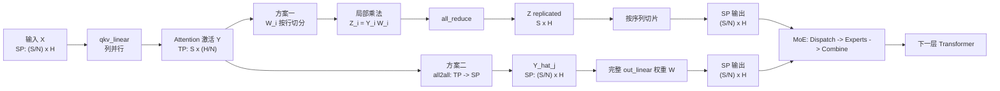
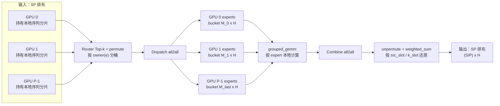

# 大模型推理中的 TP-SP-EP 混合并行优化

在大模型训练中，单纯的张量并行（TP）或序列并行（SP）往往难以覆盖所有层的通信需求。对于稠密的 Attention 层，TP 可以高效地切分权重矩阵；而对于 MoE 层，专家并行（EP）才是降低通信开销的关键。本文梳理一种将 **TP、SP、EP 融合**的混合并行策略——重点剖析 Attention 层的两种 `out_linear` 方案，以及 MoE 层的 Dispatch / Combine 机制，帮助理解它们如何协同工作以最大化吞吐。

## 一、两种混合并行图示

_TP / SP / EP 总览图_



上面的总览图展示了 Attention 层的两种 `out_linear` 实现路径。两条路径都从同一个列并行 `qkv_linear` 出发，区别在于如何处理输出投影：一种走行并行 + `all_reduce`，另一种走 `all2all` + 完整权重。后续的 MoE 层则统一以 SP 排布作为输入，借助两次 `all2all` 完成专家路由与聚合。

---

## 二、并行原理解析

两条方案的起点相同：列并行的 `qkv_linear` 将输出激活按**隐藏层维度**切分分布在各 GPU 上。从这一状态出发，两条路径以不同方式完成 `out_linear` 并进入序列并行段。

### 2.1 前提：`qkv_linear` (列切)

两种方案都始于一个**列并行 (Column-Parallel)** 的 `qkv_linear` 层。

- 我们有 $N$ 个 GPU。
- 输入 $X$ 是复制的 (replicated)。
- 第一个 `qkv_linear` 层的权重 $A$ 被按列切分：$A = [A_1, A_2, \dots, A_N]$。
- GPU $i$ 计算：$Y_i = \text{GeLU}(X A_i)$。
- **关键状态**：计算完成后，中间激活 $Y = [Y_1, \dots, Y_N]$ 在 $N$ 个 GPU 上是按**隐藏层维度**（$H_{\text{dim}}$ 维度，也常称为 $K$ 维度）切分的。

这里**涉及到 Attention 的 TP 并行**，原理可参考猛猿大佬文章 <https://zhuanlan.zhihu.com/p/622212228>，不再赘述。现在，我们要计算第二层 $Z = YW$，其中 $W$ 是 `out_linear` 的权重。

此时有两条路可走：继续保持 $H_{\text{dim}}$ 维度的切分（方案一），或提前通信将切分轴转到序列维度（方案二）。

### 2.2 方案一：`out_linear` (行切) + `all_reduce` + `Slice`

这个方案的核心思想是保持 $H_{\text{dim}}$ 维度的切分。

1. **数据排布**：
   - **输入（$Y$）**：$Y = [Y_1, \dots, Y_N]$（按 $H_{\text{dim}}$ 切分）。
   - **权重（$W$）**：`out_linear` 权重 $W$ 必须同样按 $H_{\text{dim}}$ 维度（即行）切分：
     $$
     W = \begin{bmatrix} W_1 \\ W_2 \\ \vdots \\ W_N \end{bmatrix}
     $$
1. **`out_linear`（局部计算）**：
   - GPU $i$ 拥有 $Y_i$ 和 $W_i$。
   - 它只能计算它所拥有的那部分乘积：$Z_i = Y_i W_i$。
1. **`all_reduce`（通信）**：
   - 根据矩阵乘法，最终结果是 $Z = YW = \sum_{i=1}^N Y_i W_i$。
   - `all_reduce` 操作在所有 GPU 之间对 $Z_i$ 进行求和。
   - $\text{AllReduce}(\{Z_1, \dots, Z_N\}) \to Z$。
1. **得到完整的 $Z$**：
   - $Z$ 在所有 GPU 上都是完整的、复制的 (replicated)。
1. 每张 GPU 从 $Z$ 的行维度平均 Slice 出一部分，转为序列并行送到下一层。
   - 如果下一跳只需要本 rank 的 SP shard，那么这一步其实可以直接收敛成 `reduce_scatter`，不必先拿到完整 $Z$ 再切片；第 3 节会单独比较这一优化版。

- **优点**：
  - **节省内存**：每个 GPU 只需要存储 $1/N$ 的 $W$ 权重。这在权重（如 $W_{\text{proj}}$）非常大时至关重要。
- **缺点**：
  - **通信瓶颈**：必须在计算 $Z_i$ 之后执行一个 `all_reduce`。这是一个同步操作，通信量为 $Z$ 的大小，可能会阻塞流水线。

### 2.3 方案二：`all2all` + `out_linear` (不切分)

这是“张量并行（TP）切换到序列并行（SP）”的策略。这个方案的核心思想是通过通信改变数据的切分维度。

1. **数据排布**：
   - **输入（$Y$）**：$Y = [Y_1, \dots, Y_N]$（按 $H_{\text{dim}}$ 切分）。
   - **权重（$W$）**：`out_linear` 权重 $W$ 不切分（replicated）。每个 GPU 都有完整的 $W$。
1. **`all2all`（通信）**：
   - 这一步的目标是将 $Y$ 的数据排布从“按 $H_{\text{dim}}$ 切分”转置为“按序列（Sequence）维度切分”。
   - **之前**：GPU $i$ 拥有 $Y_i$（形状 $S \times (H_{\text{dim}}/N)$）。
   - **操作**：
     - GPU $i$ 将它的 $Y_i$ 沿着 $S$ 维度切成 $N$ 块：$Y_i = [Y_i^{(1)T}, \dots, Y_i^{(N)T}]^T$。
     - GPU $i$ 将 $Y_i^{(j)}$ 发送给 GPU $j$。
     - GPU $j$ 收到来自所有 $N$ 个 GPU 的 $\{Y_1^{(j)}, \dots, Y_N^{(j)}\}$。
   - **之后**：GPU $j$ 将收到的块沿着 $H_{\text{dim}}$ 维度拼接起来（⚠️：这里会有一个 transpose 操作），得到 $\hat{Y}_j = [Y_1^{(j)}, \dots, Y_N^{(j)}]$（形状 $(S/N) \times H_{\text{dim}}$）。
   - **结果**：$Y$ 的排布从 $N$ 个 $S \times (K/N)$ 的块（TP）转换成了 $N$ 个 $(S/N) \times K$ 的块（SP）。
1. **`out_linear`（局部计算）**：
   - GPU $j$ 拥有 $\hat{Y}_j$（形状 $(S/N) \times H_{\text{dim}}$）和完整的 $W$（形状 $H_{\text{dim}} \times H_{\text{dim}}$）。
   - 它计算 $Z_j = \hat{Y}_j W$。
1. **最终结果**：
   - $Z_j$ 的形状是 $(S/N) \times H_{\text{dim}}$。
   - 最终输出 $Z$ 在 $N$ 个 GPU 上是按序列（Sequence）维度切分的。

在**工程实现**上，它们是两种**完全不同**的并行范式，有着根本的取舍：

| **特性**                      | **方案一 (out_linear \[行切] + all_reduce)** | **方案二 (all2all + out_linear \[不切分])** |
| ----------------------------- | -------------------------------------------- | ------------------------------------------- |
| **策略**                      | 标准行并行 (Row-Parallelism)                 | 张量并行 (TP) $\to$ 序列并行 (SP) 转换      |
| **`out_linear`** **权重** $W$ | **按行切分** (节省 $N-1/N$ 内存)             | **不切分/复制** (需要 $N$ 倍内存)           |
| **通信操作**                  | `all_reduce` (在计算之后)                    | `all2all` (在计算之前)                      |
| **通信内容**                  | 输出 $Z$ (形状 $S \times H_{\text{dim}}$)    | 激活 $Y$ (形状 $S \times H_{\text{dim}}$)   |
| **输出** $Z$ **的排布**       | **复制的 (Replicated)**                      | **按序列切分 (Sequence-Parallel)**          |

结论是：方案二牺牲了 $W$ 的内存（现在需要 $N$ 份 $W$），来换取将并行维度从 $H_{\text{dim}}$（TP）切换到 $S$（SP）。其主要手段是用 `all2all` 替代 `all_reduce`，并利用通信-计算重叠来提升流水线效率。

---

## 三、通信量对比分析

通信量是决定这些方案性能的关键因素。为了避免混淆，下面统一采用**每个 GPU 的单向发送量**作为统计口径，也就是：

- 只统计每个 GPU 发出去多少字节
- 不重复累计接收量
- 避免把 `all_reduce` 的“两阶段”和 `all2all` 的“发送+接收”混在一起

先定义统一记号：

- $N$：并行数
- $S$：序列长度（或 token 数）
- $H_{\text{dim}}$：隐藏层维度
- $d$：每个元素的字节数
- 定义完整输出张量大小为：

$$
M = S \times H_{\text{dim}} \times d
$$

### 3.1 方案一（原始版）：`out_linear` (行切) + `all_reduce` + `slice`

在该方案中，每个 rank 先计算自己的 partial result：

$$
Z_i \in \mathbb{R}^{S \times H_{\text{dim}}}
$$

然后通过 `all_reduce` 得到完整的 $Z$，最后再按 sequence 维切出本 rank 需要的 SP shard。

这里通信对象是 $Z_i$，大小为：

$$
M = S \times H_{\text{dim}} \times d
$$

对 ring all-reduce 而言，它可以拆成两段：

1. reduce-scatter
1. all-gather

每一段的单向发送量都是：

$$
\frac{N-1}{N} \cdot M
$$

因此，原始方案一的每 GPU 单向发送总量为：

$$
V_{AR} = 2 \cdot \frac{N-1}{N} \cdot M
$$

### 3.2 方案一（优化版）：`out_linear` (行切) + `reduce_scatter`

如果下一跳只需要 SP shard，那么没有必要先得到完整 $Z$ 再切片，可以直接对 $Z_i$ 做 `reduce_scatter`：

$$
\text{reduce\_scatter}(Z_i)
$$

此时每个 rank 直接拿到自己的 SP shard。

注意，这里通信对象仍然是 $Z_i$，大小仍然是：

$$
M = S \times H_{\text{dim}} \times d
$$

对应的每 GPU 单向发送量为：

$$
V_{RS} = \frac{N-1}{N} \cdot M
$$

因此，相比原始方案一：

$$
\frac{V_{RS}}{V_{AR}} = \frac{1}{2}
$$

也就是说，`reduce_scatter` 相比原始 `all_reduce + slice`，通信量减半，减少 50%。

### 3.3 三种通信方案的统一口径对比

方案二的目标是先把激活的切分方式从 hidden 维（TP）转为 sequence 维（SP）。

设每个 rank 上本地激活为：

$$
Y_i \in \mathbb{R}^{S \times (H_{\text{dim}}/N)}
$$

在 `all2all` 中，每个 rank 将 $Y_i$ 沿 sequence 维切成 $N$ 块，每块大小为：

$$
\frac{S}{N} \times \frac{H_{\text{dim}}}{N}
$$

每个 rank 保留其中 1 块，并把其余 $N-1$ 块分别发送给其他 $N-1$ 个 rank。

因此，每块数据大小为：

$$
\frac{M}{N^2}
$$

每个 rank 一共发送 $N-1$ 块，所以总单向发送量为：

$$
V_{A2A} = (N-1) \cdot \frac{M}{N^2} = \frac{N-1}{N^2} \cdot M
$$

统一按每 GPU 单向发送量统计，有：

$$
V_{AR} = 2 \cdot \frac{N-1}{N} \cdot M
$$

$$
V_{RS} = \frac{N-1}{N} \cdot M
$$

$$
V_{A2A} = \frac{N-1}{N^2} \cdot M
$$

把三种方案放在一起：

| **方案**     | **通信操作**         | **每 GPU 单向发送量**                    |
| ------------ | -------------------- | ---------------------------------------- |
| 原始方案一   | `all_reduce + slice` | $V_{AR} = 2 \cdot \frac{N-1}{N} \cdot M$ |
| 优化版方案一 | `reduce_scatter`     | $V_{RS} = \frac{N-1}{N} \cdot M$         |
| 方案二       | `all2all`            | $V_{A2A} = \frac{N-1}{N^2} \cdot M$      |

比例关系也就非常清晰了：

1. 优化版方案一 vs 原始方案一：

$$
\frac{V_{RS}}{V_{AR}} = \frac{1}{2}
$$

说明 `reduce_scatter` 相比 `all_reduce + slice`，通信量减少 50%。

1. 方案二 vs 优化版方案一：

$$
\frac{V_{A2A}}{V_{RS}} = \frac{1}{N}
$$

说明 `all2all` 的通信量是 `reduce_scatter` 的 $1/N$，也就是相比 `reduce_scatter` 还要再少 $N$ 倍。

1. 方案二 vs 原始方案一：

$$
\frac{V_{A2A}}{V_{AR}} = \frac{1}{2N}
$$

说明 `all2all` 的通信量是原始 `all_reduce + slice` 方案的 $1/(2N)$。

以 $N=4$ 为例：

$$
V_{AR} = 2 \cdot \frac{3}{4} \cdot M = \frac{3}{2}M
$$

$$
V_{RS} = \frac{3}{4}M
$$

$$
V_{A2A} = \frac{3}{16}M
$$

因此：

- `reduce_scatter` 相比原始 `all_reduce + slice`，通信量减少 50%
- `all2all` 相比 `reduce_scatter`，通信量只有 1/4，也就是减少 75%
- `all2all` 相比原始 `all_reduce + slice`，通信量只有 1/8

除此之外，选择方案二还有其他的工程原因：

1. **通信模式**：`all_reduce` 包含计算（Sum），而 `all2all` 只是数据交换（Transpose）。在某些硬件拓扑（如 NVLink Switch）上，`all2all` 几乎可以达到线速，效率极高。
2. **通信重叠**：方案二的 `all2all` 作用于 $Y$，它可以在 $Y$ 被计算时**重叠 (Overlap)** 进行。方案一的 `all_reduce` 必须等待 `out_linear` 计算 $Z_i$ **完成**后才能开始。
3. **内存代价**：方案二的优势是**有代价的**。它需要**每个 GPU 都存储完整的** **`out_linear`** **权重** $W$，而方案一只需要 $1/N$ 的权重。
4. **序列并行 (SP)**：如果你的网络架构（例如 MoE EP 并行）被优化为在序列并行的输入上工作，那么方案二的输出（$Z$ 按序列切分）可以直接喂给下一层，**完全消除了后续对** $Z$ **进行** **`all_reduce`** **或** **`allgather`** **的需求**。

### 3.4 为什么说 `all2all` 更容易和前面的计算重叠？

这里的“更容易重叠”，并不是说 `all2all` 天生就一定能自动 overlap，而是说：**它的通信位置更靠前，依赖更早暴露出来，粒度上也更容易做成流水。**

先看两种方案的关键区别：

- **方案一：行并行 `out_linear` + `all_reduce`**
  - 先在每张卡上做本地部分计算，得到
    $$
    Z_i = Y_i W_i
    $$
  - 然后再通过 `all_reduce` 把各卡的部分结果求和，得到完整输出
    $$
    Z = \sum_i Y_i W_i
    $$
- **方案二：先 `all2all`，把 TP 排布转成 SP 排布，再做完整权重的 `out_linear`**
  - 先对 $Y$ 做一次 `all2all`，把数据从“按 hidden 维切分”转换为“按 sequence 维切分”
  - 转换后，每张卡拿到本地的一段完整 hidden 激活 $\hat{Y}_j$
  - 然后每张卡独立做完整的 `out_linear`

两者最大的区别在于：

- `all_reduce` 通信的是 `out_linear` 之后的结果 $Z_i$
- `all2all` 通信的是 `out_linear` 之前的激活 $Y$

也就是说，`all2all` 发生在更靠前的位置，而 `all_reduce` 发生在更靠后的位置。

这里说的“前面的计算”，主要是指 Attention 侧产出 $Y$ 的那部分计算，也就是：

- `qkv_linear`
- attention 计算本身
- 必要的 reshape / pack / transpose

在 TP 场景下，每张卡拿到的是自己本地的一份激活：

$$
Y_i \in \mathbb{R}^{S \times \frac{H_{\text{dim}}}{N}}
$$

如果采用方案二，那么每张卡会把本地的 $Y_i$ 再按 sequence 切成更小的块，然后通过 `all2all` 发给不同 GPU。接收端把来自各卡的块沿 hidden 维拼起来，形成自己本地需要处理的：

$$
\hat{Y}_j \in \mathbb{R}^{\frac{S}{N} \times H_{\text{dim}}}
$$

之后再在本地执行完整权重的 `out_linear`。

更准确地说，`all2all` 主要有两类 overlap 机会。

#### 1. 和 $Y$ 的生成过程重叠

如果 $Y$ 不是一次性全部算完才可用，而是可以按 chunk、tile、token block 逐步产出，那么就可以这样做：

- 计算流继续生成后续的 $Y$ chunk
- 通信流把前面已经 ready 的 $Y$ chunk 立刻拿去做 `all2all`

也就是说，可以做到：

> 一边继续算后面的 $Y$，一边把前面已经算好的 $Y$ 发出去

这是最核心的一层 overlap。它之所以能成立，是因为方案二里通信对象就是 $Y$ 本身，通信发生在 `out_linear` 之前，所以只要某一部分 $Y$ 已经 ready，这部分就可以尽早进入通信。

#### 2. 和接收侧的 `out_linear` 计算重叠

接收端 GPU 在收到一部分 `all2all` 数据后，如果实现足够细粒度，也不一定要等全部数据都到齐才开始算。完全可以做到：

- 通信流继续接收后续 chunk
- 计算流对已经到齐并拼好的那部分 $\hat{Y}$ 先执行本地 `out_linear`

于是就形成了：

> 前面块继续传，后面块已经开始算

这就把整个过程做成了一个更细粒度的流水线：

> 生成 $Y$ → 交换 $Y$ → 计算 `out_linear`

可以把方案二直观理解成下面这条流水线：

```text
attention 产出 Y chunk 1   --> all2all(chunk 1)   --> out_linear(chunk 1)
attention 继续产出 Y chunk 2 --> all2all(chunk 2) --> out_linear(chunk 2)
attention 继续产出 Y chunk 3 --> all2all(chunk 3) --> out_linear(chunk 3)
```

为什么 `all_reduce` 更难和“前面的计算”重叠？核心原因主要有两个。

#### 1. 依赖更晚

在方案一里，`all_reduce` 的输入不是 $Y$，而是：

$$
Z_i = Y_i W_i
$$

也就是说，必须先做完 `out_linear`，得到部分结果 $Z_i$，才能开始 `all_reduce`。

所以它的依赖链是：

> 先生成 $Y$ → 再做 `out_linear` → 最后 `all_reduce`

而不是像方案二那样：

> 生成 $Y$ 的同时，就可以逐步开始通信

换句话说，`all_reduce` 的通信起点更晚，天然就少了一段 overlap 窗口。

#### 2. `all_reduce` 带归约语义，流水化更受限制

`all2all` 本质上是数据交换，你把该发的块发出去即可；但 `all_reduce` 不只是传数据，还需要做归约（例如求和），所以通信和归约语义是绑定在一起的。

这并不是说 `all_reduce` 完全不能 overlap。实际上，很多实现里的 `ring all_reduce` 也会按 chunk 做流水，甚至也能和部分计算重叠。但相比 `all2all` 这种纯交换，`all_reduce` 通常更难做成那种“上游一边生产、下游一边持续消费”的干净流水。

---

## 四、EP 并行的 MoE 层

无论选择方案一还是方案二，进入 MoE 层时激活都已处于**序列并行（SP）**的排布——每张 GPU 持有全局序列的 $1/P$ 片段，形状为 $\frac{S}{P} \times H_{\text{dim}}$。EP 的核心思想是**将专家参数分片到各 GPU，同时通过两次 `all2all` 完成 token 的路由与聚合**，以此避免所有 GPU 都冗余存储全量专家权重。

_MoE Dispatch / Combine 路由图_



### 4.1 假设一些参数：

- 输入：$X \in \mathbb{R}^{S \times H_{\text{dim}}}$
- Router：为每个 token 选 $k$ 个专家（Top-k），得到
  - 专家索引：$\text{eid} \in \{0,\dots,E-1\}^{S \times k}$
  - 权重：$w \in \mathbb{R}^{S \times k}$
- 专家集合：共有 $E$ 个 experts
- EP 规模：$P$（同一个 EP group 中有 $P$ 张 GPU）
  - 每张 GPU 持有 $E/P$ 个 experts（参数分片）

**两次 `all2all`（Dispatch / Combine）：**

> EP 的本质是：**按专家维度切参数，但按 token 路由把激活在卡间重排**。因此每个 MoE 层固定两次集合通信。

- **Dispatch**：把 token 送到“持有目标专家”的 GPU
- **Combine**：把专家输出送回“token 所在的 GPU”，并按权重聚合

**MoE 输入的 SP 排布：**

- 全局 $S$ 个 tokens，被 $P$ 张 GPU 按序列维度均分
  - GPU $i$ 拥有：$X_i \in \mathbb{R}^{\frac{S}{P} \times H_{\text{dim}}}$
- 每个 GPU 本地计算 Router：
  - $\text{eid}_i \in \{0,\dots,E-1\}^{\frac{S}{P} \times k}$
  - $w_i \in \mathbb{R}^{\frac{S}{P} \times k}$

### 4.2 Dispatch：`permute` + `all2all`（把 token 发到专家所在卡）

**目标**：将 token 从“按序列切分”的排布，变换为“按专家分桶并落在对应 GPU”的排布。

**本地分桶（bucketize）/ 打包（pack）：**

- 对 GPU $i$ 上的每个 token $t$，它会被路由到 $k$ 个专家：${\text{eid}_i[t,1], \dots, \text{eid}_i[t,k]}$
- 定义专家到 GPU 的映射（静态）：
  - $\text{owner}(e) \in \{0,\dots,P-1\}$
- GPU $i$ 将其本地 token 复制出 $k$ 份“token-expert 关联样本”，并按 $\text{owner}(e)$ 分桶：
  - 形成 $P$ 个发送缓冲区：$\text{sendbuf}_{i\to j}$
- 同时，GPU $i$ 记录两类索引用于还原：
  - `src_slot`：这个样本来自本地第几个 token
  - `k_slot`：这是 top-k 的第几路（用于乘权重）

**第一次 `all2all`：**

- 所有 GPU 同时执行 `all2all`，$\text{recvbuf}_{j} = \bigcup_{i=0}^{P-1} \text{sendbuf}_{i\to j}$

**Dispatch 后的数据排布：**

- GPU $j$ 得到按其本地 experts 分桶后的激活集合：
  - $\hat{X}_j \in \mathbb{R}^{M_j \times H_{\text{dim}}}$
- 其中 $M_j$ 是路由到 GPU $j$ 的（token, expert）样本数（一般不均匀）。
- 同时携带对应的还原元信息（如 `src_slot / k_slot`、以及回传路由所需的 index）。

> 关键状态：Dispatch 后，激活不再保持原序列顺序，而是按专家分桶组织，便于专家侧批处理。

### 4.3 Experts：本地 `grouped_gemm`（只在持有的专家上算）

GPU $j$ 持有专家集合，每个专家是一个 FFN：

- Expert $e$ 的参数：$W^{(e)}_1, W^{(e)}_2$
- 对属于该专家的子 batch：$\hat{X}^{(e)}_j$
- 局部计算：
  - $H^{(e)} = \phi(\hat{X}^{(e)}_j W^{(e)}_1)$
  - $O^{(e)} = H^{(e)} W^{(e)}_2$

将所有专家输出拼接为：

- $\hat{O}_j \in \mathbb{R}^{M_j \times H_{\text{dim}}}$（与 $\hat{X}_j$ 一一对应）

### 4.4 Combine：`all2all` + `unpermute` + `weighted_sum`（送回并聚合）

**目标**：把专家输出返回到 token 的原属 GPU，并将 top-k 多路输出按权重聚合为一个 token 输出。

**按来源 GPU 反向打包（pack-back）：**

- Dispatch 时每个样本带有其“来源 GPU + 来源 token 位置（src_slot）+ k_slot”
- GPU $j$ 将 $\hat{O}_j$ 按来源 GPU 分桶：
  - 形成 $\text{sendback}_{j\to i}$

**第二次 `all2all`：**

- 所有 GPU 同时执行 `all2all`，GPU $i$ 收到所有返回样本集合 $\text{recvback}_i$

**本地还原与加权聚合：**

- GPU $i$ 对其本地每个 token $t$，收集来自 $k$ 路的返回输出 ${O_{t,1},\dots,O_{t,k}}$
- 按 router 权重聚合：
  - $Y_i[t] = \sum_{r=1}^{k} w_i[t,r] \cdot O_{t,r}$

**Combine 后的输出排布：**

- GPU $i$ 得到：
  - $Y_i \in \mathbb{R}^{\frac{S}{P} \times H_{\text{dim}}}$
- 输出仍是**按序列维度切分（SP）**，可直接送入下一层。

---

## 五、全局数据流回顾

将各阶段的排布变化串联起来，便能看清整条流水线的"数据拓扑"：

| 阶段                                  | 数据排布                           | 通信           |
| ------------------------------------- | ---------------------------------- | -------------- |
| `qkv_linear` 输入                     | 序列切分 (SP)，$(S/N) \times H$    | —              |
| `qkv_linear` 输出（列并行）           | 隐藏维切分 (TP)，$S \times (H/N)$  | 无（本地计算） |
| **方案一** `out_linear`（行并行）输出 | 全量复制，$S \times H$             | `all_reduce`   |
| → Slice 为 SP                         | 序列切分，$(S/N) \times H$         | 本地切片       |
| **方案二** `all2all` 后               | 序列切分 (SP)，$(S/N) \times H$    | `all2all`      |
| → `out_linear`（完整权重）输出        | 序列切分，$(S/N) \times H$         | 无             |
| MoE Dispatch `all2all`                | 专家分桶，$M_j \times H$（不均匀） | `all2all`      |
| Expert `grouped_gemm`                 | 专家分桶，$M_j \times H$           | 无（本地计算） |
| MoE Combine `all2all`                 | 序列切分，$(S/P) \times H$         | `all2all`      |

可以看到：两条路径都将 Attention 层的 TP 激活"归还"为 SP，从而 MoE 层可以无缝地以序列并行为接口完成 EP 路由，整个前向过程不需要任何额外的同步等待（在理想的通信-计算重叠实现下）。

---

## 六、总结

- **方案一（行并行 + `all_reduce`）**：实现简单，权重内存占用低（$1/N$），但 `all_reduce` 必须在 `out_linear` 完成后才能发起，难以与计算重叠。
- **方案二（`all2all` + 完整权重）**：按“每 GPU 单向发送量”统计，相比原始 `all_reduce + slice` 方案，通信量只有 $1/(2N)$；相比优化版 `reduce_scatter`，通信量只有 $1/N$。同时，由于它通信的是 `out_linear` 之前的 $Y$，更容易和前面的 Attention 计算做细粒度重叠。代价是每张 GPU 需存储完整的 `out_linear` 权重。当 GPU 显存充裕、NVLink 带宽高、且下游对 SP 排布有明确需求时（如接 EP-MoE），方案二的优势更为突出。
- **EP 的 MoE 层**：以 SP 排布为接口，两次 `all2all` 完成 Dispatch 与 Combine，实现专家参数的分片存储与正确的 token 路由，输出依然是 SP，可无缝接入下一 Transformer 层。

三者的联动使得超大规模 MoE 模型（如 DeepSeek、Mixtral 等）在多机多卡场景中既能充分利用 NVLink/IB 带宽，又能将每卡的参数与激活内存控制在可接受范围内。
